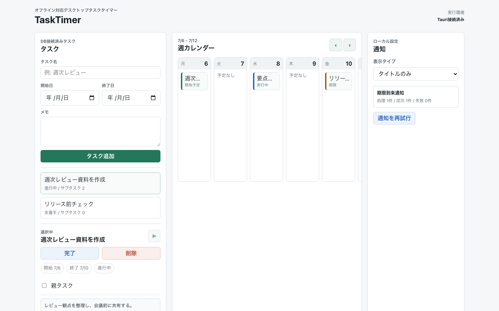

# TaskTimer

Windows/macOS向けの、オフライン前提TODO・タイマー管理デスクトップアプリです。

## 画面イメージ



現在のUIは、左ナビゲーション、中央の作業ビュー、右詳細ペインで構成しています。画像はREADME用のサンプルデータで撮影しており、個人のタスク名、メモ本文、通知本文、ローカルDBは含めていません。

## UI構成

- 左ナビゲーション: タスクリスト、お気に入り、週カレンダー、設定を切り替えます。`Ctrl+B` で開閉できます。
- 中央ビュー: 選択中のリスト、完了セクション、タスク追加、週カレンダー、設定画面を表示します。
- 右詳細ペイン: タスク選択時に開き、開始日、終了日、目標時間、繰り返し、メモ、通知、サブタスク、タイマー操作をまとめて扱います。
- タスク行: 円形チェック、お気に入り、期限、実行中状態、サブタスク進捗を一覧で確認できます。

## 利用方法

### インストール

外部利用者は [GitHub Releases](https://github.com/yt-hsgw/TaskTimer/releases) から最新版を入手します。

- Windows: NSISインストーラーをダウンロードします。
- macOS: Developer ID署名・公証済みDMGが提供されているReleaseのみ利用してください。
- 自動更新はありません。新しいバージョンはGitHub Releasesで確認してください。
- Windows版はコード署名未設定のため、Windows SmartScreenの警告が出る場合があります。

v0.1.0はWindows先行の通常Releaseとして公開済みです。業務利用前には、[v0.1.0 Release notes](https://github.com/yt-hsgw/TaskTimer/releases/tag/app-v0.1.0) の既知制限を確認してください。

### 基本操作

1. 左ペインでタスクリスト、カレンダー、設定を切り替えます。
2. 左ペインは `Ctrl+B` で開閉できます。
3. 中央のタスク一覧下部にある追加ボタン、または `Ctrl+N` でタスクを作成します。
4. タスクを選択すると右詳細ペインが開き、開始日、終了日、目標時間、繰り返し、メモ、サブタスク、通知、タイマーを編集できます。
5. 選択中タスクまたはサブタスクの開始ボタンを押すとタイマーが開始します。開始できるタイマーはアプリ全体で1件だけです。
6. 作業を中断または再開するときは、右詳細ペインの一時停止、再開、終了ボタンを使います。
7. タスクまたはサブタスクが終わったら円形チェックボックスで完了します。完了済みタスクは完了セクションへ移動します。
8. 重要なタスクは星ボタンでお気に入りに追加し、左ペインのお気に入りビューで確認します。
9. 週カレンダーで、開始予定、期限、実行中の作業を確認します。カレンダー項目を選択すると右詳細ペインで対象を編集できます。
10. 設定画面で、通知本文を `タイトルのみ` または `汎用メッセージ` に切り替えます。

未完了のサブタスクがある親タスクも、確認メッセージでOKした場合は親タスクだけ完了できます。

## 利用者向けサポート

- 不具合報告: [Issues](https://github.com/yt-hsgw/TaskTimer/issues)
- 質問や使い方相談: [Discussions](https://github.com/yt-hsgw/TaskTimer/discussions)
- 脆弱性報告: [Security Policy](SECURITY.md)

公開IssueやDiscussionsには、実データを含むSQLiteファイル、タスク名、メモ本文、通知本文、秘密情報、個人的なスクリーンショットを貼らないでください。

## プロダクト範囲

TaskTimerは、タスク、サブタスク、予定日、ローカル通知、タイマー履歴を端末内だけで管理します。アプリ実行時の外部通信は行いません。

MVPの決定事項:

- Windows/macOS向けデスクトップアプリ。
- 技術構成は Tauri + React + TypeScript + SQLite。
- アプリ全体で同時に開始できるタイマーは1件だけ。
- タスクとサブタスクは、開始予定日、期限、メモ、タイマー履歴、通知を持つ。
- カレンダーMVPは週表示。
- 未完了サブタスクがある親タスクも、確認後であれば完了できる。
- タスク/サブタスク削除時は、関連するタイマー履歴もソフト削除する。
- 通知はデフォルトでタイトルのみ表示し、設定で汎用メッセージへ切り替えられる。
- GitHubはソースコード、Issue、Pull Request、Release管理に使う。
- アプリ実行時に外部API、分析、リモートフォント、リモート画像、自動更新エンドポイントへ接続しない。

## 現在の状態

MVPの主要機能は実装済みです。v0.1.0はWindows版を先行して通常Releaseとして公開済みで、macOS版はApple署名・公証準備が完了したReleaseで提供します。業務利用前には、[Release notes](https://github.com/yt-hsgw/TaskTimer/releases/tag/app-v0.1.0) と既知制限を確認してください。

## ドキュメント

- [MVP仕様](docs/mvp-spec.md)
- [アーキテクチャ](docs/architecture.md)
- [ドメインモデル](docs/domain-model.md)
- [データベーススキーマ](docs/database-schema.sql)
- [セキュリティ設計](docs/security.md)
- [テスト戦略](docs/testing.md)
- [運用方針](docs/operations.md)
- [外部利用者向け公開運用](docs/public-operations.md)
- [パブリック公開前チェック](docs/public-readiness.md)
- [リリース前チェックリスト](docs/release-checklist.md)
- [v0.1.0 Release notes](docs/releases/v0.1.0.md)
- [設定方針](docs/configuration.md)
- [実装計画](docs/implementation-plan.md)
- [次の作業](docs/next-actions.md)
- [レビューチェックリスト](docs/review/checklist.md)
- [ADR 0001: デスクトップ技術構成](docs/adr/0001-desktop-stack.md)
- [ADR 0002: オフライン優先ローカル保存](docs/adr/0002-offline-first-local-storage.md)
- [ADR 0003: 単一アクティブタイマー](docs/adr/0003-single-active-timer.md)
- [ADR 0004: パブリック配布とライセンス](docs/adr/0004-public-distribution-license.md)
- [コントリビュート方針](CONTRIBUTING.md)
- [サポート方針](SUPPORT.md)
- [変更履歴](CHANGELOG.md)

## 開発ルール

実装は次の順序で進めます。

1. 仕様
2. 設計
3. レビュー
4. 実装

対象ユースケース、トランザクション境界、入力検証、セキュリティ影響が説明できるまで実装を始めません。

## リポジトリ状態

このリポジトリには、設計資料、運用設定、Tauri + Reactのアプリ本体、SQLite永続化、GitHub Actionsのリリース運用が入っています。

## ローカル開発

依存関係をインストールした後に起動します。

```bash
npm ci
npm run tauri:dev
```

よく使う確認コマンド:

```bash
npm run build
sqlite3 :memory: ".read docs/database-schema.sql"
sqlite3 :memory: ".read src-tauri/migrations/0001_initial.sql"
cargo fmt --manifest-path src-tauri/Cargo.toml -- --check
cargo test --manifest-path src-tauri/Cargo.toml
cargo clippy --manifest-path src-tauri/Cargo.toml --all-targets -- -D warnings
git diff --check
```

アプリ実行時はオフライン前提です。依存関係のインストールやGitHub Actionsは開発時の通信であり、アプリ実行時の外部通信ではありません。

README画像を更新する場合:

```bash
npm run screenshots:readme
```

README画像の再生成にはChromeが必要です。自動検出できない環境では `CHROME_PATH` にChrome実行ファイルのパスを指定してください。

## パブリック公開時の注意

公開前には [パブリック公開前チェック](docs/public-readiness.md) を確認します。

- 秘密情報、ローカルDB、個人データ、個人環境の絶対パスをコミットしない。
- GitHub Issue/PRに個人のタスク内容、DB、秘密情報、個人的なスクリーンショットを貼らない。
- Dependabotは依存関係更新の追跡に使う。これは開発・運用時の通信であり、アプリ実行時通信ではありません。
- Git履歴の著者名と著者メールは、リポジトリ公開後に見える可能性があります。

## リリース運用

GitHub Actionsの `リポジトリチェック` は、PRとブランチpushで基本チェックを実行します。

GitHub Actionsの `リリースビルド` は、`app-v*` タグまたは手動実行の既定ではWindows向けartifactだけをビルドし、Draft Releaseへ添付します。macOS artifactは、手動実行で `include_macos` を有効にした場合だけDeveloper ID署名とApple公証を行ったうえで作成します。

配布形式:

- Windows: `nsis`
- macOS: `dmg`。Apple署名・公証準備が完了したReleaseでのみ提供します。

リリース前には [リリース前チェックリスト](docs/release-checklist.md) を使い、Windowsの手動確認、通知権限、オフライン起動、外部通信なしの方針を確認します。macOS artifactを配布する場合はmacOSの署名・公証・Gatekeeper確認も必須です。Windows実機確認を完了できない状態では通常Releaseとして公開せず、Release notesに未確認範囲と配布判断を明記します。

macOS署名・公証は後回しにできますが、macOS artifactを配布する場合はApple Developer Programの証明書とGitHub Secretsが必要です。証明書、Apple ID、App用パスワード、Team IDはリポジトリ、Issue、PR、Release notesに書かないでください。

## ライセンス

TaskTimerはMIT Licenseで公開します。詳細は [LICENSE](LICENSE) を確認してください。
