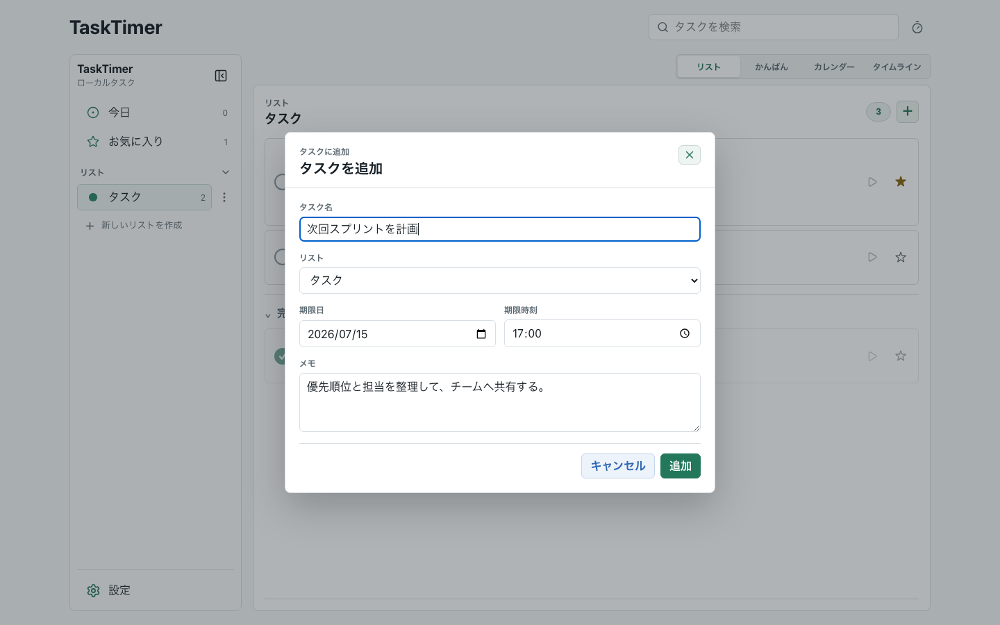
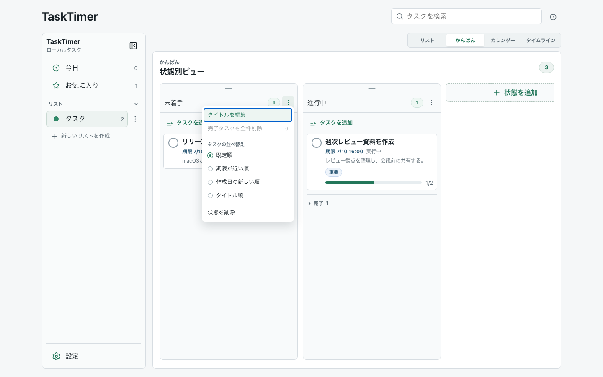
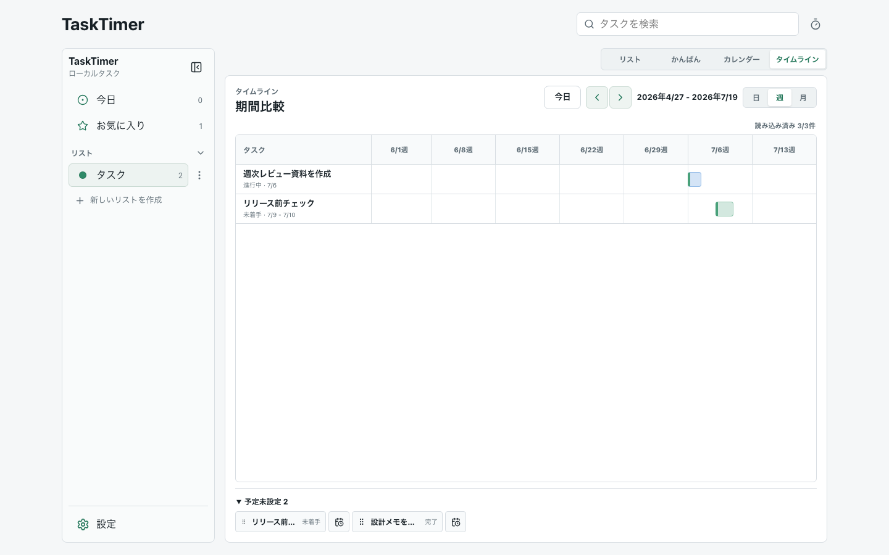

# TaskTimer

Windows/macOS向けの、オフライン前提TODO・タイマー管理デスクトップアプリです。

## 画面イメージ








現在のUIは、左ナビゲーション、中央の作業ビュー、右詳細ペインで構成しています。画像はREADME用のサンプルデータで撮影しており、個人のタスク名、メモ本文、通知本文、ローカルDBは含めていません。

## UI構成

- 左ナビゲーション: 今日、お気に入り、タスクリスト、設定を切り替えます。リスト一覧は折りたたみ可能で、一覧下部から作成し、名称、色、削除もここで管理します。タグの付与と管理はタスク詳細へ集約しています。`Ctrl+B` で開閉できます。
- 中央ビュー: 選択中のリスト、今日、お気に入りを対象範囲として維持しながら、上部の切り替えでリスト、カンバン、週/日/月カレンダー、日/週/月タイムラインを表示します。
- 上部ツールバー: 端末内のタスク名、サブタスク名、メモ、タグを横断検索し、結果から詳細を開けます。右端のタイマーアイコンから独立ポモドーロへ移動します。
- 右詳細ペイン: タスク選択時に開き、所属リスト、タグ、期限、目標時間、繰り返し、メモ、サブタスクを扱います。通常タイマーはタスク行、通知全体の設定は設定画面から操作します。
- タスク行: 円形チェック、お気に入り、期限、メモプレビュー、実行中状態、サブタスク進捗を一覧で確認できます。

## 利用方法

### インストール

外部利用者は [GitHub Releases](https://github.com/yt-hsgw/TaskTimer/releases) から最新版を入手します。

- Windows: NSISインストーラーをダウンロードします。
- macOS: Developer ID署名・公証済みDMGが提供されているReleaseのみ利用してください。
- 自動更新はありません。新しいバージョンはGitHub Releasesで確認してください。
- Windows版はv0.1.xではコード署名未設定のため、Windows SmartScreenまたは組織ポリシーの警告が出る場合があります。

v0.1.0はWindows先行の通常Releaseとして公開済みです。業務利用前には、[v0.1.0 Release notes](https://github.com/yt-hsgw/TaskTimer/releases/tag/app-v0.1.0) の既知制限を確認してください。

### 基本操作

1. 左ペインで今日、お気に入り、タスクリスト、設定を切り替えます。リスト見出しで一覧を折りたたみ、一覧下部から新しいリストを作成できます。
2. 左ペインは `Ctrl+B` で開閉できます。
3. 左ペインの `今日` では、開始予定日または期限日が今日のタスクと、それらが今日のサブタスクを持つ親タスクを確認できます。追加ボタンから作成すると、開始予定日が今日に設定されます。
4. 中央上部の `リスト`、`カンバン`、`カレンダー`、`タイムライン` で表示形式を切り替えます。選択中の対象範囲は切り替えても維持されます。
5. リスト表示ではタスク数横の追加ボタン、カンバンでは追加先となる状態列の先頭にある `タスクを追加`、または `Ctrl+N` で共通の作成ダイアログを開き、タイトル、所属リスト、期限、メモを入力してタスクを作成します。
6. タスクを選択すると中央ペイン上に詳細が開き、所属リスト、タグ、期限、目標時間、繰り返し、メモ、サブタスクを確認・編集できます。同じタスクをもう一度選ぶと閉じます。リスト色は左ペインのリスト編集から変更します。
7. 上部の検索欄へ入力すると、読み込み済みページに限らず端末内のタスクとサブタスクを検索できます。検索語や結果は外部へ送信されません。
8. タスクまたはサブタスク行の再生ボタンを押すとカウントダウンが始まり、行内で残り時間を確認できます。開始できる通常タイマーとポモドーロは、合わせてアプリ全体で1件だけです。
9. 作業を中断、再開、終了するときはタスクまたはサブタスク行内の操作ボタンを使います。対象で時間を指定していない場合は、設定画面の既定時間（初期値30分）を使用し、0秒でローカル通知します。
10. 右上のタイマーアイコンから、タスクを選ばずに集中と休憩のサイクルを開始できます。独立ポモドーロの作業時間はタスク別タイマー履歴へ加算されません。
11. タスクまたはサブタスクが終わったら円形チェックボックスで完了します。完了済みタスクは完了セクションへ移動します。
12. 重要なタスクは星ボタンでお気に入りに追加し、左ペインのお気に入りビューで確認します。
13. カンバンでは、ドラッグ&ドロップでタスクの状態を変更できます。状態は最右端から追加し、列幅全体を操作領域にした上部ハンドルで並べ替えられます。列右端の三点メニューから名称変更、列削除、完了タスクの全件削除、期限・作成日・タイトルによる表示ソートを選べます。完了タスクは元の状態列にある折りたたみセクションへ移動します。ドラッグ操作はキーボードでも利用できます。
14. カレンダーで週/日/月を切り替え、空きセルのダブルクリックまたはドラッグ範囲選択から共通の作成ダイアログを開きます。選択した日付・時刻・期間は初期値へ反映されます。`予定未設定` の既存タスクは、トレイから時刻グリッドまたは日付へドラッグして予定化できます。予定ブロック本体のドラッグで期間を保ったまま移動し、両端のハンドルで開始/終了を調整できます。矢印キーでも移動・調整できます。「他 N 件」から省略された予定を一覧表示でき、サブタスクには親タスク名が表示されます。カレンダー項目を選択すると詳細で対象を編集できます。
15. タイムラインでは日/週/月の粒度を切り替え、カレンダー予定期間を横棒で比較します。予定期間がない既存タスクは開始予定から期限までを互換表示し、`予定未設定` トレイから軸へドラッグして1日予定を設定できます。バーを選ぶと詳細を開きます。
16. 設定画面で、通知全体のON/OFF、通知本文の `タイトルのみ` / `汎用メッセージ`、通知の再試行を設定します。
17. 設定画面のエクスポートからJSON/CSVを作成できます。

通知はアプリ起動中のローカル再同期を基本にしています。Windows版では将来時刻通知のネイティブ予約PoCを進めていますが、アプリ完全終了中の通知保証はWindows 11のインストール済みアプリでの検証結果を確認してからRelease notesで案内します。

未完了のサブタスクがある親タスクも、確認メッセージでOKした場合は親タスクだけ完了できます。

### データのエクスポート

TaskTimerの実行時データはローカルSQLiteに保存されます。エクスポートファイルにはタスク名、サブタスク名、メモ本文、タイマー履歴、通知ルールが含まれる可能性があります。

- JSON/CSVエクスポートは閲覧、監査、他ツール移行の補助形式であり、完全復元用ではありません。
- 公開Issue、PR、Discussions、Release artifactへSQLite DB、JSON、CSVを添付しないでください。

詳細な方針は [ローカルデータのバックアップとエクスポート方針](docs/data-backup-export.md) を確認してください。設定画面では保存先フォルダを選択し、アプリが形式別のファイル名を生成します。

## 利用者向けサポート

- 不具合報告: [Issues](https://github.com/yt-hsgw/TaskTimer/issues)
- 質問や使い方相談: [Discussions](https://github.com/yt-hsgw/TaskTimer/discussions)
- 脆弱性報告: [Security Policy](SECURITY.md)

公開IssueやDiscussionsには、実データを含むSQLiteファイル、タスク名、メモ本文、通知本文、秘密情報、個人的なスクリーンショットを貼らないでください。

## プロダクト範囲

TaskTimerは、タスク、サブタスク、予定日、ローカル通知、タイマー履歴を端末内だけで管理します。アプリ実行時の外部通信は行いません。

MVPの決定事項:

- Windows/macOS向けデスクトップアプリ。
- 技術構成は Tauri + React + TypeScript + SQLite。
- アプリ全体で同時に開始できるタイマーは1件だけ。
- 通常タイマーは開始時点の対象別時間または既定時間を使うカウントダウン型で、再起動やスリープ復帰後もSQLiteを正として完了判定する。
- タスクとサブタスクは、期限、メモ、タイマー履歴、通知を持つ。開始予定日は既存データ互換のためモデルに残しますが、現在の詳細UIは期限中心です。
- カレンダーは週/日/月表示を切り替え、予定未設定タスクを表示軸へドラッグして予定化できる。
- タイムラインは選択中の対象範囲を維持し、日/週/月の固定期間で予定期間を比較・初回割り当てできる。
- かんばんの各状態列からタスクを追加でき、状態列は最右端から追加、上部ハンドルでの並べ替えができる。列の三点メニューには名称変更、削除、完了タスク全件削除、表示ソートを集約する。タスクはドラッグ&ドロップで移動し、完了は状態とは分離して列ごとの完了セクションに表示する。
- 未完了サブタスクがある親タスクも、確認後であれば完了できる。
- カスタムリストを作成、名称変更、削除できる。カスタムリスト削除時、所属タスクは初期リストへ移動します。
- タスク/サブタスク削除時は、関連するタイマー履歴もソフト削除する。
- 通知はデフォルトでタイトルのみ表示し、設定で汎用メッセージへ切り替えられる。
- アプリ起動中の将来時刻通知を再同期する。アプリ完全終了中の将来時刻通知はWindowsネイティブ予約PoCの検証対象であり、検証完了まで保証対象外です。
- GitHubはソースコード、Issue、Pull Request、Release管理に使う。
- アプリ実行時に外部API、分析、リモートフォント、リモート画像、自動更新エンドポイントへ接続しない。

## 現在の状態

MVPの主要機能は実装済みです。v0.1.0はWindows版を先行して通常Releaseとして公開済みで、macOS版はApple署名・公証準備が完了したReleaseで提供します。業務利用前には、[Release notes](https://github.com/yt-hsgw/TaskTimer/releases/tag/app-v0.1.0) と既知制限を確認してください。

## ドキュメント

- [MVP仕様](docs/mvp-spec.md)
- [アーキテクチャ](docs/architecture.md)
- [ドメインモデル](docs/domain-model.md)
- [データベーススキーマ](docs/database-schema.sql)
- [ローカルデータのバックアップとエクスポート方針](docs/data-backup-export.md)
- [セキュリティ設計](docs/security.md)
- [テスト戦略](docs/testing.md)
- [運用方針](docs/operations.md)
- [外部利用者向け公開運用](docs/public-operations.md)
- [パブリック公開前チェック](docs/public-readiness.md)
- [リリース前チェックリスト](docs/release-checklist.md)
- [v0.1.0 Release notes](docs/releases/v0.1.0.md)
- [設定方針](docs/configuration.md)
- [実装計画](docs/implementation-plan.md)
- [次の作業](docs/next-actions.md)
- [レビューチェックリスト](docs/review/checklist.md)
- [ADR 0001: デスクトップ技術構成](docs/adr/0001-desktop-stack.md)
- [ADR 0002: オフライン優先ローカル保存](docs/adr/0002-offline-first-local-storage.md)
- [ADR 0003: 単一アクティブタイマー](docs/adr/0003-single-active-timer.md)
- [ADR 0004: パブリック配布とライセンス](docs/adr/0004-public-distribution-license.md)
- [ADR 0005: Windowsコード署名方針](docs/adr/0005-windows-code-signing-policy.md)
- [ADR 0006: ローカルバックアップとエクスポート方針](docs/adr/0006-local-backup-export-policy.md)
- [コントリビュート方針](CONTRIBUTING.md)
- [サポート方針](SUPPORT.md)
- [変更履歴](CHANGELOG.md)

## 開発ルール

実装は次の順序で進めます。

1. 仕様
2. 設計
3. レビュー
4. 実装

対象ユースケース、トランザクション境界、入力検証、セキュリティ影響が説明できるまで実装を始めません。

## リポジトリ状態

このリポジトリには、設計資料、運用設定、Tauri + Reactのアプリ本体、SQLite永続化、GitHub Actionsのリリース運用が入っています。

## ローカル開発

依存関係をインストールした後に起動します。

```bash
npm ci
npm run tauri:dev
```

よく使う確認コマンド:

```bash
npm run build
sqlite3 :memory: ".read docs/database-schema.sql"
sqlite3 :memory: ".read src-tauri/migrations/0001_initial.sql"
cargo fmt --manifest-path src-tauri/Cargo.toml -- --check
cargo test --manifest-path src-tauri/Cargo.toml
cargo clippy --manifest-path src-tauri/Cargo.toml --all-targets -- -D warnings
git diff --check
```

アプリ実行時はオフライン前提です。依存関係のインストールやGitHub Actionsは開発時の通信であり、アプリ実行時の外部通信ではありません。

README画像を更新する場合:

```bash
npm run screenshots:readme
```

README画像の再生成にはChromeが必要です。自動検出できない環境では `CHROME_PATH` にChrome実行ファイルのパスを指定してください。

## パブリック公開時の注意

公開前には [パブリック公開前チェック](docs/public-readiness.md) を確認します。

- 秘密情報、ローカルDB、個人データ、個人環境の絶対パスをコミットしない。
- GitHub Issue/PRに個人のタスク内容、DB、秘密情報、個人的なスクリーンショットを貼らない。
- Dependabotは依存関係更新の追跡に使う。これは開発・運用時の通信であり、アプリ実行時通信ではありません。
- Git履歴の著者名と著者メールは、リポジトリ公開後に見える可能性があります。

## リリース運用

GitHub Actionsの `リポジトリチェック` は、PRとブランチpushで基本チェックを実行します。

GitHub Actionsの `リリースビルド` は、`app-v*` タグまたは手動実行の既定ではWindows向けartifactだけをビルドし、Draft Releaseへ添付します。macOS artifactは、手動実行で `include_macos` を有効にした場合だけDeveloper ID署名とApple公証を行ったうえで作成します。

配布形式:

- Windows: `nsis`
- macOS: `dmg`。Apple署名・公証準備が完了したReleaseでのみ提供します。

リリース前には [リリース前チェックリスト](docs/release-checklist.md) を使い、Windowsの手動確認、通知権限、オフライン起動、外部通信なしの方針を確認します。macOS artifactを配布する場合はmacOSの署名・公証・Gatekeeper確認も必須です。Windows実機確認を完了できない状態では通常Releaseとして公開せず、Release notesに未確認範囲と配布判断を明記します。

Windowsコード署名は [ADR 0005](docs/adr/0005-windows-code-signing-policy.md) に従い、v0.1.xでは未署名配布を既知制限付きで継続します。macOS署名・公証は後回しにできますが、macOS artifactを配布する場合はApple Developer Programの証明書とGitHub Secretsが必要です。証明書、秘密鍵、Apple ID、App用パスワード、Team IDはリポジトリ、Issue、PR、Release notesに書かないでください。

## ライセンス

TaskTimerはMIT Licenseで公開します。詳細は [LICENSE](LICENSE) を確認してください。
