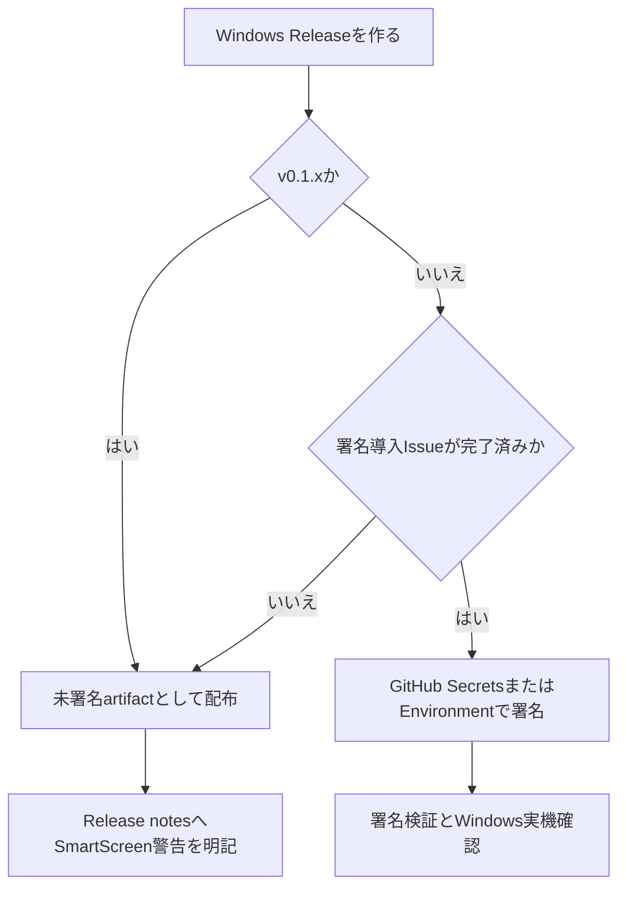

# ADR 0005: Windowsコード署名方針

## 状態

採用。

## 文脈

TaskTimer v0.1.0はWindows先行の通常Releaseとして公開済みである。現在のWindows NSISインストーラーはコード署名未設定のため、Windows SmartScreenや企業ポリシーにより警告または実行ブロックが表示される可能性がある。

この判断は配布・運用方針であり、アプリ実行時の外部通信禁止、ローカルSQLite保存、ユーザー内容をログに出さない方針は変更しない。

## 決定

- v0.1.xではWindowsコード署名を導入せず、未署名Windows artifactを既知制限付きで配布する。
- Release notesには、Windows版がコード署名未設定であり、SmartScreenまたは組織ポリシーの警告が表示される可能性を明記する。
- 利用者にはGitHub Releasesの公式URL、Release notes、SHA-256を確認してから利用判断してもらう。
- Windowsコード署名を導入する場合は、別IssueでSecret名、workflow変更、確認手順、証明書更新手順を設計してから実装する。
- 公開配布向けに自己署名証明書は使わない。
- EV証明書は、SmartScreen回避だけを目的には採用しない。
- 将来の第一候補は、利用資格を満たす場合のMicrosoft Azure Artifact Signingとする。
- Azure Artifact Signingを使えない場合は、CA発行のOV証明書を候補にする。
- Microsoft Store配布はMVP外とし、必要になった時点で別ADRで扱う。

## 導入時の設計境界

署名を導入する場合でも、秘密情報はGitHub SecretsまたはGitHub Environment Secretsだけに保存する。証明書、秘密鍵、証明書パスワード、Azure認証情報、発行者IDは、リポジトリ、Issue、PR、Release notes、Actionsログへ書かない。

Tauri側の接続方式は、選択した署名方式に合わせて次のどちらかを使う。

- `bundle.windows.certificateThumbprint`、`digestAlgorithm`、`timestampUrl` を使う。
- `bundle.windows.signCommand` を使い、Azure Key Vault、Azure Artifact Signing、または外部署名ツールへ委譲する。

GitHub Actionsへ導入する場合は、署名jobだけに必要な権限とSecretsを渡す。署名後はWindows上で署名検証、インストール、起動、アンインストールを確認する。

## Release notes表現

未署名配布を継続するReleaseでは、次の趣旨をRelease notesへ残す。

- Windows版はコード署名未設定である。
- Windows SmartScreenまたは組織ポリシーにより警告やブロックが表示される場合がある。
- GitHub Releasesの公式URL、Release notes、SHA-256を確認してから利用判断する。
- 企業端末で実行できない場合は、組織のIT管理者に確認する。

署名済み配布へ切り替えるReleaseでは、次の趣旨をRelease notesへ残す。

- Windows版は署名済みである。
- 署名済みでも新しいファイルや新しい発行者評価ではSmartScreen警告が出る場合がある。
- 署名者名、SHA-256、Windows実機確認結果を確認できる。

## 設計理由

- MicrosoftのSmartScreenはファイル、アプリ、証明書の評価を使うため、署名だけで常に警告が消えるとは限らない。
- Azure Artifact Signingは、対象地域と本人確認を満たせる場合、CI/CDに統合しやすく、従来の証明書運用より秘密鍵管理を小さくできる。
- OV証明書は従来型の選択肢だが、HSMまたはハードウェアトークンの運用が必要になる可能性があり、個人開発・小規模運用では負荷が高い。
- v0.1.xではWindows実機確認済みの価値を先に届け、署名はコスト、本人確認、更新運用を設計してから導入する。

## トレードオフ

- 未署名配布を継続すると、利用者はSmartScreen警告に遭遇する可能性がある。
- 署名導入を急がないことで、証明書費用、本人確認、Secret管理、更新期限管理を先送りできる。
- 署名済み配布へ切り替えても、SmartScreen評価が十分に蓄積されるまでは警告が残る可能性がある。
- Microsoft Store配布を見送るため、SmartScreen警告を最も確実に避ける導線は採用しない。

## 代替案

Windowsコード署名が整うまでWindows Releaseを止める。

不採用理由:

- v0.1.0はWindows実機確認とWindows runner検証が完了している。
- 未署名であることを既知制限として説明すれば、利用者が判断できる。
- 署名導入は費用、本人確認、Secret管理、更新作業を伴うため、運用設計なしに急ぐと漏えいリスクが上がる。

Microsoft Store配布を先に行う。

不採用理由:

- ストア審査、パッケージング、アカウント運用がMVPの範囲を超える。
- GitHub Releases中心の配布方針と運用が変わるため、別ADRが必要になる。

## セキュリティ

- 証明書と秘密鍵はコードベースに保存しない。
- GitHub Actionsログへ証明書値、秘密鍵、パスワード、Azure認証情報を出さない。
- 署名は配布元とartifact改ざん検知を助ける仕組みであり、入力検証、ローカルDB保護、外部通信禁止の代替ではない。
- 署名済みartifactでもRelease前の実機確認、SHA-256確認、runtime privacy auditを継続する。

## 破綻シナリオ

- Secret値をIssue、PR、Release notes、Actionsログへ貼ってしまう。
- 署名済みになっただけでSmartScreen警告が必ず消えると説明してしまう。
- 自己署名証明書を公開配布に使い、利用者にルート証明書の追加を促してしまう。
- 証明書更新時に発行者評価が途切れ、警告が再発する。
- 署名後にartifactを変更して署名を壊す。
- 署名導入時に不要なGitHub Actions権限を増やす。

## 受け入れ条件

- Windowsコード署名の採用方針または保留判断がADRへ記録されている。
- 未署名配布を継続するRelease notes表現が定義されている。
- 署名導入時のSecret境界とworkflow境界が定義されている。
- 導入する場合は別IssueでSecrets、workflow、確認手順を扱うことが明記されている。

## 参考

- Tauri Windows Code Signing: https://v2.tauri.app/distribute/sign/windows/
- Microsoft SmartScreen reputation for Windows app developers: https://learn.microsoft.com/en-us/windows/apps/package-and-deploy/smartscreen-reputation
- Microsoft Code signing options for Windows app developers: https://learn.microsoft.com/en-us/windows/apps/package-and-deploy/code-signing-options
- Microsoft Defender SmartScreen overview: https://learn.microsoft.com/en-us/windows/security/operating-system-security/virus-and-threat-protection/microsoft-defender-smartscreen/
