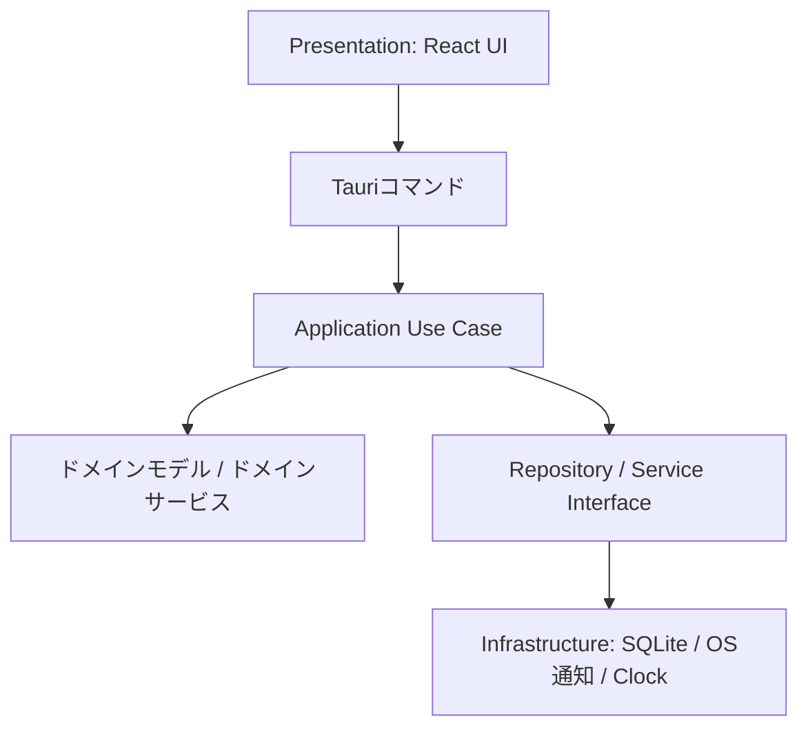
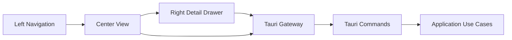
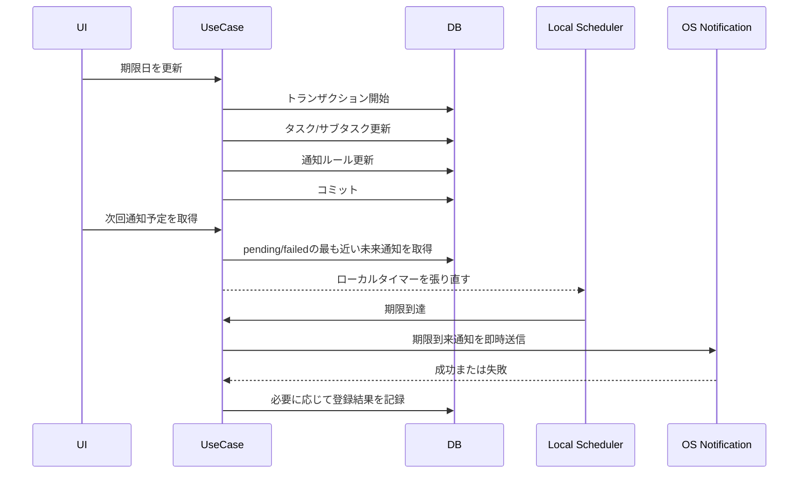

# アーキテクチャ

## 採用アーキテクチャ

TaskTimerはClean Architectureを採用し、ドメインの意味が重要な箇所ではDDDの考え方を使う。

## レイヤー責務

### Domain

業務ルールを持つ。

- タスク/サブタスクの状態遷移。
- 日付検証。
- タイマー開始可否。
- 単一アクティブタイマー制約。

DomainはReact、Tauri、SQLite、OS通知API、ファイルシステムAPIに依存しない。

### Application

ユースケースの調整処理とトランザクション境界を持つ。

- `CreateTask`
- `UpdateTask`
- `CreateSubtask`
- `UpdateSubtask`
- `StartTimer`
- `StopActiveTimer`
- `PauseActiveTimer`
- `ResumeActiveTimer`
- `EndActiveTimer`
- `ListWeekCalendarItems`
- `ScheduleNotification`
- `ListTaskLists`
- `CreateTaskList`
- `UpdateTaskList`
- `DeleteTaskList`
- `ListTags`
- `CreateTag`
- `UpdateTag`
- `DeleteTag`
- `AttachTagToTask`
- `DetachTagFromTask`
- `ListTasksByView`
- `ToggleTaskFavorite`
- `UpdateTaskStatus`
- `UpdateTaskSchedule`
- `UpdateSubtaskSchedule`
- `UpdateRecurrenceRule`
- `UpdateUiPreference`

### Infrastructure

副作用を実装する。

- SQLite Repository。
- データベースマイグレーション。
- OSローカル通知アダプター。
- Clockアダプター。
- アプリデータディレクトリ解決。

### Presentation

表示状態とユーザー操作を扱う。

- 左ナビゲーションペイン。
- 中央タスク一覧ビュー。
- 右タスク詳細ペイン。
- サブタスク編集。
- アクティブタイマー表示。
- カレンダー。
- 設定ビュー。

Presentationはトランザクション挙動を決めない。

UI/UX改修後のPresentationは [UI/UX再設計仕様](ui-ux-redesign.md) を正とする。

## トランザクション境界

| ユースケース | トランザクション |
| --- | --- |
| CreateTask | タスクを追加する。 |
| UpdateTask | 日付検証、タスク更新、通知ルールレコード更新を行う。 |
| CreateSubtask | 親タスク存在確認後、サブタスクを追加する。 |
| UpdateSubtask | 日付検証、サブタスク更新、通知ルールレコード更新を行う。 |
| StartTimer | 対象存在確認、開始可能性確認、アクティブタイマー/アクティブポモドーロ不存在確認、タイマーセッション追加、対象状態を `in_progress` に更新する。 |
| GetPomodoroSettings | ポモドーロ既定値を取得する。読み取り専用。 |
| UpdatePomodoroSettings | 作業/休憩秒数と長休憩までの回数を検証し、設定を保存する。 |
| GetActivePomodoro | 進行中または一時停止中のポモドーロを1件取得する。読み取り専用。 |
| StartPomodoro | 対象存在確認、開始可能性確認、アクティブタイマー/アクティブポモドーロ不存在確認、作業フェーズ用 `timer_sessions` と `pomodoro_sessions` を同一トランザクションで作成し、対象状態を `in_progress` に更新する。 |
| PausePomodoro | アクティブポモドーロを取得し、作業フェーズでは `timer_pauses`、休憩フェーズでは `pomodoro_sessions.paused_at` を更新する。 |
| ResumePomodoro | 一時停止中のポモドーロを取得し、作業フェーズでは `timer_pauses`、休憩フェーズでは `paused_total_seconds` を更新して `running` に戻す。 |
| CompletePomodoroWorkPhase | 作業フェーズ用 `timer_sessions.elapsed_seconds` を確定し、`pomodoro_sessions` を `completed` にして `cycle_count` を加算する。 |
| StartPomodoroBreak | 完了済み作業フェーズを検証し、設定値から短休憩/長休憩を判定して休憩フェーズを開始する。 |
| SkipPomodoroBreak | 開始中休憩をキャンセルし、次の作業フェーズ用 `timer_sessions` と `pomodoro_sessions` を作成する。 |
| CompletePomodoroBreak | 休憩フェーズを `completed` にする。休憩は `timer_sessions` へ保存しない。 |
| CancelPomodoro | 作業フェーズなら作業タイマーも停止し、休憩フェーズなら休憩セッションだけを `cancelled` にする。 |
| PauseActiveTimer | アクティブタイマーを取得し、未再開の一時停止区間がないことを確認して一時停止区間を開始する。ポモドーロ作業フェーズに紐づく場合はポモドーロも `paused` にする。 |
| ResumeActiveTimer | 一時停止中のアクティブタイマーを取得し、未再開の一時停止区間を閉じる。ポモドーロ作業フェーズに紐づく場合は一時停止秒数を加算して `running` に戻す。 |
| EndActiveTimer | アクティブタイマーを取得し、一時停止区間を考慮して経過秒数を算出し、タイマーセッションを確定する。ポモドーロ作業フェーズに紐づく場合は互換操作としてポモドーロを `cancelled` にする。 |
| StopActiveTimer | 既存MVP名。UI改修後は `EndActiveTimer` の互換Use Caseとして扱う。 |
| CompleteTask | 未完了サブタスク数を確認し、確認済みの場合だけ親タスクを完了する。サブタスク状態は変更しない。 |
| CompleteSubtask | サブタスクを完了し、完了日時を記録する。 |
| DeleteTask | タスク、子サブタスク、タイマーセッション、ポモドーロセッション、通知ルールをソフト削除する。開始中タイマー/ポモドーロも通常検索から除外する。 |
| DeleteSubtask | サブタスク、タイマーセッション、ポモドーロセッション、通知ルールをソフト削除する。開始中タイマー/ポモドーロも通常検索から除外する。 |
| UpdateNotificationPreference | ローカル通知表示モードと通知全体ON/OFFを保存する。 |
| GetNextPendingNotification | アプリ起動中のローカルスケジューラ用に、未来の `pending` / `failed` 通知から最も近い1件を取得する。読み取り専用。 |
| DispatchDueNotifications | 期限到来した通知ルールを取得し、OS通知送信後に `registered` または `failed` を保存する。アプリ起動中スケジューラも期限到達時にこのUse Caseを呼ぶ。 |
| SyncNotifications | 起動、復帰、設定変更、復元後の再同期入口。期限到来通知dispatch後に次回通知予定を返す。 |
| ListNotificationOsRegistrationJobs | 将来のネイティブadapter用に、OS登録/差し替え/解除が必要な通知登録状態を上限付きで取得する。 |
| MarkNotificationOsRegistrationRegistered / Failed / Cancelled | OS登録・失敗・解除完了の結果を `notification_os_registrations` へ保存する。 |
| ListTaskLists | 左ペインのリスト一覧を取得する。読み取り専用。 |
| CreateTaskList | リスト名を検証し、リストを作成する。 |
| UpdateTaskList | 初期リストではないことを確認し、リスト名を検証して名称を変更する。 |
| DeleteTaskList | 初期リストではないことを確認し、所属タスクを初期リストへ移動してからリストをソフト削除する。 |
| ListTags | 左ペインのタグ一覧を取得する。読み取り専用。 |
| CreateTag | タグ名を検証し、大文字小文字を区別しない一意確認後にタグを作成する。 |
| UpdateTag | タグ存在確認、タグ名検証、一意確認後に名称を変更する。 |
| DeleteTag | タグとタスクタグ関連をソフト削除する。タスク、サブタスク、タイマー履歴、通知ルールは削除しない。 |
| AttachTagToTask | タスク存在確認、タグ存在確認後に `task_tags` 関連を作成または復活する。 |
| DetachTagFromTask | タスク存在確認、タグ存在確認後に `task_tags` 関連をソフト削除する。 |
| ListTasksByView | 選択中リスト、お気に入り、完了セクション、サブタスク進捗を含む一覧Read Modelを取得する。読み取り専用。 |
| ToggleTaskFavorite | タスク1件のお気に入り状態を更新する。 |
| UpdateTaskStatus | かんばん画面から `todo`、`in_progress`、`done` のいずれかへ状態を変更する。`done` へ移動する場合は未完了サブタスク確認を維持し、`todo` / `in_progress` へ戻す場合は `completed_at` を解除する。 |
| UpdateTaskSchedule | タスクの開始予定日、期限、通知ルールを同一トランザクションで更新する。 |
| UpdateSubtaskSchedule | サブタスクの開始予定日、期限、通知ルールを同一トランザクションで更新する。 |
| UpdateRecurrenceRule | 対象の繰り返し設定を検証し保存する。 |
| SetTimerTarget | タスクまたはサブタスクの目標タイマー時間を保存する。 |
| GetUiPreferences | 左ペイン開閉、最後のビュー、最後のリストID、カレンダー表示モードを取得する。 |
| UpdateUiPreferences | 左ペイン開閉、最後のビュー、最後のリストID、カレンダー表示モードを同一トランザクションで保存する。 |

OS通知送信、アプリ起動中のローカルタイマー予約、将来のネイティブOS登録はDBトランザクションに含めない。`notification_rules` を通知意図の正とし、DBコミット後の副作用として実行する。失敗時は通知意図を失わず、再試行状態を記録する。

Issue #29 の右詳細ペインでは、`UpdateTask` と `UpdateSubtask` をUI更新境界として使う。タイトル、開始予定日、期限、メモ、タイマー目標時間を同時に検証し、開始予定日/期限に対応する通知ルールを同一トランザクションで同期する。日付が未設定になった通知ルールは無効化し、日付が追加または変更された通知ルールは `pending` として再試行対象に戻す。

Issue #30 では、`PauseActiveTimer`、`ResumeActiveTimer`、`StopActiveTimer` をタイマー操作境界として使う。`StopActiveTimer` は互換名のまま「終了」として扱い、未再開の一時停止区間を終了時刻で閉じてから、一時停止合計秒数を差し引いた `elapsed_seconds` を保存する。`UpdateTask` と `UpdateSubtask` は繰り返し設定も同じトランザクションで保存し、繰り返し有効時は開始予定日または期限日の少なくとも一方を必須にする。

Issue #58 では、OS復帰またはウィンドウ再フォーカス相当のイベントでPresentationがスナップショットを再取得し、期限到来通知dispatchを再実行する。タイマーの正はDBに置き、停止時の `elapsed_seconds` は `started_at` と停止時刻のwall-clock差分から一時停止区間を差し引いて確定する。成功済み通知は `registered` として保持し、復帰後のdispatch対象から除外する。

Issue #51 では、将来時刻通知を段階導入にする。第1段階ではアプリ起動中だけローカルスケジューラが次回 `notify_at` まで待機し、期限到達時に既存の `DispatchDueNotifications` を呼ぶ。起動、ウィンドウ復帰、通知設定変更、タスク/サブタスク日付変更後は、期限到来通知を処理してから次回通知を再予約する。第2段階ではWindows/macOSのネイティブ永続登録を検証するが、OS登録状態は `notification_rules.registration_status` に混ぜず、専用の `notification_os_registrations` とRepository境界へ分離する。

Issue #116 では、`GetNextPendingNotification` を読み取り専用Use Caseとして実装する。返却DTOは `notificationRuleId` と `notifyAt` に限定し、タスク名、サブタスク名、メモ本文、通知本文をPresentationへ渡さない。React側はスナップショット更新後に次回通知を取得し、古い予約を破棄して1本だけローカルタイマーを張る。タイマー発火時は既存のスナップショット更新を呼び、期限到来通知dispatch後に次回通知を再予約する。

Issue #117 では、`SyncNotifications` を通知再同期の入口にする。Presentationは起動、ウィンドウ復帰、通知設定変更、タスク/サブタスク期限変更、カレンダー期限移動、SQLite復元後に `loadSnapshot` を経由し、`SyncNotifications` で期限到来通知dispatchと次回通知予定取得を同じ順序で実行する。通知全体OFF時はdispatchも次回予約も行わない。

Issue #115 では、将来のネイティブOS通知予約adapterに備えて `notification_os_registrations` を追加する。`notification_rules` は通知意図と期限到来dispatch状態を保持し、OS登録ID、OS登録状態、最終試行時刻、最終エラーは `notification_os_registrations` に保持する。タスク/サブタスク更新時は通知予定が同じでもOS登録状態だけを `pending` に戻し、通知ルール削除時はOS登録IDがある行を `cancel_pending` として残す。

Issue #60 では、カレンダーRead Modelを週専用から開始予定日・期限日の範囲取得へ拡張する。表示切替、基準日、選択中カレンダー項目はPresentation状態であり、DB更新を行わない。取得範囲は93日以内に制限し、週/日/月表示で必要な範囲だけをSQLiteから読み取る。サブタスク項目は親タスク名をRead Modelに含め、実行中タイマーは `started_at` から表示用時刻を派生する。

Issue #68 では、右詳細ペインの編集対象を期限日/期限時刻中心へ寄せる。`planned_start_date` は互換性のため保持するが、詳細UIからの作成・更新では `null` を渡す。期限通知の `notify_at` は `due_date` と `due_time` から同一トランザクション内で同期し、期限時刻がない場合は従来通り日付開始時刻を使う。

Issue #54 では、`TaskList` をタスク分類の境界として扱う。`CreateTaskList`、`UpdateTaskList`、`DeleteTaskList` はApplication Use Caseとして入力検証とトランザクション境界を持つ。カスタムリスト削除時は、同一トランザクション内で所属タスクを初期リストへ移動し、タイマー履歴や通知ルールは削除しない。

既定タスクリストのIDと名称はDomainの不変値として扱う。Applicationは既定値補完に使い、Infrastructureは初期データ投入と削除時の移動先に使う。Presentationで同じ意味を扱う場合も、UI固有の文字列ではなくDomain定数を参照する。

Issue #57 では、UI設定を `ui_preferences` に保存する。保存対象は `left_pane_open`、`last_view`、`last_task_list_id`、`calendar_view_mode` に限定する。壊れた値はRepositoryの読み取り時に既定値へフォールバックし、Use Caseの更新時はホワイトリスト化された値だけを受け付ける。選択中タスクや右詳細ペイン開閉は、削除やアーカイブで無効になりやすいため保存しない。

Issue #82 では、カレンダーからのタスク作成も既存の `CreateTask` を使う。Presentationはカレンダーの選択位置から `due_date` と `due_time` の初期値を組み立てるだけに留め、保存、入力検証、通知ルール同期、SQLiteトランザクションはApplication/Infrastructureの既存境界に委ねる。作成後の右詳細ペイン自動表示は行わない。

Issue #83 では、カレンダー上の期限マーカー移動も既存の `UpdateTask` / `UpdateSubtask` を使う。Presentationはドラッグ中の対象とドロップ先セルを一時状態として持ち、新しい `due_date` と `due_time` を組み立てる。開始予定日、タイトル、メモ、繰り返し設定、目標時間は既存値を保持し、保存と通知ルール同期はApplication/Infrastructureの既存境界に委ねる。リサイズや開始/終了期間モデルは後続Issueで扱う。

Issue #84 では、カレンダー項目の色をリスト単位で管理する。`TaskList` に `color_token` を追加し、`UpdateTaskList` がリスト名と色トークンの検証・保存トランザクション境界を持つ。Calendar Read Modelはタスクまたは親タスクの所属リスト色を `WeekCalendarItem` へ含め、Presentationは許可済みトークンからCSSクラスを選ぶ。タグ単位色とタスク個別色は後続Issueで扱う。

Issue #80 では、タグを横断分類として追加する。`tags` と `task_tags` は `TaskList` とは別の分類境界であり、親タスクにだけ付与する。サブタスク詳細では親タスクのタグを継承表示するが、サブタスクへ直接タグを保存しない。タグ削除はタグと関連だけを同一トランザクションでソフト削除し、タスク、サブタスク、タイマー履歴、通知ルールは保持する。

Issue #81 では、かんばん画面を `TaskRowItem` Read Modelの別表示として追加する。列分けはPresentationが `status` から派生し、状態変更は `UpdateTaskStatus` Use Caseを通す。MVPではドラッグ&ドロップを採用せず、カード内のクリック操作で状態を変更する。`archived` は通常かんばんから除外し、アーカイブ操作と復元操作は既存の専用Use Caseに委ねる。

## Read Model

UI/UX改修では、タスク一覧と詳細で必要な情報量が増えるため、Presentationが全データを走査しないように読み取り専用DTOを分ける。

| Read Model | 用途 | 主な項目 |
| --- | --- | --- |
| `TaskListNavigationItem` | 左ペイン | リストID、名前、未完了件数、選択状態。 |
| `TagNavigationItem` | 左ペイン | タグID、名前、対象タスク件数、選択状態。 |
| `TaskRowItem` | 中央タスク一覧 | タスクID、タイトル、状態、お気に入り、期限有無、期限状態、タグ、サブタスク完了数、サブタスク総数、アクティブタイマー有無。 |
| `TaskDetailView` | 右ペイン | タスク詳細、タグ、サブタスク、通知設定、繰り返し、タイマー目標、アクティブタイマー状態。 |
| `WeekCalendarItem` | カレンダー | 対象ID、対象種別、タイトル、親タスク名、日付、表示用時刻、マーカー、状態。 |

かんばん画面は専用Read Modelを追加せず、`TaskRowItem` を再利用する。カード内のタグ、メモプレビュー、サブタスク進捗、タイマー状態は同じDTOから表示する。

Read ModelはUI表示の都合を持つが、状態変更ルールは持たない。

## 状態と副作用

## 設計理由

- SQLiteはローカル構造化データとトランザクション整合性に向いている。
- TauriはElectronより実行時サイズが小さく、権限境界を作りやすい。
- Reactはカレンダーやタスク編集のような対話的UIに向いている。
- OS通知をアダプターに閉じ込めることで、Windows/macOS差分をInfrastructureへ隔離できる。
- Tauriの公式notification pluginをRust側adapterから呼び、PresentationにOS通知APIを直接公開しない。

## トレードオフ

- `target_type` と `target_id` により、タイマーと通知の共通処理は簡単になるが、DBレベルの外部キー制約は弱くなる。
- `tasks` と `subtasks` を分けることでドメイン意味は保てるが、共通処理のApplication Service設計が必要になる。
- Tauriは実行時サイズを抑えられる一方、Rust側実装とパッケージングの複雑さが増える。
- 将来時刻通知は、まずアプリ起動中のローカルスケジューラで既存dispatch境界を再利用する。アプリ完全終了中の通知保証はWindows/macOSネイティブ登録の検証後に扱う。
- UI/UX改修はRead Modelを増やすためRepository境界が増えるが、大量タスク時にPresentationで全件集計するより安全である。
- タイマー一時停止/再開は実務上便利だが、単純な開始/停止よりDB設計と境界ケースが増える。

## 代替案

タスクとサブタスクを単一の `work_items` テーブルに統合する。

利点:

- タイマーと通知の共通化が最も簡単。
- カレンダー取得クエリが単純になる。

欠点:

- 親タスクとサブタスクの意味が曖昧になりやすい。
- 将来、タスクとサブタスクで異なるルールが増えた場合に表現しづらい。

決定: MVPでは `tasks` と `subtasks` を分け、Application/Domain Serviceで作業対象の共通処理を扱う。
