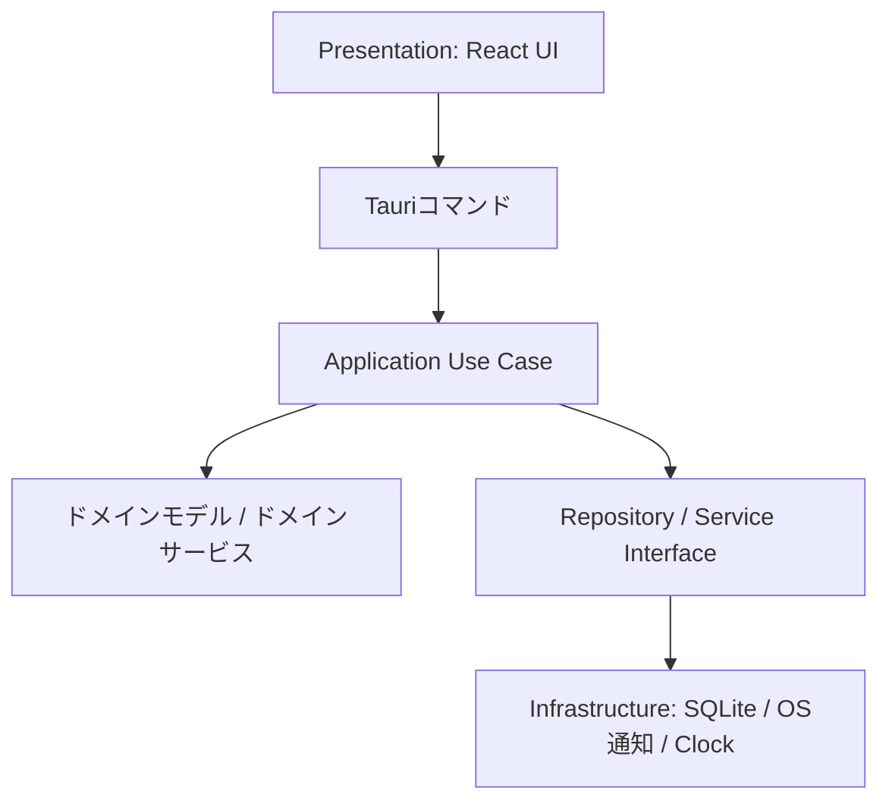
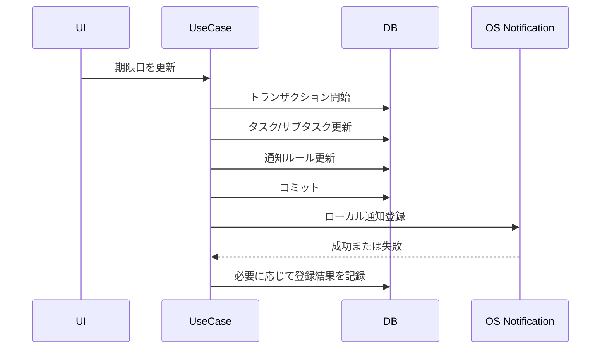

# アーキテクチャ

## 採用アーキテクチャ

TaskTimerはClean Architectureを採用し、ドメインの意味が重要な箇所ではDDDの考え方を使う。

## レイヤー責務

### Domain

業務ルールを持つ。

- タスク/サブタスクの状態遷移。
- 日付検証。
- タイマー開始可否。
- 単一アクティブタイマー制約。

DomainはReact、Tauri、SQLite、OS通知API、ファイルシステムAPIに依存しない。

### Application

ユースケースの調整処理とトランザクション境界を持つ。

- `CreateTask`
- `UpdateTask`
- `CreateSubtask`
- `UpdateSubtask`
- `StartTimer`
- `StopActiveTimer`
- `ListWeekCalendarItems`
- `ScheduleNotification`

### Infrastructure

副作用を実装する。

- SQLite Repository。
- データベースマイグレーション。
- OSローカル通知アダプター。
- Clockアダプター。
- アプリデータディレクトリ解決。

### Presentation

表示状態とユーザー操作を扱う。

- タスクリスト。
- タスク詳細。
- サブタスク編集。
- アクティブタイマー表示。
- 週カレンダー。

Presentationはトランザクション挙動を決めない。

## トランザクション境界

| ユースケース | トランザクション |
| --- | --- |
| CreateTask | タスクを追加する。 |
| UpdateTask | 日付検証、タスク更新、通知ルールレコード更新を行う。 |
| CreateSubtask | 親タスク存在確認後、サブタスクを追加する。 |
| UpdateSubtask | 日付検証、サブタスク更新、通知ルールレコード更新を行う。 |
| StartTimer | 対象存在確認、開始可能性確認、アクティブタイマー不存在確認、タイマーセッション追加、対象状態を `in_progress` に更新する。 |
| StopActiveTimer | アクティブタイマーを取得し、経過秒数を算出してタイマーセッションを確定する。 |
| CompleteTask | 未完了サブタスク数を確認し、確認済みの場合だけ親タスクを完了する。サブタスク状態は変更しない。 |
| CompleteSubtask | サブタスクを完了し、完了日時を記録する。 |
| DeleteTask | タスク、子サブタスク、タイマーセッション、通知ルールをソフト削除する。開始中タイマーも通常検索から除外する。 |
| DeleteSubtask | サブタスク、タイマーセッション、通知ルールをソフト削除する。開始中タイマーも通常検索から除外する。 |
| UpdateNotificationPreference | ローカル通知表示モードを保存する。 |

OS通知登録はDBトランザクションに含めない。DBコミット後に実行し、失敗時は再試行状態を記録する。

## 状態と副作用

## 設計理由

- SQLiteはローカル構造化データとトランザクション整合性に向いている。
- TauriはElectronより実行時サイズが小さく、権限境界を作りやすい。
- Reactは週カレンダーやタスク編集のような対話的UIに向いている。
- OS通知をアダプターに閉じ込めることで、Windows/macOS差分をInfrastructureへ隔離できる。

## トレードオフ

- `target_type` と `target_id` により、タイマーと通知の共通処理は簡単になるが、DBレベルの外部キー制約は弱くなる。
- `tasks` と `subtasks` を分けることでドメイン意味は保てるが、共通処理のApplication Service設計が必要になる。
- Tauriは実行時サイズを抑えられる一方、Rust側実装とパッケージングの複雑さが増える。

## 代替案

タスクとサブタスクを単一の `work_items` テーブルに統合する。

利点:

- タイマーと通知の共通化が最も簡単。
- カレンダー取得クエリが単純になる。

欠点:

- 親タスクとサブタスクの意味が曖昧になりやすい。
- 将来、タスクとサブタスクで異なるルールが増えた場合に表現しづらい。

決定: MVPでは `tasks` と `subtasks` を分け、Application/Domain Serviceで作業対象の共通処理を扱う。
