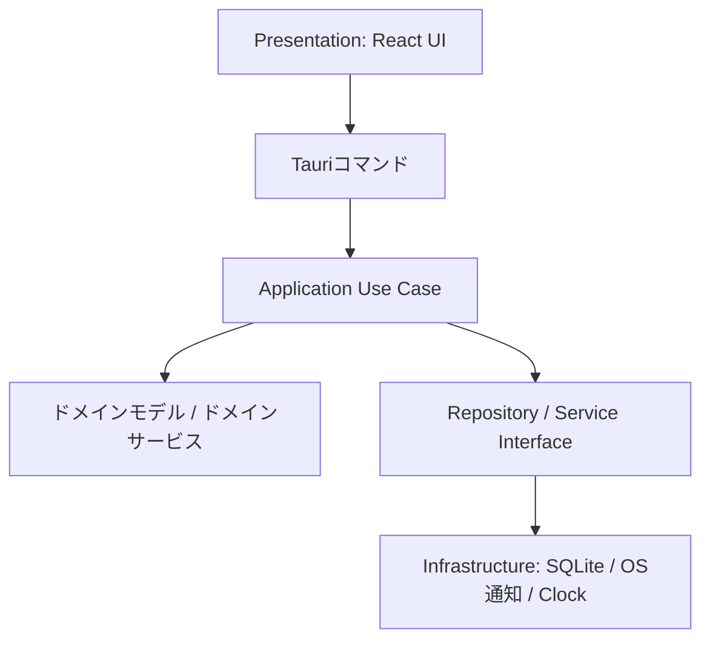
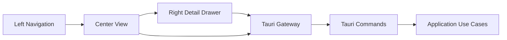
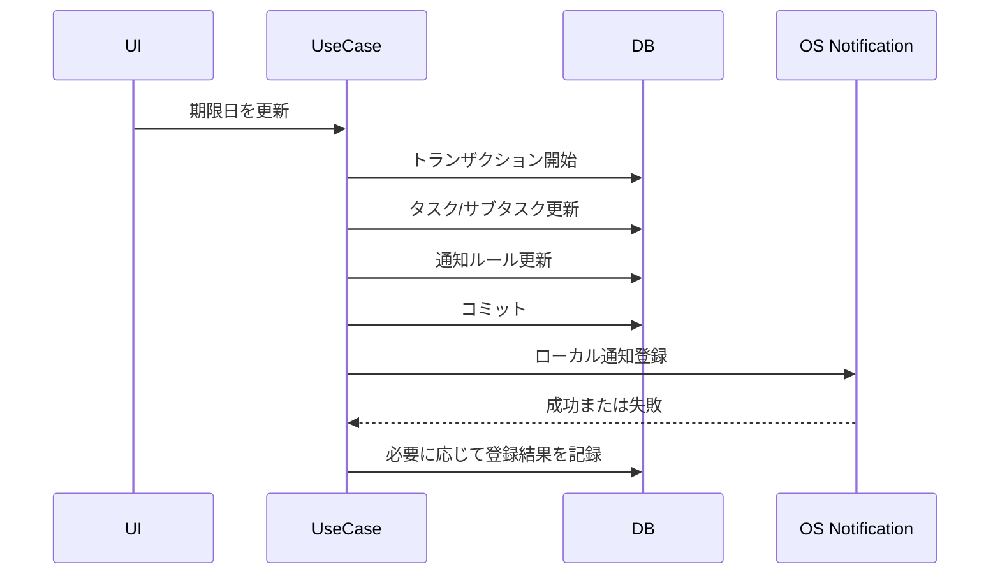

# アーキテクチャ

## 採用アーキテクチャ

TaskTimerはClean Architectureを採用し、ドメインの意味が重要な箇所ではDDDの考え方を使う。

## レイヤー責務

### Domain

業務ルールを持つ。

- タスク/サブタスクの状態遷移。
- 日付検証。
- タイマー開始可否。
- 単一アクティブタイマー制約。

DomainはReact、Tauri、SQLite、OS通知API、ファイルシステムAPIに依存しない。

### Application

ユースケースの調整処理とトランザクション境界を持つ。

- `CreateTask`
- `UpdateTask`
- `CreateSubtask`
- `UpdateSubtask`
- `StartTimer`
- `StopActiveTimer`
- `PauseActiveTimer`
- `ResumeActiveTimer`
- `EndActiveTimer`
- `ListWeekCalendarItems`
- `ScheduleNotification`
- `ListTaskLists`
- `ListTasksByView`
- `ToggleTaskFavorite`
- `UpdateTaskSchedule`
- `UpdateSubtaskSchedule`
- `UpdateRecurrenceRule`
- `UpdateUiPreference`

### Infrastructure

副作用を実装する。

- SQLite Repository。
- データベースマイグレーション。
- OSローカル通知アダプター。
- Clockアダプター。
- アプリデータディレクトリ解決。

### Presentation

表示状態とユーザー操作を扱う。

- 左ナビゲーションペイン。
- 中央タスク一覧ビュー。
- 右タスク詳細ペイン。
- サブタスク編集。
- アクティブタイマー表示。
- カレンダー。
- 設定ビュー。

Presentationはトランザクション挙動を決めない。

UI/UX改修後のPresentationは [UI/UX再設計仕様](ui-ux-redesign.md) を正とする。

## トランザクション境界

| ユースケース | トランザクション |
| --- | --- |
| CreateTask | タスクを追加する。 |
| UpdateTask | 日付検証、タスク更新、通知ルールレコード更新を行う。 |
| CreateSubtask | 親タスク存在確認後、サブタスクを追加する。 |
| UpdateSubtask | 日付検証、サブタスク更新、通知ルールレコード更新を行う。 |
| StartTimer | 対象存在確認、開始可能性確認、アクティブタイマー不存在確認、タイマーセッション追加、対象状態を `in_progress` に更新する。 |
| PauseActiveTimer | アクティブタイマーを取得し、未再開の一時停止区間がないことを確認して一時停止区間を開始する。 |
| ResumeActiveTimer | 一時停止中のアクティブタイマーを取得し、未再開の一時停止区間を閉じる。 |
| EndActiveTimer | アクティブタイマーを取得し、一時停止区間を考慮して経過秒数を算出し、タイマーセッションを確定する。 |
| StopActiveTimer | 既存MVP名。UI改修後は `EndActiveTimer` の互換Use Caseとして扱う。 |
| CompleteTask | 未完了サブタスク数を確認し、確認済みの場合だけ親タスクを完了する。サブタスク状態は変更しない。 |
| CompleteSubtask | サブタスクを完了し、完了日時を記録する。 |
| DeleteTask | タスク、子サブタスク、タイマーセッション、通知ルールをソフト削除する。開始中タイマーも通常検索から除外する。 |
| DeleteSubtask | サブタスク、タイマーセッション、通知ルールをソフト削除する。開始中タイマーも通常検索から除外する。 |
| UpdateNotificationPreference | ローカル通知表示モードと通知全体ON/OFFを保存する。 |
| DispatchDueNotifications | 期限到来した通知ルールを取得し、OS通知送信後に `registered` または `failed` を保存する。 |
| ListTaskLists | 左ペインのリスト一覧を取得する。読み取り専用。 |
| CreateTaskList | リスト名を検証し、リストを作成する。 |
| ListTasksByView | 選択中リスト、お気に入り、完了セクション、サブタスク進捗を含む一覧Read Modelを取得する。読み取り専用。 |
| ToggleTaskFavorite | タスク1件のお気に入り状態を更新する。 |
| UpdateTaskSchedule | タスクの開始予定日、期限、通知ルールを同一トランザクションで更新する。 |
| UpdateSubtaskSchedule | サブタスクの開始予定日、期限、通知ルールを同一トランザクションで更新する。 |
| UpdateRecurrenceRule | 対象の繰り返し設定を検証し保存する。 |
| SetTimerTarget | タスクまたはサブタスクの目標タイマー時間を保存する。 |
| UpdateUiPreference | 左ペイン開閉や最後に開いたビューなど、UI設定を保存する。 |

OS通知登録はDBトランザクションに含めない。DBコミット後に実行し、失敗時は再試行状態を記録する。

Issue #29 の右詳細ペインでは、`UpdateTask` と `UpdateSubtask` をUI更新境界として使う。タイトル、開始予定日、期限、メモ、タイマー目標時間を同時に検証し、開始予定日/期限に対応する通知ルールを同一トランザクションで同期する。日付が未設定になった通知ルールは無効化し、日付が追加または変更された通知ルールは `pending` として再試行対象に戻す。

Issue #30 では、`PauseActiveTimer`、`ResumeActiveTimer`、`StopActiveTimer` をタイマー操作境界として使う。`StopActiveTimer` は互換名のまま「終了」として扱い、未再開の一時停止区間を終了時刻で閉じてから、一時停止合計秒数を差し引いた `elapsed_seconds` を保存する。`UpdateTask` と `UpdateSubtask` は繰り返し設定も同じトランザクションで保存し、繰り返し有効時は開始予定日または期限日の少なくとも一方を必須にする。

Issue #58 では、OS復帰またはウィンドウ再フォーカス相当のイベントでPresentationがスナップショットを再取得し、期限到来通知dispatchを再実行する。タイマーの正はDBに置き、停止時の `elapsed_seconds` は `started_at` と停止時刻のwall-clock差分から一時停止区間を差し引いて確定する。成功済み通知は `registered` として保持し、復帰後のdispatch対象から除外する。

Issue #60 では、カレンダーRead Modelを週専用から開始日・終了日の範囲取得へ拡張する。表示切替、基準日、選択中カレンダー項目はPresentation状態であり、DB更新を行わない。取得範囲は93日以内に制限し、週/日/月表示で必要な範囲だけをSQLiteから読み取る。サブタスク項目は親タスク名をRead Modelに含め、実行中タイマーは `started_at` から表示用時刻を派生する。

## Read Model

UI/UX改修では、タスク一覧と詳細で必要な情報量が増えるため、Presentationが全データを走査しないように読み取り専用DTOを分ける。

| Read Model | 用途 | 主な項目 |
| --- | --- | --- |
| `TaskListNavigationItem` | 左ペイン | リストID、名前、未完了件数、選択状態。 |
| `TaskRowItem` | 中央タスク一覧 | タスクID、タイトル、状態、お気に入り、期限有無、期限状態、サブタスク完了数、サブタスク総数、アクティブタイマー有無。 |
| `TaskDetailView` | 右ペイン | タスク詳細、サブタスク、通知設定、繰り返し、タイマー目標、アクティブタイマー状態。 |
| `WeekCalendarItem` | カレンダー | 対象ID、対象種別、タイトル、親タスク名、日付、表示用時刻、マーカー、状態。 |

Read ModelはUI表示の都合を持つが、状態変更ルールは持たない。

## 状態と副作用

## 設計理由

- SQLiteはローカル構造化データとトランザクション整合性に向いている。
- TauriはElectronより実行時サイズが小さく、権限境界を作りやすい。
- Reactはカレンダーやタスク編集のような対話的UIに向いている。
- OS通知をアダプターに閉じ込めることで、Windows/macOS差分をInfrastructureへ隔離できる。
- Tauriの公式notification pluginをRust側adapterから呼び、PresentationにOS通知APIを直接公開しない。

## トレードオフ

- `target_type` と `target_id` により、タイマーと通知の共通処理は簡単になるが、DBレベルの外部キー制約は弱くなる。
- `tasks` と `subtasks` を分けることでドメイン意味は保てるが、共通処理のApplication Service設計が必要になる。
- Tauriは実行時サイズを抑えられる一方、Rust側実装とパッケージングの複雑さが増える。
- MVPの通知はアプリ起動中または再読み込み時に期限到来ルールをdispatchする。OS側の将来時刻スケジューリングは後続改善とする。
- UI/UX改修はRead Modelを増やすためRepository境界が増えるが、大量タスク時にPresentationで全件集計するより安全である。
- タイマー一時停止/再開は実務上便利だが、単純な開始/停止よりDB設計と境界ケースが増える。

## 代替案

タスクとサブタスクを単一の `work_items` テーブルに統合する。

利点:

- タイマーと通知の共通化が最も簡単。
- カレンダー取得クエリが単純になる。

欠点:

- 親タスクとサブタスクの意味が曖昧になりやすい。
- 将来、タスクとサブタスクで異なるルールが増えた場合に表現しづらい。

決定: MVPでは `tasks` と `subtasks` を分け、Application/Domain Serviceで作業対象の共通処理を扱う。
