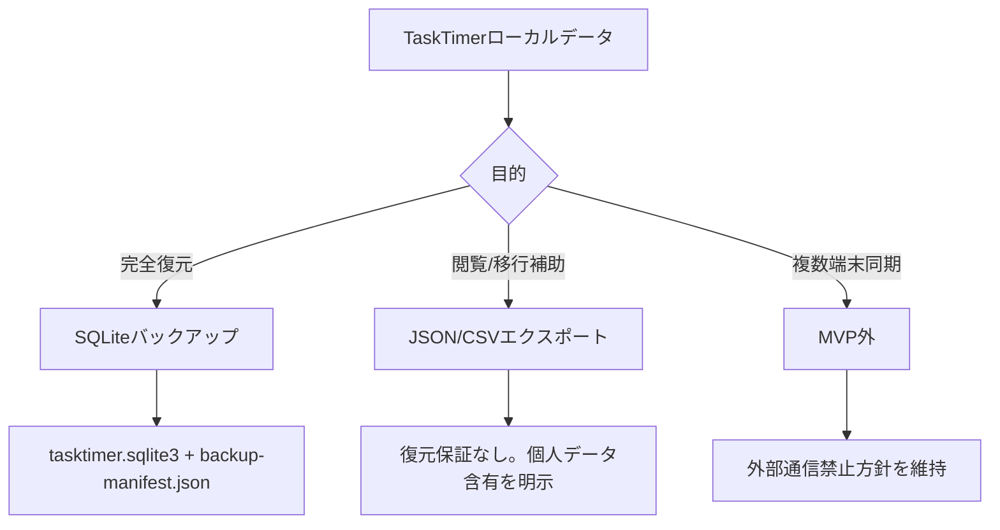
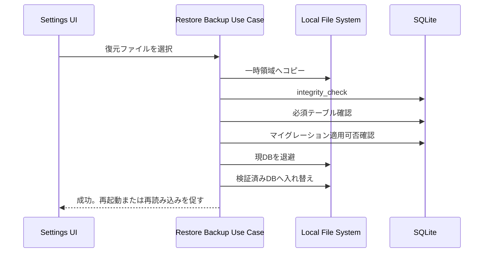
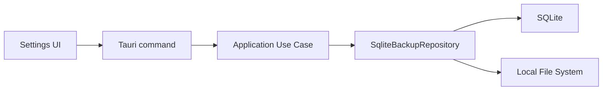

# ローカルデータのバックアップとエクスポート方針

## 目的

TaskTimerのローカルデータを、端末故障、端末移行、誤削除に備えて安全に退避できるようにする。

この文書はデータ保護の設計方針であり、クラウド同期、外部ストレージ連携、アプリ実行時の外部通信は追加しない。

## 採用案

フル復元用の正はSQLiteバックアップにする。JSON/CSVは閲覧、監査、他ツール移行の補助形式として扱い、完全復元用にはしない。



## バックアップ対象

| 対象 | 扱い | 理由 |
| --- | --- | --- |
| `tasktimer.sqlite3` | フルバックアップ対象 | タスク、サブタスク、タグ、タイマー履歴、通知ルール、通知設定、UI設定の正。 |
| `backup-manifest.json` | バックアップ作成時に同梱 | アプリバージョン、スキーマ確認結果、作成日時、プラットフォームを記録する。 |
| Release version | manifestに記録 | 復元時の互換性判断に使う。 |
| OS通知の登録状態 | DB内の通知ルールを正とする | OS側登録そのものは復元せず、復元後にアプリ側で再同期する。 |

## バックアップ対象外

| 対象外 | 理由 |
| --- | --- |
| GitHub Issue、PR、Release artifactへのDB添付 | タスク名、メモ本文、通知本文、タイマー履歴が含まれる可能性がある。 |
| OS固有の通知許可状態 | OS権限は端末ごとに異なり、ファイル復元で移行しない。 |
| アプリのインストーラー/実行ファイル | GitHub Releasesから再取得する。 |
| ログファイル | ユーザー内容を含めない方針だが、バックアップの正にはしない。 |
| クラウド保存先設定 | MVPではクラウド保存を提供しない。 |

## ファイル形式

### SQLiteバックアップ

推奨パッケージ:

```text
TaskTimer-backup-YYYYMMDD-HHMMSS/
  tasktimer.sqlite3
  backup-manifest.json
```

`backup-manifest.json` の最小項目:

```json
{
  "format": "tasktimer-sqlite-backup",
  "formatVersion": 1,
  "appVersion": "0.1.0",
  "schemaVersion": 1,
  "createdAt": "2026-07-15T00:00:00+09:00",
  "platform": "windows",
  "databaseFile": "tasktimer.sqlite3",
  "integrityCheck": "ok"
}
```

SQLiteバックアップは完全復元用であり、タスク名、サブタスク名、メモ本文、通知ルール、通知失敗履歴、タイマー履歴を含む。

### JSONエクスポート

JSONは人間が確認しやすい構造化エクスポートとして扱う。完全復元の互換性は保証しない。

ファイル名:

```text
TaskTimer-export-YYYYMMDD-HHMMSS.json
```

トップレベル項目:

- `task_lists`
- `tags`
- `task_tags`
- `tasks`
- `subtasks`
- `timer_sessions`
- `timer_pauses`
- `notification_rules`
- `recurrence_rules`

`manifest` には以下を記録する。

```json
{
  "format": "tasktimer-json-export",
  "formatVersion": 1,
  "appVersion": "0.1.0",
  "createdAt": "2026-07-15T00:00:00+09:00",
  "platform": "windows",
  "compatibility": "viewing-and-migration-aid-not-restore",
  "containsPersonalData": true
}
```

各テーブル相当データは、復元ではなく閲覧、監査、移行補助に必要な表示・関連付けフィールドだけを含める。削除済み行は補助エクスポート対象外とし、完全復元が必要な場合はSQLiteバックアップを使う。

メモ本文を含むため、UIとdocsで個人データ含有を明示する。

### CSVエクスポート

CSVは表計算ソフトでの閲覧・集計を目的にする。1ファイルに詰め込まず、用途ごとに分ける。

フォルダ名:

```text
TaskTimer-export-YYYYMMDD-HHMMSS-csv/
```

同梱ファイル:

- `export-manifest.json`
- `task_lists.csv`: `id`, `name`, `color_token`, `sort_order`, `created_at`, `updated_at`
- `tags.csv`: `id`, `name`, `sort_order`, `created_at`, `updated_at`
- `task_tags.csv`: `task_id`, `tag_id`, `created_at`
- `tasks.csv`
- `subtasks.csv`
- `timer_sessions.csv`
- `timer_pauses.csv`
- `notification_rules.csv`
- `recurrence_rules.csv`

CSVは改行、カンマ、ダブルクォートを正しくエスケープする。表計算ソフトで開いたときの数式実行を避けるため、`=`, `+`, `-`, `@` などで始まるセルは先頭にアポストロフィを付けて安全化する。CSVからの復元はMVP外とする。正確な値を機械的に参照したい場合はJSONエクスポートを使う。

## 復元方針

復元は既存DBを直接上書きしない。検証済みの一時DBへ配置し、検証成功後に入れ替える。



復元時の判断:

| 状態 | 方針 |
| --- | --- |
| SQLiteとして開けない | 復元を拒否する。 |
| `PRAGMA integrity_check` が `ok` でない | 復元を拒否する。 |
| 必須テーブルがない | 復元を拒否する。 |
| 古いDBだが既存マイグレーションで更新可能 | 一時DB上でマイグレーション後に復元する。 |
| 新しいアプリで作られたDBなど、現在のアプリが理解できない | 復元を拒否し、新しいTaskTimerで作成された可能性を説明する。 |
| 復元処理中に失敗 | 既存DBを保持し、退避済みDBから戻せるようにする。 |

## トランザクション境界

バックアップ作成:

1. Application Use Caseがバックアップ開始を受ける。
2. Repository/InfrastructureがSQLiteの一貫したスナップショットを作る。
3. `PRAGMA integrity_check` を実行する。
4. DBコピーとmanifest作成を同じバックアップ操作単位として扱う。
5. 成功後にUIへ保存先を返す。

復元:

1. Application Use Caseが復元開始を受ける。
2. Infrastructureが選択DBを一時領域へコピーする。
3. 一時DBで検証とマイグレーションを行う。
4. 現DBを退避した後、検証済みDBへ入れ替える。
5. 失敗時は現DBまたは退避DBを保持し、復元途中のDBを正にしない。

DB書き込み中の単純ファイルコピーは避ける。アプリ内実装では `VACUUM INTO` によるSQLiteの一貫したスナップショットを使う。

## 実装境界

SQLiteバックアップ/復元Use Caseは、設定画面UIから独立したApplication境界として実装する。



Tauri command:

- `create_sqlite_backup({ destinationDir })`
- `restore_sqlite_backup({ backupDir })`

Repository/Infrastructureの責務:

- バックアップ作成前に現DBで `PRAGMA integrity_check` を実行する。
- `VACUUM INTO` で `tasktimer.sqlite3` のスナップショットを作る。
- 作成後のバックアップDBを読み取り専用で開き、整合性と必須テーブルを確認する。
- `backup-manifest.json` に `formatVersion`、`appVersion`、`schemaVersion`、`createdAt`、`platform` を記録する。
- 復元時はmanifest、DB整合性、必須テーブル、既存マイグレーション適用可否を一時DBで確認してから入れ替える。
- 復元失敗時は既存DBまたは退避DBを正として保持する。

## UI方針

設定画面に「データ管理」セクションを置く。

提供する操作:

- SQLiteバックアップを作成。
- SQLiteバックアップから復元。
- JSONエクスポート。
- CSVエクスポート。

UIの責務:

- 保存先または復元元フォルダの選択。
- 復元前の確認メッセージ表示。
- 成功、失敗、キャンセル状態の表示。
- 操作中の多重実行防止。

UIが持たない責務:

- バックアップmanifest、SQLite整合性、必須テーブル、マイグレーション可否の検証。
- DBファイルの直接入れ替え。
- JSON/CSVの内容生成。

表示する注意:

- バックアップ/エクスポートにはタスク名、メモ本文、タイマー履歴が含まれる。
- 公開Issue、PR、Discussions、Release artifactへ添付しない。
- 復元は現在のデータを置き換えるため、実行前に現在DBを退避する。

設計理由:

- ファイル名はUse Case側で生成し、UIはフォルダ選択に限定する。形式やタイムスタンプ命名のばらつきを防ぐため。
- 復元確認はUIで実施し、検証と入れ替えはUse Case/Infrastructureへ閉じ込める。Presentation層がDBの正しさを判断しないため。
- Tauri権限はフォルダ選択に必要な `dialog:allow-open` に限定する。外部通信やクラウド連携は追加しないため。

トレードオフ:

- ファイル名を利用者が直接指定できない代わりに、保存形式と衝突回避の責務をアプリ側に寄せられる。
- UIでは詳細なファイルパスを出さないため、調査時の情報量は減るが、個人情報を含むパスの露出を抑えられる。

## セキュリティ

- エクスポートファイルとSQLiteバックアップは個人データとして扱う。
- ユーザー内容、DBパス、ファイル名に含まれる個人情報をログへ出さない。
- 外部通信、自動バックアップ、クラウド保存先連携は追加しない。
- 暗号化バックアップはMVP外とする。必要になった時点で鍵管理、復旧不能リスク、パスワード忘れ時の扱いを別ADRで設計する。
- Issue調査でDB提供を求めない。再現が必要な場合は、個人データを含まない手順または合成データで確認する。

## 実装分割

- GitHub #88: SQLiteバックアップ/復元Use Caseを実装する。
- GitHub #87: JSON/CSVエクスポートUse Caseを実装する。
- GitHub #89: バックアップ/復元/エクスポートUIを設定画面へ追加する。

## 代替案

### OS標準バックアップへ完全に任せる

利点:

- アプリ実装が不要。
- Tauriファイル権限を増やさずに済む。

欠点:

- 利用者が何を退避すればよいか分からない。
- 端末移行時の復元判断、破損DB、バージョン不一致を説明できない。

判断: 不採用。少なくとも対象ファイルと復元方針をTaskTimer側で説明する。

### JSONを完全復元形式にする

利点:

- 人間が読める。
- 将来のスキーマ変更に対して柔軟に見える。

欠点:

- 通知ルール、タイマー履歴、削除済み行、将来の制約を完全に復元する設計が複雑。
- SQLiteの制約とマイグレーションを別形式で再実装することになる。

判断: 不採用。完全復元はSQLite、JSON/CSVは補助形式に分ける。

## 危険ケース

- 利用者がSQLiteバックアップやCSVをIssueへ添付し、個人データが公開される。
- DBコピー中にアプリが書き込み、復元不能なバックアップが作られる。
- 新しいアプリで作られたDBを古いアプリへ復元して起動できなくなる。
- 復元失敗時に既存DBまで失われる。
- CSVエクスポートでメモ本文の改行やカンマが壊れ、内容が誤解される。
- 暗号化なしバックアップを共有フォルダへ置き、端末外へ漏れる。
