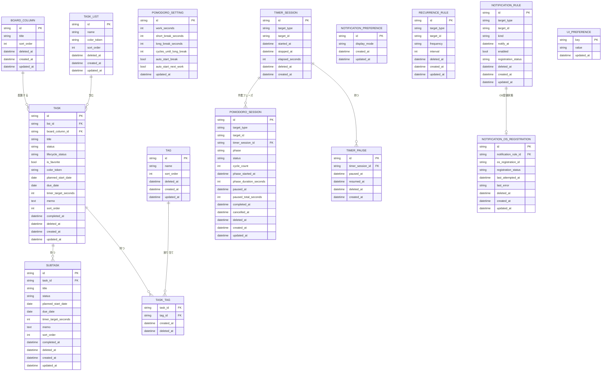
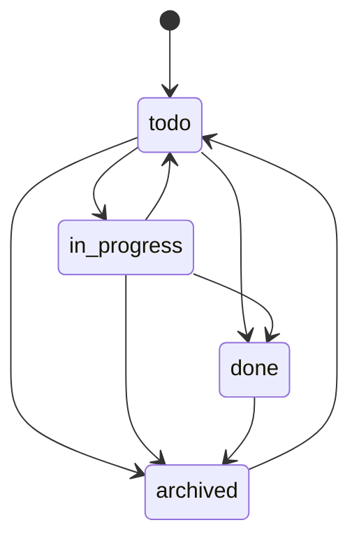

# ドメインモデル

## 集約概要

## エンティティ

### TaskList

左ペインに表示するタスクリストを表す。

ルール:

- 初期リストとして `タスク` を持つ。
- タスクは1つのリストに所属する。
- 削除済みリストは通常のリスト一覧に表示しない。
- 初期リストは `id = default` とし、名称変更と削除はできない。
- 初期リストIDと名称はドメイン不変値として扱い、Application、Infrastructure、Presentationで直書きしない。
- カスタムリスト名はtrim後に必須、最大80文字。
- アクティブなリスト間で同名は作成できない。
- アクティブなリストは初期リストを含めて最大10件。
- リスト色は許可済み色トークン `green`、`blue`、`amber`、`rose`、`violet`、`gray` のいずれか。
- 初期リストと既存リストの既定色は `green`。
- タスクとサブタスクのカレンダー色は所属リスト色を継承する。
- カスタムリスト削除時、所属タスクは初期リストへ移動し、タスク、サブタスク、タイマー履歴、通知ルールは削除しない。

### Task

親の作業項目を表す。

フィールド:

- `id`
- `list_id`
- `board_column_id`
- `title`
- `status`: `todo`, `in_progress`, `done`, `archived`
- `lifecycle_status`: `active`, `done`, `archived`
- `is_favorite`
- `color_token`: nullable。nullは所属リスト色を継承する。
- `planned_start_date`
- `due_date`
- `due_time`
- `timer_target_seconds`
- `memo`
- `sort_order`
- `completed_at`
- `deleted_at`
- `created_at`
- `updated_at`

ルール:

- `color_token` は `green`、`blue`、`amber`、`rose`、`violet`、`gray` またはnullに限定する。
- サブタスクは色を保存せず、親タスクの実効色を継承する。
- タイトルはtrim後に必須。
- 期限日は開始予定日より前にできない。
- 期限時刻は `HH:MM` 形式とし、期限日がない場合は保存できない。
- 完了済みまたはアーカイブ済みタスクはタイマー開始不可。
- 未完了サブタスクがあるタスクの完了には明示確認が必要。確認後は完了可能だが、サブタスク状態は変更しない。
- かんばん上の業務状態は `board_column_id`、完了/アーカイブ状態は `lifecycle_status` を正とする。
- `status` は既存画面と外部データ互換のため保持し、完了、再開、アーカイブ、復元、列移動時に同一トランザクションで同期する。
- 完了後も `board_column_id` を保持し、完了前に所属していた列の完了セクションへ表示する。
- タスクのアーカイブは `status = archived` として保存し、削除とは別の復元可能な状態として扱う。
- タスクアーカイブ時、子サブタスク、タイマー履歴、通知ルール、繰り返し設定、完了時刻は変更しない。
- アーカイブ済みタスクとその子サブタスクは、通常一覧、今日、お気に入り、カレンダー、通知dispatchから除外する。
- タスクまたは子サブタスクでタイマー開始中の場合、アーカイブは拒否する。
- アーカイブ済みタスクの復元は、`completed_at` があれば `done`、なければ `todo` へ戻し、子サブタスク状態は維持する。
- タスク削除時は、タスク、子サブタスク、タイマーセッション、ポモドーロセッション、通知ルールを同一トランザクションでソフト削除する。
- タスク削除時に対象タスクまたは子サブタスクでタイマー/ポモドーロ開始中の場合、そのセッションもソフト削除して通常のアクティブ検索から除外する。
- お気に入り状態はタスク単位で保持する。
- タグは親タスク単位で複数付与できる。
- 完了済みタスクは完了セクションへ表示され、データ上は `lifecycle_status` と `completed_at` を正とする。

### BoardColumn

かんばん上の業務状態を表す。

ルール:

- 名称はtrim後に必須、最大80文字、制御文字不可。
- アクティブな列名は大文字小文字を区別せず一意にする。
- 列は最低1件必要とし、最終1列は削除できない。
- 列削除時は移動先の別列を必須とし、所属タスクの列変更と列のソフト削除を同一トランザクションで行う。
- 並び順は重複のない連番として1トランザクションで更新する。
- 状態列を指定したタスク作成では、列の存在確認と `tasks.board_column_id` を含むタスク追加を同一トランザクションで行う。
- 状態列の完了タスク全件削除では、その列に所属する `lifecycle_status = done` のタスクグラフだけを同一トランザクションでソフト削除する。

### Tag

タスクを横断分類するラベルを表す。

ルール:

- タグ名はtrim後に必須、最大40文字、制御文字不可。
- アクティブなタグ名は大文字小文字を区別せず一意にする。
- タグ削除時はタグと `task_tags` 関連だけをソフト削除し、タスク、サブタスク、タイマー履歴、通知ルールは削除しない。
- サブタスクはMVPでは直接タグを持たず、詳細UIでは親タスクのタグを継承表示する。

### Subtask

タスク配下の子作業を表す。

ルール:

- 親タスクが存在する必要がある。
- タイトルはtrim後に必須。
- 期限日は開始予定日より前にできない。
- 期限時刻は `HH:MM` 形式とし、期限日がない場合は保存できない。
- 完了済みまたはアーカイブ済みサブタスクはタイマー開始不可。
- サブタスクは独自のタイマー履歴を持てる。
- サブタスクは独自の開始予定日、期限日、期限時刻、タイマー目標時間を持てる。
- 完了済みサブタスクは未完了に戻せるが、アーカイブ済みサブタスクは未完了に戻せない。
- サブタスク削除時は、サブタスク、タイマーセッション、ポモドーロセッション、通知ルールを同一トランザクションでソフト削除する。
- サブタスク削除時にタイマー/ポモドーロ開始中の場合、そのセッションもソフト削除して通常のアクティブ検索から除外する。

### TimerSession

1つの作業計測区間を表す。

ルール:

- `target_type` は `task` または `subtask`。
- `started_at` は必須。
- `stopped_at` がnullの行だけがアクティブタイマー。
- タスク/サブタスク全体でアクティブタイマーは1件だけ。
- `elapsed_seconds` は停止時に確定する。
- OSスリープやアプリ再起動をまたいでも、停止時は `started_at` と停止時刻のwall-clock差分を使って経過時間を確定する。
- 一時停止/再開を扱う場合、停止中区間は `TimerPause` または同等のセグメントとして保持し、経過時間から除外する。
- UI上の「終了」はタイマーセッションを確定し、`stopped_at` と `elapsed_seconds` を保存する操作とする。
- ソフト削除済みタイマーセッションは通常の履歴表示とアクティブタイマー検索から除外する。

### TimerPause

タイマー一時停止区間を表す。

ルール:

- 1つのアクティブタイマーに対して、未再開の一時停止区間は最大1件。
- 一時停止中のタイマーはアクティブタイマー制約上は実行中として扱い、別対象のタイマー開始はできない。
- 再開時に `resumed_at` を記録する。
- 終了時に未再開の一時停止区間がある場合、終了時刻で `resumed_at` を閉じる。
- `elapsed_seconds` は一時停止区間の合計秒数を除外して確定する。
- ソフト削除済みタイマーの一時停止区間は通常の計算対象から除外する。

### PomodoroSetting

ポモドーロの既定値を表す。

ルール:

- `id = default` の1行を正とする。
- 作業、短休憩、長休憩は60秒以上86,400秒以下。
- 長休憩までの作業回数は1以上12以下。
- 自動開始設定は将来UI/通知実装で使う。初期値はOFF。

### PomodoroSession

ポモドーロの現在フェーズと履歴を表す。

ルール:

- `target_type` は `task` または `subtask`。
- `phase` は `work`, `short_break`, `long_break`。
- `status` は `running`, `paused`, `completed`, `cancelled`。
- `running` または `paused` のポモドーロはアプリ全体で最大1件。
- 作業フェーズは `timer_sessions` を同一トランザクションで作成し、実作業時間履歴として扱う。
- 作業フェーズ完了時は `timer_sessions.elapsed_seconds` を確定し、`cycle_count` を1加算する。
- 休憩フェーズは `timer_sessions` に保存しない。
- 休憩フェーズの一時停止秒数は `pomodoro_sessions.paused_total_seconds` を正とする。
- 休憩スキップ時は開始中の休憩を `cancelled` にし、次の作業フェーズを新しい `timer_sessions` として開始する。
- 対象削除時はソフト削除し、アクティブポモドーロ検索から除外する。

### NotificationRule

ローカル通知の意図を表す。

ルール:

- `kind` は `planned_start` または `due`。
- 有効な通知では `notify_at` が必須。
- OS通知サービスへの登録はDBコミット後の副作用として扱う。
- タスク/サブタスク作成時に、開始予定日と期限がある場合は通知ルールを `pending` として作成する。
- 期限時刻がある期限通知は `due_date + due_time` を `notify_at` として保存する。
- 期限到来後のdispatchに成功した通知ルールは `registered` とする。
- `registered` の通知ルールは、OS復帰または再フォーカス後の再dispatch対象にしない。
- dispatchに失敗した通知ルールは `failed` とし、再試行対象に残す。
- ソフト削除済み通知ルールは無効化され、通知登録対象から除外する。
- アプリ起動中の将来時刻通知スケジューラは、DBに保存する独立エンティティではなく `notification_rules` から再生成できる副作用として扱う。
- アプリ完全終了中の通知を保証するネイティブOS登録を採用する場合、OS登録IDや最終登録試行は専用状態で管理し、通知意図の状態と混同しない。

### NotificationDeliveryAttempt

ローカル通知送信の試行イベントを表す。

ルール:

- `notification_rule_id` で通知意図と関連付ける。
- `result` は `success` または `failed`。
- 送信成功時も失敗時も1試行として保存する。
- `target_type`、`target_id`、`kind`、`notify_at` は履歴表示用のスナップショットとして保存する。
- `error_message` は失敗時のみ保存し、500文字までに切り詰める。
- タスク名、サブタスク名、メモ本文、通知本文は保存しない。
- UI表示は最新件数に制限し、全履歴読み込みに依存しない。

### NotificationPreference

ローカル通知本文の表示設定を表す。

ルール:

- `display_mode` は `title_only` または `generic`。
- `notifications_enabled` は通知全体のON/OFFを表す。
- デフォルトは `title_only`。
- デフォルトでは通知全体をONにする。
- `title_only` はタスクまたはサブタスクのタイトルのみを表示する。
- `generic` はタスクまたはサブタスクのタイトルをOS通知adapterへ渡さず、汎用メッセージだけを表示する。
- 通知全体がOFFの場合、通知ルールは保持したままdispatch対象から除外する。
- アーカイブ済みタスクおよびアーカイブ済み親タスク配下のサブタスク通知は、通知ルールを保持したままdispatch対象から除外する。

### RecurrenceRule

タスクまたはサブタスクの繰り返し設定を表す。

ルール:

- `target_type` は `task` または `subtask`。
- `frequency` は `daily`, `weekly`, `monthly` などの許可値に限定する。
- `interval` は1以上の整数とする。
- MVPでは `frequency` は `daily`, `weekly`, `monthly` に限定し、`interval` は1以上365以下とする。
- 繰り返しを有効化する場合、開始予定日または期限日の少なくとも一方が必要。
- 繰り返しタスクの次回生成または期限更新は、完了操作の副作用ではなくApplication Use Caseで明示的に扱う。
- 無限生成を避けるため、1回の操作で作成する次回タスクは最大1件とする。

### UiPreference

画面状態のローカル設定を表す。

ルール:

- 左ペイン開閉、最後に開いたビュー、最後に選択したリスト、カレンダー表示モードを保存する。
- 業務データではないが、オフライン復元性のためSQLiteに保存する。
- ユーザーのメモ本文やタスク内容を値に保存しない。
- 任意キーではなく、Application Use Caseで許可されたキーだけを保存する。
- 設定値が破損している場合は、アプリ起動を止めず既定値へフォールバックする。
- 選択中タスク、選択中サブタスク、右詳細ペイン開閉は保存しない。

## ドメインサービス

### TimerPolicy

確認内容:

- 対象が存在する。
- 対象が完了済みまたはアーカイブ済みではない。
- アクティブタイマーまたはアクティブポモドーロが存在しない。

### PomodoroPolicy

確認内容:

- 作業/休憩秒数と長休憩までの作業回数が許容範囲内である。
- 作業フェーズだけが `timer_sessions` と紐づく。
- 完了済み作業フェーズの `cycle_count` に応じて短休憩/長休憩を判定する。
- 通常タイマーとポモドーロを合わせて単一アクティブ制約を満たす。
- 対象削除時にポモドーロセッションが孤立しない。

### SchedulePolicy

確認内容:

- 開始予定日と期限日の順序。
- 通知時刻の妥当性。
- カレンダー項目が指定された表示範囲に含まれること。
- カレンダー表示範囲が過大ではないこと。
- 繰り返し設定の頻度と間隔の妥当性。

### NotificationContentPolicy

確認内容:

- 表示モードが妥当。
- `title_only` のときだけタイトルを含める。
- メモ本文を通知に含めない。

### TaskListPolicy

確認内容:

- 初期リストが存在する。
- タスク作成時の所属リストが存在する。
- リスト削除時にタスクが孤立しない。
- 初期リストは名称変更、削除できない。
- リスト名が必須、最大80文字、アクティブリスト間で一意である。
- アクティブリスト数が初期リストを含めて10件を超えない。

### TimerPausePolicy

確認内容:

- アクティブタイマーが存在する。
- 一時停止中のタイマーを二重に一時停止しない。
- 一時停止していないタイマーだけを再開できる。
- 一時停止中も単一アクティブタイマー制約を維持する。

## 状態遷移

補足:

- `archived --> todo` はアーカイブ復元を表す。
- アーカイブ復元は親タスクの状態だけを戻し、サブタスクの完了状態、通知ルール、親タスクの完了時刻は保持する。
