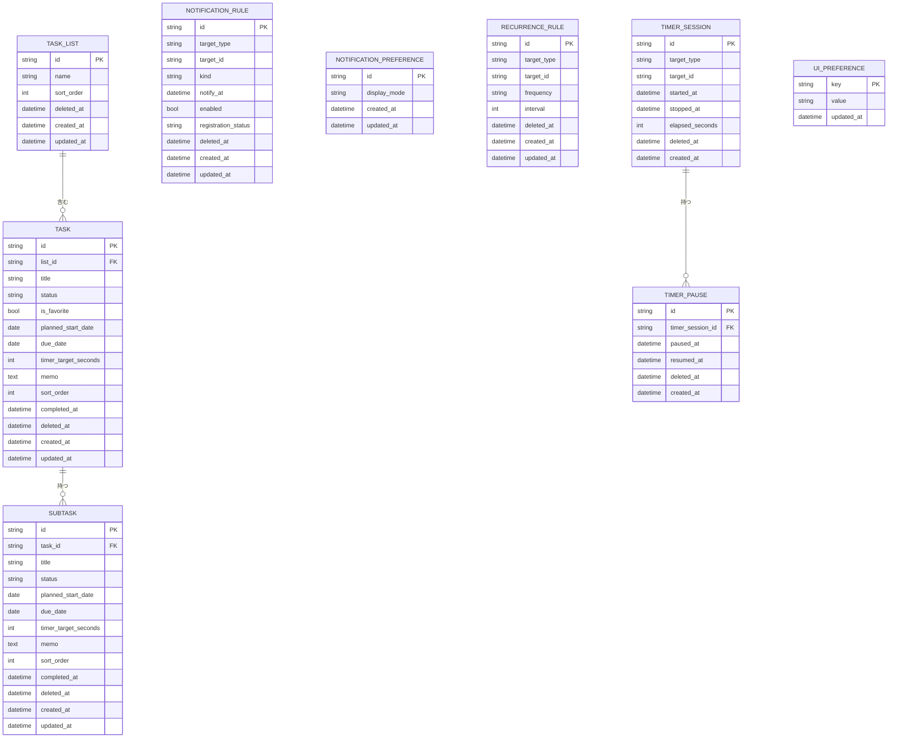
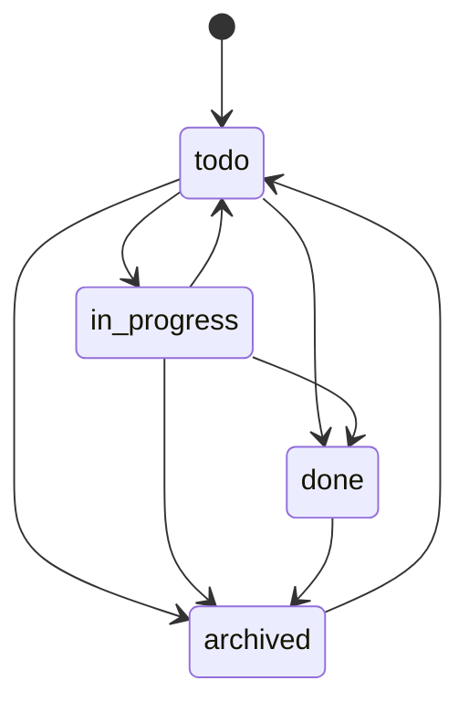

# ドメインモデル

## 集約概要

## エンティティ

### TaskList

左ペインに表示するタスクリストを表す。

ルール:

- 初期リストとして `タスク` を持つ。
- タスクは1つのリストに所属する。
- 削除済みリストは通常のリスト一覧に表示しない。
- 初期リストは `id = default` とし、名称変更と削除はできない。
- 初期リストIDと名称はドメイン不変値として扱い、Application、Infrastructure、Presentationで直書きしない。
- カスタムリスト名はtrim後に必須、最大80文字。
- アクティブなリスト間で同名は作成できない。
- カスタムリスト削除時、所属タスクは初期リストへ移動し、タスク、サブタスク、タイマー履歴、通知ルールは削除しない。

### Task

親の作業項目を表す。

フィールド:

- `id`
- `list_id`
- `title`
- `status`: `todo`, `in_progress`, `done`, `archived`
- `is_favorite`
- `planned_start_date`
- `due_date`
- `due_time`
- `timer_target_seconds`
- `memo`
- `sort_order`
- `completed_at`
- `deleted_at`
- `created_at`
- `updated_at`

ルール:

- タイトルはtrim後に必須。
- 期限日は開始予定日より前にできない。
- 期限時刻は `HH:MM` 形式とし、期限日がない場合は保存できない。
- 完了済みまたはアーカイブ済みタスクはタイマー開始不可。
- 未完了サブタスクがあるタスクの完了には明示確認が必要。確認後は完了可能だが、サブタスク状態は変更しない。
- タスクのアーカイブは `status = archived` として保存し、削除とは別の復元可能な状態として扱う。
- タスクアーカイブ時、子サブタスク、タイマー履歴、通知ルール、繰り返し設定、完了時刻は変更しない。
- アーカイブ済みタスクとその子サブタスクは、通常一覧、今日、お気に入り、カレンダー、通知dispatchから除外する。
- タスクまたは子サブタスクでタイマー開始中の場合、アーカイブは拒否する。
- アーカイブ済みタスクの復元は、`completed_at` があれば `done`、なければ `todo` へ戻し、子サブタスク状態は維持する。
- タスク削除時は、タスク、子サブタスク、タイマーセッション、通知ルールを同一トランザクションでソフト削除する。
- タスク削除時に対象タスクまたは子サブタスクでタイマー開始中の場合、そのタイマーセッションもソフト削除して通常のアクティブタイマー検索から除外する。
- お気に入り状態はタスク単位で保持する。
- 完了済みタスクは完了セクションへ表示されるが、データ上は `status` と `completed_at` を正とする。

### Subtask

タスク配下の子作業を表す。

ルール:

- 親タスクが存在する必要がある。
- タイトルはtrim後に必須。
- 期限日は開始予定日より前にできない。
- 期限時刻は `HH:MM` 形式とし、期限日がない場合は保存できない。
- 完了済みまたはアーカイブ済みサブタスクはタイマー開始不可。
- サブタスクは独自のタイマー履歴を持てる。
- サブタスクは独自の開始予定日、期限日、期限時刻、タイマー目標時間を持てる。
- 完了済みサブタスクは未完了に戻せるが、アーカイブ済みサブタスクは未完了に戻せない。
- サブタスク削除時は、サブタスク、タイマーセッション、通知ルールを同一トランザクションでソフト削除する。
- サブタスク削除時にタイマー開始中の場合、そのタイマーセッションもソフト削除して通常のアクティブタイマー検索から除外する。

### TimerSession

1つの作業計測区間を表す。

ルール:

- `target_type` は `task` または `subtask`。
- `started_at` は必須。
- `stopped_at` がnullの行だけがアクティブタイマー。
- タスク/サブタスク全体でアクティブタイマーは1件だけ。
- `elapsed_seconds` は停止時に確定する。
- OSスリープやアプリ再起動をまたいでも、停止時は `started_at` と停止時刻のwall-clock差分を使って経過時間を確定する。
- 一時停止/再開を扱う場合、停止中区間は `TimerPause` または同等のセグメントとして保持し、経過時間から除外する。
- UI上の「終了」はタイマーセッションを確定し、`stopped_at` と `elapsed_seconds` を保存する操作とする。
- ソフト削除済みタイマーセッションは通常の履歴表示とアクティブタイマー検索から除外する。

### TimerPause

タイマー一時停止区間を表す。

ルール:

- 1つのアクティブタイマーに対して、未再開の一時停止区間は最大1件。
- 一時停止中のタイマーはアクティブタイマー制約上は実行中として扱い、別対象のタイマー開始はできない。
- 再開時に `resumed_at` を記録する。
- 終了時に未再開の一時停止区間がある場合、終了時刻で `resumed_at` を閉じる。
- `elapsed_seconds` は一時停止区間の合計秒数を除外して確定する。
- ソフト削除済みタイマーの一時停止区間は通常の計算対象から除外する。

### NotificationRule

ローカル通知の意図を表す。

ルール:

- `kind` は `planned_start` または `due`。
- 有効な通知では `notify_at` が必須。
- OS通知サービスへの登録はDBコミット後の副作用として扱う。
- タスク/サブタスク作成時に、開始予定日と期限がある場合は通知ルールを `pending` として作成する。
- 期限時刻がある期限通知は `due_date + due_time` を `notify_at` として保存する。
- 期限到来後のdispatchに成功した通知ルールは `registered` とする。
- `registered` の通知ルールは、OS復帰または再フォーカス後の再dispatch対象にしない。
- dispatchに失敗した通知ルールは `failed` とし、再試行対象に残す。
- ソフト削除済み通知ルールは無効化され、通知登録対象から除外する。

### NotificationDeliveryAttempt

ローカル通知送信の試行イベントを表す。

ルール:

- `notification_rule_id` で通知意図と関連付ける。
- `result` は `success` または `failed`。
- 送信成功時も失敗時も1試行として保存する。
- `target_type`、`target_id`、`kind`、`notify_at` は履歴表示用のスナップショットとして保存する。
- `error_message` は失敗時のみ保存し、500文字までに切り詰める。
- タスク名、サブタスク名、メモ本文、通知本文は保存しない。
- UI表示は最新件数に制限し、全履歴読み込みに依存しない。

### NotificationPreference

ローカル通知本文の表示設定を表す。

ルール:

- `display_mode` は `title_only` または `generic`。
- `notifications_enabled` は通知全体のON/OFFを表す。
- デフォルトは `title_only`。
- デフォルトでは通知全体をONにする。
- `title_only` はタスクまたはサブタスクのタイトルのみを表示する。
- `generic` はタスクまたはサブタスクのタイトルをOS通知adapterへ渡さず、汎用メッセージだけを表示する。
- 通知全体がOFFの場合、通知ルールは保持したままdispatch対象から除外する。
- アーカイブ済みタスクおよびアーカイブ済み親タスク配下のサブタスク通知は、通知ルールを保持したままdispatch対象から除外する。

### RecurrenceRule

タスクまたはサブタスクの繰り返し設定を表す。

ルール:

- `target_type` は `task` または `subtask`。
- `frequency` は `daily`, `weekly`, `monthly` などの許可値に限定する。
- `interval` は1以上の整数とする。
- MVPでは `frequency` は `daily`, `weekly`, `monthly` に限定し、`interval` は1以上365以下とする。
- 繰り返しを有効化する場合、開始予定日または期限日の少なくとも一方が必要。
- 繰り返しタスクの次回生成または期限更新は、完了操作の副作用ではなくApplication Use Caseで明示的に扱う。
- 無限生成を避けるため、1回の操作で作成する次回タスクは最大1件とする。

### UiPreference

画面状態のローカル設定を表す。

ルール:

- 左ペイン開閉、最後に開いたビュー、最後に選択したリスト、カレンダー表示モードを保存する。
- 業務データではないが、オフライン復元性のためSQLiteに保存する。
- ユーザーのメモ本文やタスク内容を値に保存しない。
- 任意キーではなく、Application Use Caseで許可されたキーだけを保存する。
- 設定値が破損している場合は、アプリ起動を止めず既定値へフォールバックする。
- 選択中タスク、選択中サブタスク、右詳細ペイン開閉は保存しない。

## ドメインサービス

### TimerPolicy

確認内容:

- 対象が存在する。
- 対象が完了済みまたはアーカイブ済みではない。
- アクティブタイマーが存在しない。

### SchedulePolicy

確認内容:

- 開始予定日と期限日の順序。
- 通知時刻の妥当性。
- カレンダー項目が指定された表示範囲に含まれること。
- カレンダー表示範囲が過大ではないこと。
- 繰り返し設定の頻度と間隔の妥当性。

### NotificationContentPolicy

確認内容:

- 表示モードが妥当。
- `title_only` のときだけタイトルを含める。
- メモ本文を通知に含めない。

### TaskListPolicy

確認内容:

- 初期リストが存在する。
- タスク作成時の所属リストが存在する。
- リスト削除時にタスクが孤立しない。
- 初期リストは名称変更、削除できない。
- リスト名が必須、最大80文字、アクティブリスト間で一意である。

### TimerPausePolicy

確認内容:

- アクティブタイマーが存在する。
- 一時停止中のタイマーを二重に一時停止しない。
- 一時停止していないタイマーだけを再開できる。
- 一時停止中も単一アクティブタイマー制約を維持する。

## 状態遷移

補足:

- `archived --> todo` はアーカイブ復元を表す。
- アーカイブ復元は親タスクの状態だけを戻し、サブタスクの完了状態、通知ルール、親タスクの完了時刻は保持する。
