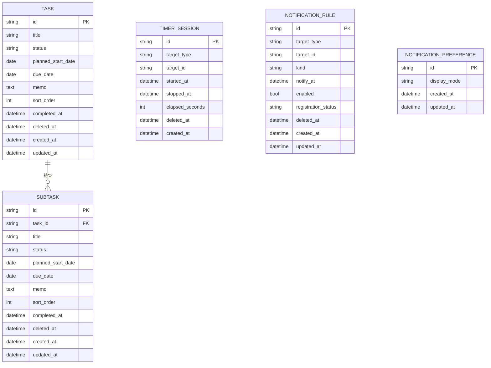
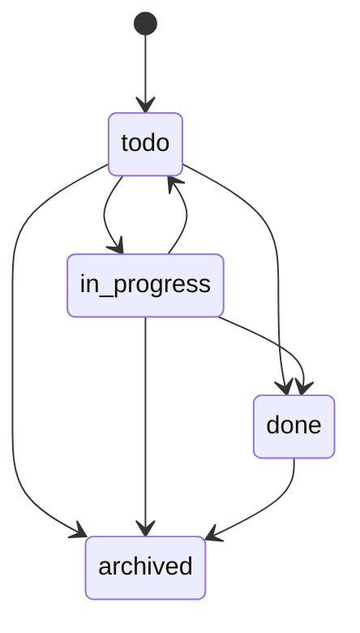

# ドメインモデル

## 集約概要

## エンティティ

### Task

親の作業項目を表す。

フィールド:

- `id`
- `title`
- `status`: `todo`, `in_progress`, `done`, `archived`
- `planned_start_date`
- `due_date`
- `memo`
- `sort_order`
- `completed_at`
- `deleted_at`
- `created_at`
- `updated_at`

ルール:

- タイトルはtrim後に必須。
- 期限日は開始予定日より前にできない。
- 完了済みまたはアーカイブ済みタスクはタイマー開始不可。
- 未完了サブタスクがあるタスクの完了には明示確認が必要。確認後は完了可能だが、サブタスク状態は変更しない。
- タスク削除時は、タスク、子サブタスク、タイマーセッション、通知ルールを同一トランザクションでソフト削除する。
- タスク削除時に対象タスクまたは子サブタスクでタイマー開始中の場合、そのタイマーセッションもソフト削除して通常のアクティブタイマー検索から除外する。

### Subtask

タスク配下の子作業を表す。

ルール:

- 親タスクが存在する必要がある。
- タイトルはtrim後に必須。
- 期限日は開始予定日より前にできない。
- 完了済みまたはアーカイブ済みサブタスクはタイマー開始不可。
- サブタスクは独自のタイマー履歴を持てる。
- サブタスク削除時は、サブタスク、タイマーセッション、通知ルールを同一トランザクションでソフト削除する。
- サブタスク削除時にタイマー開始中の場合、そのタイマーセッションもソフト削除して通常のアクティブタイマー検索から除外する。

### TimerSession

1つの作業計測区間を表す。

ルール:

- `target_type` は `task` または `subtask`。
- `started_at` は必須。
- `stopped_at` がnullの行だけがアクティブタイマー。
- タスク/サブタスク全体でアクティブタイマーは1件だけ。
- `elapsed_seconds` は停止時に確定する。
- ソフト削除済みタイマーセッションは通常の履歴表示とアクティブタイマー検索から除外する。

### NotificationRule

ローカル通知の意図を表す。

ルール:

- `kind` は `planned_start` または `due`。
- 有効な通知では `notify_at` が必須。
- OS通知サービスへの登録はDBコミット後の副作用として扱う。
- ソフト削除済み通知ルールは無効化され、通知登録対象から除外する。

### NotificationPreference

ローカル通知本文の表示設定を表す。

ルール:

- `display_mode` は `title_only` または `generic`。
- デフォルトは `title_only`。
- `title_only` はタスクまたはサブタスクのタイトルのみを表示する。
- `generic` はタイトルを含まないプライバシー保護メッセージを表示する。

## ドメインサービス

### TimerPolicy

確認内容:

- 対象が存在する。
- 対象が完了済みまたはアーカイブ済みではない。
- アクティブタイマーが存在しない。

### SchedulePolicy

確認内容:

- 開始予定日と期限日の順序。
- 通知時刻の妥当性。
- カレンダー項目が指定週に含まれること。

### NotificationContentPolicy

確認内容:

- 表示モードが妥当。
- `title_only` のときだけタイトルを含める。
- メモ本文を通知に含めない。

## 状態遷移

