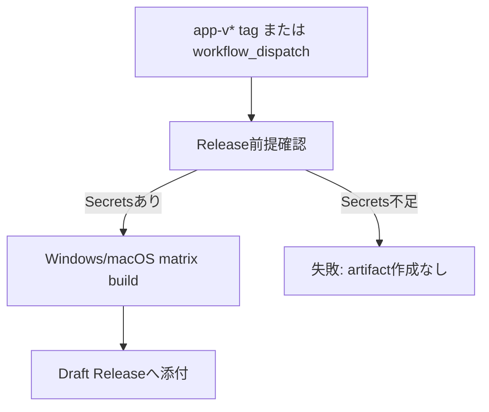

# 020: Release workflowの前提確認jobを追加する

## 対象Issue

- GitHub #24 `[Release] macOS署名と公証を設定する`

## 目的

macOS署名・公証Secretsが未設定の状態で `リリースビルド` を実行したときに、Windows artifactだけがDraft Releaseへ添付されるような部分的なReleaseを防ぐ。

## 要件

- Release workflowは、Windows/macOSのmatrix buildを開始する前にmacOS署名・公証Secretsの存在を確認する。
- 必須Secretsが1つでも未設定の場合は、Release artifactを作成せずにworkflowを失敗させる。
- Secretsの値はworkflowログ、Issue、PR、Release notesへ出さない。
- Release作成に必要な書き込み権限は、Draft Releaseへ添付するjobだけに限定する。

## 設計

### データモデル

アプリ実行時のデータモデル変更はない。Release前提条件をGitHub Actions上の運用データとして扱う。

### トランザクション境界

Release workflowでは、前提確認をartifact作成前のゲートとして扱う。

- `preflight-release`: Secrets名の存在確認のみ。artifact、tag、Releaseを変更しない。
- `build-release`: `preflight-release` 成功後にのみDraft Releaseとartifactを作成する。

### 状態と副作用

- 状態確認: Secretsの存在確認。
- 副作用: Draft Release作成、artifact添付。

この2つを別jobに分け、状態確認に失敗した場合は副作用へ進めない。

## 設計理由

macOS署名・公証は配布可能性に直結するため、Windowsだけ成功したReleaseを作れてしまうと公開判断を誤りやすい。matrix内のmacOS jobで検証するだけでは、Windows jobが先にDraft Releaseへartifactを添付する可能性があるため、matrix前に共通preflightを置く。

## トレードオフ

- Windowsのみの検証Releaseも、macOS Secretsが未設定だと失敗する。
- Release workflowの早期失敗により、Secrets未設定をすぐ発見できる。
- PRや通常CIには影響しないため、日常開発の速度は落とさない。

## 代替案

- macOS job内のSecrets検証だけにする。
  - 実装は少ないが、Windows artifactだけがDraft Releaseに残る可能性がある。
- WindowsとmacOSのRelease workflowを分ける。
  - 個別再実行はしやすいが、v0.1.0の配布単位が分かれ、公開判定が複雑になる。

## セキュリティ

- Secrets値は環境変数として存在確認だけに使い、ログへ出さない。
- workflow全体の権限は `contents: read` とし、Draft Releaseを作成する `build-release` jobだけ `contents: write` を持つ。
- アプリ実行時の外部通信、Tauri権限、ローカルDBには影響しない。

## 破綻シナリオ

- 必須Secretsが未設定のままRelease workflowを実行し、artifactが部分的に生成される。
- Secrets値をデバッグログへ出してしまう。
- Draft Releaseに古いartifactが残り、現在のRelease notesと食い違う。
- macOS署名・公証が成功していないDMGを公開してしまう。

## スケール懸念

Release対象OSが増える場合、preflightで確認する配布前提条件が増える。OSごとの前提条件が増えた場合は、Release unitごとに必須条件を整理する。

## 受け入れ条件

- `build-release` jobが `preflight-release` を `needs` に持つ。
- Secrets未設定時はmatrix buildに進まない。
- Draft Release作成権限は `build-release` jobに限定されている。
- 運用資料とリリースチェックリストにpreflightの役割が記録されている。

## 実装レビュー

- 指摘事項: なし。
- 判断: フォローアップ付き承認。
- フォローアップ: GitHub Secrets登録後に実際の `リリースビルド` を実行し、macOS/Windows artifactとGatekeeper確認を行う。
