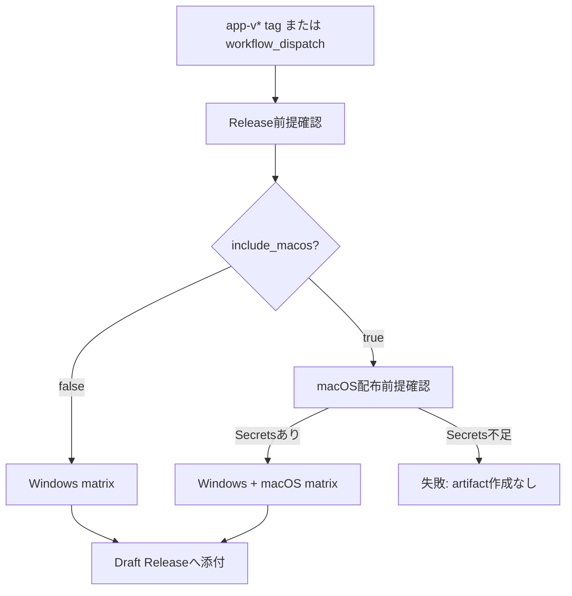

# 020: Windows優先Release workflowへ切り替える

## 対象Issue

- GitHub #20 `[Release] v0.1.0`
- GitHub #24 `[Release] macOS署名と公証を設定する`

## 目的

v0.1.0ではWindows利用を主目的にし、Apple Developer ProgramとmacOS署名・公証の準備を後回しにしてもWindows版を配布できる運用へ切り替える。

## 要件

- `app-v*` タグpushと手動実行の既定では、Windows artifactだけをDraft Releaseへ添付する。
- macOS artifactは手動実行で `include_macos` を有効にした場合だけ作成する。
- macOSを含める場合は、matrix build前にmacOS署名・公証Secretsの存在を確認する。
- macOS前提確認が失敗した場合は、macOS込みReleaseのartifact作成へ進めない。
- Secretsの値はworkflowログ、Issue、PR、Release notesへ出さない。
- Release作成に必要な書き込み権限は、Draft Releaseへ添付するjobだけに限定する。

## 設計

### データモデル

アプリ実行時のデータモデル変更はない。Release対象OSとmacOS前提条件をGitHub Actions上の運用データとして扱う。

### トランザクション境界

Release workflowでは、前提確認をartifact作成前のゲートとして扱う。

- `prepare-release`: Release対象OSを決める。artifact、tag、Releaseを変更しない。
- `preflight-macos`: macOSを含める場合のみSecrets名の存在確認を行う。artifact、tag、Releaseを変更しない。
- `build-release`: `prepare-release` と必要な前提確認の成功後にDraft Releaseとartifactを作成する。

### 状態と副作用

- 状態確認: Release対象OSの決定、macOS Secretsの存在確認。
- 副作用: Draft Release作成、artifact添付。

状態確認と副作用を別jobに分け、macOS込みReleaseで前提確認に失敗した場合は副作用へ進めない。

## 設計理由

ユーザーの当面の利用環境はWindowsであり、macOS署名・公証をv0.1.0公開の必須条件にすると配布開始が遅れる。Windows artifactを既定Release対象にし、macOSはApple準備が整った時だけ明示的に含める。

macOSを含める場合だけpreflightを置くことで、Apple Secrets未設定を早期に検出しつつ、通常のWindows配布を妨げない。

## トレードオフ

- v0.1.0時点ではmacOS利用者へ正式artifactを提供できない。
- Windows利用者向けの配布を先に進められる。
- macOS込みReleaseを作る場合は、手動実行で `include_macos` を有効にする運用が増える。
- PRや通常CIには影響しないため、日常開発の速度は落とさない。

## 代替案

- macOS署名・公証を完了するまでv0.1.0公開を止める。
  - 配布品質は揃うが、Windows利用開始が遅れる。
- WindowsとmacOSのRelease workflowを完全に分ける。
  - 権限と確認項目は分離しやすいが、Release notesとtag管理が複雑になる。

## セキュリティ

- Secrets値は環境変数として存在確認だけに使い、ログへ出さない。
- workflow全体の権限は `contents: read` とし、Draft Releaseを作成する `build-release` jobだけ `contents: write` を持つ。
- アプリ実行時の外部通信、Tauri権限、ローカルDBには影響しない。

## 破綻シナリオ

- Windows版だけのReleaseなのに、Release notesがmacOS artifactも提供済みであるように見える。
- macOS込みReleaseを指定したが、必須Secretsが未設定のままartifactが部分的に生成される。
- Secrets値をデバッグログへ出してしまう。
- Draft Releaseに古いartifactが残り、現在のRelease notesと食い違う。
- macOS署名・公証が成功していないDMGを公開してしまう。

## スケール懸念

Release対象OSが増える場合、動的matrixとpreflight条件が増える。OSごとの配布前提条件が増えた場合は、OS単位のworkflow分割を再検討する。

## 受け入れ条件

- `app-v*` タグpushではWindows artifactだけを作成する。
- 手動実行の既定でもWindows artifactだけを作成する。
- 手動実行で `include_macos` を有効にした場合だけmacOS artifactを作成する。
- macOS込みReleaseではSecrets未設定時にmatrix buildへ進まない。
- Draft Release作成権限は `build-release` jobに限定されている。
- 運用資料とリリースチェックリストにWindows優先運用とmacOS後回し方針が記録されている。

## 実装レビュー

- 指摘事項: なし。
- 判断: フォローアップ付き承認。
- フォローアップ: GitHub Secrets登録後に `include_macos` を有効にした `リリースビルド` を実行し、macOS artifactとGatekeeper確認を行う。
