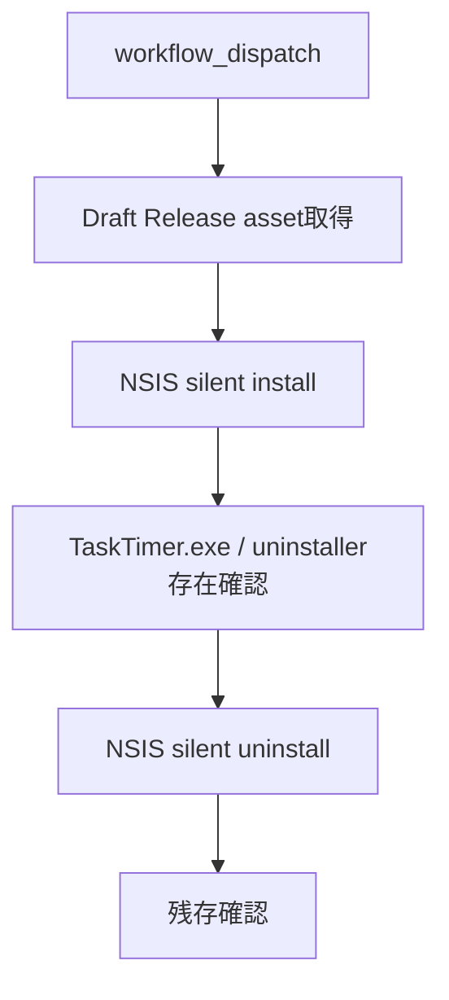

# 021: Windows runnerでインストーラー最低限検証を追加する

## 対象Issue

- GitHub #20 `[Release] v0.1.0`

## 目的

Windows実機をすぐに用意できない状況でも、Draft Releaseに添付されたWindows NSISインストーラーが最低限壊れていないことをGitHub-hosted Windows runner上で確認する。

## 要件

- 手動実行できるGitHub Actions workflowとして追加する。
- 入力されたRelease tagからWindowsインストーラーassetを取得する。
- Draft Releaseのassetも取得できるよう、workflowの `GITHUB_TOKEN` を使う。
- Windows runner上でサイレントインストールを実行する。
- インストール後、`TaskTimer.exe` とアンインストーラーの存在を確認する。
- サイレントアンインストールを実行し、アンインストール後にインストール痕跡が残っていないことを確認する。

## スコープ外

- OS通知の表示確認。
- SmartScreen表示確認。
- GUI操作確認。
- Windows実機・VMでの手動確認の代替。
- macOS署名・公証確認。

## 設計

### データモデル

アプリのドメインデータ、SQLiteスキーマ、Repository、Use Caseは変更しない。Release artifact検証の運用データだけを扱う。

### トランザクション境界

- Release asset取得: Draft ReleaseのWindows artifactを検証対象として固定する境界。
- インストール: Windows runnerの一時環境に副作用を発生させる境界。
- アンインストール: 発生させた副作用を戻す境界。

### 状態と副作用

- 状態確認: Release asset名、インストール後の実行ファイル、アンインストーラー、レジストリ情報。
- 副作用: Windows runnerへのインストールとアンインストール。

## 設計理由

Draft Releaseは一般利用者へ見えないため、公開前確認はメンテナー権限を持つCIか手元環境で行う必要がある。Windows実機確認がないまま通常Releaseを公開するのは危険だが、CIでサイレントインストールまで確認できれば、artifact破損やNSIS packagingの大きな失敗を早期に検出できる。

## トレードオフ

- 実機の通知、SmartScreen、GUI操作は確認できない。
- Windows runnerはクリーン環境のため、ユーザー端末固有の権限や既存インストールとの競合は確認できない。
- 手動実行にすることでRelease前ゲートとして明示的に扱えるが、自動実行忘れのリスクが残る。

## 代替案

- Windows実機またはVMを用意する。
  - 最も信頼性が高いが、現時点ではすぐに用意できない。
- 未確認のままpre-releaseとして公開する。
  - 外部利用者に確認してもらえるが、実務品質の通常Releaseとしてはリスクが高い。

## セキュリティ

- workflow権限は `contents: read` に限定する。
- Draft Release asset取得には `GITHUB_TOKEN` を使い、Secret値は追加しない。
- アプリ実行時の外部通信やTauri権限は変更しない。
- インストール検証ではユーザーのタスク名、メモ本文、通知本文を扱わない。

## 破綻シナリオ

- Draft Release assetが取得できず、公開前にインストーラーを確認できない。
- NSIS silent installが失敗する。
- インストールは成功するが、`TaskTimer.exe` またはアンインストーラーが配置されない。
- アンインストールに失敗し、runner上に残存する。
- CI成功を実機確認完了と誤認して、通知やGUI操作の確認を省略する。

## スケール懸念

Release対象が増える場合、OSごとにartifact検証workflowが増える。将来はRelease workflow完了後に対象OSごとのsmoke testを連鎖させるか、手動実行のままRelease checklistで管理する。

## 受け入れ条件

- Windows runner上でRelease assetを取得できる。
- Windows runner上でNSIS silent installとsilent uninstallを実行できる。
- 失敗時にworkflowが失敗する。
- `docs/release-checklist.md` とIssue #20に、runner検証は実機確認の代替ではないことが残っている。

## 実装レビュー

- 指摘事項: なし。
- 判断: フォローアップ付き承認。
- フォローアップ: workflow追加後、Draft Release `app-v0.1.0` に対して手動実行し、Issue #20へ結果を記録する。
