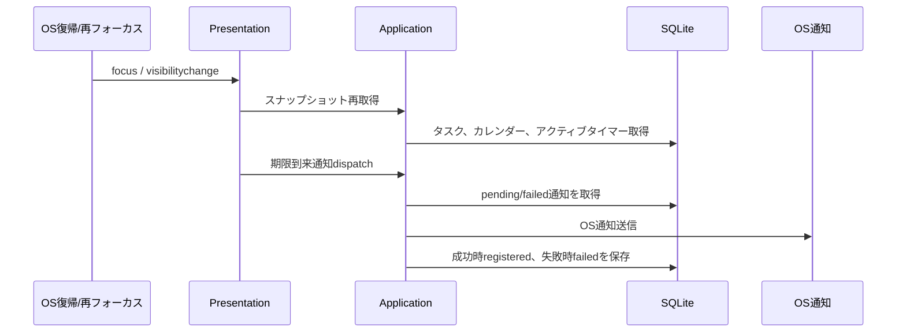

# 025: OSスリープ・復帰時のタイマーと通知を強化する

GitHub Issue: #58

## 目的

タイマー開始中にOSがスリープまたは復帰した場合でも、経過時間、アクティブタイマー復元、期限通知の重複送信が破綻しないことを確認できる状態にする。

## スコープ

- 復帰またはウィンドウ再フォーカス相当のイベントで、アプリ状態を軽く再同期する。
- アクティブタイマーがDBから復元されることを自動テスト化する。
- 長時間のwall-clock差分が `elapsed_seconds` に反映されることを自動テスト化する。
- `registered` になった通知ルールが復帰後の再dispatchで再送されないことを自動テスト化する。
- 一時停止中にDB接続を閉じ、長時間経過後に再接続して停止しても、停止中の時間が経過時間へ混ざらないことを自動テスト化する。
- GitHub-hosted Windows VMでタイマー復元、wall-clock計算、通知重複防止を継続検証する。
- Windows実機で確認する観点と手順を記録する。

## スコープ外

- OSへ将来時刻の通知を予約する仕組み。これはGitHub #51で扱う。
- OSスリープイベントをTauri pluginで直接購読する仕組み。
- GitHub-hosted runner自体をOSスリープさせる検証。
- バックグラウンド常駐や自動更新。

## 設計レビュー

### データモデル

新しいテーブルやカラムは追加しない。
アクティブタイマーの正は既存どおり `timer_sessions.stopped_at IS NULL AND deleted_at IS NULL` に置く。

### トランザクション境界

- タイマー開始、停止、一時停止、再開のトランザクション境界は変更しない。
- 復帰時再同期は読み取りと期限到来通知dispatchだけを呼び、状態変更は既存Use Caseへ委譲する。
- OS通知送信は既存どおりDBコミット後の副作用として扱う。

### 振る舞い

### セキュリティ

- 新しいTauri権限は追加しない。
- アプリ実行時の外部通信は追加しない。
- タスク名やメモ本文をログへ出さない。
- 通知本文のプライバシー方針は既存の `title_only` / `generic` に従う。

### 破綻シナリオ

- スリープ時間が停止時の経過時間に反映されない。
- アプリ再起動後にアクティブタイマーが見えなくなる。
- 復帰時に同じ期限通知が複数回送信される。
- 復帰時の再同期が連続発火し、画面全体のちらつきや通知dispatch重複を起こす。
- 一時停止中にスリープし、復帰後に停止したとき一時停止区間が経過時間へ混ざる。

### スケール

復帰時再同期は既存のスナップショット取得を使い、全タイマー履歴を読み込まない。
通知dispatchは既存の上限 `NOTIFICATION_DISPATCH_LIMIT` を維持し、復帰時に大量通知を無制限に処理しない。

## トレードオフ

- `focus` と `visibilitychange` はOSスリープ専用イベントではないが、Tauri追加pluginなしで復帰相当の再同期を行える。
- OSスリープを直接検知しないため、端末やOS差分は手動確認が必要。
- 復帰時にスナップショットを再取得することで整合性は上がるが、頻繁なフォーカス切り替えでは軽いDB読み取りが増える。

## 代替案

Tauri pluginでOS電源イベントを直接購読する。

不採用理由:

- 新しい権限とOS差分が増える。
- #58の目的は、まず既存のDB正とwall-clock計算が復帰後に破綻しないことを確認すること。
- MVPでは `focus` / `visibilitychange` の再同期で十分にリスクを下げられる。

## 自動テスト範囲

- アプリ再起動後に `get_active_timer` が開始中タイマーを返す。
- 長時間のwall-clock差分を含めて停止時 `elapsed_seconds` が確定する。
- 一時停止中のDB再接続と長時間のwall-clock差分後も、一時停止区間を除外して `elapsed_seconds` が確定する。
- `registered` 通知ルールは次回dispatch対象にならない。
- 復帰相当の通知同期で、期限到来通知を1回だけ送信し、次の未来通知を再予約する。

### Windows VM回帰検証

`.github/workflows/windows-resume-regression.yml` はPull Requestと手動実行でWindows runner上のRustテストを実行する。

- Windows向け依存を含む状態でSQLite RepositoryとUse Caseの全テストを実行する。
- 実際のOS電源スリープはGitHub-hosted runnerで安定して自動化できないため、固定時刻のジャンプとDB再接続を復帰相当の代理入力にする。
- workflow成功は実スリープ確認の代替ではない。実電源イベント、WebView2のフォーカス復帰、OS通知表示はRelease前手動確認に残す。

## 手動確認範囲

Windows実機またはVMで次を確認する。

1. タスクを作成し、タイマーを開始する。
2. アプリを閉じずにWindowsをスリープする。
3. 2分以上待って復帰する。
4. TaskTimerを前面に戻し、実行中タイマーが同じ対象のまま表示されることを確認する。
5. タイマーを終了し、スリープ中の時間を含む経過時間として保存されることを確認する。
6. 期限日が今日のタスクを作成し、復帰または再フォーカス後に通知が1回だけ送信されることを確認する。
7. アプリを終了して再起動し、開始中タイマーが復元されることを確認する。

実機確認で差分が見つかった場合は、OSバージョン、インストール済みartifact、再現手順、期待結果、実際の結果をGitHub Issueへ記録する。タスク名、メモ本文、SQLite DB、個人情報は貼らない。

## 受け入れ条件

- 復帰相当のイベントでスナップショット再同期が行われる。
- 自動テスト化できる範囲がRustテストで固定されている。
- GitHub-hosted Windows VMで回帰テストが成功し、実行結果をIssueへ記録できる。
- Windows実機確認手順が文書化されている。
- 不具合が見つかった場合の記録方針が明確である。

## 実装結果

- `paused_timer_survives_database_reopen_and_excludes_wall_clock_gap` を追加し、一時停止後の長時間経過とDB再接続を経ても、停止前の120秒だけが作業時間として確定することを固定した。
- `Windows復帰回帰検証` workflowを追加し、Windows向け依存を含むRustテスト全体をPull Requestと手動実行で確認できるようにした。
- ローカルではRustテスト95件、Clippy、TypeScript/Vite build、npm監査、実行時プライバシー監査が成功した。
- 実電源スリープとOS通知表示は自動確認済みと扱わず、Release前手動確認を維持する。

## レビュー判断

承認。

- 実装上の再同期、自動テスト、Windows VM回帰workflow、実機確認手順をIssue #58の完了範囲とする。
- 実際のWindowsスリープ/復帰はRelease artifactごとの手動ゲートであり、workflow成功だけで確認済みとは扱わない。
- 手動確認で差分が見つかった場合は、別IssueとしてOS情報と再現手順を記録する。
