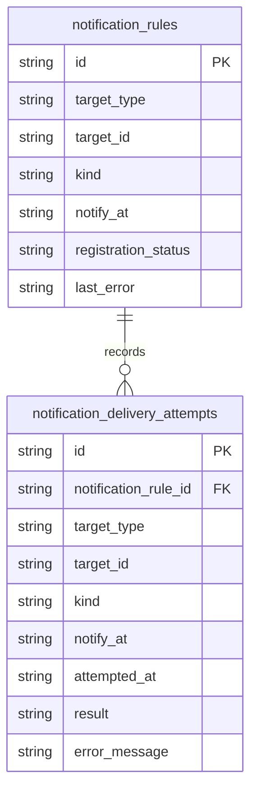

# 通知失敗履歴と再試行結果を表示する

GitHub Issue: #53

## 背景

期限到来通知の送信失敗は `notification_rules.registration_status = failed` と `last_error` に保存されている。ただし現在の設定画面では最後のdispatch結果しか分からず、どの種類の通知が失敗し、再試行で成功したか失敗したかを業務利用者が追いにくい。

## 要件

- 設定画面で通知送信の失敗履歴を確認できる。
- 対象種別、通知種別、通知予定時刻、発生時刻、再試行結果、失敗理由を表示する。
- ユーザーが明示的に再試行できる。
- 再試行の成功/失敗が履歴に残る。
- タスク名、サブタスク名、メモ本文、通知本文は履歴表示やログ用途の保存対象にしない。

## MVP範囲

- 期限到来時のdispatch試行を `notification_delivery_attempts` に保存する。
- 設定画面に最新20件の失敗/再試行履歴を表示する。
- 再試行ボタンは既存どおり手動操作のみとする。

## MVP外

- リモート通知。
- バックグラウンド常駐。
- OS通知の将来時刻スケジューリング。
- 履歴の手動削除UI。

## データモデル

`notification_delivery_attempts` は通知送信の試行イベントを表す。タスク本文を持つ `tasks` / `subtasks` とは分離し、表示に必要なIDと状態だけを保持する。

## トランザクション境界

- `dispatch_due_notifications` はOS通知送信という副作用を先に実行する。
- 送信後、同じRepository操作内で通知ルール状態と試行ログを保存する。
- 成功時は `registered` にし、試行ログに `success` を保存する。
- 失敗時は `failed` と `last_error` を更新し、試行ログに `failed` とエラーを保存する。

## 設計理由

- `notification_rules` は現在の通知意図を表し、試行イベントとは責務が異なる。
- 失敗が成功で上書きされても過去の失敗を追えるよう、試行ログを別テーブルにする。
- タイトルやメモを履歴に保存しないことで、公開Issueやサポート時に画面共有してもプライバシー露出を抑えられる。

## トレードオフ

- 試行ログテーブルが増えるためDBは少し大きくなる。
- 一方で最新20件に表示を制限し、読み取りUIが全履歴に依存しないようにする。

## 代替案

`notification_rules.last_error` と `updated_at` だけを表示する。

不採用理由:

- 再試行で成功した場合に失敗履歴が消え、Issue #53 の「再試行の成功/失敗が履歴に残る」を満たせない。

## 危険ケース

- OS通知権限が拒否された状態で再試行を連打すると失敗ログが増える。
- エラー文字列にOS由来の詳細が含まれる可能性がある。
- タスク名やメモを表示するとプライバシー情報が設定画面に露出する。

## 受け入れ条件

- 通知失敗が設定画面上で判別できる。
- 再試行操作後の成功/失敗が保存され、履歴に表示される。
- 再試行はユーザー操作時だけ実行され、自動無限再試行にならない。
- タスク名、サブタスク名、メモ本文、通知本文を履歴に保存・表示しない。
