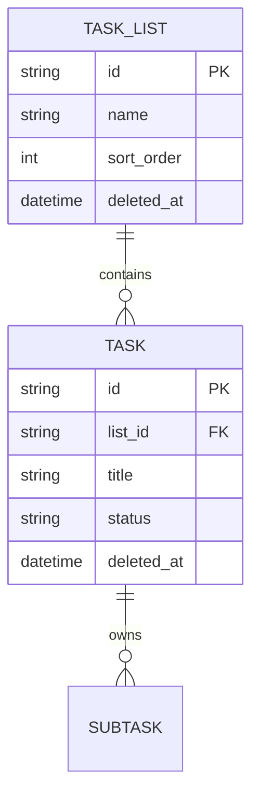

# カスタムリスト管理を追加する

GitHub Issue: #54

## 背景

左ペインは `task_lists` と `tasks.list_id` を前提に表示されているが、現状は初期リスト `タスク` の表示に限定されている。
実務運用では、仕事、個人、案件、日次確認などの分類をユーザーが作れる必要がある。

## MVP範囲

- カスタムリストを作成できる。
- カスタムリスト名を変更できる。
- カスタムリストを削除できる。
- タスク作成時は選択中リストへ所属させる。
- タスク詳細から所属リストを変更できる。
- 左ペインに既定リストとカスタムリストを表示し、選択リストでタスク一覧を絞り込む。

## 範囲外

- リスト並び替え。
- リスト色、アイコン、共有。
- サブタスク単位のリスト所属。
- 削除済みリストの復元。

## データモデル

## ルール

- 既定リストは `id = default`, `name = タスク` とする。
- 既定リストIDと名称はDomain定数として扱い、Use CaseやRepositoryで文字列を重複定義しない。
- 既定リストは名称変更、削除できない。
- リスト名はtrim後に必須、最大80文字。
- アクティブなリスト間で同名は不可。
- タスクは常に有効なリストに所属する。
- カスタムリスト削除時、所属タスクは既定リストへ移動する。
- リスト削除ではタスク、サブタスク、タイマー履歴、通知ルールを削除しない。

## Use Case

| Use Case | トランザクション境界 |
| --- | --- |
| CreateTaskList | リスト名検証、同名確認、sort_order採番、リスト追加。 |
| UpdateTaskList | 既定リストではないことを確認し、リスト名検証、同名確認、名称更新。 |
| DeleteTaskList | 既定リストではないことを確認し、所属タスクを既定リストへ移動し、リストをソフト削除。 |
| CreateTask | 所属リスト存在確認後、選択中リストへタスクを追加。 |
| UpdateTask | 所属リスト変更がある場合、有効リスト存在確認後に更新。 |

## 設計理由

- タスクを削除せず既定リストへ戻すことで、タイマー履歴や通知履歴の喪失を避けられる。
- 既定リストを不変にすると、削除後の避難先と初期表示が常に保証される。
- リストCRUDをUse Caseとして分けることで、UIが削除時のタスク扱いを決めない。

## トレードオフ

- リスト削除後に既定リストへタスクが増えるため、ユーザーが整理し直す必要がある。
- 同名禁止により分類名の柔軟性は下がるが、左ペインでの誤選択を減らせる。
- リスト並び替えは今回見送るため、作成順表示に限定される。

## 代替案

リスト削除時にタスクもソフト削除する。

不採用理由:

- 分類削除と作業履歴削除の意味が混ざる。
- タイマー履歴や通知履歴が意図せず見えなくなる。
- 「リスト整理」の操作としては破壊的すぎる。

## セキュリティ

- リスト名はHTMLとして描画しない。
- リスト名はログへ出さない。
- アプリ実行時の外部通信は追加しない。
- リストIDはRepository境界で検証し、任意SQL片として扱わない。

## 危険ケース

- 削除中のリストにタスク作成が同時に走る。
- 既定リストが壊れているDBで削除操作を実行する。
- 長いリスト名で左ペインが崩れる。
- 同名リストができ、ユーザーが移動先を誤認する。

## 受け入れ条件

- カスタムリストを作成、名称変更、削除できる。
- 選択中リストでタスク一覧が絞り込まれる。
- 選択中リストで作成したタスクがそのリストに所属する。
- タスク詳細から所属リストを変更できる。
- カスタムリスト削除時、所属タスクは既定リストへ移動し、タイマー履歴は削除されない。
- リスト名はHTMLとして描画されない。
