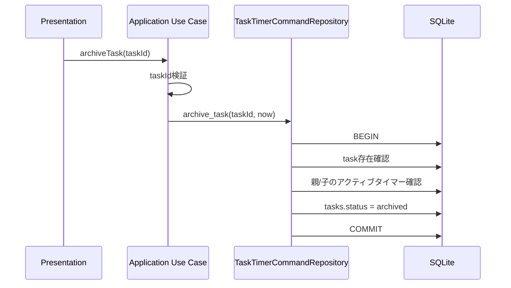

# 036 タスクのアーカイブ操作をUse Caseへ追加する

GitHub Issue: #52

## 目的

完了済みまたは当面使わないタスクを通常一覧、今日、お気に入り、カレンダーから外しつつ、履歴と復元可能性を保つ。

## スコープ

MVP内:

- 親タスクをアーカイブするApplication Use Caseを追加する。
- アーカイブ済み親タスクを復元するApplication Use Caseを追加する。
- 通常のタスクRead Modelからアーカイブ済み親タスクを除外する。
- アーカイブ一覧用のRead Model境界を追加する。
- カレンダーと通知dispatchから、アーカイブ済み親タスクおよびその配下サブタスクを除外する。
- アクティブタイマーを持つ親タスクまたは配下サブタスクはアーカイブできない。

MVP外:

- アーカイブ一覧UI。
- サブタスク単体のアーカイブ操作。
- アーカイブ済みタスクの一括削除。

## データモデル

既存の `tasks.status = archived` を正式に利用する。新しいテーブルやカラムは追加しない。

親タスクのアーカイブでは、サブタスクの `status`、タイマー履歴、通知ルール、繰り返し設定、完了時刻は変更しない。親タスクの状態を表示・dispatch境界で参照し、配下サブタスクも通常表示と通知対象から除外する。

## トランザクション境界

`ArchiveTask` と `RestoreArchivedTask` はApplication Use Caseを入口とし、SQLite Repositoryの1トランザクションで完結する。

## 設計理由

- アーカイブは削除ではないため、履歴や通知ルールをソフト削除しない。
- サブタスク状態を直接 `archived` に変えると、復元時に元の完了/未完了状態を失う。親タスク状態で除外する方が復元時のデータ損失が少ない。
- 完了済みタスクの `completed_at` は履歴として保持し、復元時は `completed_at` があれば `done`、なければ `todo` に戻す。
- アクティブタイマーを自動停止してアーカイブすると、ユーザーが意図しないタイマー履歴が確定する。明示的にタイマーを終了してからアーカイブしてもらう方が安全。

## トレードオフ

- 読み取りクエリと通知dispatchで親タスク状態を考慮する必要があり、クエリ条件は増える。
- アーカイブ中も通知ルールは保持されるため、復元後に期限到来済みの通知が再dispatch対象になる可能性がある。これは「復元した作業の通知設定も戻る」挙動として扱う。

## 代替案

アーカイブ時に配下サブタスク、通知ルール、繰り返し設定もすべて `archived` または無効化する。

不採用理由:

- 復元時に、アーカイブ前のサブタスク完了状態や通知有効状態を復元するための追加スナップショットが必要になる。
- MVPの目的は通常運用画面から隠すことであり、履歴破棄や通知設定変更までは必要ない。

## 受け入れ条件

- アーカイブ済み親タスクは通常タスク一覧に出ない。
- アーカイブ済み親タスクはアーカイブ一覧Read Modelから取得できる。
- 復元すると通常タスク一覧へ戻る。
- 完了済みタスクをアーカイブして復元した場合、完了状態と完了時刻が保持される。
- アーカイブ済み親タスクと配下サブタスクはカレンダーに出ない。
- アーカイブ済み親タスクと配下サブタスクの通知はdispatchされない。
- 親タスクまたは配下サブタスクでタイマー開始中の場合、アーカイブは失敗する。

## 危険ケース

- アーカイブ済み親タスクのサブタスク通知が送信される。
- アクティブタイマーを持つタスクがアーカイブされ、タイマーが通常表示から孤立する。
- アーカイブ済みタスクが通常一覧やカレンダーに混ざる。
- 復元時にサブタスクの完了状態が失われる。
