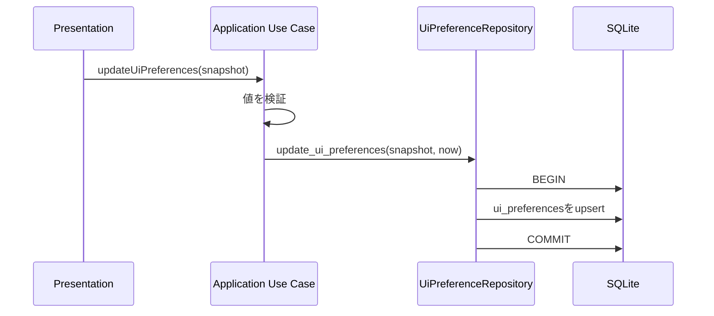

# 037 UI設定の永続化範囲を拡張する

GitHub Issue: #57

## 目的

アプリ再起動後も、ユーザーが前回使っていた主要な作業状態へ戻れるようにする。

## MVPで永続化するもの

| 項目 | 保存キー | 理由 |
| --- | --- | --- |
| 左ペイン開閉 | `left_pane_open` | 作業領域の広さを毎回調整しなくて済む。 |
| 最後のビュー | `last_view` | タスク、今日、お気に入り、カレンダー、設定のどこから再開するかを復元する。 |
| 最後のリストID | `last_task_list_id` | `last_view = list` のとき、前回選択したリストへ戻る。 |
| カレンダー表示モード | `calendar_view_mode` | 週/日/月の好みを復元する。 |

保存先は既存のSQLite `ui_preferences` とする。UI設定はローカル作業状態であり、タスクデータと同じバックアップ対象に含める方が、復元時の体験が自然になる。

## MVPで永続化しないもの

| 項目 | 理由 |
| --- | --- |
| 選択中タスク/サブタスク | 削除、アーカイブ、リスト切替で無効になりやすく、復元時に詳細ペインを勝手に開くと作業を邪魔する。 |
| 右詳細ペイン開閉 | タスク選択から派生する一時状態のため保存しない。 |
| カレンダー基準日 | 長期保存すると古い日付を開き続けるため、再起動時は今日を基準にする。 |
| ウィンドウサイズ/位置 | Tauri window API権限とOS差分を伴うため、別Issueで扱う。 |
| タスク並び順 | 業務データの順序であり、UI設定ではなくタスク/リストのドメイン操作として扱う。 |

## トランザクション境界

`UpdateUiPreferences` はApplication Use Caseを入口とし、SQLite Repositoryの1トランザクションで対象キーをまとめてupsertする。

## 破損時フォールバック

DB上の値が壊れていてもアプリ起動を止めない。

- `left_pane_open`: `true` / `false` 以外は `true`。
- `last_view`: 許可値以外は `list`。
- `last_task_list_id`: 空または不正値は `default`。
- `calendar_view_mode`: `week` / `day` / `month` 以外は `week`。

## 設計理由

- UI設定はDomain ModelではなくPresentation状態に近いが、アプリ再起動後の復元性に関わるためApplication境界を用意する。
- 任意キー保存を公開すると、ネットワーク設定や隠しFeature Flagのような意図しない値を保存できてしまうため、Use Caseはホワイトリスト化されたスナップショットだけを受け付ける。
- 詳細ペインや選択タスクは、タスク削除やアーカイブと競合しやすいため、起動時は閉じた状態にする。

## トレードオフ

- スナップショット更新にすると、キー単位更新より書き込み量は少し増える。
- 一方で、画面状態を一貫した単位で保存でき、壊れた組み合わせを避けやすい。

## 代替案

Tauriのアプリ設定ファイルに保存する。

不採用理由:

- 既にSQLiteバックアップ/復元の仕組みがあるため、UI設定だけ別ファイルに分けると復元対象が分散する。
- SQLite内なら既存のバックアップ、エクスポート、破損検証の運用に乗せやすい。

## セキュリティ

- 保存値は作業状態のみとし、APIキー、リモートURL、分析ID、外部通信Feature Flagを保存しない。
- ユーザーのタスク名、メモ本文、通知本文は保存しない。
- 破損値をHTMLとして描画しない。

## 受け入れ条件

- 起動時にUI設定が読み込まれる。
- 左ペイン開閉、ビュー、最後のリストID、カレンダー表示モードが保存される。
- 壊れた設定値があっても既定値で起動する。
- 永続化対象と非対象がdocsに記録されている。

