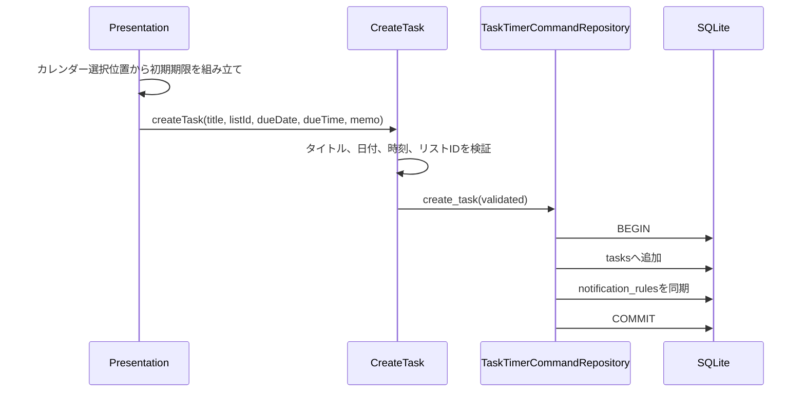

# 038 カレンダーからタスクを追加できるようにする

GitHub Issue: #82

## 目的

カレンダーで日付や時間帯を見ながら、その場で期限付きタスクを作成できるようにする。

## MVP範囲

- カレンダー画面のツールバーからタスク作成を開始できる。
- 週/日表示では時間帯セルからタスク作成を開始できる。
- 月表示と終日行では日付だけを期限として初期入力する。
- タイトル、所属リスト、期限日、期限時刻、メモを入力できる。
- 作成後はカレンダーとタスク一覧を更新する。
- 作成後に右詳細ペインは自動で開かない。

## MVP外

- カレンダー上のドラッグ作成。
- 作成後の期間リサイズ。
- タスク色の設定。
- 外部カレンダー連携。

## データモデル

新しいエンティティやフィールドは追加しない。

カレンダーから作成するタスクは既存の `Task` として保存し、期限情報は既存の `due_date` と `due_time` を使う。所属リストは既存の `list_id` を使う。

## トランザクション境界

`CreateTask` Use Caseを再利用する。

## 画面仕様

- カレンダー右上に `+` ボタンを置く。
- `+` ボタンからの作成では、基準日の期限日を初期値にする。
- 週/日表示の終日行をクリックした場合は、その日の期限日だけを初期値にする。
- 週/日表示の時間帯セルをクリックした場合は、その日の期限日と時間を初期値にする。
- 月表示の日付セルをクリックした場合は、その日の期限日だけを初期値にする。
- 入力UIはカレンダーパネル内の小さな作成フォームとして表示し、右詳細ペインは開かない。
- 作成フォームは `Esc` またはキャンセルで閉じる。

## 設計理由

- 既存の `CreateTask` を使うことで、入力検証、通知ルール同期、SQLiteトランザクション境界を重複させない。
- カレンダー上の作成は日付・時刻の初期値を補助するPresentation責務であり、Domainに新しいルールは増やさない。
- 作成後に右詳細ペインを自動で開かないことで、既存の「タスク作成後は詳細を勝手に開かない」UXと揃える。

## トレードオフ

- セルクリックで作成フォームを開くと、予定ブロック選択との操作が近くなる。
- 一方で、カレンダー上の日時を自然に反映でき、ツールバーの `+` より入力回数を減らせる。

## 代替案

右詳細ペインを作成フォームとして開く。

不採用理由:

- 既存方針では右ペインは選択済みタスクの詳細表示が中心であり、未保存タスク作成と混ざると役割が曖昧になる。
- 作成直後に詳細を自動で開かない既存UXと矛盾する。

## セキュリティ

- タイトルとメモは既存Use Caseで検証し、HTMLとして描画しない。
- 外部通信や新しいTauri権限は追加しない。
- 作成フォームの内容をログへ出さない。

## 危険ケース

- 時刻セルクリックが予定ブロック選択と競合する。
- 期限時刻だけが送信され、期限日なしになる。
- 存在しないリストIDを送信する。
- 作成失敗時にフォーム内容が消えて再入力が必要になる。

## 受け入れ条件

- カレンダー画面からタスクを作成できる。
- 選択した日付/時間が期限に反映される。
- 所属リストが保存される。
- 作成処理で外部通信を追加しない。
