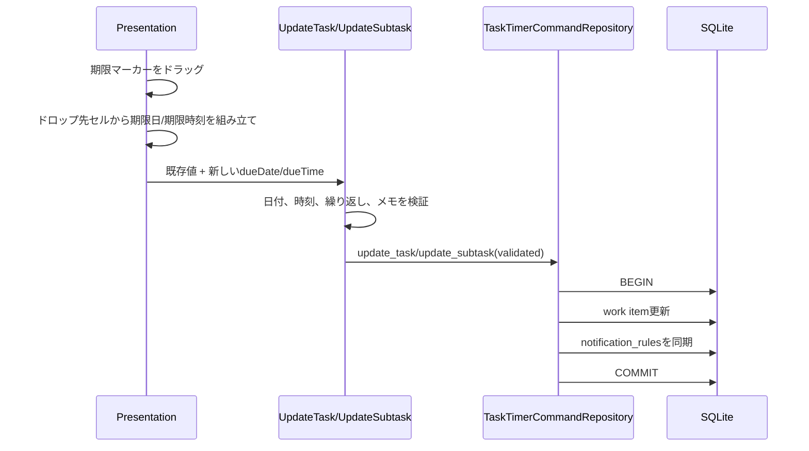

# 039 カレンダー上でタスク期限を調整できるようにする

GitHub Issue: #83

## 目的

カレンダー上のタスクを直接移動し、期限日と期限時刻を素早く調整できるようにする。

## MVP範囲

- 期限マーカーのカレンダー項目をドラッグできる。
- 週/日表示の時間帯セルへドロップした場合、期限日と期限時刻を更新する。
- 週/日表示の終日行へドロップした場合、期限日を更新し期限時刻を解除する。
- 月表示の日付セルへドロップした場合、期限日を更新し期限時刻を解除する。
- タスクとサブタスクのどちらの期限マーカーも移動できる。
- 更新は既存の `UpdateTask` / `UpdateSubtask` Use Caseを経由する。
- 更新失敗時はエラー表示後、次回読み込みでDB上の正を表示する。

## MVP外

- リサイズ操作。
- 開始予定マーカーの移動。
- 実行中タイマーマーカーの移動。
- 複数日またぎの期間表現。
- 15分/30分刻みの細かな時間調整。

## データモデル

新しいエンティティやフィールドは追加しない。

TaskTimerの現行モデルは `due_date` と `due_time` を持つが、予定の開始・終了時刻ペアは持たない。そのため #83 のMVPでは「期間」全体ではなく、期限マーカーの移動として扱う。

## トランザクション境界

期限変更は既存の `UpdateTask` / `UpdateSubtask` を使う。

## 更新ルール

| ドロップ先 | `due_date` | `due_time` |
| --- | --- | --- |
| 週/日: 時間帯セル | セルの日付 | セルの開始時刻 |
| 週/日: 終日行 | セルの日付 | `null` |
| 月: 日付セル | セルの日付 | `null` |

開始予定日 `planned_start_date` は既存値を維持する。詳細UIでは開始予定日を主要編集対象から外しているため、カレンダー移動で新規設定や変更は行わない。

## 設計理由

- 既存の更新Use Caseを使うことで、入力検証、通知ルール同期、SQLiteトランザクション境界を重複させない。
- 期限マーカーだけを移動対象にすると、ユーザーが実際に変更する値が明確になる。
- 開始予定と実行中タイマーは意味が異なるため、同じドラッグ操作で変更しない。

## トレードオフ

- リサイズ非対応のため、Googleカレンダーの完全な期間編集には届かない。
- 一方で、現行モデルに無理な開始/終了時刻を追加せず、期限調整という実務で多い操作を先に提供できる。

## 代替案

ドラッグではなく、カレンダー項目選択後に詳細ペインで期限を編集する。

不採用理由:

- すでに詳細ペインから期限編集は可能であり、#83の「カレンダー上で直接調整」の価値が出にくい。

## セキュリティ

- ドロップ先の日付と時刻はPresentationで組み立てるが、保存前にApplication Use Caseで再検証する。
- タスク名やメモ本文をログへ出さない。
- 外部通信や新しいTauri権限は追加しない。

## 危険ケース

- 予定ブロック選択とドラッグ操作が競合する。
- 期限時刻だけ更新され、期限日が空になる。
- 繰り返し設定ありのタスクで基準日を失う。
- 更新失敗時に画面表示だけが先行して不整合になる。

## 受け入れ条件

- カレンダー上の操作でタスクの期限日/期限時刻を変更できる。
- 更新はRepository境界を経由する。
- 不正な日付範囲や時刻は保存されない。
- 操作失敗時にUIが破綻しない。
