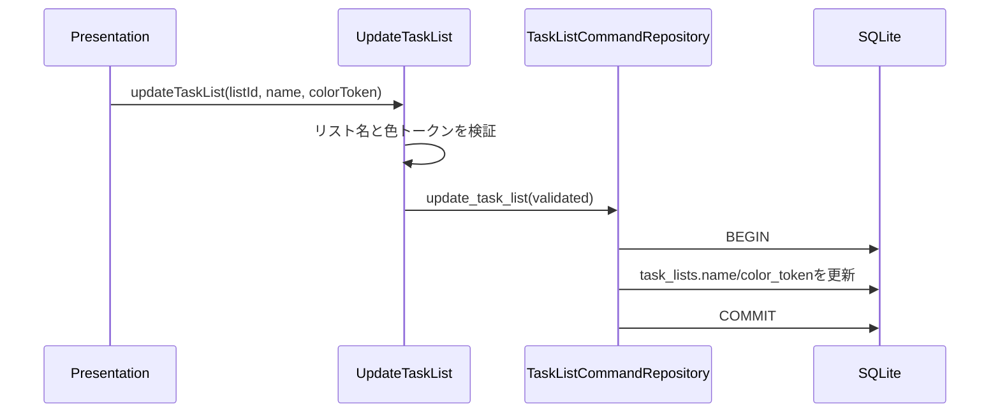

# 040 カレンダー上のタスク色を変更できるようにする

GitHub Issue: #84

## 目的

カレンダー上のタスクが増えたときに、業務文脈やリスト単位の違いを視認しやすくする。

## MVP範囲

- 色の単位はリスト単位とする。
- タスクリストに許可済み色トークンを1つ保存する。
- タスクとサブタスクのカレンダー項目は、所属する親タスクのリスト色を継承する。
- 左ペインのリスト操作からプリセット色を変更できる。
- カレンダー表示でリスト色を反映する。
- カレンダー項目にはマーカー種別テキスト、親タスク名、状態も表示し、色だけに依存しない。

## MVP外

- タスク単位の個別色。
- タグ単位の色。
- 任意HEX値入力。
- ダークモード専用パレット。

## データモデル

`task_lists` に `color_token` を追加する。

許可値:

- `green`
- `blue`
- `amber`
- `rose`
- `violet`
- `gray`

既存リストと初期リストは `green` を既定値にする。

## トランザクション境界

色変更は既存の `UpdateTaskList` Use Caseを拡張して扱う。

## 設計理由

- タグ機能がまだ未実装のため、タグ単位色は #80 後に再検討する。
- タスク単位色は柔軟だが、詳細ペインとRead Modelの複雑さが増える。
- 既にリストはタスク分類の境界として存在し、左ペインで操作できるため、MVPの色単位として自然である。
- 任意色ではなくトークン保存にすると、アクセシビリティ、将来のテーマ対応、不正値対策を一箇所に寄せられる。

## トレードオフ

- 同じリスト内のタスクをさらに色分けすることはできない。
- 一方で、リスト単位ならUIが軽く、カレンダー上の業務文脈を素早く把握できる。

## 代替案

タスク単位の `calendar_color_token` を `tasks` に追加する。

不採用理由:

- サブタスク継承、詳細ペイン、一覧、エクスポートの変更範囲が広がる。
- タグ機能追加後に色設計が重複する可能性がある。

## セキュリティ

- 色は許可済みトークンだけを保存し、任意CSS値やHTMLは保存しない。
- 色トークンはログへ出さない。
- 外部通信や新しいTauri権限は追加しない。

## 危険ケース

- 既存DBに `color_token` がなく起動に失敗する。
- 不正な色トークンでCSSクラス注入が起きる。
- 色だけでマーカー種別や状態を判別するUIになる。
- リスト削除時に移動先の初期リスト色と表示が変わる。

## 受け入れ条件

- カレンダー項目の色を変更できる。
- 保存した色が再起動後も反映される。
- 不正な色値は保存されない。
- 色だけで状態判別するUIになっていない。
