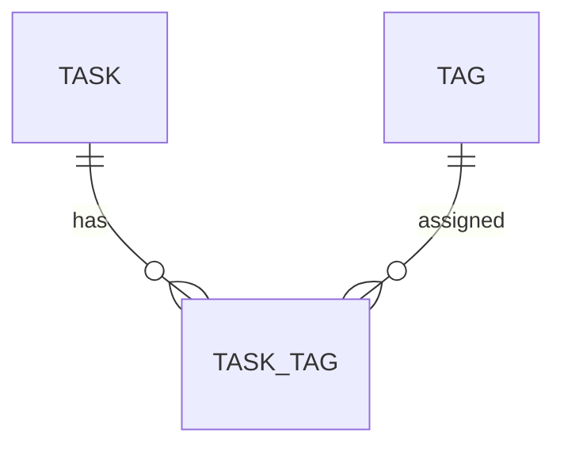

# タスクにタグを付けられるようにする

GitHub Issue: #80

## 背景

リストはタスクの所属先として機能しているが、実務では「案件」「優先領域」「作業種別」のように横断的な分類も必要になる。リストを増やすだけでは同じタスクを複数観点で見られないため、タグを別集約として追加する。

## MVP範囲

- タグを作成、名称変更、削除できる。
- 親タスクへ複数タグを付け外しできる。
- タスク一覧と詳細でタグを表示する。
- 左ペインのタグからタグ付きタスクを絞り込める。
- JSON/CSVエクスポートにタグとタスクタグ関連を含める。

## MVP外

- サブタスクへ直接タグを付ける。
- タグ色を設定する。
- タグの並び替えUI。
- タグビューでの新規タスク作成時にタグを自動付与する。

## データモデル

- `tags`: タグ名、並び順、作成/更新日時、削除日時を持つ。
- `task_tags`: 親タスクとタグの関連を持つ。
- タグ名はtrim後必須、40文字以内、制御文字不可。
- アクティブなタグ名は大文字小文字を区別せず一意にする。

## トランザクション境界

| Use Case | 境界 |
| --- | --- |
| CreateTag | タグ名検証、一意確認、タグ作成を同一トランザクションで行う。 |
| UpdateTag | タグ存在確認、タグ名検証、一意確認、名称変更を同一トランザクションで行う。 |
| DeleteTag | タグと `task_tags` 関連を同一トランザクションでソフト削除する。タスク、サブタスク、タイマー履歴、通知ルールは削除しない。 |
| AttachTagToTask | タスク存在確認、タグ存在確認、関連作成または復活を同一トランザクションで行う。 |
| DetachTagFromTask | タスク存在確認、タグ存在確認、関連ソフト削除を同一トランザクションで行う。 |

## 設計理由

- タグは所属先ではなく横断分類なので、`tasks.list_id` とは別の多対多関連にする。
- サブタスクへの直接タグ付与はモデルとUIの複雑さが増えるためMVP外とし、サブタスク詳細では親タスクのタグを継承表示する。
- タグ削除は利用者の分類変更であり、タスク本体や履歴を消す操作ではないため関連だけを削除する。

## トレードオフ

- 多対多によりRead Model取得が増えるが、タグを一括取得してN+1を避ける。
- タグビューで作成時自動付与を見送るため、タグ付きタスク作成の手数は残る。
- タグ色を持たないため視認性は限定されるが、カレンダー色と意味が衝突しない。

## 代替案

`tasks.tags` にカンマ区切り文字列を保存する。

利点:

- テーブル追加が不要で実装が短い。

欠点:

- 重複、名称変更、検索、削除時の整合性が崩れやすい。
- タグ名のエスケープや部分一致の事故が起きやすい。

判断: 不採用。実務運用の分類情報として整合性を優先する。

## 危険ケース

- タグ削除でタスクやタイマー履歴まで削除してしまう。
- タグ名をHTMLとして描画し、メモと同様にユーザー入力が実行される。
- タスク一覧でタグをタスクごとに個別取得し、大量データで遅くなる。

## 受け入れ条件

- タグを作成し、タスクへ付与できる。
- 付与したタグがタスク一覧と詳細に表示される。
- 左ペインのタグを選択すると対象タスクだけが表示される。
- タグを削除してもタスク、サブタスク、タイマー履歴は削除されない。
- JSON/CSVエクスポートに `tags` と `task_tags` が含まれる。
