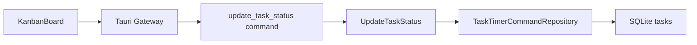

# 042 かんばん形式の画面を追加する

GitHub Issue: #81

## 背景

タスク一覧とカレンダーだけでは、作業の進行状態を俯瞰しづらい。
未着手、進行中、完了を列で見られるかんばん形式を追加し、状態確認と状態変更を素早く行えるようにする。

## MVP範囲

- 左ペインから `かんばん` 画面へ移動できる。
- 列は `未着手`、`進行中`、`完了` の3列に固定する。
- カードにはタイトル、期限、タグ、メモプレビュー、サブタスク進捗、タイマー実行中状態を表示する。
- カード選択で右詳細ペインを開く。
- 状態変更はカード内のクリック操作で行い、Application Use Case経由で保存する。
- 完了済みタスクは `完了` 列へ表示し、アーカイブ済みタスクは通常かんばんから除外する。

## MVP外

- ドラッグ&ドロップによる列移動。
- 列名、列数、WIP制限のカスタマイズ。
- 大量タスク向けの仮想スクロール。
- サブタスクを独立カードとして列表示すること。

## 設計

### 状態変更

- `status` を正とし、Presentationは既存の `TaskRowItem` Read Modelを列へ分配する。
- `todo`、`in_progress`、`done` だけをかんばんから変更可能にする。
- `archived` は通常一覧と同じく表示対象外にする。
- `done` へ移動する場合、未完了サブタスクがあると既存の親タスク完了ルールに従い確認を要求する。
- `todo` または `in_progress` へ移動する場合、`completed_at` を `NULL` に戻す。

### トランザクション境界

`UpdateTaskStatus` はApplication Use Caseとして入力検証と状態値のホワイトリストを持ち、Repository実装の1トランザクション内で `tasks.status`、`completed_at`、`updated_at` を更新する。

### セキュリティ

- タスクIDは既存のID検証を通す。
- 状態値は `todo`、`in_progress`、`done` のみ許可し、`archived` への直接変更はアーカイブUse Caseに委ねる。
- タスク名、メモ、タグ名はHTMLとして描画しない。
- 外部通信、追加権限、秘密情報は追加しない。

## 代替案

最初からドラッグ&ドロップで状態変更する。

不採用理由:

- DnDはキーボード操作、誤操作、状態遷移Use Caseとの接続、テスト範囲が広くなる。
- まずクリック操作で保存境界と表示価値を固めた方が、以後のDnD導入時の責務が明確になる。

## 危険ケース

- 未完了サブタスクがある親タスクを完了列へ移す。
- 完了済みタスクを進行中へ戻したとき、`completed_at` が残る。
- アーカイブ済みタスクが通常かんばんへ混ざる。
- 状態変更後の再読み込みで選択タスクが消え、右詳細ペインが古い情報を表示する。
- タスク数が増えたときに3列すべてが重くなる。

## 受け入れ条件

- 左ペインに `かんばん` が表示される。
- `未着手`、`進行中`、`完了` の列にタスクが分かれて表示される。
- カードから右詳細ペインを開ける。
- カード内操作で状態を変更でき、再読み込み後も保存されている。
- 未完了サブタスクがある親タスクの完了確認が維持される。
- 設計資料に完了済みタスクとアーカイブ済みタスクの扱いが記録されている。
