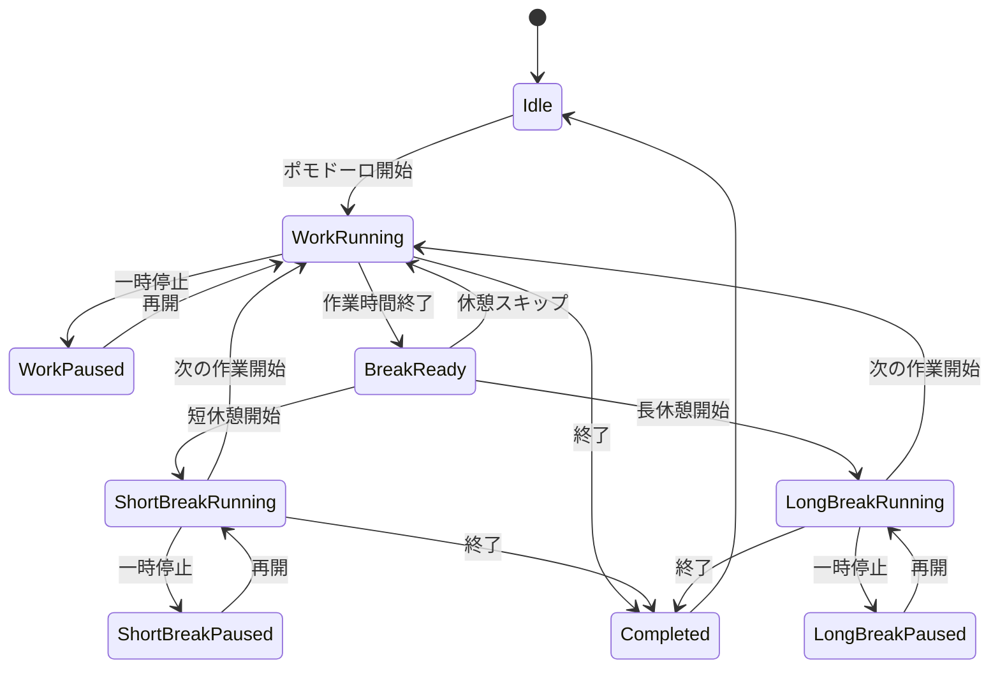

# 043 ポモドーロタイマーを設計・実装する

GitHub Issue: #107

## 背景

現行のタイマーは、タスクまたはサブタスクに対する実作業時間を記録する通常タイマーである。
開始、一時停止、再開、終了、目標時間は扱えるが、ポモドーロのような作業、短休憩、作業、長休憩のサイクル管理は持っていない。

TaskTimerの差別化として、タスク管理、サブタスク、カレンダー、実作業時間の記録に加えて、集中作業のリズムを支援するポモドーロモードを追加する。

## スコープ

- 通常タイマーを維持したまま、ポモドーロを任意モードとして追加する。
- 作業フェーズは既存の作業時間履歴として保存する。
- 休憩フェーズは作業時間履歴に含めない。
- タスクまたはサブタスクを対象にポモドーロを開始できる。
- アプリ全体で同時に進行できる通常タイマーまたはポモドーロは1件だけにする。
- 作業終了、休憩終了の通知を既存通知設定に従って扱う。
- 設定画面でポモドーロ既定値を変更できる。

## スコープ外

- 外部通信、クラウド同期、分析送信。
- OSへの将来時刻通知の完全予約。これは #51 と整合させる。
- 複数タスクの同時ポモドーロ。
- 休憩時間をタスク作業時間として集計すること。
- ポモドーロ完了時にタスクを自動完了すること。

## 現在の実装状態

2026-07-17時点で、初回実装スライスとして以下を追加した。

- `PomodoroPhase`、`PomodoroStatus`、設定値検証をドメイン層へ追加。
- `PomodoroRepository`、`GetPomodoroSettings`、`UpdatePomodoroSettings`、`GetActivePomodoro`、`StartPomodoro` をApplication境界へ追加。
- `pomodoro_settings`、`pomodoro_sessions` のSQLiteマイグレーションを追加。
- `StartPomodoro` は作業フェーズ用の `timer_sessions` と `pomodoro_sessions` を同一トランザクションで作成する。
- 通常タイマー開始とポモドーロ開始の相互排他をRepository境界で検証する。
- 通常タイマーの一時停止/再開/終了は、ポモドーロ作業フェーズの `paused_at`、`paused_total_seconds`、`cancelled_at` と同期する。
- 対象タスク削除時に関連ポモドーロ履歴をソフト削除する。
- SQLiteバックアップはDBファイルとしてポモドーロテーブルを保持し、JSON/CSVエクスポートにも `pomodoro_settings` と `pomodoro_sessions` を含める。

未実装:

- 作業フェーズ完了、休憩開始/終了、スキップ、キャンセル。
- 専用 `PausePomodoro` / `ResumePomodoro` と休憩フェーズの一時停止/再開。
- 作業終了/休憩終了通知と復帰時再同期。
- 右詳細ペインと設定画面のUI。
- 大量データ計測へのactive pomodoro lookup追加。

## 設計レビュー

### データモデル

既存の `timer_sessions` は実作業時間の正として維持する。
ポモドーロの休憩フェーズを `timer_sessions` に保存すると、タスクごとの作業時間に休憩が混ざるため避ける。

追加候補:

| テーブル | 役割 |
| --- | --- |
| `pomodoro_settings` | 作業、短休憩、長休憩、長休憩までの回数、自動開始設定を保存する。 |
| `pomodoro_sessions` | 対象、現在フェーズ、状態、サイクル数、フェーズ開始/一時停止情報を保存する。 |

`pomodoro_sessions` の主要フィールド案:

| フィールド | 内容 |
| --- | --- |
| `id` | UUID。 |
| `target_type` / `target_id` | `task` または `subtask` と対象ID。 |
| `phase` | `work`, `short_break`, `long_break`。 |
| `status` | `running`, `paused`, `completed`, `cancelled`。 |
| `cycle_count` | 完了した作業フェーズ数。 |
| `phase_started_at` | 現在フェーズ開始時刻。 |
| `phase_duration_seconds` | 現在フェーズの予定秒数。 |
| `paused_at` | 一時停止中の場合の時刻。 |
| `paused_total_seconds` | 現在フェーズで累積した一時停止秒数。 |
| `timer_session_id` | 作業フェーズに紐づく `timer_sessions.id`。休憩フェーズではNULL可。 |
| `deleted_at` | 対象削除時のソフト削除用。 |

### 状態遷移

### トランザクション境界

- `StartPomodoro` は対象存在、対象状態、単一アクティブ制約を検証し、作業フェーズの `timer_sessions` 作成と `pomodoro_sessions` 作成を同一トランザクションで行う。
- `CompletePomodoroWorkPhase` は作業フェーズの `timer_sessions.elapsed_seconds` 確定と、次フェーズの判定を同一トランザクションで行う。
- `StartPomodoroBreak`、`SkipPomodoroBreak`、`CompletePomodoroBreak` は作業履歴を変更せず、`pomodoro_sessions` のフェーズだけを更新する。
- `PausePomodoro`、`ResumePomodoro` は現在フェーズの一時停止情報を更新する。作業フェーズでは既存 `timer_pauses` と矛盾しないように扱う。
- OS通知は既存方針どおりDBコミット後の副作用として扱う。

### Application Use Case候補

- `GetPomodoroSettings`
- `UpdatePomodoroSettings`
- `GetActivePomodoro`
- `StartPomodoro`
- `PausePomodoro`
- `ResumePomodoro`
- `CompletePomodoroWorkPhase`
- `StartPomodoroBreak`
- `SkipPomodoroBreak`
- `CompletePomodoroBreak`
- `CancelPomodoro`

### UI/UX

- 右詳細ペインのタイマーセクションに、通常タイマーとポモドーロの切替を置く。
- ポモドーロ中は現在フェーズ、残り時間、セット数を表示する。
- 作業終了時は `休憩を開始`、`休憩をスキップ`、`終了` を選べる。
- 休憩中はタスク作業中と誤認しない色とラベルを使う。
- 中央リスト、かんばん、カレンダーには、通常タイマー実行中とポモドーロ作業中/休憩中を区別できる最小インジケーターを出す。
- 設定画面に作業、短休憩、長休憩、長休憩までのセット数を追加する。

### 通知

- 作業フェーズ終了通知と休憩フェーズ終了通知を扱う。
- 通知全体OFFの場合はOS通知を送らない。
- `generic` モードでは対象タイトルを通知本文に含めない。
- メモ本文は通知へ含めない。
- 将来時刻通知の完全予約は #51 に従う。#107の初期実装では、既存の起動中/再同期時dispatchの枠で扱う。

### セキュリティ

- 外部通信、新しいTauri権限、自動更新、分析送信は追加しない。
- 対象ID、フェーズ、状態、秒数設定をApplication Use Caseで検証する。
- タスク名、サブタスク名、メモ本文をログへ出さない。
- 通知表示は既存のプライバシー設定に従う。

### スケール

- Active Pomodoro取得は進行中1件だけに絞る。
- タスク一覧、かんばん、カレンダーのRead Modelでは、全ポモドーロ履歴をロードしない。
- ポモドーロ履歴表示を追加する場合は直近N件に制限する。
- 大量データ性能検証へ、active pomodoro lookupを後続で追加する。

## 設計理由

- 通常タイマーを残すことで、ポモドーロを使わない実務者の操作を変えない。
- 作業フェーズだけを `timer_sessions` に保存することで、既存の作業時間履歴、バックアップ、CSV/JSONエクスポートの意味を保てる。
- ポモドーロを別テーブルにすることで、休憩フェーズ、セット数、将来の自動開始設定を扱いやすくする。
- 単一アクティブ制約を通常タイマーと共有することで、複数作業が同時に走ってしまう実績不整合を避ける。

## トレードオフ

- 別テーブルにするとマイグレーション、Repository、エクスポート対応が増える。
- 既存 `timer_sessions` へ `mode` や `phase` を足すより実装量は多い。
- 一方で、休憩時間と作業時間の混在を避けられ、既存Read Modelへの影響も局所化しやすい。

## 代替案

`timer_sessions` に `mode`, `phase`, `cycle_count` を追加し、通常タイマーとポモドーロを同じテーブルで扱う。

不採用理由:

- 休憩フェーズが作業履歴テーブルへ混ざりやすい。
- 既存の停止済みタイマー履歴、エクスポート、一覧のactive timer JOINの意味が複雑になる。
- 通常タイマーの単純さが失われる。

## 受け入れ条件

- 通常タイマーは既存どおり開始、一時停止、再開、終了できる。
- ポモドーロモードを開始できる。
- 作業フェーズ終了時に作業時間が `timer_sessions` に保存される。
- 休憩時間は作業時間として保存されない。
- 短休憩と長休憩が設定値とセット数に応じて切り替わる。
- ポモドーロ中は別タスク/サブタスクの通常タイマーまたはポモドーロを開始できない。
- 一時停止/再開後も残り時間と保存される作業時間が正しい。
- アプリ再起動後に進行中フェーズが復元される。
- 作業終了/休憩終了通知が通知設定に従って送信される。
- バックアップ、JSON、CSVエクスポートに必要なポモドーロデータが含まれる。
- アプリ実行時の外部通信や新しいTauri権限を追加しない。

## テスト観点

- 通常タイマーとポモドーロの単一アクティブ制約。
- 作業フェーズ完了時の `elapsed_seconds` 確定。
- 休憩フェーズが `timer_sessions` に混ざらないこと。
- 4セット目後に長休憩へ遷移すること。
- 一時停止中にOSスリープ/復帰またはアプリ再起動しても残り時間が破綻しないこと。
- 対象タスク/サブタスク削除時に進行中ポモドーロが孤立しないこと。
- 通知全体OFF時に作業終了/休憩終了通知が送られないこと。

## 危険ケース

- 休憩時間を作業時間に含めてしまい、実績が不正確になる。
- 作業終了と休憩開始の境界で二重にタイマー履歴が作られる。
- ポモドーロ休憩中に別タスクのタイマーが開始でき、単一アクティブ制約が破綻する。
- アプリ終了中に作業時間が過ぎた場合、復帰時に作業終了通知や休憩遷移が重複する。
- 通知本文にタスク名を出す/出さない設定と矛盾する。
- エクスポートやバックアップにポモドーロ関連テーブルが含まれず、復元後に進行中状態が壊れる。

## 実装分割

1. データモデル、Use Case、Repository境界を追加する。完了。
2. SQLiteマイグレーションとRustテストを追加する。完了。
3. 右詳細ペインに通常/ポモドーロ切替と進行中表示を追加する。
4. 設定画面にポモドーロ既定値を追加する。
5. 作業終了/休憩終了通知と復帰時再同期を追加する。
6. バックアップ、JSON、CSVエクスポートを更新する。完了。
7. 大量データ計測を更新する。

## レビュー判断

フォローアップ付き承認。

- #107の初回PRでは、設計資料と既存仕様への反映を行う。
- 実装はデータモデルとApplication Use Caseから開始する。初回実装スライスではUIを触らず、DB/Repository/Use Case境界を優先する。
