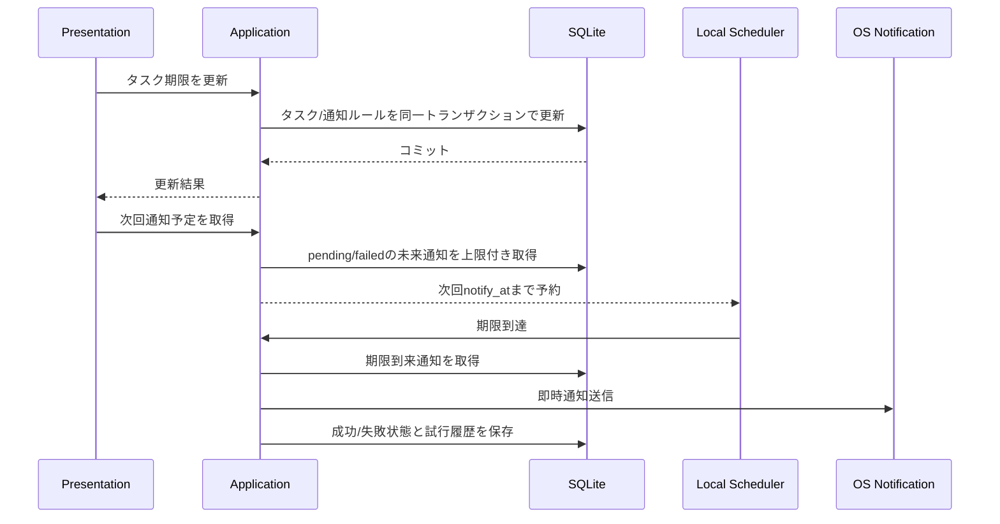

# 044 OSへの将来時刻通知スケジューリング方式を設計する

GitHub Issue: #51

## 背景

現在の通知は、アプリ起動中、再読み込み時、復帰時に期限到来済みの `notification_rules` を読み取り、OS通知を即時送信する方式である。
この方式はDBを正にでき、再試行もしやすい一方で、将来時刻に近づいたときの通知はアプリの再読み込みやフォーカス復帰に依存する。

業務利用では「アプリを開いている間は時刻どおり通知される」「アプリ終了中の扱いが明確である」ことが必要になる。

## 調査結果

現行依存の `tauri-plugin-notification 2.3.3` は `Schedule::At` 型を持つ。
ただしdesktop側の `show()` 実装は、現時点では `schedule` をWindows/macOSの永続的な将来時刻登録として扱っていない。

そのため、Windows/macOSでアプリ完全終了中の通知を保証するには、Tauri pluginの将来対応を待つか、Windows/macOSそれぞれのネイティブ通知予約API、OSタスク、常駐プロセスの検討が必要になる。

## 採用案

段階導入にする。

第1段階では、DBを正としたまま、アプリ起動中の将来時刻通知スケジューラを実装する。

- `notification_rules` を通知意図の正とする。
- OS通知送信は既存の `dispatch_due_notifications` を使う。
- PresentationまたはTauri側が次回 `notify_at` までのローカルタイマーを張り、期限到達時に `dispatch_due_notifications` を呼び出す。
- アプリ起動、ウィンドウ復帰、通知設定変更、タスク/サブタスク日付更新後に再同期する。
- 通知全体OFF時はローカルタイマーもOS通知送信も行わない。
- 成功した通知は既存どおり `registered` にし、再dispatch対象から除外する。
- 失敗した通知は既存どおり `failed` とし、再試行対象に残す。

第2段階では、アプリ完全終了中の通知を保証するネイティブOS登録方式を検証する。

- Windows/macOS別の実装コスト、署名、公証、インストーラー影響を確認する。
- OS側登録はDBから再生成できる副作用として扱う。
- OS側登録状態を追跡する場合、既存 `notification_rules.registration_status` を過剰に多義化せず、専用テーブルまたは専用カラムを追加する。

## スコープ

- 将来時刻通知の設計方針を決める。
- DBコミットと通知副作用の境界を明示する。
- 通知登録失敗時の再試行方針を定義する。
- 実装Issueを分割する。

## スコープ外

- リモート通知。
- 外部サーバー連携。
- 自動更新。
- 分析送信。
- 常駐プロセスの即時導入。

## データモデル

第1段階では新規テーブルを追加しない。

| テーブル | 役割 |
| --- | --- |
| `notification_rules` | 通知意図の正。対象、種別、通知予定時刻、有効/無効、dispatch状態を持つ。 |
| `notification_delivery_attempts` | OS通知送信の試行履歴。タスク名、サブタスク名、メモ、通知本文は保存しない。 |

第2段階でOS側の永続登録を採用する場合は、以下のような専用状態を追加する。

| 候補 | 役割 |
| --- | --- |
| `notification_os_registrations` | `notification_rule_id`、OS通知ID、登録対象時刻、状態、最終試行時刻、エラーを保持する。 |

`notification_rules.registration_status` は、現在の期限到来dispatchの結果として使われているため、OS永続登録の状態を混ぜると意味が曖昧になる。第2段階では専用状態を追加する案を優先する。

## トランザクション境界

- タスク/サブタスク更新と通知ルール同期は既存どおり同一DBトランザクションで行う。
- ローカルタイマー予約とOS通知送信はDBトランザクションに含めない。
- ローカルタイマー予約に失敗しても、DB上の通知意図は失わない。
- OS通知送信に失敗した場合は既存どおり `failed` と `last_error`、`notification_delivery_attempts` に保存する。

## 再同期方針

- 起動時、ウィンドウ復帰時、通知設定変更時、タスク/サブタスク日付変更後に再同期する。
- まず `dispatch_due_notifications` で期限到来済みを処理する。
- 次に未来の `pending` / `failed` 通知から最も近い `notify_at` を取得し、ローカルタイマーを張る。
- タイマーは一度に1件だけ保持し、再同期時に張り直す。
- 遠い未来の通知は、環境差を避けるため最大待機時間を区切って再評価する。
- 上限件数を超える通知は次回再同期に回し、無制限ループにしない。

## 通知本文

- `title_only` では対象タイトルのみをOS通知adapterへ渡す。
- `generic` ではタイトルを `TaskTimer`、本文を汎用文言にする。
- メモ本文は通知に含めない。
- 通知失敗履歴にもタイトル、メモ本文、通知本文を保存しない。

## セキュリティレビュー

- 外部通信は追加しない。
- 新しいTauri権限は追加しない。
- OS通知adapterはRust側に閉じ、JS側へ通知plugin権限を追加しない。
- タスク名、サブタスク名、メモ本文、通知本文をログへ出さない。
- OS由来エラーは長さを制限し、ユーザー本文を含めない前提で保存する。
- 常駐プロセスやネイティブOS登録を採用する場合は、ユーザー同意、署名、公証、アンインストール時の登録解除を別途レビューする。

## スケール

- 未来通知の再同期は最も近い通知だけを取得する。
- 一括同期が必要な場合も上限を設ける。
- `notification_rules_schedule_idx` を使えるよう、`enabled`、`notify_at`、`registration_status`、`deleted_at` で絞り込む。
- 期限到来通知dispatchは既存の上限付き取得を維持する。

## 破綻シナリオ

- アプリ終了中の通知が第1段階では発火しない。
- OSスリープ/復帰後、期限到来通知とローカルタイマー通知が重複する。
- タスク期限変更後、古いローカルタイマーが残る。
- 通知OFF中にOS通知adapterへタイトルを渡してしまう。
- `generic` 設定なのに対象タイトルをOS通知へ渡してしまう。
- OS通知送信失敗を握りつぶし、UIで再試行できない。

## 代替案

### 代替案1: 現行の期限到来dispatchのみを継続する

不採用。

- 実装は最小だが、アプリを開いたままでも通知時刻に自動でdispatchされない場合がある。
- 業務利用で「時刻どおり知らせる」期待に弱い。

### 代替案2: `Schedule::At` をそのまま使う

現時点では不採用。

- 型は存在するが、現行desktop実装でWindows/macOSの将来時刻登録として確実に利用できる前提を置けない。
- 採用する場合はTauri plugin更新確認と実機検証が必要。

### 代替案3: Windows/macOSネイティブ永続予約をすぐ実装する

現時点では不採用。

- アプリ終了中の通知を保証しやすい一方、プラットフォーム別実装、署名、公証、アンインストール時の解除、権限拒否時の再試行が重い。
- Windows先行運用とmacOS後回し方針の中で、同時に両OS品質を担保しにくい。

## トレードオフ

- 第1段階は実装しやすく、既存DB境界と通知失敗履歴を再利用できる。
- 一方で、アプリ完全終了中の通知は保証しない。
- ネイティブ永続登録を後回しにすることで安全に進められるが、将来の実装Issueは残る。

## 実装分割

1. #116 アプリ起動中の将来時刻通知スケジューラを実装する。
2. #117 起動・復帰・設定変更時のOS通知再同期を実装する。
3. #115 通知OS登録状態のRepository境界とDB状態を追加する。
4. #118 Windows/macOSネイティブ将来通知adapterの実現性を検証する。
5. #123 Windowsネイティブ将来通知adapterのPoCを実装する。

## 受け入れ条件

- 採用案、代替案、トレードオフがdocsへ記録されている。
- 実装Issueが分割されている。
- 実装前にセキュリティレビュー観点が明記されている。
- 既存の外部通信なし方針と矛盾しない。

## レビュー判断

承認。

- #51では設計と実装分割までを完了とする。
- アプリ終了中の通知保証は #118 の実現性検証では本実装せず、Windows先行PoC #123 で採用可否を判断する。
