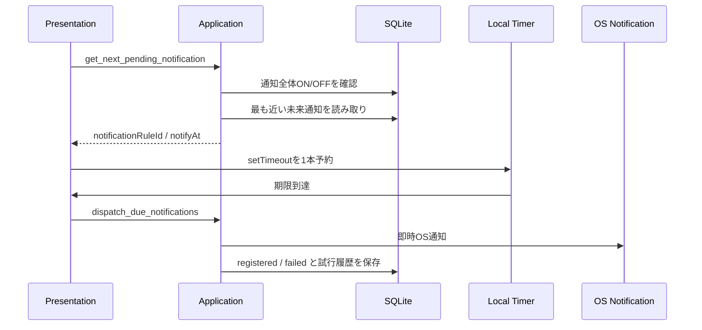

# 045 アプリ起動中の将来時刻通知スケジューラを実装する

GitHub Issue: #116

## 背景

#51では、Windows/macOS desktopの永続的な将来時刻通知を即時採用せず、まずアプリ起動中にDB上の通知意図から次回通知を予約する方針にした。

現在の `dispatch_due_notifications` は期限到来済み通知を安全に送信できるため、将来時刻通知もこのUse Caseを再利用する。

## 採用案

- `notification_rules` を通知意図の正とする。
- Rust Applicationに `get_next_pending_notification` を追加し、未来の `pending` / `failed` 通知のうち最も近い1件だけを返す。
- 通知全体OFF時、`get_next_pending_notification` は `None` を返す。
- 返却DTOは `notificationRuleId` と `notifyAt` のみとし、タスク名、サブタスク名、メモ本文、通知本文をJS側へ渡さない。
- React側はスナップショット更新後に次回通知を取得し、`setTimeout` を1本だけ張る。
- タイマー発火時は既存の `loadSnapshot` を呼び、ポモドーロ同期、期限到来通知dispatch、画面更新、次回予約を同じ流れで実行する。
- 期限が遠い場合は最大60秒で再評価し、OSスリープや時刻変更、DB更新との差分を吸収する。

## トランザクション境界

- 次回通知取得は読み取り専用で、DB状態を変更しない。
- OS通知送信は既存どおり `dispatch_due_notifications` の内部だけで行う。
- タスク更新、通知ルール同期、OS通知送信は同一トランザクションにしない。

## セキュリティレビュー

- 外部通信は追加しない。
- Tauri capabilityは追加しない。
- JS側へ通知plugin権限を追加しない。
- スケジューラDTOにユーザー本文を含めない。
- 通知OFF時は次回通知予定を返さず、OS通知adapterへ到達しない。
- エラー表示には既存の汎用エラー処理を使い、タスク名やメモ本文を組み込まない。

## スケール

- 取得件数は1件だけ。
- 既存の `notification_rules_schedule_idx` を使える条件で絞り込む。
- React側のタイマーは常に1本だけ保持し、effect cleanupで古い予約を破棄する。
- 遠い未来は60秒ごとに再評価するため、長時間timeoutの環境差に依存しない。

## 代替案

### Tauri/Rust側に常駐スケジューラを持たせる

不採用。

- Rust側に状態管理とwindow lifecycleの監視が増え、既存Presentationのスナップショット更新境界と重複する。
- まずはReact側の単一timerで十分に検証できる。

### OSの将来時刻登録APIを直接呼ぶ

不採用。

- #118でWindows/macOS別の実現性、署名、公証、アンインストール時の解除を検証してから判断する。

## 受け入れ条件

- アプリ起動中に次回通知予定までローカルタイマーを張れる。
- 期限到達時に既存 `dispatch_due_notifications` が呼ばれる。
- 通知OFF時にスケジューラが通知予定を返さない。
- 成功済み通知が再予約されない。
- テストと手動確認手順が更新されている。

## レビュー判断

承認。

- #116の範囲はアプリ起動中の通知に限定する。
- アプリ完全終了中の通知保証は #118 で扱う。
