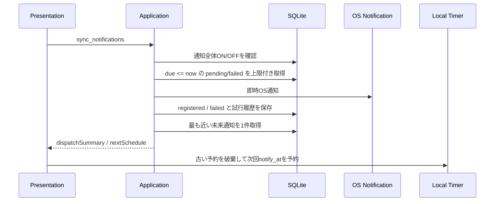

# 046 起動・復帰・設定変更時の通知再同期を実装する

GitHub Issue: #117

## 背景

#116で、アプリ起動中に次回通知予定をローカルタイマーへ予約できるようにした。
ただし、起動、ウィンドウ復帰、通知設定変更、バックアップ復元後に同じ順序で通知状態を再同期する入口が曖昧だと、古い予約が残ったり、期限到来通知と次回予約の順序がずれたりする。

## 採用案

- Application Use Caseとして `sync_notifications` を追加する。
- `sync_notifications` は既存 `dispatch_due_notifications` を先に呼び、期限到来済み通知を処理する。
- その後 `get_next_pending_notification` を呼び、未来の `pending` / `failed` 通知のうち最も近い1件を返す。
- React側の `loadSnapshot` は `dispatch_due_notifications` を直接呼ばず、`sync_notifications` だけを通知再同期入口として使う。
- `sync_notifications` の結果に含まれる `nextSchedule` をReact stateへ保存し、既存ローカルタイマーはeffect cleanupで破棄して張り直す。
- 通知全体OFF時はdispatchも次回予約も行わない。

## スコープ

- アプリ起動中の通知再同期入口を明示する。
- 起動、復帰、設定変更、バックアップ復元後に同じ再同期順序を通す。
- 重複通知を防ぐテストを追加する。

## スコープ外

- アプリ完全終了中のOS永続通知。
- Windows/macOSネイティブ通知予約adapter。
- OS登録状態専用テーブル。

これらは #118 と #115 で扱う。

## トランザクション境界

- 通知ルールの作成・更新はタスク更新トランザクションに含める。
- OS通知送信とローカルタイマー予約はDBトランザクションに含めない。
- OS通知送信失敗時は既存どおり `failed` と `notification_delivery_attempts` に記録し、次回再同期時の再試行対象に残す。

## 再同期イベント

- アプリ起動後の初回スナップショット取得。
- ウィンドウfocusまたはvisibility復帰。
- 通知表示タイプ変更。
- 通知全体ON/OFF変更。
- タスク/サブタスクの期限変更。
- カレンダー上の期限移動。
- SQLiteバックアップ復元後。

いずれも `loadSnapshot` を経由し、最終的に `sync_notifications` を呼ぶ。

## セキュリティレビュー

- 外部通信は追加しない。
- Tauri capabilityは追加しない。
- JS側へ通知plugin権限を追加しない。
- `sync_notifications` の戻り値は `dispatchSummary` と `nextSchedule` だけで、タスク名、サブタスク名、メモ本文、通知本文を含めない。
- 通知全体OFF時はOS通知adapterへ到達しない。

## スケール

- dispatch対象は既存上限 `NOTIFICATION_DISPATCH_LIMIT = 20` を維持する。
- 次回予約は最も近い1件だけを返す。
- React側のローカルタイマーは1本だけ保持する。
- 遠い未来通知は最大60秒ごとに再評価する。

## 破綻シナリオ

- 復帰後に期限到来通知を送ったあと、同じ通知を次回予約へ残してしまう。
- 通知OFFへ変更したのに古いローカルタイマーが残る。
- バックアップ復元後に復元前DBの通知予定を保持する。
- 失敗済み通知を再同期対象から外してしまい、再試行できない。

## 受け入れ条件

- `sync_notifications` が期限到来dispatch後に未来通知を返す。
- 復帰相当の時刻ジャンプ後に、期限到来通知が1回だけ送信される。
- 通知OFF時はdispatchも次回予約も行わない。
- docsへ再同期上限と失敗時再試行方針が反映されている。

## レビュー判断

承認。

- #117はアプリ起動中の再同期入口の明示化として完了する。
- OS永続登録状態のDB設計は #115、ネイティブadapter実現性は #118 で扱う。
