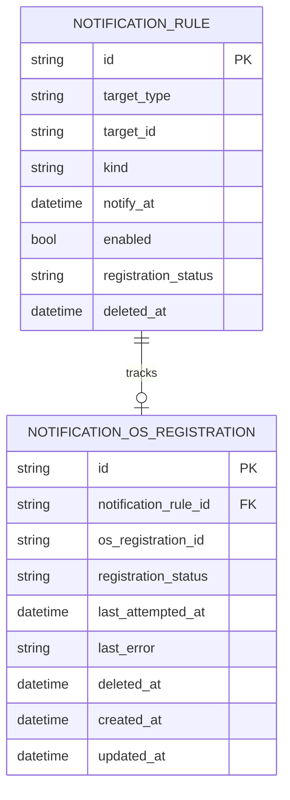
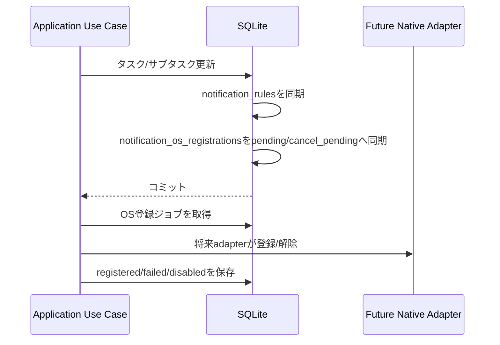

# 047 通知OS登録状態のRepository境界とDB状態を追加する

GitHub Issue: #115

## 背景

#51 では、将来時刻通知を段階導入にし、第1段階ではアプリ起動中のローカルスケジューラで扱う方針にした。
第2段階でWindows/macOSのネイティブ通知予約adapterを検証するには、通知意図とOS側登録状態を混ぜないDB境界が必要になる。

既存の `notification_rules.registration_status` は、期限到来通知を即時dispatchした結果を表す。
ここへOS永続登録状態を混ぜると、「OSへ予約済み」と「期限到来後に送信済み」の意味が衝突する。

## 採用案

- `notification_rules` は通知意図の正として維持する。
- OS登録状態は新しい `notification_os_registrations` に分離する。
- `notification_os_registrations` はOS登録ID、登録状態、最終試行時刻、最終エラーを持つ。
- タスク/サブタスク作成時は、対応する通知ルールごとにOS登録状態を `pending` で作成する。
- タスク/サブタスク更新時は、通知予定が同じでもOS登録状態だけを `pending` に戻す。
- 通知予定が変わった場合、既存OS登録IDを保持したまま `pending` に戻し、将来のadapterが古いOS登録を差し替えられるようにする。
- 通知ルールが削除または無効化された場合、OS登録IDがある行は `cancel_pending` にし、OS登録IDがない行は `disabled` として完了扱いにする。
- `notification_rules.registration_status` は、通知予定時刻が変わる場合だけ既存どおり `pending` に戻す。

## スコープ

- DBマイグレーション。
- Repository境界。
- 将来adapter向けのApplication Use Case。
- 既存通知ルールのbackfill。
- タスク/サブタスク作成、更新、削除時のOS登録状態同期。

## スコープ外

- Windows/macOSネイティブ通知予約adapterの実装。
- アプリ完全終了中の通知保証。
- UI表示。
- 外部通信。

## データモデル

`registration_status` は以下に限定する。

| 状態 | 意味 |
| --- | --- |
| `pending` | OS側へ登録または差し替えが必要。 |
| `registered` | OS側登録が成功している。 |
| `failed` | OS側登録が失敗し、再試行対象。 |
| `cancel_pending` | 古いOS登録の解除が必要。 |
| `disabled` | OS側の解除または登録不要が完了している。 |

## Repository境界

`NotificationOsRegistrationRepository` を追加する。

- `list_notification_os_registration_jobs(now, limit)`
  - `pending` / `failed` の未来通知と、`cancel_pending` の解除対象を上限付きで返す。
  - DTOへタスク名、サブタスク名、メモ本文、通知本文は含めない。
- `mark_notification_os_registration_registered(registration_id, os_registration_id, now)`
  - OS側登録IDを保存し、状態を `registered` にする。
- `mark_notification_os_registration_failed(registration_id, error, now)`
  - 最終試行時刻と短縮済みエラーだけを保存し、状態を `failed` にする。
- `mark_notification_os_registration_cancelled(registration_id, now)`
  - OS側解除完了として `disabled` にし、OS登録IDを破棄する。

## トランザクション境界

- タスク/サブタスク更新とOS登録状態の `pending` 化は同一DBトランザクションで行う。
- OSへの登録/解除はDBトランザクション外の副作用にする。
- DB上の通知意図からOS登録は再生成できるため、OS側登録そのものは正にしない。

## セキュリティレビュー

- 外部通信は追加しない。
- 新しいTauri capabilityは追加しない。
- OS登録状態にはタスク名、サブタスク名、メモ本文、通知本文を保存しない。
- `last_error` は既存の通知失敗と同じく短縮保存し、秘密情報の混入を避ける。
- Repository境界の戻り値にもユーザー本文を含めない。

## スケール

- OS登録ジョブ取得は上限付きにする。
- `registration_status` と `updated_at` のインデックスを持ち、再同期対象だけを読む。
- `notification_rule_id` の有効行は一意にし、重複OS登録状態を避ける。

## 破綻シナリオ

- `notification_rules.registration_status` にOS登録状態を混ぜ、送信済み通知を再送してしまう。
- 期限変更時に古いOS登録IDを失い、OS側へ残った予約を解除できなくなる。
- 削除済みタスクのOS登録解除対象を消し込みすぎ、将来adapterが解除できなくなる。
- OS登録失敗時にタスク名や通知本文を履歴へ保存してしまう。

## 受け入れ条件

- DBマイグレーションとRepository境界がある。
- 既存通知ルールからOS登録状態をbackfillできる。
- タスク/サブタスク作成、更新、削除時にOS登録状態が同期される。
- タスク名、メモ本文、通知本文をログや履歴へ保存しない。

## レビュー判断

承認。

- #115ではOS登録状態の土台だけを作る。
- ネイティブadapterの実現性とOS別の制約は #118 で検証する。
