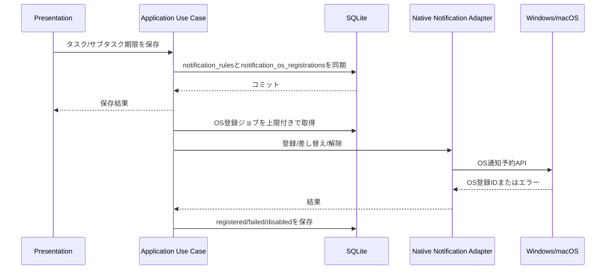

# 048 Windows/macOSネイティブ将来通知adapterの実現性を検証する

GitHub Issue: #118

## 背景

#51 では、将来時刻通知を段階導入にし、第1段階ではアプリ起動中のローカルスケジューラで扱う方針にした。
#115 では、第2段階のネイティブOS通知予約adapterに備えて `notification_os_registrations` を追加した。

業務利用では「アプリを開いている間の通知」だけでなく、「アプリ完全終了中の通知」が期待される可能性がある。
ただし、この保証にはWindows/macOSそれぞれのOS通知予約API、署名、インストーラー、アンインストール時の解除、通知権限が関係するため、現行のTauri plugin利用だけで採用判断しない。

## 調査入力

| 対象 | 確認結果 |
| --- | --- |
| 現行依存 | `src-tauri/Cargo.lock` 上の `tauri-plugin-notification` は `2.3.3`。 |
| 現行TaskTimer実装 | `TauriLocalNotificationGateway` はRust側で `builder().title(...).body(...).show()` の即時通知だけを呼ぶ。 |
| Tauri notification plugin | JS/Rust APIには `schedule` があるが、2.3.3 のdesktop `show()` 実装は `schedule` を読まず `notify-rust` の即時表示へ渡している。 |
| Windows | `Windows.UI.Notifications` には `ScheduledToastNotification` と `ToastNotifier.AddToSchedule` があるが、Microsoft Learnでは `AddToSchedule` がWinRTを既定frameworkにするアプリ向けと説明され、desktop appではAppUserModelIDやショートカットなどの制約がある。 |
| Windows App SDK | 現行のアプリ通知APIはローカル通知を扱えるが、Microsoft Learn上では昇格実行時の制限が明記されている。予約APIの採用可否はPoCが必要。 |
| macOS | Apple UserNotifications frameworkは `UNCalendarNotificationTrigger` と `UNUserNotificationCenter` でローカル通知をスケジュールできる。実装には通知許可、署名、公証、RustからのObjective-C/Swift bridge確認が必要。 |

参照:

- [Tauri notification JavaScript reference](https://v2.tauri.app/reference/javascript/notification/)
- [tauri-plugin-notification 2.3.3 desktop.rs](https://docs.rs/tauri-plugin-notification/2.3.3/src/tauri_plugin_notification/desktop.rs.html)
- [ToastNotifier.AddToSchedule](https://learn.microsoft.com/en-us/uwp/api/windows.ui.notifications.toastnotifier.addtoschedule?view=winrt-28000)
- [ToastNotificationManager.CreateToastNotifier](https://learn.microsoft.com/en-us/uwp/api/windows.ui.notifications.toastnotificationmanager.createtoastnotifier?view=winrt-28000)
- [Windows App SDK app notifications overview](https://learn.microsoft.com/en-us/windows/apps/develop/notifications/app-notifications/)
- [Apple: Scheduling a notification locally from your app](https://developer.apple.com/documentation/usernotifications/scheduling-a-notification-locally-from-your-app)
- [Apple: Scheduling and Handling Local Notifications](https://developer.apple.com/library/archive/documentation/NetworkingInternet/Conceptual/RemoteNotificationsPG/SchedulingandHandlingLocalNotifications.html)

## 採用判断

現時点では、Windows/macOSネイティブ将来通知adapterを本実装しない。

代わりに、Windows先行運用に合わせて #123 でWindowsネイティブ将来通知adapterのPoCを行う。
macOSはApple Developer ID署名とApple公証の準備ができるまで後回しにする。

理由:

- 現行Tauri plugin 2.3.3 のdesktop `show()` は `schedule` を永続的なOS予約として扱っていない。
- WindowsはAPI候補があるが、Tauriの配布形態、AppUserModelID、インストーラー、非昇格実行、アプリ終了中の発火を実機で確認する必要がある。
- macOSはOS APIとしては実現可能だが、公開配布品質では署名・公証・通知許可の確認が必要であり、現在のWindows優先方針と衝突する。
- 常駐プロセスやOSタスク登録は、ユーザー同意、アンインストール時の解除、プライバシー説明、公開運用の負担が大きい。

## 方式比較

| 方式 | 採用可否 | 制限 | 実装コスト |
| --- | --- | --- | --- |
| 現行Tauri plugin `show()` | 既存継続 | 即時表示のみ。アプリ終了中の将来通知は保証しない。 | 追加なし。 |
| Tauri plugin `schedule` をそのまま利用 | 不採用 | JS/Rust API上は存在するが、2.3.3 desktop `show()` では永続予約として扱えない。JS側権限追加も避けたい。 | 低いが、保証できない。 |
| Windows `ScheduledToastNotification` / `ToastNotifier` | 条件付き。#123でPoC | WinRT/framework、AppUserModelID、インストール済みアプリ、非昇格実行、解除手順の確認が必要。 | 中。Rust/WinRT bridgeとinstaller検証が必要。 |
| Windows App SDK通知API | 条件付き。#123で候補比較 | ローカル通知は扱えるが、予約APIとTauri統合の実機検証が必要。昇格実行時の制限がある。 | 中から高。依存追加と配布影響の検証が必要。 |
| macOS UserNotifications | 後回し | 通知許可、署名、公証、アプリbundle ID、実機検証が必要。 | 中。Apple署名・公証運用が前提。 |
| 常駐プロセス / OSタスク | 不採用 | ユーザー同意、バックグラウンド実行説明、アンインストール解除、プライバシー説明が重い。 | 高。公開運用負荷が大きい。 |

## 目標アーキテクチャ

ネイティブadapterを採用する場合でも、DBを正とする。

- `notification_rules` は通知意図の正。
- `notification_os_registrations` はOS側登録状態であり、再生成可能な副作用の結果。
- OS登録/解除はDBトランザクション外で実行する。
- OS登録IDを保存しても、OS側を正にしない。
- 古いOS登録を解除できない場合は `failed` として短縮エラーだけ保存し、ユーザー本文は保存しない。

## Tauri権限と公開運用

- この検証では新しいTauri capabilityを追加しない。
- JS側へnotification plugin権限を追加しない。
- adapterはRust Infrastructureへ閉じる。
- 外部通信は追加しない。
- Windows PoCで追加依存が必要な場合は、依存のライセンス、メンテナンス状況、Windows runnerでのビルド可否を確認する。
- macOS adapterを検討する場合は、macOS署名・公証Issue #24 の完了後に別Issueで扱う。

## 通知プライバシー

- `title_only` では対象タイトルのみをOS通知adapterへ渡す。
- `generic` では対象タイトル、サブタスクタイトル、メモ本文、通知本文をOS通知adapterへ渡さない。
- メモ本文は通知本文にもOS登録状態にも保存しない。
- `notification_os_registrations.last_error` は短縮済みOSエラーだけを保存し、タスク名、サブタスク名、メモ本文、通知本文を含めない。

## スケール

- OS登録ジョブは上限付きで処理する。
- 一度に全未来通知をOSへ登録しない。初期上限を設け、再同期で分割処理する。
- OS側に予約数制限がある場合、DB上の通知意図を維持しつつ、登録失敗状態として扱う。
- バックアップ復元後はDBを正としてOS登録を再生成する。

## 破綻シナリオ

- Tauri pluginの `schedule` 型だけを見て採用し、アプリ終了中に通知が届かない。
- Windowsで開発ビルドでは動くが、インストーラー経由のRelease buildでAppUserModelIDが合わず通知されない。
- Windowsで昇格実行時に通知が使えない。
- タスク期限変更後、古いOS予約が残り二重通知される。
- タスク削除後、OS側予約が解除されず、削除済みタスクの通知が出る。
- `generic` 設定なのに、OS登録時点でタスクタイトルを渡してしまう。
- macOS未署名・未公証artifactで通知許可やGatekeeper挙動が安定せず、外部利用者に危険な手順を踏ませる。
- 常駐プロセスを導入し、ユーザーが終了したと思っているのにバックグラウンドで動き続ける。

## 代替案

### 代替案1: 現行のアプリ起動中スケジューラだけを継続する

採用中。

- 外部通信なし、追加権限なし、DB正の境界を維持しやすい。
- アプリ完全終了中の通知は保証しない。

### 代替案2: Tauri plugin `schedule` へすぐ切り替える

不採用。

- 現行desktop実装が永続予約として扱っていない。
- JS側権限を追加すると、PresentationへOS通知権限が広がる。

### 代替案3: macOS/Windowsを同時に本実装する

不採用。

- Windows優先運用とmacOS後回し方針に合わない。
- 署名、公証、OS権限、インストーラー検証の組み合わせが大きくなりすぎる。

### 代替案4: 常駐プロセスで時刻監視する

不採用。

- ユーザー同意、プライバシー説明、アンインストール解除、OS起動時登録の運用負担が大きい。
- TaskTimerの「外部通信なし・ローカル完結」方針とは両立するが、公開利用者への説明責任が増える。

## 後続Issue

- #123 Windowsネイティブ将来通知adapterのPoCを実装する。
- macOS adapterは #24 の署名・公証準備後に、別IssueでPoCまたは実装判断する。

## 受け入れ条件

- Windows/macOSそれぞれの採用可否、制限、実装コストがdocsに記録されている。
- 常駐プロセスを採用しない判断と、採用する場合の公開運用・プライバシー・ユーザー同意観点が記録されている。
- 外部通信なし方針を維持している。
- Windows先行の後続Issueが作成されている。

## レビュー判断

フォローアップ付き承認。

- #118では実現性検証と採用判断を完了とする。
- 本実装は行わず、Windows先行PoC #123 に分割する。
