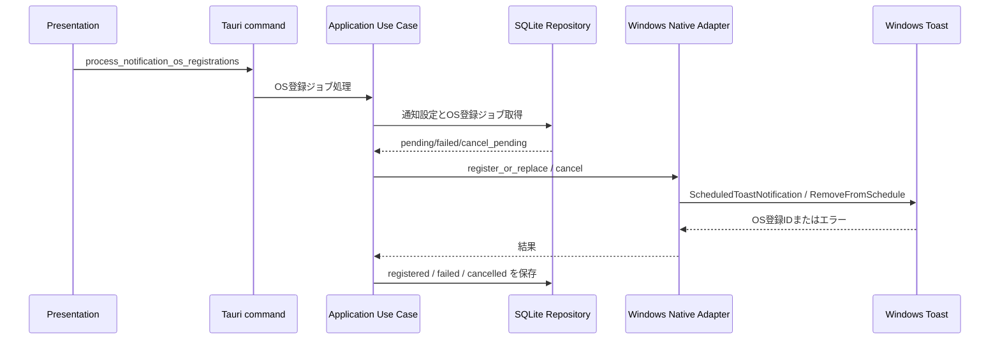

# 049 Windowsネイティブ将来通知adapterのPoCを実装する

GitHub Issue: #123

## 背景

#118 では、現行 `tauri-plugin-notification 2.3.3` のdesktop実装をアプリ完全終了中の永続予約として採用しない判断にした。
#115 で追加した `notification_os_registrations` を使い、Windows先行運用向けにRust側Infrastructure adapterだけでネイティブ通知予約のPoCを行う。

Microsoft Learnでは、`Windows.UI.Notifications` の `ToastNotifier.AddToSchedule` と `ScheduledToastNotification` は存在する一方、desktop appにはAppUserModelID付きショートカットが必要であり、`ToastNotificationManager.CreateToastNotifier` のdesktop app説明では「desktop apps cannot schedule a toast」と記載されている。
そのため、このIssueでは本採用ではなく、インストール済みWindows 11で登録、変更、解除、発火を検証するPoCとして扱う。

参照:

- [ToastNotificationManager.CreateToastNotifier](https://learn.microsoft.com/en-us/uwp/api/windows.ui.notifications.toastnotificationmanager.createtoastnotifier?view=winrt-28000)
- [ToastNotifier.AddToSchedule](https://learn.microsoft.com/en-us/uwp/api/windows.ui.notifications.toastnotifier.addtoschedule?view=winrt-28000)
- [ScheduledToastNotification](https://learn.microsoft.com/en-us/uwp/api/windows.ui.notifications.scheduledtoastnotification?view=winrt-28000)
- [ToastNotifier.RemoveFromSchedule](https://learn.microsoft.com/en-us/uwp/api/windows.ui.notifications.toastnotifier.removefromschedule?view=winrt-28000)
- [Windows App SDK app notifications overview](https://learn.microsoft.com/en-us/windows/apps/develop/notifications/app-notifications/)
- [Quickstart: Send and Handle App Notifications](https://learn.microsoft.com/en-us/windows/apps/develop/notifications/app-notifications/app-notifications-quickstart)

## 要件

- Windows限定で `Windows.UI.Notifications` の `ScheduledToastNotification` / `ToastNotifier.AddToSchedule` を呼ぶInfrastructure adapterを追加する。
- Application Use Caseは、DB上の `notification_os_registrations` を正として登録、差し替え、解除を上限付きで処理する。
- OS登録/解除はDBトランザクション外の副作用として扱い、結果だけを `registered`、`failed`、`disabled` へ戻す。
- 通知全体OFF時は既存OS登録を `cancel_pending` 経由で解除し、対象タイトルや本文をOS adapterへ渡さない。
- `generic` 設定ではタスク名、サブタスク名、メモ本文、通知本文をOS adapterへ渡さない。
- JS側へnotification capabilityを追加しない。
- アプリ実行時の外部通信を追加しない。
- 失敗時の `last_error` にはOSエラーだけを保存し、タスク名、サブタスク名、メモ本文、通知本文を含めない。

## 設計

### Application

- `NativeNotificationRegistrationGateway`
  - `is_available()`
  - `register_or_replace(request)`
  - `cancel(os_registration_id)`
- `NativeNotificationOsRegistrationRepository`
  - `list_native_notification_os_registration_jobs(now, limit)`
- `process_notification_os_registration_jobs`
  - Windows以外では `is_available=false` とし、DB読み取りもOS副作用も行わない。
  - `RegisterOrReplace` は通知表示モードを通してタイトル/本文を組み立てる。
  - `Cancel` は既存OS登録IDをadapterへ渡し、成功後にDB側を解除済みにする。

### Infrastructure

- `TauriNativeNotificationRegistrationGateway`
  - Windowsでは `windows` crate経由で `Windows.UI.Notifications` を呼ぶ。
  - Windows以外では未対応エラーを返すが、Use Caseの `is_available=false` により通常呼ばれない。
- OS登録IDは `tasktimer:{notification_os_registrations.id}` で決定的に生成する。
- Toast XMLはRust側でエスケープし、HTMLやユーザー入力をそのまま解釈しない。
- AppUserModelID候補にはTauri設定の `identifier` を使う。

### Presentation

- `loadSnapshot` で既存 `sync_notifications` の後に `processNativeNotificationRegistrations` を呼ぶ。
- OS登録結果を通常UIの通知サマリーへ混ぜない。PoCの失敗はDBのOS登録状態に閉じる。
- 右詳細ペインや設定画面へWindows固有APIを露出しない。

## 手動検証手順

Windows 11のインストール済みアプリで確認する。

1. 非昇格でTaskTimerを起動する。
2. 通知全体ON、表示モード `タイトルのみ` にする。
3. 2から5分後の期限時刻を持つタスクを作成する。
4. DBの `notification_os_registrations.registration_status` が `registered` になることを確認する。
5. 期限時刻を変更し、古いOS予約が解除され、新しいOS登録IDで再登録されることを確認する。
6. 期限時刻前にタスクを削除し、`cancel_pending` が処理されて解除済みになることを確認する。
7. 通知全体OFFへ変更し、既存未来通知が解除されることを確認する。
8. 表示モード `汎用メッセージ` で再登録し、OS通知にタスク名、サブタスク名、メモ本文が出ないことを確認する。
9. アプリを完全終了し、期限時刻に通知が出るかを確認する。
10. 未来通知を登録した状態でアンインストールし、アンインストール後に通知が残らないか、または残る場合の解除方法と採用不可理由を記録する。

## 採用判断

このPRではPoC adapterを追加するが、Windowsネイティブ将来通知を公開保証機能として採用したとはみなさない。

採用条件:

- Windows 11のインストール済みアプリで、登録、変更、解除、通知全体OFF、`generic` 表示、削除後解除、アプリ完全終了中の発火が確認できる。
- 非昇格実行で動作する。
- インストーラーのAppUserModelIDとショートカット要件が満たされ、アンインストール後に予約通知が残らない。
- OS予約数制限またはAPI制限時に、DB上の通知意図を失わず `failed` として再試行できる。

見送り条件:

- Microsoft Learnのdesktop app制限どおり、インストール済みTauriアプリでも予約発火しない。
- AppUserModelIDやショートカット要件を満たすために、常駐プロセスや過剰な権限追加が必要になる。
- アプリ完全終了中の発火が安定しない。
- 解除に失敗し、削除済みタスクの通知が残る。
- アンインストール後に未来通知が残り、TaskTimer側から解除できなくなる。

## 代替案

### 代替案1: アプリ起動中スケジューラだけを継続する

採用中。

- 外部通信なし、追加権限なし、DB正の境界を維持しやすい。
- アプリ完全終了中の通知は保証しない。

### 代替案2: Windows App SDK app notificationsへ移行する

保留。

- 公式にdesktop向けの通知APIだが、Tauri/Rustへの統合、依存追加、非昇格制限、スケジュールAPIの安定性を別途確認する必要がある。

### 代替案3: 常駐プロセスまたはOSタスクを追加する

不採用。

- ユーザー同意、アンインストール時解除、公開運用、プライバシー説明の負担が大きい。

## テスト

- `process_notification_os_registration_jobs` のApplication単体テスト。
  - Windows以外ではDBに触らずスキップする。
  - `generic` 設定ではタイトルを `TaskTimer`、本文を汎用メッセージにする。
  - `cancel_pending` はOS解除後にDBを解除済みにする。
  - OS登録失敗時は `failed` と `last_error` を保存する。
- `toast_xml` のエスケープテスト。
- Windows `DateTime` ticks変換テスト。
- 既存SQLite通知テスト。

## 破綻シナリオ

- Microsoft Learnのdesktop app制限により、API呼び出しは成功しても発火しない。
- Windowsで昇格実行し、通知が送受信されない。
- AppUserModelIDがインストーラーのショートカットと一致せず通知されない。
- 期限変更後に古いOS予約が残り二重通知される。
- `generic` 設定なのにOS登録時点でタスク名を渡す。
- タスク削除後にOS予約が残り、削除済みタスクの通知が出る。
- macOS/LinuxでPoC commandがDB状態を変更してしまう。

## レビュー判断

フォローアップ付き承認。

- Windows adapterのコード境界は追加する。
- 採用可否はWindows 11インストール済みアプリの手動検証結果で別途判断する。
