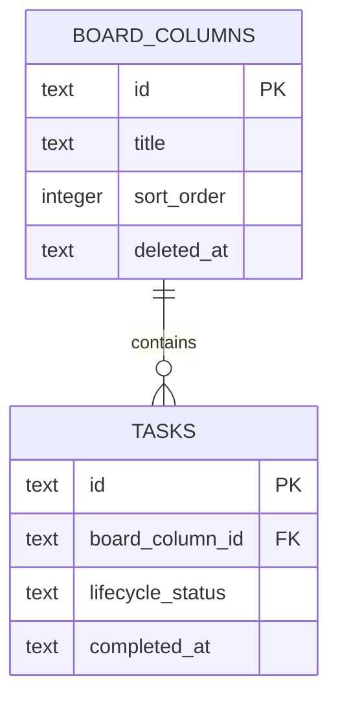

# 051 かんばんをドラッグ操作とカスタム状態へ拡張する

GitHub Issue: #126

## 背景

現在のかんばんは `todo`、`in_progress`、`done` の固定3列で、カード内ボタンから状態を変更する。
利用者が業務の流れに合わせて列を追加、編集、並べ替えし、カードをドラッグして移動できる構成へ拡張する。

## 要件

- 状態変更ボタンを廃止し、カードのドラッグ&ドロップで列を変更する。
- タスクリストと同じ円形完了ボタンをカードに表示する。
- 完了タスクは、完了前に所属していた状態列の下部にある折りたたみ可能な完了セクションへ移す。
- 状態列を追加、名称変更、並べ替えできる。
- 状態列そのものをドラッグ&ドロップで並べ替えられる。
- マウスだけに依存せず、キーボードでもカードと列を移動できる。

## 先行設計課題

現行 `tasks.status` は進行状態と完了状態を兼ねている。完了後も元の列を保持するには、少なくとも以下を分離する必要がある。

- `board_column_id`: かんばん上の業務状態。
- `lifecycle_status`: 未完了、完了、アーカイブのライフサイクル。
- `completed_at`: 完了日時。

`tasks.status` は既存一覧、通知、アーカイブとの後方互換のため削除しない。正規の完了状態は `lifecycle_status`、かんばん上の位置は `board_column_id` とし、互換 `status` はApplication/Infrastructureが同一トランザクションで同期する。

## 移行と互換方針

- `board_columns` に `未着手` と `進行中` の2列を初期投入する。
- 既存 `status = in_progress` は `進行中`、それ以外は `未着手` へ割り当てる。既存完了タスクは完了前の列を復元できないため、決定的な移行先として `未着手` を使う。
- `lifecycle_status` は既存 `done` を `done`、`archived` を `archived`、それ以外を `active` へ移行する。
- 新規タスクは `未着手` 列かつ `lifecycle_status = active` で作成する。
- カスタム列へ移動した未完了タスクの互換 `status` は `in_progress` とする。`未着手` 列だけは `todo` とする。
- 完了時は列IDを保持したまま `lifecycle_status = done`、`status = done`、`completed_at` を保存する。
- 再開時は列IDを保持して `lifecycle_status = active` に戻し、互換 `status` は列に応じて `todo` または `in_progress` とする。
- アーカイブ時は列IDを保持して `lifecycle_status = archived`、`status = archived` とする。復元時は完了時刻の有無に応じて `done` または `active` へ戻す。
- 一覧、今日、お気に入り、カレンダー、通知は当面互換 `status` を利用できるが、かんばんRead Modelは `board_column_id` を必須情報として返す。
- JSON/CSVには `board_columns`、`board_column_id`、`lifecycle_status` を追加する。SQLiteバックアップのスキーマバージョンを更新する。

## トランザクション境界

- カード移動は `MoveTaskToBoardColumn` Use Caseで `board_column_id` と更新日時を1トランザクションで保存する。
- 列並べ替えは `ReorderBoardColumns` Use Caseで全対象の順序を1トランザクションで更新する。
- 列削除時は、所属タスクの移動先を明示してから同じトランザクションで列をソフト削除する。
- 完了/未完了は既存完了ルールを保ち、未完了サブタスク確認を維持する。
- 列作成、名称変更、削除では、trim後の名称、重複名、ID存在、最終1列の削除禁止をApplication/Repositoryの両境界で検証する。

## UI状態とDnD

- `@dnd-kit/core` と `@dnd-kit/sortable` のPointer/Keyboard sensorを使う。
- 列のドラッグは専用ハンドルから開始し、カード選択、完了チェック、名称編集と競合させない。
- カードのドラッグは専用ハンドルから開始し、ドロップ先列IDだけを永続化する。列内のカード順は本Issueでは変更しない。
- 完了タスクは各列の下部にある折りたたみセクションへ表示する。完了タスクを別列へ移動しても `completed_at` は変更しない。
- DnD結果を楽観反映せず、保存成功後のスナップショットだけを表示する。失敗時はカード/列を直前のDB読込状態へ戻す。
- 列削除UIは移動先を明示して確認し、最終1列の削除操作を無効にする。

## 設計理由

- 進行状態と完了状態を分けることで、「レビュー中のまま完了」のように元の業務状態を保持できる。
- 列をエンティティにすると、名称、順序、削除、将来のWIP制限をドメイン境界で扱える。
- DnDは実績のあるライブラリを使い、ポインター、キーボード、衝突判定を自前実装しない。

## トレードオフ

- 柔軟な列管理により、固定列よりDB、移行、エクスポート、テスト範囲が大きくなる。
- DnDは直感的だが、誤移動とアクセシビリティ対策が必要になる。

## 代替案

固定3列のままHTML Drag and Drop APIだけを追加する。

不採用理由:

- 完了状態と進行状態の混在を解消できない。
- キーボード操作とタッチ操作の品質を確保しにくい。

## セキュリティと危険ケース

- 列名は長さと空文字を検証し、HTMLとして描画しない。
- ドロップ先IDはApplication層で存在確認する。
- 列削除時に所属タスクが孤立する。
- 並べ替え途中の失敗で順序が重複する。
- 大量カードの全再描画で操作が遅くなる。
- 完了済みカードを移動した際に `completed_at` が失われる。
- ドラッグハンドルとカード選択が同時発火し、詳細が意図せず開く。
- 互換 `status` と `lifecycle_status` が不一致になり、一覧と完了セクションで表示が分かれる。

## 受け入れ条件

- カードと列をポインター、キーボードの両方で移動できる。
- 完了ボタンと完了セクションが一覧と一貫した挙動になる。
- 列の追加、名称変更、並べ替え、削除が再起動後も保持される。
- 既存タスクを移行しても一覧、カレンダー、通知、エクスポートが破綻しない。
- 大量データ検証にかんばん操作を追加する。
- 列削除時に移動先が存在しない、同じ列である、最終1列である場合は保存されない。
