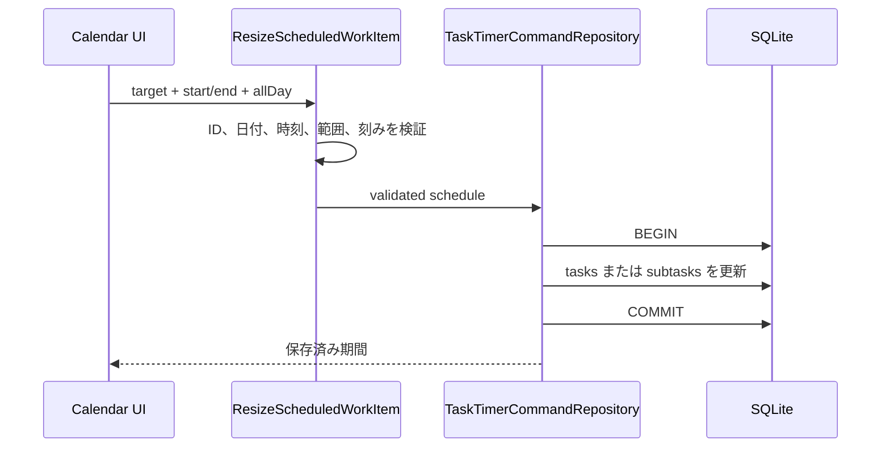

# 052 カレンダー項目を期間表示し端のドラッグで調整する

GitHub Issue: #127

## 背景

現在のカレンダー項目は期限日と期限時刻を示す点のマーカーであり、開始・終了を持つ予定ブロックではない。
項目端をドラッグして期間を調整するには、UIだけでなく期間データと通知の意味を設計する必要がある。

## 要件

- 週/日表示で、期間を持つタスクを開始から終了までのブロックとして表示する。
- 項目の開始端または終了端へフォーカス/ホバーすると、左右または上下のリサイズカーソルと操作ハンドルを表示する。
- 端をドラッグして開始/終了を時間刻みで変更できる。
- 月表示では日単位の開始日/終了日を調整できる。
- タスクとサブタスクの期間を同じ規則で扱う。

## 期間モデル

現行 `planned_start_date`、`due_date`、`due_time` は開始予定と期限であり、作業予定の開始/終了を表す期間には使わない。
タスクとサブタスクへ次の列を追加する。

| 列 | 型 | 意味 |
| --- | --- | --- |
| `scheduled_start_date` | `TEXT NULL` | 予定開始日。ローカル日付 `YYYY-MM-DD`。 |
| `scheduled_start_time` | `TEXT NULL` | 予定開始時刻。ローカル時刻 `HH:mm`。 |
| `scheduled_end_date` | `TEXT NULL` | 予定終了日。ローカル日付 `YYYY-MM-DD`。 |
| `scheduled_end_time` | `TEXT NULL` | 予定終了時刻。ローカル時刻 `HH:mm`。 |
| `scheduled_is_all_day` | `INTEGER NOT NULL DEFAULT 0` | 終日予定なら `1`。 |

期間なしは開始日・終了日・両時刻がすべて `NULL`、`scheduled_is_all_day = 0` とする。
終日予定は開始日と終了日を必須とし、両時刻を `NULL` にする。開始日と終了日は包含範囲で扱う。
時刻あり予定は4項目を必須とし、開始日時より終了日時が後でなければならない。

日時はOSのローカルカレンダーとして保存する。TaskTimerは外部同期を行わず、利用端末の予定を同じ壁時計時刻で維持するため、UTC変換やタイムゾーンIDは保存しない。
タイムゾーン変更後も表示時刻を維持できる一方、DST境界をまたぐ実時間とは一致しない場合がある。

既存データから期間は推測して移行しない。期限だけのタスクを暗黙に1時間予定へ変換すると、保存した意味が変わるためである。

## 既存期限・通知との互換方針

- `planned_start_date` は開始予定の通知基準、`due_date/due_time` は期限と期限通知の基準として維持する。
- カレンダー期間のリサイズは予定期間だけを更新し、期限、開始予定、通知ルールを変更しない。
- カレンダーから新規作成したタスクは予定期間を持つ。期限は自動設定せず、必要ならタスク詳細から追加する。
- 予定開始/終了通知は本Issueでは追加しない。将来追加する場合は既存の期限通知とは別種別にする。
- 予定期間がある項目は期間ブロックを表示し、既存の開始予定・期限・実行中マーカーも意味の異なる情報として維持する。

## 更新規則

- 週/日表示の時刻あり期間は15分刻みで開始端または終了端を変更する。
- 週/日表示の終日期間と月表示は1日刻みで開始日または終了日を変更する。
- 時刻あり期間の最小長は15分、最大長は366日とする。
- 終日期間の最小長は1日、最大長は366日とする。
- リサイズハンドルはポインター操作とキーボード操作を提供する。
- キーボードでは週/日の時刻あり期間を `ArrowUp` / `ArrowDown`、終日/月期間を `ArrowLeft` / `ArrowRight` で調整する。

## トランザクション境界

`ResizeScheduledWorkItem` Use Caseが対象ID、開始、終了、終日状態を検証し、タスクまたはサブタスクの予定期間を1トランザクションで更新する。
通知ルールは期限情報を正とするため、このトランザクションでは変更しない。

カレンダーからの作成は `CreateScheduledTask` Use Caseがタスク本体と予定期間を1トランザクションで保存する。

## 設計理由

- 期限点を見た目だけ伸ばすと、保存値と表示が一致しない。
- 開始/終了を明示すると、カレンダー配置、重なり、期間変更、将来の所要時間分析を同じモデルで扱える。

## トレードオフ

- 期間モデル追加はマイグレーション、繰り返し、カレンダーRead Model、エクスポートへ影響する。
- 15分刻みは操作しやすい一方、任意時刻入力との丸め規則が必要になる。
- 日付/時刻の分割列は列数が増える一方、終日予定とローカル壁時計の意味を明示できる。
- カレンダー項目が多い場合、期間ブロックが重なる。MVPでは重なりを横分割せず、選択中の項目を前面へ出す。

## 代替案

期限マーカーの左右に装飾だけを表示し、ドラッグ量を期限時刻の変更として扱う。

不採用理由:

- 開始位置が存在せず、どの期間を伸縮したのか説明できない。
- Googleカレンダー型の予定ブロックと異なる挙動になる。

## セキュリティと危険ケース

- 開始が終了以後になる入力をApplication層で拒否する。
- 日時文字列を検証し、任意HTML/CSS値を保存しない。
- 繰り返しタスクの1回分だけを変えるか系列全体を変えるかが曖昧になる。
- DSTやタイムゾーン変更で表示期間がずれる。
- リサイズ失敗時にUIだけが先行して更新される。
- 重なった項目のハンドルを選択できない。
- 366日を超える入力や15分未満の期間で描画量が不当に増える。
- タスク名、親タスク名、メモをログへ出さない。
- 外部通信、新しいTauri権限、HTML描画を追加しない。

## 受け入れ条件

- 期間モデル、既存期限との互換方針、通知同期が設計資料に記録される。
- 週/日/月で期間を表示し、端のドラッグで変更できる。
- キーボードでも開始/終了を調整できる。
- 不正期間は保存されず、失敗時にDB上の値へ戻る。
- タスク、サブタスク、繰り返し、エクスポートのテストが追加される。

## 設計レビュー

- [2026-07-18 カレンダー期間・リサイズ設計レビュー](../review/2026-07-18-calendar-duration-resize-review.md)

## 実装結果

- 期限・通知から独立した予定期間をタスクとサブタスクへ追加した。
- カレンダー作成時に予定期間を同一トランザクションで保存する。
- 週/日/月表示に期間ブロックと開始・終了ハンドルを追加した。
- ポインターとキーボードで予定期間を変更し、Application層で再検証して保存する。
- JSON/CSVエクスポートへ予定期間を追加し、既存DBを非破壊で移行する。
