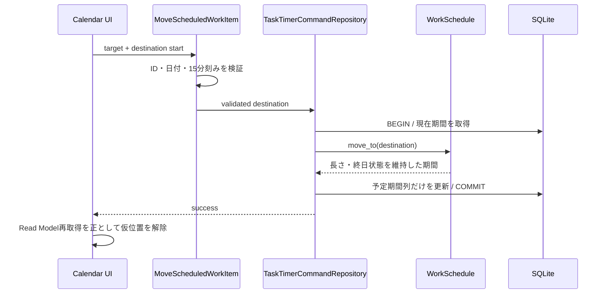

# 055 カレンダーの予定ブロック移動と期限調整操作を統合する

GitHub Issue: #139

## 背景

期限マーカーはドラッグ移動、予定期間は端のリサイズに対応しているが、予定ブロック全体を別日時へ移動できない。期限と予定期間は異なる値であるため、同じ見た目のD&Dでも更新対象を明示する必要がある。

## 要件

- 期限マーカー本体のドラッグで `due_date` / `due_time` を変更する既存操作を維持し、ドラッグ可能であることを見た目とカーソルで示す。
- 予定期間ブロック本体のドラッグで、長さを維持したまま開始/終了を別日時へ移動する。
- 予定期間ブロックの端では、既存どおり開始/終了だけをリサイズする。
- タスクとサブタスク、週/日/月表示で同じ意味規則を使う。
- ポインター操作に加え、キーボードで移動量を調整できる。

## 更新規則

- 期限マーカー移動は期限だけを更新し、予定期間と開始予定日は変更しない。
- 予定期間ブロック移動は予定期間だけを更新し、期限と通知ルールは変更しない。
- 週/日は15分、月表示と終日予定は1日を移動単位にする。
- 予定期間の長さと終日状態を維持する。
- UIの仮位置はPresentation状態とし、保存成功後のRead Modelを正とする。
- 日/週/月の本体D&D中は、移動先の開始日時から期間長を維持した予定全体を予測表示する。
- 開始端/終了端のドラッグ中は元ブロックを残し、変更後の期間を予測ブロックとして表示する。
- 予定本体の移動または期間端の調整を完了しても、タスク詳細を自動で開かない。
- 日/週表示では、日付をまたぐ予定を時刻の有無にかかわらずタイムゾーン表示と同じ上部予定行へ置く。開始・終了時刻は保存値を維持し、単日かつ時刻ありの予定だけを時間軸へ置く。
- 月表示では予定ブロック本体の日付移動と、開始端/終了端による日付範囲変更の両方を提供する。
- 月表示の複数日予定は同一週内を連続バーで表示し、週境界だけで表示を分割する。

### 入力単位と表示別の規則

| 表示/予定種別 | ポインター移動先 | キーボード |
| --- | --- | --- |
| 週/日・時刻あり | ドロップ位置を15分刻みに丸める | `ArrowUp` / `ArrowDown` で15分、`ArrowLeft` / `ArrowRight` で1日 |
| 週/日・終日 | 移動先の日付 | `ArrowLeft` / `ArrowRight` で1日 |
| 月・時刻あり | 移動先の日付。開始時刻は維持する | `ArrowLeft` / `ArrowRight` で1日 |
| 月・終日 | 移動先の日付 | `ArrowLeft` / `ArrowRight` で1日 |

予定ブロック本体だけを移動開始領域にする。開始端・終了端のボタンは既存のリサイズ操作を継続し、本体のドラッグ開始を伝播させない。

リサイズ中の予測ブロックはPresentation内だけで保持する。元ブロックと区別できる破線と「変更後」表示を使い、ポインターイベントを受け取らない。これにより予測表示が移動先セルの判定を妨げないようにする。

本体D&Dの予測も同じPresentation境界に置く。予測開始日時だけを入力として既存の期間維持計算を使い、元ブロックと「移動後」の期間全体を同時表示する。月表示と日/週表示の上部予定行では、同一週で重なる予定へ安定した表示レーンを割り当て、日ごとの並び替えで連続バーが上下にずれないようにする。

予定移動・リサイズのmutationは更新対象タスクIDを選択結果として返さず、保存と限定Read Model再取得だけを行う。詳細選択は予定ブロックの通常クリックだけに限定し、期間調整と詳細選択を別操作として扱う。

### Application契約

UIからは期間長や終了日時を送らず、対象と移動先だけを送る。

```text
MoveScheduledWorkItem(target, destinationStartDate, destinationStartTime)
```

- 時刻あり予定では移動先時刻を必須とし、15分刻みで検証する。
- 終日予定では移動先時刻を受け付けない。
- 月表示で時刻あり予定を移動する場合は、保存済みの開始時刻を移動先時刻として送る。
- 保存済み期間がない対象、削除済みまたはアーカイブ済み対象は更新しない。

## トランザクション境界

`MoveScheduledWorkItem` Use Caseを追加する。Use Caseは対象と移動先形式を検証し、Repositoryへ検証済み入力を渡す。Repositoryは同一トランザクション内で現在の予定期間を読み、Domainの移動計算で期間長と終日状態を維持して、タスクまたはサブタスクを更新する。UIから送られた期間長を信用しない。



期限、開始予定、通知ルールはこのトランザクションで読み書きしない。期限移動は既存の期限更新Use Caseを使う。

## 設計理由

予定期間の移動と期限変更を別のApplication操作にすることで、カレンダー操作が期限通知を意図せず移動する事故を防ぐ。

## トレードオフ

- 期限と予定期間が同じカード上に見える場合、操作対象の説明が必要になる。
- 月をまたぐブロック移動と重なり項目のヒット判定が複雑になる。

## 代替案

予定ブロック移動時に期限も同じ差分だけ移動する。

不採用理由: 作業予定と締切の意味が混ざり、期限通知がユーザーの明示操作なしに変更される。

## セキュリティと危険ケース

- ID、日付、時刻、移動量をApplication層で再検証する。
- タイトルをHTMLとして描画せず、ログへ出さない。
- 外部通信と新しい権限を追加しない。
- リサイズハンドル操作が本体移動として開始される。
- 表示範囲外へドロップして366日上限を超える。
- 保存失敗後に仮位置だけが残る。
- 予測ブロックがポインター判定を奪い、月表示の移動先日を取得できない。
- 月表示で重なる期間の並び順が日ごとに変わり、連続バーが別レーンへずれる。
- 週をまたぐ予定を1本のバーにして、月グリッド外へはみ出す。
- 予定移動・リサイズのmutationが汎用更新処理へタスクIDを返し、保存完了後に対象を暗黙選択して詳細を開く。
- 日をまたぐ時刻あり予定を時間軸へ日別描画し、各日の列を長いブロックで占有する。
- 上部予定行へ移した際に開始・終了時刻を終日扱いへ書き換える。
- UIが改ざんされ、保存済み期間と異なる終了日時や終日状態が送られる。
- 月末・年末をまたぐ期間の移動で終了日計算が破綻する。
- 時刻あり予定を月表示で移動したときに開始時刻が失われる。

## 受け入れ条件

- 期限と予定期間のどちらを変更する操作か判別できる。
- 予定期間を長さを保って移動できる。
- 端のリサイズと本体移動が競合しない。
- 保存失敗時はDB上の位置へ戻る。
- 期限通知は予定期間移動では変更されない。
- 週/日では15分、月/終日では1日単位でキーボード移動できる。
- 月表示で時刻あり予定を移動しても時刻と期間長を維持する。
- 週/日の時刻調整中に、15分単位の変更後時刻とブロック長を確認できる。
- 月表示の調整中に、変更後の開始日/終了日を確認して保存できる。
- 日/週/月の本体D&D中に、期間長を維持した移動後の開始/終了を確認できる。
- 予定移動または期間調整の完了後にタスク詳細が自動で開かない。
- 日/週表示の日をまたぐ予定がタイムゾーン表示と同じ上部予定行で連続し、時間軸を縦に占有しない。
- 日/週表示の単日かつ時刻あり予定は従来どおり時間軸に表示される。
- 月表示の複数日予定が同一週内で連続し、週境界では左右端が判別できる。

## テスト計画

- Domain: 時刻あり・終日、日/月/年またぎ、15分刻み、期間長と終日状態の維持。
- Application: 対象ID、日付、時刻形式の拒否と専用Repository commandの呼び出し。
- Infrastructure: タスク/サブタスク、予定なし、削除/アーカイブ、期限・通知ルール非変更、ロールバック。
- Presentation: 週/日/月の本体D&D、期間全体の移動予測、端リサイズとの競合防止、調整後の詳細非表示、時刻/日付の予測ブロック、月と日/週上部行の連続バーと重複レーン、単日時刻予定の時間軸表示、キーボード移動、保存中の仮位置、失敗時復元。
- Performance: 移動後にタスクページとカレンダーだけを再取得し、通知同期と全Snapshot再取得を行わない。

## 設計レビュー

- [2026-07-19 操作・タイマー改善設計レビュー](../review/2026-07-19-interaction-timer-improvements-review.md)
- [2026-07-19 カレンダー予定ブロック移動設計レビュー](../review/2026-07-19-calendar-block-move-review.md)

## 実装結果

- 期限移動と分離した `MoveScheduledWorkItem` を追加した。
- SQLite Repositoryが現在期間の取得、長さを維持したDomain計算、予定期間列の更新を1トランザクションで行う。
- 週/日の予定ブロック本体を15分刻みでD&Dでき、月/終日では日単位で移動できる。
- 時刻あり予定を月/終日領域へ移動しても開始時刻と期間長を維持する。
- 日/週/月の本体D&D中は元の期間を残し、期間長を維持した「移動後」の予定全体を表示する。
- 矢印キーでも同じ規則で移動できる。
- 端のドラッグ中は元ブロックを残し、破線の予測ブロックへ変更後の開始/終了を表示する。
- 月表示では本体のD&Dによる日付移動と、両端のD&Dによる開始日/終了日変更を保存できる。
- 月表示の複数日予定は週単位の固定レーンへ置き、同一週内を連続バー、週境界を分割バーで表示する。
- 日/週表示の日をまたぐ予定は、保存済み時刻を維持したままタイムゾーン表示と同じ上部予定行へ置き、表示範囲内を連続バーで表示する。
- 予定移動・リサイズのmutationから選択対象IDを返さず、期間調整後に詳細を自動表示しない。
- 保存後のRead Modelが届くまで対象1件の仮位置を保持し、旧位置のちらつきを防ぐ。
- 予定移動後はタスクページとカレンダーだけを再取得し、通知同期を実行しない。
