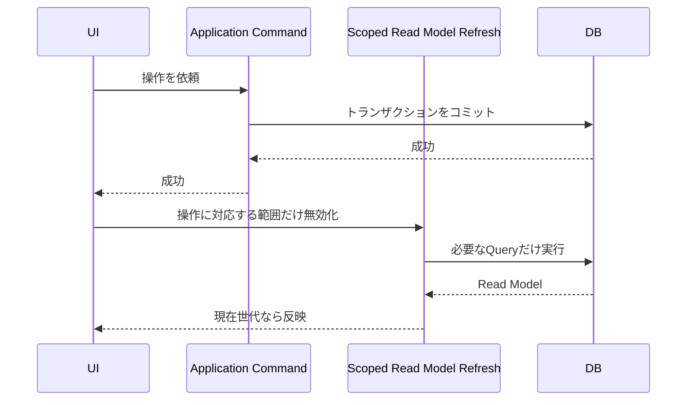

# 056 操作後の全画面再取得と再描画を表示範囲単位へ分割する

GitHub Issue: #140

## 背景

現在のPresentationは多くの更新後に `loadSnapshot` を呼び、タスク、リスト、かんばん、タグ、カレンダー、タイマー、ポモドーロ、通知設定をまとめて再取得している。配列とオブジェクトが毎回作り直されるため、関係しないペインまで再描画され、ちらつきと操作遅延の原因になる。

## 要件

- コマンド成功後の再取得を、タスク作業領域、かんばん、カレンダー、設定、実行中タイマー/通知の範囲へ分割する。
- 操作対象と無関係な左/中央/詳細ペインのDOMを再生成しない。
- 同じナビ項目の再選択では、表示条件が変わっていなければクエリを再実行しない。
- 保存中表示は対象行または対象セクションに限定し、アプリ全体のローディング表示へ戻さない。
- React Profilerまたは描画カウンターで主要操作の再描画範囲を検証する。

## アーキテクチャ方針

- Application Commandのトランザクション境界は変更しない。
- Presentationに用途別のRead Model更新関数を設け、コマンドごとに必要な範囲だけ無効化する。
- 1秒ごとのタイマー表示は局所的な時計状態に分離し、App全体のstateへ時刻を保存しない。
- `React.memo` とcallback安定化は、取得範囲を分割した後に測定結果がある箇所へ適用する。

### Read Modelの更新範囲

| 操作 | 即時更新する範囲 | 非表示時に遅延更新する範囲 |
| --- | --- | --- |
| タスク作成・完了・削除 | タスク作業領域、リスト件数、通知予定 | かんばん列件数、カレンダー |
| お気に入り変更 | タスク作業領域 | なし |
| タスク・サブタスク詳細保存 | タスク作業領域、リスト件数、通知予定 | カレンダー |
| タグの追加・編集・割り当て | タスク作業領域、タグ | なし |
| かんばん列の編集・タスク移動 | タスク作業領域、かんばん列 | なし |
| カレンダー上の移動・期間変更 | タスク作業領域、カレンダー、通知予定 | なし |
| 通常タイマー・ポモドーロ操作 | タスク作業領域、実行中タイマー | 通知予定（フェーズ完了時） |
| 通知・ポモドーロ設定 | 設定、必要な場合のみ通知予定 | なし |

- カレンダーと、タスク件数に依存するかんばん列は、非表示中の変更でdirtyにする。次に表示した時、現在の表示期間または列だけを再取得する。
- タスクページ、カレンダー、設定、実行中タイマー、通知には独立したリクエスト世代番号を持たせる。遅く完了した古い取得結果はstateへ反映しない。
- 初回起動と明示的な「再読み込み」だけは全範囲を同期する。画面遷移とコマンド成功後は用途別更新関数を使う。
- 保存中状態は `navigation`、`detail`、`board`、`calendar`、`settings` に分け、無関係な操作を無効化しない。

### Presentationの処理順

## 設計理由

メモ化だけでは、親が全データを新しい参照へ置き換える現状を隠せない。まず副作用とRead Modelの更新責務を分け、必要範囲を明示する。

## トレードオフ

- 更新関数が増え、どのコマンドがどのRead Modelを無効化するか管理が必要になる。
- 楽観更新は高速だが、DB保存失敗時のロールバック処理が増えるため、初期段階では範囲限定の再取得を優先する。

## 代替案

現行 `loadSnapshot` を維持して全コンポーネントを `React.memo` で囲む。

不採用理由: 全stateの参照が更新されるため効果が不安定で、不要なDBクエリと通知同期も残る。

## セキュリティと危険ケース

- 古いRead Modelが残り、完了状態、通知予定、単一アクティブタイマー表示がDBとずれる。
- 同時操作の完了順で新しい状態を古い取得結果が上書きする。
- 大量データで局所更新より全再取得が頻発する。
- 計測ログへタスク名やメモを出さず、件数とコンポーネント名だけを使う。
- 外部計測SDKと外部通信を追加しない。
- dirtyな非表示ビューを開く前にアプリが終了しても、正はSQLiteにあるため次回起動時の初回同期で復元する。
- 一部のRead Model再取得だけが失敗した場合は成功済みコマンドを巻き戻さず、既存表示を保持して再読み込み導線を表示する。

## 受け入れ条件

- 完了、お気に入り、詳細保存、かんばん移動で無関係なビューのクエリを実行しない。
- 同一ナビ再選択で再取得とちらつきが発生しない。
- タイマーの秒更新でApp Shell全体を再描画しない。
- 失敗時にDB状態へ復元できる。
- 大量データ計測に操作後の更新時間を追加する。

## 設計レビュー

- [2026-07-19 操作・タイマー改善設計レビュー](../review/2026-07-19-interaction-timer-improvements-review.md)
- [2026-07-19 表示範囲単位のRead Model更新 実装レビュー](../review/2026-07-19-scoped-ui-refresh-review.md)
