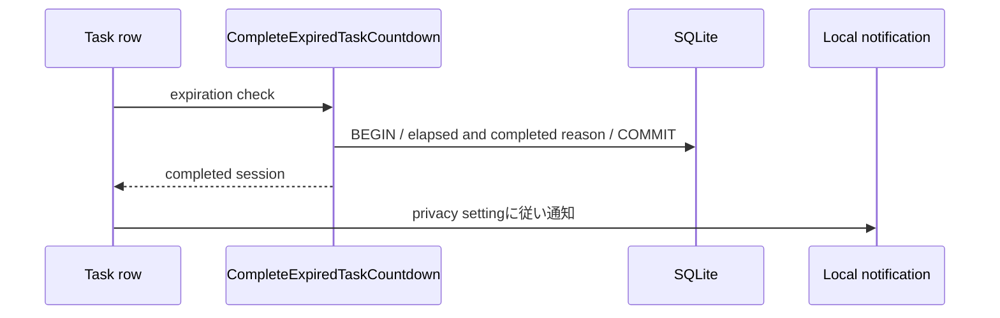

# 058 タスク行へカウントダウンタイマーと完了通知を追加する

GitHub Issue: #142

## 背景

通常タイマーは詳細画面から開始し、経過時間を計測するストップウォッチ型である。タスク一覧から開始し、設定した作業時間の残りを確認し、0秒で通知を受けられるカウントダウン型へ拡張する。

## 要件

- タスクとサブタスクの行に再生ボタンを表示する。
- 実行中の対象行に残り時間、一時停止/再開、終了操作を表示する。
- 0秒到達時にタイマーを完了し、通知全体設定と通知表示タイプに従ってOS通知する。
- 対象ごとの時間は詳細画面でプリセットまたは手入力できる。
- 未設定時の既定値は30分とし、設定画面で変更できる。
- アプリ再起動、OSスリープ/復帰後も残り時間と完了判定が一致する。
- 通常タイマーと独立ポモドーロを合わせた単一アクティブ制約を維持する。

## データモデル方針

- 既存 `tasks.timer_target_seconds` / `subtasks.timer_target_seconds` を対象固有値として使う。
- singletonの `task_timer_settings.default_target_seconds` を追加し、初期値を1,800秒とする。60秒以上86,400秒以下を許可する。
- 対象固有値がnullの場合は開始時点の既定値を使う。
- 開始後の設定変更で終了予定が変わらないよう、`timer_sessions.target_seconds` に開始時の有効値を保存する。
- 自動完了と通知の重複を防ぐ完了理由/通知済み時刻をタイマーセッションへ保存する。

## トランザクション境界

`StartTaskCountdown` が対象、単一アクティブ制約、有効秒数を検証し、開始時スナップショットを1トランザクションで作成する。`CompleteExpiredTaskCountdown` は期限到達を再検証してセッションを完了し、DBコミット後に通知する。

## 設計理由

対象の目標時間とセッション開始時の確定時間を分けることで、既定値変更や詳細編集が実行中カウントを途中で変えない。通知はDBコミット後の副作用として扱う。

## トレードオフ

- ストップウォッチ型より自動完了、スリープ復帰、通知冪等性の状態が増える。
- 1秒表示を全行へ配ると再描画が増えるため、アクティブ行だけが時計更新を購読する必要がある。

## 代替案

Reactの `setTimeout` だけで0秒を検知し、DBスキーマを変更しない。

不採用理由: 再起動、スリープ、設定変更、通知再送で終了時刻と通知済み状態を復元できない。

## セキュリティと危険ケース

- 秒数をApplication層とDB制約で検証する。
- 通知本文は既存プライバシー設定に従い、タイトル/メモをログへ出さない。
- 外部通信を追加しない。
- 0秒到達と手動終了が競合して二重完了する。
- 一時停止中に終了予定時刻へ到達する。
- スリープ中に0秒を過ぎ、復帰時に通知が重複する。
- タスク削除と自動完了が競合する。

## 受け入れ条件

- 一覧の再生ボタンからタスク/サブタスクのカウントダウンを開始できる。
- 未設定対象は開始時点の既定時間を使い、実行中の既定値変更では残り時間が変わらない。
- 0秒到達を再起動/復帰後にも一度だけ完了・通知できる。
- 通知OFFではOS通知を送らない。
- 1秒更新でApp Shell全体を再描画しない。
- Domain/Application/Infrastructure/Presentationの境界テストが追加される。

## 設計レビュー

- [2026-07-19 操作・タイマー改善設計レビュー](../review/2026-07-19-interaction-timer-improvements-review.md)
