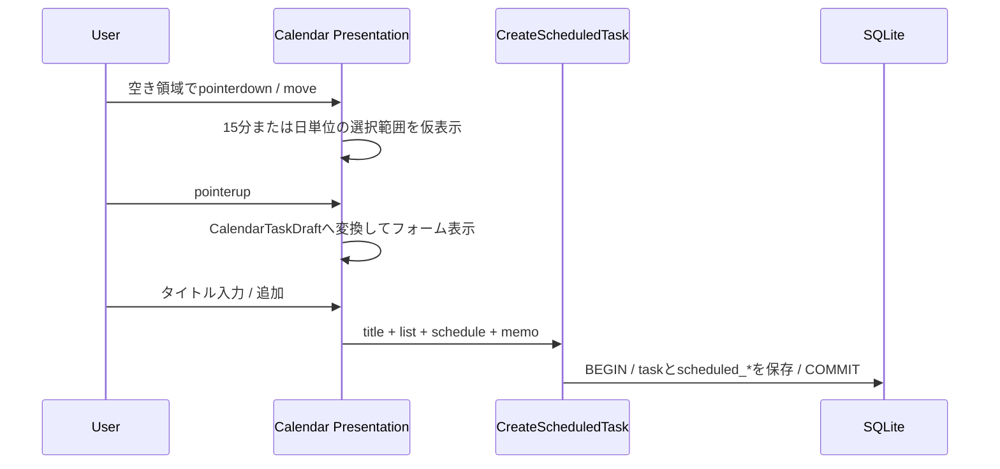

# 059 カレンダーのドラッグ範囲から予定付きタスクを作成する

GitHub Issue: #146

## 背景

現在は空きセルのダブルクリックまたは `Enter` で作成フォームを開き、時間帯では1時間、月表示と上部予定行では1日の終日予定を初期値にしている。
Googleカレンダー型の操作として、空き領域をドラッグした範囲を予定開始・終了へ反映し、日時の再入力を減らす。

## 要件

- 日/週表示の空き時間軸を縦にドラッグし、15分単位の開始・終了を選択する。
- 月表示と日/週の上部予定行では、日付を横方向にドラッグして終日期間を選択する。
- ドラッグ中は開始・終了と選択範囲を表示する。
- ポインター解放時は即時保存せず、既存のカレンダー作成フォームを選択範囲で初期化する。
- 既存のダブルクリック、`Enter`、`Esc`、キャンセル操作を維持する。
- 予定ブロック、期限マーカー、リサイズハンドル、残件数表示からは新規範囲選択を開始しない。
- 6px未満のポインター移動では範囲作成を確定しない。
- 作成後にタスク詳細を自動で開かない。

## 状態とトランザクション境界

範囲選択はPresentationの一時状態として保持する。ポインター解放後は既存の `CalendarTaskDraft` へ変換し、ユーザーがフォームを確定した場合だけ `CreateScheduledTask` を呼ぶ。
タスク本体と予定期間は既存どおり1トランザクションで保存する。

ポインター選択中、フォーム表示中、キャンセル時にはDB更新を行わない。

## 入力規則

| 表示領域 | 選択単位 | 作成フォーム初期値 |
| --- | --- | --- |
| 日/週の時間軸 | 15分 | 同日の開始時刻と終了時刻 |
| 日/週の上部予定行 | 1日 | 選択した包含日付範囲の終日予定 |
| 月表示 | 1日 | 選択した包含日付範囲の終日予定 |

- 時間軸の最小期間は15分とする。
- 上方向や左方向へドラッグしても、保存値は開始が終了より前になるよう正規化する。
- 時間軸選択は開始した日列内に限定し、横方向の日付変更は行わない。
- 予定期間の最大366日は既存Application/Domain検証でも再確認する。

## 設計理由

- 範囲選択をPresentationへ閉じることで、未確定操作をDomainやDBへ持ち込まない。
- 既存作成フォームを経由することで、タイトル、所属リスト、メモの確認と入力検証を維持する。
- Pointer Captureを使うことで、時間行や日付セルをまたいでも選択を継続する。
- 本体移動、端リサイズ、新規範囲選択を開始要素で分離し、同じポインター操作が別Use Caseへ誤配送されるのを防ぐ。

## トレードオフ

- 時間軸のドラッグを同日内に限定するため、日をまたぐ時刻あり予定はフォームで終了日を調整する必要がある。
- 6pxのしきい値により誤作成を減らせる一方、非常に短いドラッグは確定しない。
- ネイティブHTML D&Dとは別にPointer Eventsを扱うため、イベント伝播とPointer Capture解除の回帰確認が必要になる。

## 代替案

空きセルのシングルクリックだけで作成フォームを開き、フォーム内で期間を入力する。

不採用理由:

- 現在のダブルクリックより操作数は減るが、視覚的に選んだ期間をそのまま入力へ使えない。
- 既存予定選択とのクリック境界が近くなり、誤操作を増やす。

## セキュリティと危険ケース

- ポインター座標から組み立てた日付・時刻を信頼せず、既存Use Caseで形式、順序、上限を再検証する。
- タイトルとメモをHTMLとして描画せず、ログへ出さない。
- 外部通信、新しいTauri権限、DBスキーマ変更を追加しない。
- 予定ブロック上のpointerdownが新規作成として開始される。
- Pointer Captureが解除されず、その後のクリックやD&Dが反応しなくなる。
- 選択中に表示モードや画面を切り替え、古い選択範囲が残る。
- 上方向、左方向のドラッグで開始・終了が逆転する。
- 月末・年末、表示月外の日付をまたぐ選択で日付計算が破綻する。
- 選択プレビューが既存予定のD&D・リサイズ判定を遮る。

## 受け入れ条件

- 日/週で選択した15分単位の範囲が作成フォームへ反映される。
- 月表示と上部予定行で選択した日付範囲が終日予定として反映される。
- ドラッグ中に開始・終了と選択範囲を確認できる。
- 既存予定のD&D、期限移動、端リサイズと競合しない。
- 6px未満の移動とキャンセルではDB更新が発生しない。
- 作成失敗時にフォーム入力を保持する。
- 既存のダブルクリックと `Enter` による作成を維持する。

## テスト計画

- Presentation: 下方向・上方向の15分範囲、最小15分、行境界、営業時間端。
- Presentation: 上部予定行と月表示の左右方向、週/月/年境界。
- Presentation: 6pxしきい値、pointer cancel、表示切替時の解除。
- Presentation: 既存予定本体、期限マーカー、リサイズハンドルから開始しない。
- Presentation: pointerupでフォームを開き、保存前はTauri commandを呼ばない。
- 回帰: ダブルクリック、`Enter`、予定移動、期間リサイズ、詳細非表示。

## 依存

- [055 カレンダーの予定ブロック移動と期限調整操作を統合する](055-calendar-block-move-and-due-edit.md) / GitHub #139 / PR #145

## 実装結果

- 日/週の時間軸で15分単位の縦ドラッグ選択を追加した。
- 日/週の上部予定行と月表示で、左右どちらからでも複数日を選択できるようにした。
- 選択中は範囲と開始・終了を仮表示し、解放後は既存の作成フォームへ初期値を渡す。
- 6px未満の移動、キャンセル、フォーム表示前にはTauri commandを呼ばない。
- 既存の予定移動、端リサイズ、ダブルクリック、日/週/月切替の回帰を自動確認した。
- 設計レビューは [2026-07-19 カレンダードラッグ範囲作成](../review/2026-07-19-calendar-drag-range-create-review.md) に記録した。
