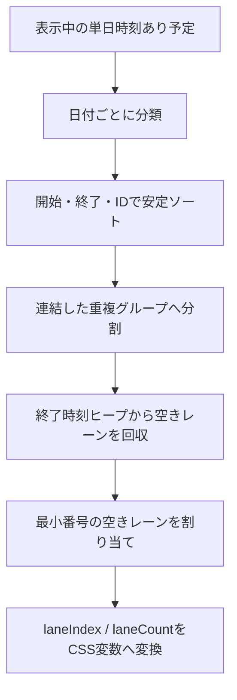

# 060 カレンダーの重複予定を横並び表示する

GitHub Issue: #147

## 背景

日/週カレンダーの時刻あり予定は、開始時刻の時間セル内で同じ横幅へ絶対配置している。そのため時間帯が重なると後から描画された予定が前面を覆い、タイトルの確認、選択、ドラッグ、期間端の調整が難しい。

## 要件

- 単日かつ時刻ありの予定を、同じ日付内の時間区間として扱う。
- 時間区間が重なる予定は横方向のレーンへ分割する。
- 重複しない予定は日列の全幅を使う。
- 完全に同じ開始・終了でも安定したレーン順を維持する。
- タスクとサブタスクへ同じ規則を適用する。
- 移動・期間調整の予測予定もレーン計算へ含める。
- 選択、詳細表示、本体D&D、キーボード移動、期間端リサイズを維持する。
- DBスキーマ、Domain、Application、Repository、Tauri commandは変更しない。

## 区間規則

予定は半開区間 `[開始, 終了)` として扱う。

- `09:00-10:00` と `09:30-10:30` は重複する。
- `09:00-10:00` と `10:00-10:30` は重複しない。
- 営業時間の表示範囲外は、既存の時間セグメント計算で `08:00-23:00` へ切り詰める。
- 終了が開始以下になる表示対象外区間にはレーンを割り当てない。

## レーン割り当て

日付ごとに対象予定を開始時刻、終了時刻の降順、IDの順で安定ソートする。連結した重複グループへ分割し、グループ内で終了済みレーンの最小番号を再利用する。

アクティブ区間と空きレーンを最小ヒープで管理し、日付ごとの予定数を `n` とした計算量を `O(n log n)`、追加メモリを `O(n)` とする。ポインター操作中もDBアクセスは行わない。

## 表示規則

- `laneCount = 1` は従来どおり全幅表示する。
- 重複時はレーン間に2pxの間隔を設ける。
- タイトルと時刻はカード内で省略し、完全な内容は既存のアクセシブル名と詳細表示から確認できる。
- 選択、フォーカス、リサイズハンドル、移動・変更予測は前面へ表示する。
- 週表示の狭い日列でもカードを日列外へはみ出させない。

## 状態と副作用

レーン割り当ては `items` から `useMemo` で導出するPresentation状態とする。予定データの正は既存Read Modelのままで、レーン番号を保存しない。

移動または期間調整中は既存の予測予定を含めて再計算し、確定時だけ既存Application Use Caseを呼ぶ。トランザクション境界と通知副作用は変更しない。

## 設計理由

- レーンは表示幅に依存する派生値であり、DomainやDBへ保存する業務データではない。
- 日付単位で先に計算することで、15時間 x 7日 x 全予定のセル単位総当たりを増やさない。
- 半開区間により、終了と開始が同時刻の予定を不要に細くしない。
- 最小番号の空きレーンを再利用し、同じ入力に対して同じ横位置を得る。

## トレードオフ

- 同時刻に非常に多くの予定がある場合、各カードの文字表示領域は小さくなる。日列外へあふれさせるより、カードを選択できることと完全なアクセシブル名を維持する。
- Googleカレンダーのような右方向へのレーン拡張は初回範囲外とする。まず全予定を遮らず選択できる単純な等幅レーンを優先する。

## 代替案

重複予定を時間軸の下に縦積みし、時間位置をずらして表示する。

不採用理由:

- 実際の開始時刻と画面上の位置が一致しなくなる。
- D&Dと期間端リサイズの座標変換が複雑になる。

## セキュリティと権限境界

- タイトル、メモ、親タスク名をHTMLとして描画せず、ログへ出さない。
- DOMへ付与するのはレーン番号とレーン数だけとし、メモなどの内容をdata属性へ複製しない。
- 外部通信、新しいTauri capability、OS権限を追加しない。
- 座標変更の保存値は既存Application/Domainで再検証する。

## 危険ケース

- 完全に同じ開始・終了の予定が同じレーンへ割り当てられる。
- 終了時刻と次の開始時刻が同じ予定を誤って重複扱いする。
- 長い予定を介した連鎖的な重複で、グループ途中から横幅が変わる。
- 予測予定の追加で元予定が隠れ、変更前後を比較できない。
- サブタスクだけ異なる計算経路になり、親タスクと重なる。
- レーン幅が狭いとリサイズハンドルが隣の予定を覆う。
- レイアウト計算が描画ごとに不安定になり、予定が左右へちらつく。

## 受け入れ条件

- 完全重複、部分重複、連鎖重複を横並びで確認・選択できる。
- 終了と開始が同時刻の予定は全幅または再利用可能なレーンへ配置される。
- 非重複予定は全幅表示を維持する。
- 同じ入力でレーン順が変化しない。
- タスクとサブタスクへ同じ規則を適用する。
- D&D、キーボード移動、期間端リサイズ、作成範囲選択が回帰しない。
- 標準大量データプロファイルで警告を発生させない。

## テスト計画

- 同じ開始・終了の2件が異なる安定レーンになることを確認する。
- 長い予定と短い予定の部分重複で最大同時数のレーンになることを確認する。
- 終了と開始が同時刻の予定が同一レーンを再利用できることを確認する。
- 非重複予定が全幅になることを確認する。
- 重複グループにサブタスクを含め、選択・フォーカス可能であることを確認する。
- 移動・変更予測、D&D、キーボード移動、リサイズの既存UI回帰を継続する。
- TypeScript、Rust、プライバシー監査、スモーク/標準UI性能を確認する。

## 依存

- [055 カレンダーの予定ブロック移動と期限調整操作を統合する](055-calendar-block-move-and-due-edit.md) / GitHub #139 / PR #145

## 実装結果

- 日付ごとの安定ソートと2つの最小ヒープで、重複グループの `laneIndex` と `laneCount` を導出した。
- 単日時刻あり予定を日列全体の透明オーバーレイへ配置し、複数時間カードの後半も次の時間セルに遮られないようにした。
- タスク、サブタスク、移動予測、期間変更予測へ同じレーン計算を適用した。
- 半開区間により境界時刻が一致する予定はレーンを再利用し、非重複グループは全幅表示を維持した。
- 現在時刻線を表示専用のヒット領域へ変更し、その下の予定を操作可能にした。
- 設計レビューは [2026-07-19 カレンダー重複予定レイアウト](../review/2026-07-19-calendar-overlap-layout-review.md) に記録した。
