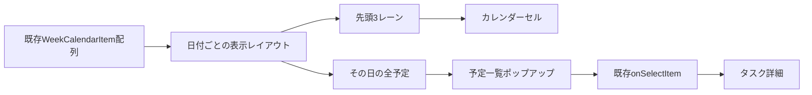

# 061 カレンダーの省略予定を一覧表示する

GitHub Issue: #148

## 背景

月カレンダーと日/週カレンダー上部は、1日あたり3レーンまで予定を表示し、残りを「他 N 件」として省略している。現在の件数表示は操作できないため、省略された予定を確認したり、通常のタスク詳細へ移動したりできない。

## 要件

- 「他 N 件」をボタンにし、その日付の表示対象予定を一覧ポップアップで開く。
- 一覧には画面上で見えている予定と省略された予定の両方を、既存の表示順で含める。
- 各行に色、タイトル、予定時刻またはマーカー、サブタスクの場合は親タスク名を表示する。
- 行を選ぶと既存のタスク詳細を開き、ポップアップを閉じる。
- 閉じるボタン、`Escape`、ポップアップ外クリックで閉じられる。
- `Tab` で操作でき、開いた直後に先頭予定へフォーカスし、通常の閉じ方では起点ボタンへフォーカスを戻す。
- 件数と日付をスクリーンリーダーへ伝える。
- ポップアップ内ではD&D、期間端リサイズ、予定作成を開始しない。
- DB、Domain、Application、Repository、Tauri commandは変更しない。

## 表示対象と順序

月表示は、その日に有効な予定期間と、その日付を持つ開始予定・期限・実行中マーカーを対象にする。日/週表示上部は、終日・複数日予定と時刻を持たないマーカーだけを対象にする。

予定期間は既存の週内レーン順、その他のマーカーは既存のマーカー優先度、時刻、タイトル順を維持する。同じタスクに複数マーカーが存在しても統合せず、マーカーの意味が分かる別行として表示する。

## 状態と副作用

ポップアップ状態は日付、表示範囲種別、起点要素、中央ペイン内の表示位置だけを保持する。予定内容は開いている間も現在の `WeekCalendarItem[]` から導出し、DBへ保存しない。予定選択以外ではApplication Use Caseを呼ばない。

## 配置

- ポップアップは `.calendar-panel` 内へ絶対配置し、中央ペインの上下左右12px以内へ収める。
- 起点の下側を優先し、必要な高さがない場合は上側へ開く。
- 幅は最大360px、高さは最大420pxとし、予定が多い場合は一覧だけをスクロールする。
- 月末セルや右端列でも中央ペイン外へはみ出させない。
- 表示切替、期間移動、作成フォーム開始、カレンダー本体のスクロール時は閉じる。

## 設計理由

- 省略は表示密度の都合であり、予定データやRepositoryの責務ではないためPresentation内で解決する。
- 既存の日付レイアウトへ全予定を併記し、セル表示とポップアップで並び順が分岐しないようにする。
- ネイティブブラウザの別ウィンドウや外部ライブラリを使わず、Tauri/WebView内で同じ操作境界を維持する。
- ポップアップを中央ペイン内へ制約し、アプリ全体のスクロールや右詳細ペインとの重なりを避ける。

## トレードオフ

- ポップアップは非モーダルなため、`Tab` でカレンダー外の操作へ移動できる。予定確認中も表示切替を阻害しないことを優先し、外側操作時は閉じる。
- 予定が数百件ある日はDOM行数が増える。カレンダー本体の3レーン制限は維持し、一覧だけをスクロール可能にする。仮想化は実測で問題が出た場合の別課題とする。

## 代替案

セルの高さを広げ、すべての予定をカレンダー本体へ直接表示する。

不採用理由:

- 月表示の行高と日/週表示上部が日ごとの件数で変動し、時間軸や他の日付との比較が崩れる。
- 大量予定時に中央ペイン全体のスクロールと再レイアウトが増える。

## セキュリティと権限境界

- タイトルと親タスク名はReactのテキストとして描画し、HTMLとして挿入しない。
- タイトル、メモ、親タスク名をログやdata属性へ複製しない。
- 外部通信、新しいTauri capability、OS権限を追加しない。
- ポップアップは既存Read Modelの表示だけを行い、日時更新や削除を直接実行しない。

## 危険ケース

- 月表示の右端・下端でポップアップが中央ペイン外へ切れる。
- 予定が数百件あり、一覧がアプリ全体の高さを押し広げる。
- ポップアップを開いたまま期間や表示モードを変え、古い予定を選択できてしまう。
- 開いている日に予定が追加・削除され、件数と行が一致しない。
- 同じ対象の異なるマーカーがID衝突で1行に統合される。
- 閉じた後にフォーカスが失われ、キーボード操作を継続できない。
- ポップアップ内のドラッグがカレンダーの範囲作成として扱われる。

## 受け入れ条件

- 月・日・週表示の「他 N 件」から当日の全表示対象を確認できる。
- 省略予定を選択すると通常のタスク詳細が開く。
- 日付、件数、タイトル、マーカー、色、親タスクが判別できる。
- `Tab`、`Escape`、閉じるボタン、外側クリックを使用でき、通常の閉じ方で起点へフォーカスが戻る。
- 右端・下端や狭い中央ペインでもポップアップが見切れない。
- ポップアップ操作でD&D、期間調整、予定作成、Tauri commandが発生しない。
- カレンダー本体の3レーン制限と既存の表示順を維持する。

## テスト計画

- 月表示と日/週表示上部で「他 N 件」を開き、表示件数と行内容を確認する。
- サブタスク、複数マーカー、複数日予定を含む並びを確認する。
- 予定選択、`Escape`、閉じるボタン、外側クリック、フォーカス復帰を確認する。
- 右端セルで中央ペイン内に収まること、数百件で一覧内スクロールになることを確認する。
- ポップアップ操作中のTauri command 0件とカレンダーD&D回帰を確認する。
- TypeScript、Rust、プライバシー監査、スモーク/標準UI性能を確認する。

## 依存

- [059 カレンダーのドラッグ範囲から予定付きタスクを作成する](059-calendar-drag-range-create.md) / GitHub #146 / PR #149
- [060 カレンダーの重複予定を横並び表示する](060-calendar-overlap-layout.md) / GitHub #147 / PR #150

## 実装結果

- 月表示と日/週の上部予定行で「他 N 件」を共通ボタンへ変更し、当日の全表示対象を一覧表示できるようにした。
- 色、タイトル、予定時刻またはマーカー、親タスク名を表示し、予定選択から既存詳細を開くようにした。
- 中央ペイン内への上下左右制約、最大高420pxの内部スクロール、ウィンドウ変更時の再配置を追加した。
- `Escape`、閉じるボタン、外側クリック、起点へのフォーカス復帰を追加し、カレンダー範囲作成へのイベント伝播を止めた。
- 予定更新で省略状態が解消された場合や起点が削除された場合は、古い一覧を自動で閉じるようにした。
- 設計レビューは [2026-07-19 カレンダー省略予定一覧ポップアップ](../review/2026-07-19-calendar-overflow-popover-review.md) に記録した。
