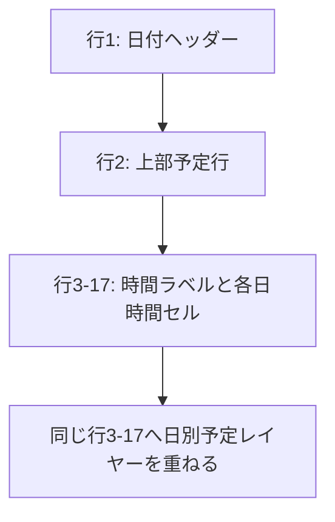

# 062 カレンダーの時間グリッド表示回帰を修正する

GitHub Issue: #152

## 背景

日・週表示で時間指定予定を日列全体の前面レイヤーへ配置した後、時間ラベルだけが表示され、日列側の水平線と垂直線が消える回帰が発生した。予定レイヤーはCSS Gridの3行目以降を占有しており、自動配置の時間セルが予定レイヤーを避けて後続行へ押し出されている。

## 要件

- 日・週表示で8:00から22:00までの時間セルを時間ラベルと同じ行へ表示する。
- 各日列の垂直線と各時間行の水平線を表示する。
- 前面予定レイヤーを時間セルと同じGrid領域へ重ねる。
- 重複予定の横レーン、選択、D&D、キーボード移動、期間端リサイズ、範囲作成を維持する。
- 月表示、Read Model、DB、Domain、Application、Repository、Tauri commandは変更しない。

## Grid配置

- 時間ラベルは `grid-column: 1`、`grid-row: hourIndex + 3` とする。
- 日付ごとの時間セルは `grid-column: dayIndex + 2`、同じ `grid-row` とする。
- 日別予定レイヤーは既存どおり対象日列で行3から15行分を占有する。
- セルと予定レイヤーは意図的に同じGrid領域を使い、`z-index` と `pointer-events` で表示・操作責務を分ける。

## 設計理由

- 回帰原因はCSS Gridの自動配置と明示配置の競合であり、予定データやレーン計算ではない。
- 全時間セルへ座標を明示すると、DOM順や前面レイヤーの追加順に依存せず、ラベル・セル・予定を同じ時間位置へ固定できる。
- 既存のセルを絶対配置へ作り直さず、スクロール、フォーカス、D&DのGrid構造を維持する。

## トレードオフ

- 行番号を日付ヘッダー2行の構造と対応させる必要がある。開始行を定数化するほどの再利用箇所はないため、今回は時間行の計算を1か所へ限定し、自動検証で構造変更を検出する。
- インラインstyleへGrid座標を持たせるが、ユーザー入力は含まず、表示データとして保存しない。

## 代替案

予定レイヤーをCSS Grid外の絶対配置コンテナへ移す。

不採用理由:

- 日列幅、横スクロール、日/週切替の座標同期を別計算する必要がある。
- 現在のGrid列と同じ領域へ重ねる方が変更範囲が小さく、既存の予定位置計算を維持できる。

## セキュリティと権限境界

- 追加するstyle値は固定の行・列番号だけで、タイトルやメモなどのユーザー入力を含めない。
- 外部通信、ログ、HTML挿入、新しいTauri capability、OS権限を追加しない。
- DBや更新Use Caseを呼ばないPresentationレイアウト修正とする。

## 危険ケース

- 週表示だけ直り、日表示では時間セルが後続行へ残る。
- ラベルとセルの行番号が1行ずれ、予定の表示時刻と罫線が一致しない。
- 予定レイヤーがセルより背面になり、予定を選択できない。
- セルが予定レイヤーより前面になり、予定のD&Dや期間端操作を奪う。
- 水平線は戻るが、日列の垂直線が表示されない。
- ヘッダー行数を将来変更した際に時間行の開始位置だけが古いまま残る。

## 受け入れ条件

- 日・週表示で全時間ラベルと時間セルの上端が一致する。
- 週表示は15時間 x 7日、日表示は15時間 x 1日のセルを正しいGrid行列へ配置する。
- 時間セルの下罫線と左罫線が表示される。
- 時間指定予定は対応する日列・時刻位置で選択できる。
- 重複レーン、D&D、キーボード移動、期間端リサイズ、範囲作成が回帰しない。

## テスト計画

- 週表示で各時間ラベルと7日分のセルの `grid-row`、上端、罫線を確認する。
- 日表示で各時間ラベルと1日分のセルの `grid-row`、上端、罫線を確認する。
- 前面予定レイヤーが8:00セルから15時間分へ重なることを確認する。
- 既存の重複レーン、予定移動、期間調整、範囲作成をスモーク/標準UI性能検証で確認する。
- TypeScript、Rust、プライバシー監査を確認する。

## 依存

- [060 カレンダーの重複予定を横並び表示する](060-calendar-overlap-layout.md) / GitHub #147 / PR #151

## 実装結果

- 8:00から22:00までの時間ラベルへ1列目とGrid行3-17を明示した。
- 週7列・日1列の各時間セルへ対応する日列と同じGrid行を明示し、前面予定レイヤーと重ねた。
- 日・週表示でセル数、行・列番号、ラベルとの上端一致、水平・垂直罫線、予定レイヤー範囲を自動検証するようにした。
- 既存の重複レーン、D&D、期間端リサイズ、範囲作成、予定一覧ポップアップをスモーク/標準プロファイルで回帰確認した。
- 設計レビューは [2026-07-19 カレンダー時間グリッド表示回帰](../review/2026-07-19-calendar-time-grid-regression-review.md) に記録した。
