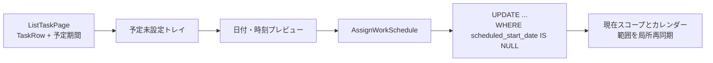

# 071 日時未設定タスクをカレンダー／タイムラインへD&Dして予定化する

GitHub Issue: #181

## 背景

既存タスクへカレンダー予定期間を設定するには、詳細画面または予定作成時の入力が必要である。カレンダーとタイムラインで日時未設定タスクを見つけ、そのまま表示軸へ配置できるようにする。

## 用語と対象

- `予定期間` は `scheduled_start_date/time`、`scheduled_end_date/time`、`scheduled_is_all_day` を指す。
- `予定未設定` は `scheduled_start_date IS NULL` と定義する。
- 開始予定 `planned_start_date`、期限 `due_date/time`、通知ルールは予定期間と独立しており、本IssueのD&Dでは変更しない。
- 初回対象は親タスクとし、サブタスクは対象外とする。
- 完了タスクも予定未設定トレイへ表示するが、完了状態は変更しない。

## UI仕様

### 共通

- カレンダーとタイムラインに、選択中スコープのページング済み `TaskRow` から作る展開可能な `予定未設定` トレイを表示する。
- トレイ内のタスクはPointer D&Dできる。クリックは従来どおり詳細表示に使う。
- D&D中はドロップ先の日付または日時と、作成される期間のプレビューを表示する。
- ドロップ成功後に詳細ペインを自動で開かない。
- Pointer操作の代替として、タスクの予定設定ボタンから日付・時刻入力へ到達できる。
- 予定設定中または保存中のタスクは二重送信できない。

### カレンダー

- 日／週の時刻グリッドへドロップすると、15分単位へスナップした開始時刻と1時間後の終了時刻を持つ予定を作成する。
- 日／週の終日領域と月表示の日付セルへドロップすると、1日終日予定を作成する。
- 既存予定の移動、期間変更、期限調整のD&Dを維持する。

### タイムライン

- 日／週／月の各列へドロップすると、Pointer位置を列内の日付へ射影し、1日終日予定を作成する。
- 予定期間があるタスクは予定期間を期間バーの正として表示する。
- 予定期間がない既存タスクは、移行互換のため開始予定から期限までの従来バーを表示できる。ただし同じタスクを `予定未設定` トレイにも表示し、予定期間を設定できるようにする。
- 予定期間を設定した後は互換バーを予定期間バーへ置き換える。

## Applicationとトランザクション境界

Application Use Case `AssignWorkSchedule` を追加する。

1. 対象ID、対象種別、日付、時刻、終日整合性を検証する。
2. Infrastructureは有効な親タスクが存在し、`scheduled_start_date IS NULL` の場合だけ予定期間を更新する。
3. 更新件数が0件の場合、対象不存在、削除済み、アーカイブ済み、既設定を区別できる利用者向けエラーへ変換する。
4. 1回のSQLiteトランザクションで全予定列と `updated_at` を保存する。
5. 開始予定、期限、通知ルール、タイマー、かんばん状態は更新しない。



## Read Model

`TaskRecord`、`TaskRowRecord` と対応DTOへ次の構造を追加する。

```text
schedule: null | {
  startDate: YYYY-MM-DD
  startTime: HH:mm | null
  endDate: YYYY-MM-DD
  endTime: HH:mm | null
  isAllDay: boolean
}
```

未設定は5項目の部分的なnullではなく `schedule = null` としてPresentationへ渡す。DBに不完全な予定データが存在する場合はRepository読み取りでエラーにし、Presentationへ不正状態を拡散しない。

## 設計理由

- 初回割り当てを既存 `ResizeScheduledWorkItem` と分けると、二重ドロップや古い画面からの操作で既存予定を上書きしない。
- 構造化した予定DTOは、終日と時刻付き予定の不変条件をPresentationでも扱いやすくする。
- 既存 `ListTaskPage` を使うと、リスト、今日、お気に入り、かんばんのスコープとページング条件を重複実装しない。
- タイムラインの従来バーを即時廃止しないことで、開始予定・期限だけを入力済みの既存利用者が期間表示を失わない。

## トレードオフ

- ページ外の予定未設定タスクは追加読み込みまでトレイへ表示されない。
- タイムラインでは互換バーと予定未設定トレイに同じタスクが現れる場合がある。意味の異なる日付を失わず段階移行することを優先する。
- 初回は1件ずつ予定化し、複数選択や一括配置は扱わない。

## 代替案

既存 `ResizeScheduledWorkItem` をそのまま使う案。

不採用理由: 既設定を許可する更新境界であり、古いRead Modelからの二重ドロップが既存予定を上書きできる。

開始予定と期限をD&Dで更新する案。

不採用理由: カレンダー配置と業務上の開始予定・期限通知が結合し、期間移動だけで通知時刻まで変わる。

## 破綻シナリオ

- 2つの画面から同じタスクを同時に予定化し、後勝ちで先の予定を消す。
- ドロップ先の日付計算が表示範囲外になり、極端な日付を保存する。
- 終日予定へ時刻が残る、または時刻付き予定の終了が開始以前になる。
- D&D保存後に画面全体を再取得し、スクロール位置やドラッグ元がちらつく。
- 既存予定移動のdrag dataと予定未設定タスクのdrag dataを誤判定する。

## スケール、セキュリティ、権限

- 既存の1ページ最大200件と追加読み込みを維持し、全件DOMを一度に作らない。
- 日付範囲と時刻はApplicationの既存検証を再利用する。
- タスク名はReactのテキストとして描画し、HTMLへ変換しない。
- タスク名、メモ、通知本文をログへ出さない。
- 外部通信、ファイルアクセス、OS権限、Tauri capabilityを追加しない。

## 受け入れ条件

- 予定未設定タスクを日／週／月のカレンダーとタイムラインへD&Dして予定化できる。
- 時刻グリッドでは1時間、終日／月／タイムラインでは1日終日予定になる。
- 予定設定後も開始予定、期限、通知、状態、完了状態が変わらない。
- 競合または二重ドロップ時に既存予定を上書きしない。
- ドロップ中に変更後プレビューが見え、成功後に詳細ペインが開かない。
- キーボード操作で同じ予定設定へ到達できる。
- 既存予定の移動、期間変更、期限調整に回帰がない。
