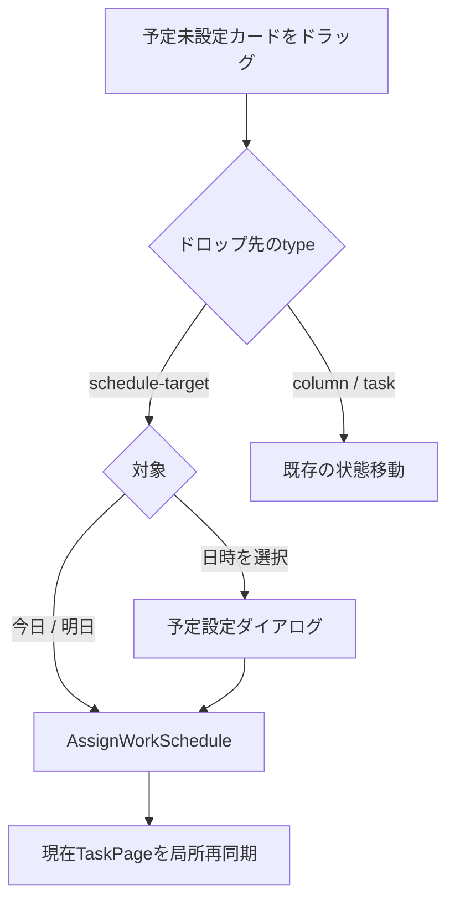

# 072 かんばんの未設定タスクをD&Dで予定化する

GitHub Issue: #182

## 背景

かんばんでは状態を確認しながら作業日を割り当てられず、予定設定のために詳細画面へ移動する必要がある。

## 仕様

- `scheduled_start_date IS NULL` のカードをドラッグしている間だけ、`今日`、`明日`、`日時を選択` の予定設定ターゲットを表示する。
- `今日` と `明日` は1日終日予定を割り当てる。
- `日時を選択` はドロップ後に予定設定ダイアログを開き、確定時に予定を割り当てる。
- 予定設定ターゲットへのドロップは予定期間だけを変更し、かんばん状態を暗黙に変更しない。
- 通常の列本体へのドロップは既存どおり状態変更だけを行う。
- 既設定カードでは予定設定ターゲットを表示せず、既存予定の上書きは行わない。
- キーボード操作はカードの操作メニューから同じ予定設定へ到達できる。

## 依存関係

- GitHub #181の `AssignWorkSchedule` と `TaskRow.schedule` を利用する。
- `@dnd-kit` の既存カードD&Dコンテキスト内で実装し、カレンダーのnative drag dataを持ち込まない。

## D&D境界

- 予定設定ターゲットは `type: schedule-target`、通常列とカードは従来どおり `columnId` を持つDroppableとして識別する。
- Pointer位置にあるDroppableを優先し、Pointer情報がないキーボードD&Dでは既存の近傍判定へフォールバックする。
- `schedule-target` へのドロップを検出した場合は列移動処理へ進まず、列へのドロップを検出した場合は予定期間を変更しない。
- `今日` と `明日` はドロップ時に1日終日予定を保存する。`日時を選択` はダイアログを開くだけとし、利用者が確定した時点で保存する。
- 保存成功後は現在のTaskPageだけを再同期し、列位置は維持する。失敗時はカードと列を変更せず、Application境界のエラーを表示する。

## 設計理由

予定設定と状態変更を1ドロップで暗黙に組み合わせると、利用者が意図しない状態変更を起こし、2つの更新を原子的に扱う専用Use Caseも必要になる。初回はドロップ先の責務を分離し、予定設定ターゲットでは予定だけを更新する。

## トレードオフ

- 状態変更と予定設定には2回の操作が必要になる場合がある。
- 日時選択は即時保存ではなくダイアログ確定を必要とする。

## 代替案

各状態列の上部に同じ日付ターゲットを置き、状態移動と予定設定を同時に行う案。

不採用理由: 同じターゲットが列ごとに重複し、ドロップの意味が曖昧になる。片方だけ失敗する部分成功も避ける必要がある。

## 危険ケース

- 予定設定ターゲットが列ドロップを横取りし、通常の状態移動ができなくなる。
- Overlayが列の背面へ入り、ドロップ先を視認できない。
- 保存後に全画面再取得して移動元カードが一瞬戻る。
- 予定済みカードを古い表示から再度ドロップして既存予定を上書きする。
- `日時を選択` へのドロップだけで既定日時を保存し、利用者の確定前に予定が作られる。
- カードメニュー操作がPointerSensorを起動し、意図せず状態移動になる。

## セキュリティと権限

- GitHub #181と同じ入力検証、競合防止、ログ抑制を使う。
- 外部通信と追加権限を導入しない。

## 受け入れ条件

- 未設定カードを今日、明日、日時選択へD&Dして予定化できる。
- 予定設定では状態列が変わらず、通常の列ドロップでは予定が変わらない。
- 予定済みカードの既存予定を上書きしない。
- D&D中のカードとターゲットが前面に表示される。
- 操作後に移動元カードのちらつきと全画面再取得が発生しない。
