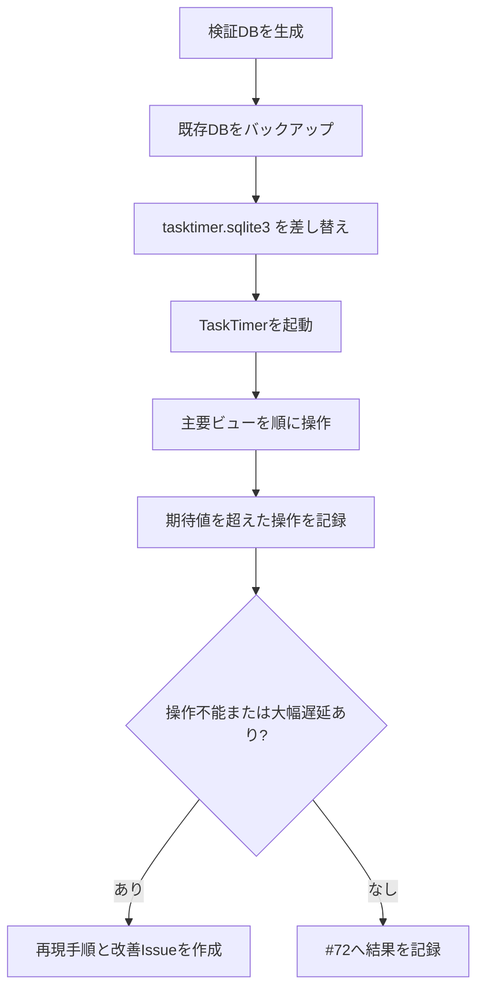

# 大量データ性能検証手順

## 目的

TaskTimerを実務で長く使った場合でも、タスク一覧、今日、お気に入り、カレンダー、右詳細ペインが操作不能にならないことを確認する。

## 検証データ規模

標準プロファイル:

| 種別 | 件数 | 意図 |
| --- | ---: | --- |
| タスクリスト | 12 | 左ペインの件数集計とリスト切替を確認する。 |
| タスク | 5,000 | 中央一覧と今日/お気に入りの表示負荷を確認する。 |
| サブタスク | 20,000 | サブタスク件数集計、展開、親子表示を確認する。 |
| タイマー履歴 | 50,000 | 右詳細やアクティブタイマー取得が履歴全件表示へ退化しないことを確認する。 |

スモークプロファイル:

| 種別 | 件数 |
| --- | ---: |
| タスクリスト | 4 |
| タスク | 50 |
| サブタスク | 200 |
| タイマー履歴 | 500 |

## データ生成

Rustの既存 `rusqlite` 依存を使う。npm依存、外部サービス、Tauri権限は追加しない。

標準データ:

```bash
npm run perf:seed -- --force
```

出力先:

```text
tmp/perf/tasktimer-large.sqlite3
```

スモークデータ:

```bash
npm run perf:seed -- --force \
  --out tmp/perf/tasktimer-smoke.sqlite3 \
  --tasks 50 \
  --subtasks 200 \
  --timers 500 \
  --lists 4
```

任意の件数:

```bash
npm run perf:seed -- \
  --out tmp/perf/tasktimer-custom.sqlite3 \
  --tasks 10000 \
  --subtasks 40000 \
  --timers 100000 \
  --lists 20 \
  --days 180
```

## アプリへの配置

既存DBを必ずバックアップしてから検証DBへ差し替える。実業務データをIssue、PR、Release artifactへ添付しない。

Windows PowerShell例:

```powershell
$AppDataDir = Join-Path $env:APPDATA "app.tasktimer.desktop"
$DbPath = Join-Path $AppDataDir "tasktimer.sqlite3"
$BackupPath = Join-Path $AppDataDir ("tasktimer.sqlite3.backup-" + (Get-Date -Format "yyyyMMddHHmmss"))

Stop-Process -Name "TaskTimer" -ErrorAction SilentlyContinue
New-Item -ItemType Directory -Force -Path $AppDataDir | Out-Null

if (Test-Path $DbPath) {
  Copy-Item $DbPath $BackupPath
}

Copy-Item ".\tmp\perf\tasktimer-large.sqlite3" $DbPath -Force
```

復元:

```powershell
Copy-Item "<バックアップしたDBパス>" "$env:APPDATA\app.tasktimer.desktop\tasktimer.sqlite3" -Force
```

macOSで補助確認する場合の配置先:

```text
~/Library/Application Support/app.tasktimer.desktop/tasktimer.sqlite3
```

## 計測フロー



## 計測対象と期待値

数値はv0.1.xの実務利用ゲートとして扱う。端末性能差があるため、超過した場合は即修正ではなく、再現条件と体感影響を記録して改善Issueへ分ける。

| 対象 | 操作 | 期待値 |
| --- | --- | --- |
| 起動 | ウィンドウ表示後、タスク一覧が操作可能になる | 5秒以内、OSの「応答なし」表示なし |
| タスク一覧 | 標準リストを表示する | 1秒以内にクリック可能 |
| 今日 | 左ペインの「今日」へ切り替える | 1秒以内にクリック可能 |
| お気に入り | 左ペインの「お気に入り」へ切り替える | 1秒以内にクリック可能 |
| 週カレンダー | カレンダーへ切替、前後週へ移動 | 1.5秒以内に操作可能 |
| 日カレンダー | 日表示へ切替、前後日へ移動 | 1.5秒以内に操作可能 |
| 月カレンダー | 月表示へ切替、前後月へ移動 | 2秒以内に操作可能 |
| 右詳細ペイン | タスク、サブタスクを選択する | 1秒以内に詳細が表示される |
| サブタスク展開 | サブタスクありタスクを展開/折りたたみ | 1秒以内に反応する |

## 記録テンプレート

| 日時 | OS/端末 | TaskTimer commit | データ規模 | 対象 | 操作時間 | 結果 | メモ |
| --- | --- | --- | --- | --- | ---: | --- | --- |
| 2026-07-14 | Windows 11 / CPU / RAM | `<commit>` | 5k/20k/50k | タスク一覧 | 未計測 | 未実施 |  |

## SQL確認

SQLite CLIがある環境では、生成後に件数を確認する。

```bash
sqlite3 tmp/perf/tasktimer-large.sqlite3 "
SELECT 'tasks', COUNT(*) FROM tasks
UNION ALL SELECT 'subtasks', COUNT(*) FROM subtasks
UNION ALL SELECT 'timer_sessions', COUNT(*) FROM timer_sessions
UNION ALL SELECT 'task_lists', COUNT(*) FROM task_lists;
"
```

カレンダー範囲クエリが表示期間で絞られているか確認する場合:

```bash
sqlite3 tmp/perf/tasktimer-large.sqlite3 "
EXPLAIN QUERY PLAN
SELECT id, title
FROM tasks
WHERE deleted_at IS NULL
  AND (planned_start_date BETWEEN '2026-07-01' AND '2026-07-31'
       OR due_date BETWEEN '2026-07-01' AND '2026-07-31');
"
```

## 設計判断

- 検証データは本番スキーマへ直接投入するが、通常Use Caseのトランザクション境界は変更しない。
- 生成データは合成文字列のみとし、個人のタスク名、メモ本文、SQLite DBを公開場所へ添付しない。
- アプリ実行時の外部通信、分析SDK、新しいTauri権限は追加しない。
- 右詳細ペインのタイマー履歴は、今後表示件数を増やす場合でも上限またはページングを前提にする。

## 危険ケース

- 今日/お気に入り表示がPresentationで全タスク/全サブタスクを毎回走査し、クリック後に固まる。
- 月カレンダーが表示範囲外の予定まで取得し、月移動のたびに大量描画する。
- タスク詳細がタイマー履歴を無制限に読み込み、履歴の多いタスクで開けなくなる。
- 大量DBを実業務DBへ戻し忘れ、検証データで通常運用してしまう。
