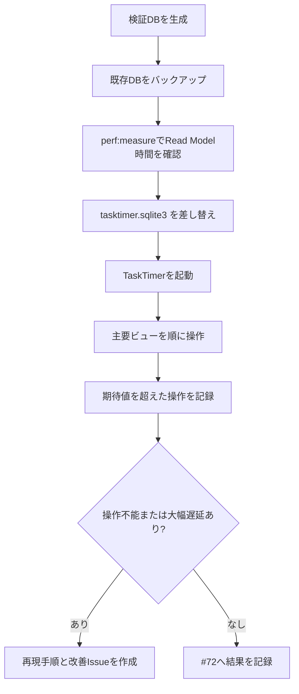

# 大量データ性能検証手順

## 目的

TaskTimerを実務で長く使った場合でも、タスク一覧、今日、お気に入り、カレンダー、右詳細ペインが操作不能にならないことを確認する。

## 検証データ規模

標準プロファイル:

| 種別 | 件数 | 意図 |
| --- | ---: | --- |
| タスクリスト | 12 | 左ペインの件数集計とリスト切替を確認する。 |
| タスク | 5,000 | 中央一覧と今日/お気に入りの表示負荷を確認する。 |
| サブタスク | 20,000 | サブタスク件数集計、展開、親子表示を確認する。 |
| 停止済みタイマー履歴 | 50,000 | 右詳細やアクティブタイマー取得が履歴全件表示へ退化しないことを確認する。 |
| アクティブポモドーロ | 1 | 起動時/復帰時のアクティブポモドーロ復元が大量履歴に引きずられないことを確認する。 |

スモークプロファイル:

| 種別 | 件数 |
| --- | ---: |
| タスクリスト | 4 |
| タスク | 50 |
| サブタスク | 200 |
| タイマー履歴 | 500 |

## データ生成

Rustの既存 `rusqlite` 依存を使う。npm依存、外部サービス、Tauri権限は追加しない。

標準データ:

```bash
npm run perf:seed -- --force
```

出力先:

```text
tmp/perf/tasktimer-large.sqlite3
```

スモークデータ:

```bash
npm run perf:seed -- --force \
  --out tmp/perf/tasktimer-smoke.sqlite3 \
  --tasks 50 \
  --subtasks 200 \
  --timers 500 \
  --lists 4
```

任意の件数:

```bash
npm run perf:seed -- \
  --out tmp/perf/tasktimer-custom.sqlite3 \
  --tasks 10000 \
  --subtasks 40000 \
  --timers 100000 \
  --lists 20 \
  --days 180
```

## Read Model計測

生成したDBに対して、主要Read Model相当のSQLiteクエリを実行時間付きで確認する。

標準データ:

```bash
npm run perf:measure
```

スモークデータ:

```bash
npm run perf:measure -- \
  --db tmp/perf/tasktimer-smoke.sqlite3 \
  --threshold-ms 100
```

CIや厳密な確認で、しきい値超過を失敗扱いにする場合:

```bash
npm run perf:measure -- --fail-on-warning
```

## GitHub ActionsでのWindows Read Model計測

`.github/workflows/performance-large-dataset.yml` の `大量データ性能検証` workflowで、GitHub-hosted Windows runner上のDB生成とRead Model計測を実行できる。

PRでは、性能検証workflow、検証bin、初期マイグレーション、npm定義が変更された場合だけスモークプロファイルを自動実行する。標準プロファイルは重いため、必要時に `workflow_dispatch` で手動実行する。

手動実行の推奨値:

| 入力 | 値 |
| --- | --- |
| `profile` | `standard` |
| `fail_on_warning` | `true` |

workflowの制約:

- 確認対象はSQLite Read Model相当のクエリ時間であり、React描画、Tauri IPC、OS通知権限、GPU/ディスク差は保証しない。
- 計測ログだけを短期artifactとstep summaryへ残し、生成DBファイルは保存しない。
- 追加Secret、新しいTauri権限、アプリ実行時外部通信は使わない。

計測対象:

| 対象 | 意図 |
| --- | --- |
| `task_lists_with_counts` | 左ペインのリスト件数集計。 |
| `board_columns_with_lifecycle_counts` | かんばん列ごとの進行中/完了件数集計。 |
| `initial_task_tree_200` | 起動時に詳細選択へ使う上限付きタスクツリー取得。 |
| `task_rows_default_list` | 標準リストの中央一覧Read Model。 |
| `task_rows_all_lists` | 今日/お気に入りなど横断ビューへ影響する一覧Read Model。 |
| `calendar_week_2026-07-13` | 週カレンダー範囲取得。 |
| `calendar_month_2026-07` | 月カレンダー範囲取得。 |
| `active_timer_lookup` | 単一アクティブタイマー復元。 |
| `active_pomodoro_lookup` | 単一アクティブポモドーロ復元。 |
| `notification_dispatch_candidates` | 期限通知dispatch候補の上限付き取得。 |
| `task_detail_subtasks` | 右詳細ペインで使う対象タスク配下のサブタスク取得。 |

この計測はDB読み取り時間だけを確認する。React描画、Tauri IPC、OS通知権限、実機GPU/ディスク差はWindows実機の手動計測で確認する。

## Presentation描画計測

ヘッドレスChromeへ合成Tauri応答を注入し、実際のReactコンポーネントで主要ビューの操作時間を計測する。

```bash
npm run perf:ui -- --profile standard --fail-on-warning
```

| プロファイル | 一覧集計件数 | 描画タスク | サブタスク/タスク | リスト |
| --- | ---: | ---: | ---: | ---: |
| `smoke` | 50 | 50 | 4 | 4 |
| `standard` | 5,000 | 200 | 4 | 12 |

計測対象と既定閾値:

| 対象 | 閾値 |
| --- | ---: |
| 初期タスク一覧 | 5,000ms |
| 今日、お気に入り、右詳細 | 1,000ms |
| かんばん、週/日カレンダー | 1,500ms |
| 月カレンダー | 2,000ms |

UIプロファイルを200件までとする理由は、現行Tauri commandの取得上限と一致させるためである。DBに存在する201件目以降へ到達できない問題は #131 でRepository/Applicationページングとして解消する。

この計測はPresentationのDOM構築とビュー切替を確認する。SQLite、Tauri IPC、WebView2、OSウィンドウ、GPU/実機ディスクは含まない。Windows workflowでは、5,000件のRead Model計測と同じジョブで実行し、層ごとの結果を1つのsummaryへ記録する。

## アプリへの配置

既存DBを必ずバックアップしてから検証DBへ差し替える。実業務データをIssue、PR、Release artifactへ添付しない。

Windows PowerShell例:

```powershell
$AppDataDir = Join-Path $env:APPDATA "app.tasktimer.desktop"
$DbPath = Join-Path $AppDataDir "tasktimer.sqlite3"
$BackupPath = Join-Path $AppDataDir ("tasktimer.sqlite3.backup-" + (Get-Date -Format "yyyyMMddHHmmss"))

Stop-Process -Name "TaskTimer" -ErrorAction SilentlyContinue
New-Item -ItemType Directory -Force -Path $AppDataDir | Out-Null

if (Test-Path $DbPath) {
  Copy-Item $DbPath $BackupPath
}

Copy-Item ".\tmp\perf\tasktimer-large.sqlite3" $DbPath -Force
```

復元:

```powershell
Copy-Item "<バックアップしたDBパス>" "$env:APPDATA\app.tasktimer.desktop\tasktimer.sqlite3" -Force
```

macOSで補助確認する場合の配置先:

```text
~/Library/Application Support/app.tasktimer.desktop/tasktimer.sqlite3
```

## 計測フロー



## 計測対象と期待値

数値はv0.1.xの実務利用ゲートとして扱う。端末性能差があるため、超過した場合は即修正ではなく、再現条件と体感影響を記録して改善Issueへ分ける。

| 対象 | 操作 | 期待値 |
| --- | --- | --- |
| 起動 | ウィンドウ表示後、タスク一覧が操作可能になる | 5秒以内、OSの「応答なし」表示なし |
| タスク一覧 | 標準リストを表示する | 1秒以内にクリック可能 |
| 今日 | 左ペインの「今日」へ切り替える | 1秒以内にクリック可能 |
| お気に入り | 左ペインの「お気に入り」へ切り替える | 1秒以内にクリック可能 |
| 週カレンダー | カレンダーへ切替、前後週へ移動 | 1.5秒以内に操作可能 |
| 日カレンダー | 日表示へ切替、前後日へ移動 | 1.5秒以内に操作可能 |
| 月カレンダー | 月表示へ切替、前後月へ移動 | 2秒以内に操作可能 |
| 右詳細ペイン | タスク、サブタスクを選択する | 1秒以内に詳細が表示される |
| サブタスク展開 | サブタスクありタスクを展開/折りたたみ | 1秒以内に反応する |

DB読み取りの期待値:

| 対象 | 期待値 |
| --- | --- |
| `perf:measure` 標準データ | 各Read Model相当クエリが250ms以内、超過時はWARNとして記録する。 |
| `perf:measure` スモークデータ | 各Read Model相当クエリが100ms以内。 |

## 記録テンプレート

| 日時 | OS/端末 | TaskTimer commit | データ規模 | 対象 | 操作時間 | 結果 | メモ |
| --- | --- | --- | --- | --- | ---: | --- | --- |
| 2026-07-14 | Windows 11 / CPU / RAM | `<commit>` | 5k/20k/50k | タスク一覧 | 未計測 | 未実施 |  |

Read Model計測結果:

| 日時 | OS/端末 | TaskTimer commit | データ規模 | コマンド | WARN件数 | メモ |
| --- | --- | --- | --- | --- | ---: | --- |
| 2026-07-18 | Darwin 25.5.0 arm64 / Apple M1 | `5f26529` + #72差分 | standard 5k/20k/50k + active pomodoro 1 | `npm run perf:measure -- --fail-on-warning` | 0 | 最大68ms。`task_rows_all_lists` が最大。 |
| 2026-07-17 | Darwin 25.5.0 arm64 / Apple M1 | `ac59e7d` + PR差分 | smoke 50/200/500 + active pomodoro 1 | `npm run perf:measure -- --db tmp/perf/tasktimer-smoke.sqlite3 --threshold-ms 100 --fail-on-warning` | 0 | 最大0ms。`active_pomodoro_lookup` は1件/0ms。 |
| 2026-07-17 | Darwin 25.5.0 arm64 / Apple M1 | `ac59e7d` + PR差分 | standard 5k/20k/50k + active pomodoro 1 | `npm run perf:measure -- --fail-on-warning` | 0 | 最大60ms。`active_pomodoro_lookup` は1件/0ms。Windows GUI描画は未計測。 |
| 2026-07-16 | Darwin 25.5.0 arm64 / Apple M1 | `dc1114f` + PR差分 | smoke 50/200/500 | `npm run perf:measure -- --db tmp/perf/tasktimer-smoke.sqlite3 --threshold-ms 100 --fail-on-warning` | 0 | 最大0ms。 |
| 2026-07-16 | Darwin 25.5.0 arm64 / Apple M1 | `dc1114f` + PR差分 | standard 5k/20k/50k | `npm run perf:measure -- --fail-on-warning` | 0 | 最大61ms。Windows GUI描画は未計測。 |
| 2026-07-16 | Darwin 25.5.0 arm64 / Apple M1 | `a3580d9` + PR差分 | smoke 50/200/500 | `npm run perf:measure -- --db tmp/perf/tasktimer-smoke.sqlite3 --threshold-ms 100 --fail-on-warning` | 0 | 最大1ms。 |
| 2026-07-16 | Darwin 25.5.0 arm64 / Apple M1 | `a3580d9` + PR差分 | standard 5k/20k/50k | `npm run perf:measure -- --fail-on-warning` | 0 | 最大56ms。Windows GUI描画は未計測。 |
| 2026-07-16 | GitHub-hosted Windows runner / Windows Server 2025 | PR #104 | smoke 50/200/500 | `大量データ性能検証` PR trigger | 0 | 最大1ms。 |
| 2026-07-16 | GitHub-hosted Windows runner / Windows Server 2025 | `321caed` | standard 5k/20k/50k | `大量データ性能検証` workflow / run `29511423778` / `profile=standard` / `fail_on_warning=true` | 0 | 最大67ms。`calendar_week_2026-07-13` が最大。Windows GUI描画は未計測。 |

Presentation描画計測結果:

| 日時 | OS/ブラウザ | TaskTimer commit | プロファイル | コマンド | WARN件数 | メモ |
| --- | --- | --- | --- | --- | ---: | --- |
| 2026-07-18 | Darwin 25.5.0 arm64 / headless Chrome | `5f26529` + #72差分 | 一覧集計5,000件 / 描画200タスク / 800サブタスク / 12リスト | `npm run perf:ui -- --profile standard --fail-on-warning` | 0 | 複数回の保守的な記録で最大1,411ms。`initial_task_list` が最大。かんばん974ms、週カレンダー434ms。 |
| 2026-07-18 | Darwin 25.5.0 arm64 / headless Chrome | `5f26529` + #72差分 | 一覧集計・描画50タスク / 200サブタスク / 4リスト | `npm run perf:ui -- --profile smoke --fail-on-warning` | 0 | 複数回の保守的な記録で最大1,007ms。`initial_task_list` が最大。 |

## SQL確認

SQLite CLIがある環境では、生成後に件数を確認する。

```bash
sqlite3 tmp/perf/tasktimer-large.sqlite3 "
SELECT 'tasks', COUNT(*) FROM tasks
UNION ALL SELECT 'subtasks', COUNT(*) FROM subtasks
UNION ALL SELECT 'timer_sessions', COUNT(*) FROM timer_sessions
UNION ALL SELECT 'pomodoro_sessions', COUNT(*) FROM pomodoro_sessions
UNION ALL SELECT 'task_lists', COUNT(*) FROM task_lists;
"
```

カレンダー範囲クエリが表示期間で絞られているか確認する場合:

```bash
sqlite3 tmp/perf/tasktimer-large.sqlite3 "
EXPLAIN QUERY PLAN
SELECT id, title
FROM tasks
WHERE deleted_at IS NULL
  AND (planned_start_date BETWEEN '2026-07-01' AND '2026-07-31'
       OR due_date BETWEEN '2026-07-01' AND '2026-07-31');
"
```

## 設計判断

- 検証データは本番スキーマへ直接投入するが、通常Use Caseのトランザクション境界は変更しない。
- Read Model計測は検証用binで実行し、Application Use CaseやRepository実装の状態変更境界は変更しない。
- `perf:seed` は初期マイグレーションSQLを直接使ったあと、UI Read Model用インデックスを検証DBへ作成する。
- `perf:ui` は合成データだけを使い、実DB、タスク名、メモ、タイマー履歴をブラウザへ渡さない。
- 生成データは合成文字列のみとし、個人のタスク名、メモ本文、SQLite DBを公開場所へ添付しない。
- アプリ実行時の外部通信、分析SDK、新しいTauri権限は追加しない。
- 右詳細ペインのタイマー履歴は、今後表示件数を増やす場合でも上限またはページングを前提にする。

## 危険ケース

- 今日/お気に入り表示がPresentationで全タスク/全サブタスクを毎回走査し、クリック後に固まる。
- 月カレンダーが表示範囲外の予定まで取得し、月移動のたびに大量描画する。
- タスク詳細がタイマー履歴を無制限に読み込み、履歴の多いタスクで開けなくなる。
- 大量DBを実業務DBへ戻し忘れ、検証データで通常運用してしまう。
- ヘッドレスChromeの結果だけで、Tauri IPCやWindows WebView2の実機性能まで保証したと誤認する。
- 200件描画が成功したことを、201件目以降へ到達できることと誤認する。
