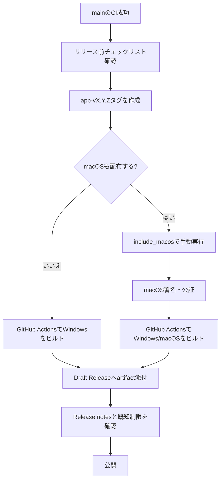

# 外部利用者向け公開運用

## 目的

外部の利用者がGitHubからTaskTimerを見つけ、入手し、使い始め、不具合や要望を安全に報告できる状態を保つ。

この文書はGitHub運用と配布手順の仕様であり、アプリ実行時の外部通信を追加しない。

## 対象範囲

MVPで対象にするもの:

- GitHub ReleasesからのWindows配布。
- Apple署名・公証準備が完了したReleaseでのmacOS配布。
- READMEでの入手方法、既知制限、プライバシー方針の説明。
- Issue、Discussions、Security Advisoryを使った問い合わせ導線。
- MIT Licenseによる利用許諾。
- Release作成用GitHub Actions。

MVPで対象外にするもの:

- 自動更新。
- ストア配布。
- Windowsコード署名の導入。v0.1.xでは [ADR 0005](adr/0005-windows-code-signing-policy.md) に従い、未署名配布を既知制限付きで継続する。
- Mac App Store配布。
- Linux配布。
- 遠隔同期、クラウドバックアップ、分析、クラッシュレポート。

## 利用者導線

1. 利用者はREADMEからGitHub Releasesへ移動する。
2. Windows利用者はNSISインストーラーをダウンロードする。
3. macOS利用者はApple署名・公証済みDMGが提供されているReleaseだけを利用する。
4. 利用者はRelease notesで既知制限と手動確認結果を確認する。
5. 不具合はIssue、質問はDiscussions、脆弱性はSecurity Policyの手順で報告する。

## リリース導線

Releaseはドラフトで作成し、公開前に手動で確認する。

## トランザクション境界

アプリのデータ更新は行わない。GitHub運用上の境界は次のとおり。

- タグ作成: リリース対象コミットを固定する境界。
- GitHub Actions: 配布artifactを生成する境界。
- Draft Release公開: 外部利用者へ配布を開始する境界。

Draft Release公開前に問題が見つかった場合は、Releaseを公開せず、タグまたはartifactを破棄してやり直す。

## 権限境界

- Release workflowは全体で `contents: read` を基本とし、artifactを添付するjobだけ `contents: write` を要求する。
- macOS署名・公証用SecretsはGitHub Repository Secretsで管理する。
- Windowsコード署名を導入する場合は、別IssueでSecret名、workflow変更、確認手順、証明書更新手順を設計し、GitHub SecretsまたはGitHub Environment Secretsだけを秘密情報の保存先にする。
- 通常のCIは `contents: read` のみを維持する。
- アプリ本体にはリモート通信、分析、クラッシュアップロード、自動更新の権限を追加しない。
- IssueやDiscussionsには秘密情報、Apple証明書、Apple認証情報、個人データ、SQLite DB、ログを投稿しない。

## 受け入れ条件

- READMEからGitHub Releases、Issue、Discussions、Security Policyへ移動できる。
- LICENSEがMIT Licenseである。
- `docs/adr/0004-public-distribution-license.md` にライセンスと配布方針が記録されている。
- `docs/adr/0005-windows-code-signing-policy.md` にWindowsコード署名方針が記録されている。
- `app-v*` タグまたは手動実行でDraft Releaseを作るGitHub Actionsがある。
- Release workflowが自動更新artifactを作らない設定である。
- Release workflowが既定でWindows artifactを作成する設定である。
- macOS artifactは手動実行で `include_macos` を有効にした場合だけDeveloper ID署名・Apple公証する設定である。
- `docs/release-checklist.md` に外部利用者向けRelease作成手順がある。

## セキュリティ観点

- ユーザーのタスク名、メモ本文、通知本文、DBをIssueやReleaseへ添付しない。
- macOS署名・公証Secretsをリポジトリ、Issue、PR、Release notesに書かない。
- Windows未署名artifactによるSmartScreenまたは組織ポリシーの警告を既知制限として扱う。
- Windowsコード署名を導入する場合も、証明書、秘密鍵、証明書パスワード、Azure認証情報をリポジトリ、Issue、PR、Release notes、Actionsログへ書かない。
- Release artifact作成時に `.env`、秘密鍵、証明書、ログ、DBを含めない。
- GitHub ActionsとDependabotの通信は開発・運用時通信であり、アプリ実行時通信ではない。

## スケール観点

- Release artifactは既定でWindowsに限定し、MVPの運用負荷を抑える。
- macOS artifactはApple署名・公証準備が完了したReleaseだけに限定する。
- Discussionsを質問窓口にして、Issueを不具合と機能要望に集中させる。
- Draft Releaseを使い、公開前にartifact確認を行う。

## トレードオフ

- GitHub Releasesは手軽だが、ストア配布ほどの信頼表示や自動配布導線はない。
- MIT Licenseは外部利用しやすいが、再配布制限を細かくかけられない。
- 自動更新を見送るため、利用者は新バージョンを手動で確認する必要がある。
- Windows配布を先行するため、macOS利用者向けの正式配布は遅れる。
- macOS署名・公証により配布信頼性は上がるが、Apple Developer ProgramとSecrets更新の運用負荷が増える。
- Windowsコード署名を保留するため、v0.1.xではSmartScreen警告の可能性が残る。

## 危険ケース

- 未確認のDraft Releaseを公開して、壊れたインストーラーを配布する。
- Release notesに既知制限を書かず、Windows署名警告や通知権限の挙動を利用者が誤解する。
- 署名済みになればSmartScreen警告が必ず消えると誤説明する。
- Windows先行Releaseなのに、Release notesがmacOS artifact提供済みであるように見える。
- Issueに実データやDBが添付され、公開リポジトリ上に残る。
- `contents: write` 以外の不要な権限をRelease workflowに追加する。
- macOS artifactを含める場合に、公証失敗を見落としてDraft Releaseを公開する。
