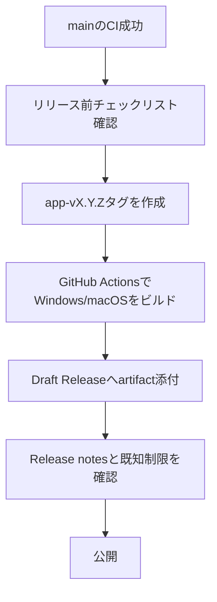

# 外部利用者向け公開運用

## 目的

外部の利用者がGitHubからTaskTimerを見つけ、入手し、使い始め、不具合や要望を安全に報告できる状態を保つ。

この文書はGitHub運用と配布手順の仕様であり、アプリ実行時の外部通信を追加しない。

## 対象範囲

MVPで対象にするもの:

- GitHub ReleasesからのWindows/macOS配布。
- READMEでの入手方法、既知制限、プライバシー方針の説明。
- Issue、Discussions、Security Advisoryを使った問い合わせ導線。
- MIT Licenseによる利用許諾。
- Release作成用GitHub Actions。

MVPで対象外にするもの:

- 自動更新。
- ストア配布。
- コード署名と公証。
- Linux配布。
- 遠隔同期、クラウドバックアップ、分析、クラッシュレポート。

## 利用者導線

1. 利用者はREADMEからGitHub Releasesへ移動する。
2. Windows利用者はNSISインストーラーをダウンロードする。
3. macOS利用者はDMGをダウンロードする。
4. 利用者はRelease notesで既知制限と手動確認結果を確認する。
5. 不具合はIssue、質問はDiscussions、脆弱性はSecurity Policyの手順で報告する。

## リリース導線

Releaseはドラフトで作成し、公開前に手動で確認する。

## トランザクション境界

アプリのデータ更新は行わない。GitHub運用上の境界は次のとおり。

- タグ作成: リリース対象コミットを固定する境界。
- GitHub Actions: 配布artifactを生成する境界。
- Draft Release公開: 外部利用者へ配布を開始する境界。

Draft Release公開前に問題が見つかった場合は、Releaseを公開せず、タグまたはartifactを破棄してやり直す。

## 権限境界

- Release workflowは `contents: write` のみを要求する。
- 通常のCIは `contents: read` のみを維持する。
- アプリ本体にはリモート通信、分析、クラッシュアップロード、自動更新の権限を追加しない。
- IssueやDiscussionsには秘密情報、個人データ、SQLite DB、ログを投稿しない。

## 受け入れ条件

- READMEからGitHub Releases、Issue、Discussions、Security Policyへ移動できる。
- LICENSEがMIT Licenseである。
- `docs/adr/0004-public-distribution-license.md` にライセンスと配布方針が記録されている。
- `app-v*` タグまたは手動実行でDraft Releaseを作るGitHub Actionsがある。
- Release workflowが自動更新artifactを作らない設定である。
- `docs/release-checklist.md` に外部利用者向けRelease作成手順がある。

## セキュリティ観点

- ユーザーのタスク名、メモ本文、通知本文、DBをIssueやReleaseへ添付しない。
- 署名なしartifactによるOS警告を既知制限として扱う。
- Release artifact作成時に `.env`、秘密鍵、証明書、ログ、DBを含めない。
- GitHub ActionsとDependabotの通信は開発・運用時通信であり、アプリ実行時通信ではない。

## スケール観点

- Release artifactはWindows/macOSに限定し、MVPの運用負荷を抑える。
- Discussionsを質問窓口にして、Issueを不具合と機能要望に集中させる。
- Draft Releaseを使い、複数OSのartifact確認を公開前にまとめて行う。

## トレードオフ

- GitHub Releasesは手軽だが、署名やストア配布ほどの信頼表示はない。
- MIT Licenseは外部利用しやすいが、再配布制限を細かくかけられない。
- 自動更新を見送るため、利用者は新バージョンを手動で確認する必要がある。

## 危険ケース

- 未確認のDraft Releaseを公開して、壊れたインストーラーを配布する。
- Release notesに既知制限を書かず、署名警告や通知権限の挙動を利用者が誤解する。
- Issueに実データやDBが添付され、公開リポジトリ上に残る。
- `contents: write` 以外の不要な権限をRelease workflowに追加する。
