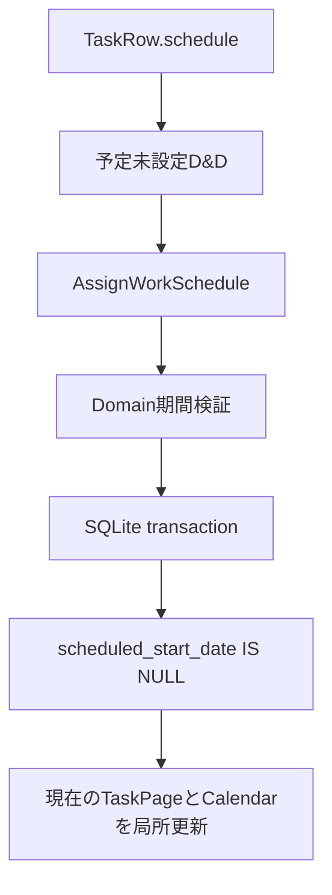

# 日時未設定タスク予定化 設計レビュー

対象: GitHub #181 / #182

## 結論

フォローアップ付き承認。初回割り当て専用 `AssignWorkSchedule` と構造化した予定期間Read Modelを先に実装し、カレンダー／タイムラインと、かんばんを別PRへ分ける。既存 `ResizeScheduledWorkItem` の上書き境界は変更しない。

## 境界レビュー

- Domain: 既存 `WorkSchedule` の日付・時刻・終日不変条件を再利用する。
- Application: 初回割り当ての意図とトランザクション境界を所有する。
- Infrastructure: 未設定条件付きUPDATEと競合判定を所有する。
- Presentation: Pointer位置からDraftを組み立て、永続化済みの正を保持しない。

## チェックリスト結果

- [x] 仕様、対象外、受け入れ条件がテスト可能である。
- [x] 予定期間と開始予定、期限、通知の意味を分離した。
- [x] Application Use Caseをトランザクション境界にした。
- [x] 新しいDB列とマイグレーションが不要である。
- [x] 外部通信、OS権限、Tauri capabilityを追加しない。
- [x] ページング上限と日付範囲検証を維持する。
- [x] 実装後にRust、TypeScript、D&D回帰、狭幅表示を確認した。

## 破綻シナリオ

- 初回割り当てに上書きUse Caseを使うと、二重ドロップで既存予定が失われる。
- Task DTOとTaskRow DTOの片方だけに予定期間を追加すると、詳細再同期と一覧再同期で表示が食い違う。
- タイムラインで開始予定／期限と予定期間を同じフィールドとして扱うと、D&Dが期限通知を変更したように見える。
- カレンダーの既存予定dragと未設定タスクdragを同じ文字列形式にすると、移動と初回割り当てを誤ルーティングする。
- D&D直後に全件再取得すると、ドラッグ元が一瞬復活しスクロールも失われる。

## スケール

- 予定未設定トレイは `ListTaskPage` の現在ページだけを射影し、追加読み込みを維持する。
- 保存後は対象行と表示中カレンダー範囲を更新し、アプリ全体のSnapshotを再取得しない。
- 日／週／月の軸は既存固定範囲を使い、Pointer位置から無制限な日付列を生成しない。

## セキュリティと権限境界

- 日付と時刻はDomain/Applicationのパーサーで検証する。
- Repositoryは有効な親タスクと未設定条件を確認し、任意テーブル名やSQL断片を入力から作らない。
- タスク名とメモはログへ出さず、UIではテキストとして描画する。
- ネットワーク、ファイル、通知権限は追加しない。

## テスト計画

- Domain/Application: 終日、時刻付き、不正期間、既設定競合、削除済み、アーカイブ済み。
- Infrastructure: 条件付きUPDATE、ロールバック、Task/TaskRow DTO整合。
- Presentation: 日／週／月のDraft計算、D&Dプレビュー、保存中抑止、詳細非表示。
- 回帰: 既存予定移動、リサイズ、期限調整、タスク選択、ページング。

## フォローアップ

- GitHub #181で基盤とカレンダー／タイムラインを実装する。
- GitHub #182でかんばんの `@dnd-kit` ターゲットを実装する。

## #182 実装前レビュー

判断: 承認。

- [x] `schedule-target` と通常列のドロップを型で分離する。
- [x] 今日／明日への割り当ては予定期間だけを変更し、状態を変更しない。
- [x] 日時選択はダイアログ確定まで永続化しない。
- [x] キーボード代替操作をカードメニューから提供する。
- [x] 既設定、削除済み、アーカイブ済み、二重送信は#181のUse Caseと条件付きUPDATEで拒否する。
- [x] 新しいDB列、外部通信、OS権限、Tauri capabilityを追加しない。
- [x] 実装後に列移動、予定設定、Overlay前面表示、局所再同期を確認する。

## 実装後確認

- `cargo test --lib`: 115件成功。初回割り当て、二重割り当て拒否、アーカイブ済み／削除済み拒否、Task/TaskRow Read Model整合を含む。
- `cargo clippy --all-targets --all-features -- -D warnings`: 成功。
- `npm run build`: 成功。
- `npm run perf:ui -- --profile smoke --fail-on-warning`: 50タスク、警告0。かんばんで今日へのD&D、日時選択の確定前非保存、カードメニューからの明日設定、列位置維持、Overlay前面表示を確認。
- `npm run perf:ui -- --profile standard --fail-on-warning`: 401タスク、1,604サブタスク、警告0。列内スクロール後の予定化、既存列D&D、週時刻枠、月日付セル、タイムライン軸への予定化と既存移動／期間変更を確認。
- `npm run screenshots:readme`: 成功。1,440pxの画像生成に加え、1,024pxと760pxでペイン外スクロールや横方向のはみ出しがないことを確認。
- `npm run audit:runtime-privacy`: 外部通信API、実行時ログ、リモートアセット、更新権限の検出なし。
