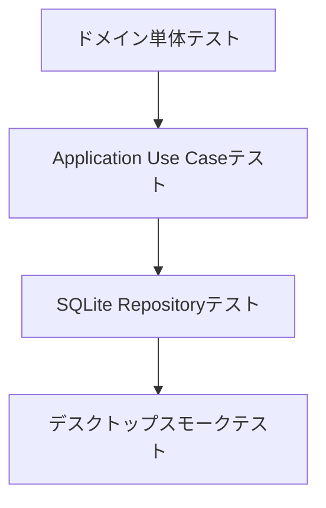

# テスト戦略

## テストピラミッド

## ドメインテスト

必須ケース:

- 空のタスクタイトルを拒否する。
- 空のサブタスクタイトルを拒否する。
- 開始予定日より前の期限日を拒否する。
- 完了済みタスクはタイマー開始不可。
- 完了済みサブタスクはタイマー開始不可。
- アーカイブ済み対象はタイマー開始不可。
- 単一アクティブタイマーポリシーが2つ目のタイマーを拒否する。

## ユースケーステスト

必須ケース:

- タスク一覧取得でタスクとサブタスクのツリーが返る。
- タスク作成で妥当なタスクが保存される。
- 存在しない親タスクへのサブタスク作成は失敗する。
- タスクタイマー開始でアクティブタイマーが作成され、タスク状態が更新される。
- サブタスクタイマー開始でアクティブタイマーが作成され、サブタスク状態が更新される。
- 既に別タイマーが開始中の場合、タイマー開始は失敗する。
- アクティブタイマー停止で経過秒数が確定する。
- 未完了サブタスクがある親タスク完了は確認フラグなしでは失敗する。
- 確認済みの親タスク完了では、サブタスク状態を変更しない。
- タスク削除で子サブタスク、タイマーセッション、通知ルールがソフト削除される。
- サブタスク削除でタイマーセッション、通知ルールがソフト削除される。
- 期限日更新時、通知ルールレコードも同一トランザクションで更新される。
- 通知表示モードのデフォルトは `title_only`。
- 汎用通知モードではタスク/サブタスクタイトルを含めない。

## SQLiteテスト

必須ケース:

- スキーマが空タイトルを拒否する。
- スキーマが不正な状態値を拒否する。
- スキーマがアクティブタイマー1件制約を守る。
- SQLiteファイルを開き直した後もタスクとサブタスクが取得できる。
- タスク削除はソフト削除を使い、監査/復旧用に行を残す。
- カレンダークエリが週範囲のタスクとサブタスクを返す。

## 手動デスクトップ確認

リリース前にWindows/macOSで確認する。

- インターネットなしでアプリが起動する。
- タスクの作成、編集、削除。
- サブタスクの作成、編集、削除。
- タスクタイマーの開始/停止。
- サブタスクタイマーの開始/停止。
- タイマー開始中にアプリを再起動する。
- 週カレンダーの移動。
- ローカル通知の権限と配信。
- OSスリープ/復帰後も操作できる。

## パフォーマンス確認

最小データセット:

- タスク5,000件。
- サブタスク20,000件。
- タイマーセッション50,000件。

期待結果:

- 週カレンダーが目に見える停止なく描画される。
- 検索や絞り込みがタイマー表示をブロックしない。
- 週範囲取得とアクティブタイマー取得にインデックスが使われる。
