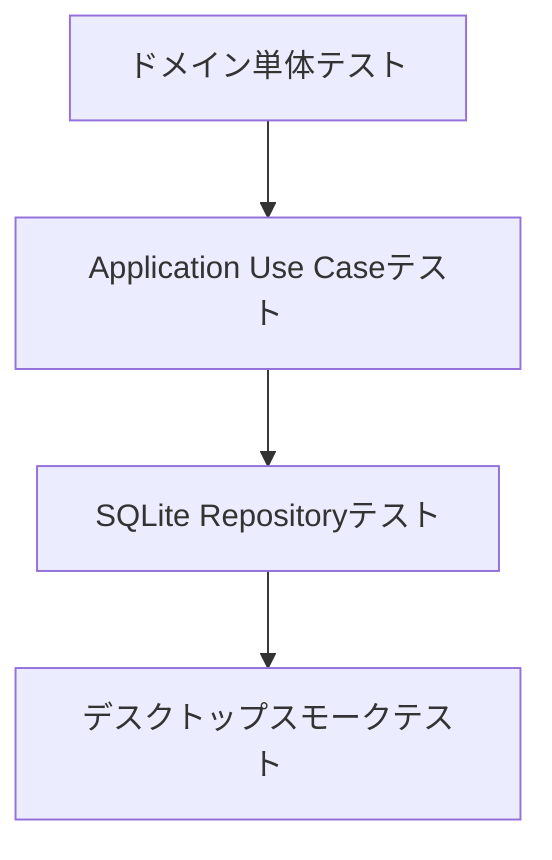

# テスト戦略

## テストピラミッド



## ドメインテスト

必須ケース:

- 空のタスクタイトルを拒否する。
- 空のサブタスクタイトルを拒否する。
- 開始予定日より前の期限日を拒否する。
- 完了済みタスクはタイマー開始不可。
- 完了済みサブタスクはタイマー開始不可。
- アーカイブ済み対象はタイマー開始不可。
- 単一アクティブタイマーポリシーが2つ目のタイマーを拒否する。

## ユースケーステスト

必須ケース:

- タスク一覧取得でタスクとサブタスクのツリーが返る。
- タスク作成で妥当なタスクが保存される。
- 存在しない親タスクへのサブタスク作成は失敗する。
- タスクタイマー開始でアクティブタイマーが作成され、タスク状態が更新される。
- サブタスクタイマー開始でアクティブタイマーが作成され、サブタスク状態が更新される。
- 既に別タイマーが開始中の場合、タイマー開始は失敗する。
- アクティブタイマー停止で経過秒数が確定する。
- 未完了サブタスクがある親タスク完了は確認フラグなしでは失敗する。
- 確認済みの親タスク完了では、サブタスク状態を変更しない。
- タスクアーカイブで通常一覧、カレンダー、通知dispatchから対象タスクと配下サブタスクが除外される。
- タスク復元で通常一覧に戻り、サブタスク状態、通知ルール、完了済みタスクの完了時刻が保持される。
- 親タスクまたは配下サブタスクでタイマー開始中の場合、タスクアーカイブは失敗する。
- タスク削除で子サブタスク、タイマーセッション、通知ルールがソフト削除される。
- サブタスク削除でタイマーセッション、通知ルールがソフト削除される。
- 期限日更新時、通知ルールレコードも同一トランザクションで更新される。
- 通知表示モードのデフォルトは `title_only`。
- 汎用通知モードではタスク/サブタスクタイトルを含めない。
- 期限到来通知のdispatch成功で `registered` になる。
- OS通知送信失敗時は `failed` と `last_error` が保存される。
- OS通知送信の成功/失敗は `notification_delivery_attempts` に保存され、設定画面で最新履歴として確認できる。
- 通知全体OFF中はdispatch対象から除外され、ONへ戻すと既存の `pending` / `failed` 通知が対象に戻る。
- 期限時刻がある期限通知は `due_date + due_time` を `notify_at` として保存する。
- アプリ起動中の将来時刻通知スケジューラは、未来の `pending` / `failed` 通知のうち最も近い1件だけを予約する。
- 期限変更、通知設定変更、ウィンドウ復帰時に古い予約を破棄し、期限到来dispatch後に次回予約を張り直す。
- 通知全体OFF中は将来時刻通知スケジューラもOS通知adapterを呼ばない。
- 成功済み `registered` 通知は、スケジューラ再同期後も再送信されない。
- スケジューラ用DTOにはタスク名、サブタスク名、メモ本文、通知本文を含めない。
- `sync_notifications` は復帰相当の時刻ジャンプ後に期限到来通知を1回だけ送信し、次の未来通知を返す。
- `sync_notifications` は通知全体OFF中にdispatchも次回予約も行わない。
- 既存 `notification_rules` から `notification_os_registrations` がbackfillされる。
- タスク更新時、`notification_rules.registration_status` を重複dispatch対象に戻さず、OS登録状態だけを `pending` に戻す。
- タスク削除時、OS登録IDがある通知登録状態は `cancel_pending` として残り、解除完了後にジョブ対象から外れる。
- Windows以外ではネイティブOS登録PoCのUse CaseがDBに触らずスキップする。
- WindowsネイティブOS登録PoCで、`generic` 設定時に対象タイトルやメモ本文をadapterへ渡さない。
- WindowsネイティブOS登録PoCで、登録失敗時は `failed` とOSエラーだけを保存する。
- WindowsネイティブOS登録PoCで、`cancel_pending` がOS解除後に解除済みになる。
- UI設定取得で左ペイン開閉、最後のビュー、最後のリストID、カレンダー表示モードが返る。
- UI設定更新で許可された値だけが保存される。
- UI設定値が破損していても既定値へフォールバックして取得できる。

## SQLiteテスト

必須ケース:

- スキーマが空タイトルを拒否する。
- スキーマが不正な状態値を拒否する。
- スキーマがアクティブタイマー1件制約を守る。
- SQLiteファイルを開き直した後もタスクとサブタスクが取得できる。
- タスク削除はソフト削除を使い、監査/復旧用に行を残す。
- カレンダークエリが指定範囲のタスクとサブタスクを返す。
- カレンダークエリがアーカイブ済みタスクとその配下サブタスクを返さない。
- カレンダークエリがサブタスクの親タスク名と実行中タイマーの表示用時刻を返す。
- カレンダー取得範囲が逆順または過大な場合は拒否する。

## バックアップ/エクスポートテスト

バックアップ/復元/エクスポートを実装するPRでは、[ローカルデータのバックアップとエクスポート方針](data-backup-export.md) に従って確認する。

必須ケース:

- SQLiteバックアップ作成前後で `PRAGMA integrity_check` が `ok` になる。
- DB書き込み中の単純コピーに依存せず、一貫したスナップショットを作る。
- 破損DBの復元を拒否し、既存DBを保持する。
- 必須テーブルがないDBの復元を拒否する。
- 古いDBを一時DB上でマイグレーションできる場合だけ復元する。
- 現在のアプリが理解できない新しいDBの復元を拒否する。
- JSON/CSVエクスポートでメモ本文の改行、カンマ、ダブルクォートが壊れない。
- CSVエクスポートで、表計算ソフトが数式として解釈しうるセルが安全化される。
- 失敗時のエラーとログにタスク名、メモ本文、通知本文を含めない。
- 設定画面のデータ管理UIで、バックアップ/復元/JSON/CSVの成功、失敗、キャンセル状態が表示される。
- 復元前に現在データを置き換える確認が表示され、キャンセル時はDBを変更しない。
- データ管理操作中は他のデータ管理操作を再実行できない。

## 手動デスクトップ確認

リリース前にWindowsで確認する。macOS artifactを配布対象に含める場合はmacOSでも確認する。

- インターネットなしでアプリが起動する。
- タスクの作成、編集、削除。
- サブタスクの作成、編集、削除。
- タスクタイマーの開始/停止。
- サブタスクタイマーの開始/停止。
- タイマー開始中にアプリを再起動する。
- カレンダーの週/日/月切替と前後移動。
- 週/日カレンダーで日付のみ予定と実行中タイマーの時刻表示が分かれている。
- 月カレンダーで残件数表示が出る。
- ローカル通知の権限と配信。
- アプリを開いたまま2分後の期限時刻を設定し、予定時刻に通知される。
- 未来通知が届いたあと、同じ通知が再フォーカスや画面更新で重複送信されない。
- 通知全体OFFへ変更した直後、既存の未来通知が予定時刻になっても送信されない。
- SQLiteバックアップ復元後、復元後DBの通知予定だけが再同期される。
- `generic` 通知でタスク/サブタスクタイトルがOS通知に出ない。
- 通知送信失敗時に設定画面で失敗が分かり、再試行できる。
- Windowsネイティブ将来通知PoCは、インストール済みWindows 11アプリを非昇格で起動し、登録、期限変更による差し替え、削除による解除、通知全体OFFによる解除、`generic` 表示、アプリ完全終了中の発火、アンインストール後の予約通知残存可否を手動確認する。
- OSスリープ/復帰後も操作できる。

詳細なリリース判定は [リリース前チェックリスト](release-checklist.md) に記録する。

## CI確認

Pull Requestとブランチpushでは、GitHub Actionsの `リポジトリチェック` を実行する。

CIで確認するもの:

- 必須設計ファイルが揃っている。
- SQLiteスキーマと初期マイグレーションを空DBへ適用できる。
- Rust format、test、clippyが成功する。
- TypeScript/Vite buildが成功する。
- `.env` と `.env.*` がコミットされていない。
- 空白エラーがない。

CIで保証しないもの:

- macOS/Windows固有の通知権限。
- アプリ完全終了中の将来時刻通知。#123 でWindows先行PoC adapterを追加したが、Windows 11のインストール済みアプリで手動検証が完了するまで公開保証対象外とする。
- インストーラーartifactの実インストール。
- macOS artifactを配布する場合の署名・公証済みDMGのGatekeeper実機挙動。
- Windows未署名artifactに対するOS警告。
- Windows実機またはVMでのOSスリープ/復帰後のタイマー復元、経過時間、通知重複なし確認。手順は [Issue 025](issues/025-sleep-resume-timer-notification.md) に記録する。
- オフライン起動の実機確認。

## パフォーマンス確認

大量データでの実測と改善分割は [Issue 028](issues/028-performance-large-dataset.md) / GitHub #72 で追跡する。具体的なデータ生成、DB差し替え、計測記録は [大量データ性能検証手順](performance-large-dataset.md) に従う。

最小データセット:

- タスク5,000件。
- サブタスク20,000件。
- タイマーセッション50,000件。

Read Model計測:

```bash
npm run perf:seed -- --force
npm run perf:measure
```

Windows runnerでRead Model計測を行う場合:

```text
GitHub Actions > 大量データ性能検証 > Run workflow
profile=standard
fail_on_warning=true
```

期待結果:

- ウィンドウ表示後5秒以内にタスク一覧が操作可能になる。
- タスク一覧、今日、お気に入りが1秒以内に操作可能になる。
- 週/日カレンダーは1.5秒以内、月カレンダーは2秒以内に操作可能になる。
- 右詳細ペインがタイマー履歴の全件表示に依存せず、1秒以内に表示される。
- カレンダー範囲取得とアクティブタイマー取得が表示範囲または単一アクティブタイマーに絞られている。
- `perf:measure` の標準データ計測でWARNが出た場合は、対象Read Model名、件数、実行時間、端末情報を #72 へ記録する。
- `大量データ性能検証` workflowはWindows上のDB読み取り時間を確認する。GUI操作、Tauri IPC、OS通知、SmartScreen、実機ディスク差の代替にはしない。
