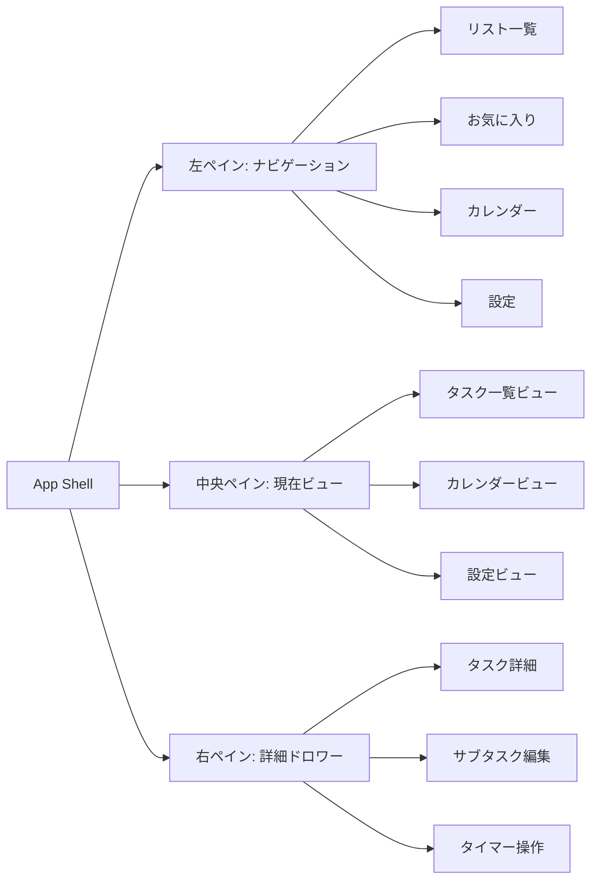
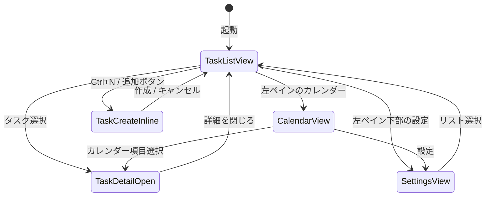

# UI/UX再設計仕様

## 目的

TaskTimerのUI/UXを、実務で毎日使うタスク管理アプリとして整理し直す。
Microsoft To Doの「左ナビ、中央リスト、右詳細」という認知しやすい構造を参考にしつつ、TaskTimerでは以下を差別化要素にする。

- タスクとサブタスクのどちらにも期限とタイマーを持てる。
- アプリ全体で同時に開始できるタイマーを1件に制限する。
- 週/日/月カレンダーで開始予定、期限、実行中タイマーを確認できる。
- 通知表示タイプをローカル設定として切り替えられる。
- アプリ実行時の外部通信を追加しない。

Microsoft To Doの画面構成をそのまま複製するのではなく、情報設計の型を参考にして、色、操作、タイマー体験、カレンダー体験はTaskTimer独自のものにする。

## 現状UI/UX整理

再設計前は、タスク作成、タスク詳細、週カレンダー、通知設定を1画面に並べたMVP検証向けUIだった。

| 領域 | 現状 | 課題 |
| --- | --- | --- |
| 左側 | タスク作成フォーム、タスク一覧、選択タスク詳細が同じペインにある | 作成フォームが常時大きく、一覧の見通しが弱い。ナビゲーションの概念がない。 |
| 中央 | 週カレンダーが常時表示される | タスク一覧を主作業にしたい場面でもカレンダーが画面を占有する。 |
| 右側 | 通知設定が常時表示される | タスク詳細と設定の役割が混ざらず、設定は必要時だけでよい。 |
| タスク完了 | チェックボックスで完了できる | 完了済みの視覚的移動、訂正線、半透明表現がない。 |
| サブタスク | 詳細内で作成、完了、タイマー開始ができる | 進捗が親タスク一覧に見えない。期限アイコンや進捗バーがない。 |
| タイマー | 開始/停止のみ | 一時停止、再開、終了、目標時間のUIがない。 |
| レスポンシブ | グリッドが折り返す | 幅ごとの主従関係が定義されていない。 |

## 改善したい情報

タスク一覧では、詳細を開かなくても以下を判断できることを目標にする。

- 完了状態。
- タスクタイトル。
- お気に入り状態。
- サブタスク進捗。例: `1/2`。
- 親タスクにサブタスクがある場合の進捗バー。
- 期限があること。
- 期限切れ、今日、今週などの状態。
- タイマー実行中であること。

タスク詳細では、実作業中に必要な操作を1か所へ寄せる。

- サブタスク追加、完了、期限変更。
- タスク期限追加。
- 繰り返し設定。
- 通知設定。
- 目標タイマー時間設定。
- タイマー開始、一時停止、再開、終了。
- タスク削除。

## 画面構成

### 左ペイン

役割:

- リスト一覧を表示する。
- お気に入りされたタスクへのビューを表示する。
- カレンダー画面へ遷移する。
- 最下部に設定画面への導線を置く。
- `Ctrl+B` で開閉できる。
- 開閉ボタンはアプリヘッダーではなく、左ペイン右端に配置する。

表示項目:

- アプリ名。
- リスト一覧。
- お気に入り。
- カレンダー。
- 設定。最下部に固定。

振る舞い:

- 開いている状態ではラベルと件数を表示する。
- 閉じている状態ではアイコンのみ表示する。
- 閉じている状態でも現在ビューは視覚的に分かる。
- 設定画面には現状のローカル通知設定を移管する。

### 中央ペイン

役割:

- タスク一覧ビュー、カレンダービュー、設定ビューを切り替えて表示する。
- 通常作業の中心はタスク一覧ビューとする。

タスク一覧ビュー:

- 選択中リストのタスクを表示する。
- 未完了タスクを上部に表示する。
- 完了タスクは画面下部の完了セクションへ移動する。
- 完了セクションは折りたたみ可能にする。
- タスク作成はタスク件数表示の右にある追加ボタン、または `Ctrl+N` で開始する。
- タスク作成後は右ペインを自動で開かない。

タスク行:

- 左に円形チェックボタンを置く。
- 中央にタスクタイトルを置く。
- 右端にお気に入りボタンを置く。
- 行本文を選択したときだけ右ペインを開く。
- 円形チェックボタンとお気に入りボタンは状態だけ更新し、右ペインを開かない。
- 円形チェックボタンとお気に入りボタンの更新後は、一覧全体を読み込み表示へ戻さず、対象行だけpending状態にする。
- 完了済みの円形チェックボタンを押すと、未完了へ戻せる。
- 親タスクでサブタスクが存在する場合だけ、進捗バーと `1/2` のような数値を表示する。
- 期限設定がある場合は期限アイコンを表示する。
- 完了タスクは訂正線と半透明で表示する。
- タイマー実行中のタスクまたは子サブタスクがある場合は、行に実行中インジケーターを出す。

カレンダービュー:

- カレンダーを中央ペインへ表示する。
- 左ペインのカレンダーを選択したときに表示する。
- `週`、`日`、`月` を切り替えられる。
- 週/日表示はGoogleカレンダー型の上部ツールバー、日付ヘッダー、終日行、時間行、予定ブロック、現在時刻ラインを持つ。
- 週/日表示は、終日行と8:00から22:00の時間軸で開始予定、期限、実行中タイマーを表示する。
- 月表示は月曜始まりのグリッドで、1日3件まで表示し、残件数を表示する。
- サブタスク項目には親タスク名を表示する。
- カレンダー項目を選択すると右ペインで該当タスクまたはサブタスクを表示する。

設定ビュー:

- 現状のローカル通知設定を移管する。
- 通知表示タイプ、通知再試行、通知状態を扱う。
- 将来はテーマ、ショートカット表示、データ保存場所表示を追加できる。

### 右ペイン

役割:

- 基本は非表示。
- タスクを選択したときにタスク詳細を表示する。
- カレンダー項目を選択したときも、対象タスクまたはサブタスクの詳細を表示する。

タスク詳細:

- タイトル左に一覧と同じ円形完了ボタンを表示する。
- 完了済みの場合は同じボタンで未完了へ戻せる。
- お気に入り。
- 初期表示は現在情報の参照を主にし、編集フォームを常時表示しない。
- 開始日は詳細UIから外し、期限日/期限時刻を主要設定にする。
- 期限は `今日`、`明日`、`時間設定`、削除アイコンから変更できる。
- `時間設定` はポップアップで期限日と期限時刻を設定する。
- 期限操作は小さなチップとして表示し、期限削除は現在期限の削除アイコンで扱う。
- タイマー目標時間はプリセット選択と手入力の両方を可能にする。
- 繰り返しは通常無効の最小表示にし、有効時だけ頻度と間隔を展開する。
- 通知。
- メモ。
- サブタスク、タイマー、通知は折りたたみセクションにする。
- 折りたたみセクションは原則デフォルトで閉じる。ただしサブタスクは作業関係を把握しやすいよう初期表示で開く。
- セクションの表示順は、サブタスク、タイマー、通知とする。
- サブタスクセクションでは親タスクとの関係が分かる説明、進捗件数、サブタスク一覧を表示する。
- 親タスク詳細では既存サブタスクの編集フォームを表示せず、サブタスク追加と選択だけを扱う。
- サブタスク追加フォームは「サブタスクの追加」押下後に表示し、通常時は一覧を優先する。
- 削除は詳細ペイン最下部に配置する。

Issue #29 のMVPでは、繰り返し設定の永続化とタイマーの一時停止/再開は扱わない。開始予定日/期限に紐づく通知予定、タイマー開始/終了、タイマー目標時間、削除確認を右ペインへ集約する。

Issue #68 では詳細ペインを参照中心へ変更し、開始予定日の編集UIは外す。期限日/期限時刻はクイック操作と時間設定ポップアップで扱い、親タスク詳細では既存サブタスクを編集せず、サブタスク詳細へ遷移して編集する。

サブタスク:

- タスク詳細内で追加できる。
- サブタスクごとに完了、期限日/期限時刻、タイマー目標時間、タイマー対象を扱える。
- 完了済みサブタスクは一覧と同じチェックUIで未完了へ戻せる。
- サブタスク行を選択すると、右ペイン内でサブタスク編集状態へ切り替える。
- 親タスク詳細へ戻る導線を持つ。
- タスク一覧でも親タスク行からサブタスクを展開し、サブタスク選択で右ペインへ詳細を表示する。

タイマー:

- 開始、一時停止、再開、終了を表示する。
- アプリ全体で他のタイマーが実行中の場合、開始ボタンは無効化し、実行中対象への導線を表示する。
- タイマー目標時間を設定できる。
- 目標時間は通知や見積もりに使うが、MVPではタイマー開始可否の制約にはしない。
- Issue #29 では開始と終了を実装し、一時停止と再開は #30 で追加する。

通知:

- 開始予定日がある場合は開始予定通知、期限がある場合は期限通知を作成する。
- 期限時刻がある場合、期限通知とカレンダー表示はその時刻を使う。
- 日付更新時に通知ルールを同一トランザクションで同期する。
- 右詳細ペインでは期限通知の予定を読み取り表示する。開始予定通知は既存データ互換として保持するが、詳細UIでは編集対象にしない。
- 通知全体のON/OFFは設定ビューで管理する。
- 日付が削除された通知ルールはソフト削除する。
- 通知本文の表示タイプは設定ビューで管理する。

## 画面遷移

初期表示:

- 初回起動時は `タスク` リストを表示する。
- 2回目以降は最後に開いたビューを復元する。ただし対象リストが削除済みの場合は `タスク` に戻す。

キーボード:

- `Ctrl+B`: 左ペイン開閉。
- `Ctrl+N`: 現在のタスクリストに新規タスクを追加。
- `Esc`: 右ペインまたは作成フォームを閉じる。
- `Enter`: 作成フォームの確定。ただしメモ入力中は改行を優先する。

## ビューの振る舞い

### 完了

- タスク完了時は、対象を完了セクションへ移動する。
- 未完了サブタスクがある親タスクを完了する場合、現行仕様どおり確認メッセージを表示する。
- 完了した親タスクは訂正線と半透明で表示する。
- タスク完了/未完了復元後の再取得はバックグラウンドで行い、中央ビューを一瞬空にしない。
- 完了済みタスクの円形チェックボタンを押すと、`status` を `todo` に戻し、`completed_at` をクリアする。
- サブタスク完了は親タスクの進捗バーへ即時反映する。

### お気に入り

- タスク一覧の右端にお気に入りボタンを表示する。
- お気に入りビューでは、お気に入り済みタスクを一覧表示する。
- お気に入り状態はタスク単位で保持する。
- サブタスク単位のお気に入りはMVP外とする。

### リスト

- タスクは1つのリストに所属する。
- 初期リストは `タスク` とする。
- カスタムリスト作成はUI改修MVPでは表示に必要な最小設計だけ行い、実装優先度は低くする。

### カレンダー

- カレンダーは日付範囲でDBから取得する。
- タスクとサブタスクの開始予定、期限、実行中を表示する。
- 週/日/月の表示切替ができる。
- 日付のみの開始予定/期限は時間指定と誤認しないよう、時間軸とは別の「終日」行へ表示する。
- 実行中タイマーは開始時刻を表示し、8:00から22:00の時間軸に配置する。時間外の場合は最寄りの端の行へ寄せ、実際の時刻テキストを併記する。
- カレンダー上でのドラッグ移動はMVP外とする。

### 設定

- 通知表示タイプを移管する。
- 通知再試行を移管する。
- アプリ実行時の外部通信設定は追加しない。通信を有効にする設定も追加しない。

## デザインカラー

色はMicrosoft To Doの青系をそのまま使わず、TaskTimerの「実務、集中、時間」を表す落ち着いた配色にする。

| 用途 | Token | 値 | 理由 |
| --- | --- | --- | --- |
| 背景 | `--color-bg` | `#f6f8f9` | 長時間見ても疲れにくい明るい背景。 |
| 表面 | `--color-surface` | `#ffffff` | タスク行と詳細ペインの読みやすさを優先。 |
| 境界線 | `--color-line` | `#d8dee4` | 控えめな区切り。 |
| 本文 | `--color-ink` | `#172026` | 既存UIと互換性が高い濃色。 |
| 補助文字 | `--color-muted` | `#66737d` | 期限や件数に使う。 |
| 主アクセント | `--color-accent` | `#2f6f8f` | ナビ選択、主要ボタン。 |
| タイマー実行中 | `--color-timer` | `#23775a` | 実行中、開始、集中状態。 |
| 期限注意 | `--color-due` | `#9a6a14` | 期限アイコン、期限切れ予告。 |
| 破壊操作 | `--color-danger` | `#b64a3c` | 削除、エラー。 |
| お気に入り | `--color-favorite` | `#b88a00` | 星アイコン。 |

デザイン制約:

- 主要画面を単一色相だけで構成しない。
- 装飾的なグラデーション、オーブ、背景画像は使わない。
- アプリ内説明文を過剰に置かず、ラベル、アイコン、状態で理解できる構成にする。
- アイコンは既存採用ライブラリがないため、導入時は `lucide-react` を候補にする。ただし依存追加はIssue単位で判断する。

## ウィンドウ幅ごとのデザイン

| 幅 | 左ペイン | 中央ペイン | 右ペイン | 備考 |
| --- | --- | --- | --- | --- |
| `>= 1280px` | 280pxで常時表示 | 残り幅を使用 | 360pxで表示可能 | 3ペイン標準。 |
| `1024px - 1279px` | 240pxまたは72pxへ折りたたみ | 主表示 | 340pxのドロワー | 詳細は必要時だけ開く。 |
| `768px - 1023px` | 72pxのアイコンナビ | 主表示 | 画面右から重なるドロワー | カレンダーは横スクロールまたは2列。 |
| `< 768px` | オーバーレイドロワー | 単一カラム | 全画面詳細 | タスク一覧、詳細、設定を1画面ずつ表示。 |

最小対応幅:

- 360pxを下回る幅では、操作可能性は保証しない。
- 560px未満ではタスク行のサブ情報を2段に折り返す。
- 長いタスクタイトルは省略せず、詳細ペインでは折り返して全文を表示する。

## データモデル影響

UI改修だけではなく、以下のドメイン/永続化変更が必要になる。

| 必要要素 | 変更案 | 理由 |
| --- | --- | --- |
| リスト一覧 | `task_lists` テーブルと `tasks.list_id` | 左ペインのリスト選択に必要。 |
| お気に入り | `tasks.is_favorite` | お気に入りビューと星ボタンに必要。 |
| 完了セクション | 既存 `status`, `completed_at` を利用 | 新規データは不要。表示ロジックで対応。 |
| 進捗バー | サブタスク集計Read Model | 親タスク一覧で `done / total` が必要。 |
| 繰り返し | `recurrence_rules` または対象テーブルの recurrence列 | 期限更新時の次回生成ルールが必要。 |
| 通知全体設定 | `notification_preferences.notifications_enabled` | 設定画面で全体ON/OFFを扱う。 |
| 目標タイマー時間 | タスク/サブタスクに `timer_target_seconds` | 詳細ペインの目標時間表示に必要。 |
| 一時停止/再開 | `timer_pauses` または `timer_segments` | 経過時間から停止中時間を除外する必要がある。 |
| ビュー状態 | `ui_preferences` | 左ペイン開閉、最後に開いたビューを復元する。 |

## アーキテクチャ影響

Presentationは画面状態を増やすが、ドメインルールを持たない。

追加が必要なApplication境界:

- `ListTaskLists`
- `CreateTaskList`
- `ToggleTaskFavorite`
- `ReopenTask`
- `ListTasksByView`
- `UpdateTaskDueDate`
- `UpdateSubtaskDueDate`
- `UpdateTaskRecurrence`
- `UpdateNotificationsEnabled`
- `SetTimerTarget`
- `PauseActiveTimer`
- `ResumeActiveTimer`
- `EndActiveTimer`
- `GetUiPreference`
- `UpdateUiPreference`

Read Model:

- タスク一覧は、サブタスク進捗、期限有無、お気に入り、アクティブタイマー有無を一括で返す専用DTOを持つ。
- 右ペイン詳細は、選択対象のサブタスク、通知、タイマー情報を遅延取得できる。
- カレンダーは現行どおり日付範囲で取得する。

トランザクション境界:

- お気に入り切り替えはタスク1件更新。
- お気に入り切り替え後のRead Model再取得はバックグラウンド更新とし、グローバルなローディング状態を出さない。
- 完了済みタスクを未完了へ戻す操作は、タスク1件の `status` と `completed_at` を同一トランザクションで更新する。
- 期限/通知/繰り返し更新は、対象更新と通知ルール更新を同一トランザクションにする。
- タイマー一時停止/再開/終了は、単一アクティブタイマー制約を維持したまま同一トランザクションで処理する。
- UI設定は業務データと分けるが、SQLite内に保存してよい。

## 設計理由

- 3ペイン構成は、タスクの発見、選択、編集を分離でき、実務アプリとして繰り返し使いやすい。
- カレンダーを常時表示からビューへ移すことで、通常時はタスク一覧へ集中できる。
- 右ペインを必要時だけ表示することで、一覧の密度と詳細編集の両方を保てる。
- タイマー機能を右ペインへ寄せることで、TaskTimer独自の価値を詳細操作として明確にできる。
- お気に入りと完了セクションは、作業優先度と進捗整理に直結する。

## トレードオフ

- 3ペインはデスクトップでは強いが、狭い幅ではドロワー制御が複雑になる。
- 詳細ペインを基本非表示にすると初見では操作が見えにくい可能性がある。選択時のアニメーションと明確な選択状態で補う。
- 一時停止/再開を入れるとタイマー集計が複雑になる。単純な開始/終了だけよりDB設計とテストが増える。
- リストとお気に入りを追加するとクエリが増える。Read Modelで必要情報をまとめる。

## 代替案

### 代替案A: 現状の常時3カラムを維持する

利点:

- 実装変更が少ない。
- 週カレンダーと通知設定が常に見える。

欠点:

- タスク一覧への集中度が低い。
- 詳細ペイン、設定、カレンダーの主従関係が曖昧。
- Microsoft To Do系の使い慣れた操作モデルから離れる。

判断: 不採用。実務利用では中央タスク一覧を主役にする。

### 代替案B: 1画面1ビューで詳細をモーダルにする

利点:

- レスポンシブ設計が単純。
- 実装量が少ない。

欠点:

- タスク一覧を見ながらサブタスクやタイマーを操作しにくい。
- デスクトップアプリらしい効率が落ちる。

判断: 不採用。デスクトップでは右ペイン詳細を優先する。

## セキュリティ

- ユーザーのタスク名、メモ本文、通知本文をログに出さない。
- メモ本文をHTMLとして描画しない。
- リモートフォント、リモート画像、分析SDK、自動更新通信を追加しない。
- スクリーンショットやREADME用画像はサンプルデータで作成し、実データを使わない。
- キーボードショートカットはアプリ内状態だけを変更し、OSグローバルショートカットとして登録しない。

## スケール

- タスク一覧はページングまたはウィンドウイングを検討する。
- 一覧DTOに進捗集計を含め、UIで全サブタスクを毎回走査しない。
- 右ペイン詳細でタイマー履歴を表示する場合は、直近N件に制限する。
- カレンダーは表示範囲で絞り、全期間のタスクをロードしない。

## 危険ケース

- 左ペインを閉じた状態で、現在ビューが分からなくなる。
- 右ペインが開いている間に別タスクのタイマーが開始され、詳細表示と実態がずれる。
- 完了済みタスクを半透明にしすぎて、復元や確認が困難になる。
- サブタスクの期限変更で親タスク期限との関係が不明になる。
- 一時停止中タイマーをアプリ終了後に再開したとき、停止時間が経過時間に含まれる。
- 繰り返しタスクが完了時に無限生成される。
- 狭い幅で右ペインが中央ペインを覆い、削除ボタンを誤タップする。

## 受け入れ条件

- 左ペインからリスト、カレンダー、設定へ移動できる。
- `Ctrl+B` で左ペインを開閉できる。
- `Ctrl+N` で現在のタスクリストにタスク追加を開始できる。
- タスク行に円形チェック、タイトル、お気に入り、進捗、期限アイコンが表示される。
- 完了済みタスクが完了セクションへ移動し、訂正線と半透明で表示される。
- 完了済みタスクを未完了へ戻せる。
- チェック、お気に入り、作成完了では右ペインが自動で開かない。
- タスク選択時だけ右ペインが開く。
- 右ペインでサブタスク追加、期限、通知予定表示、タイマー目標時間、タイマー操作、削除ができる。
- 右ペインのサブタスク、タイマー、通知はデフォルトで折りたたまれ、サブタスク、タイマー、通知の順に表示される。
- カレンダー画面で週表示ができ、項目選択で右ペイン詳細を開ける。
- カレンダー画面に週/日/月の表示切替UIがある。
- 設定画面で通知全体ON/OFFと通知表示タイプを変更できる。
- 768px未満でも主要操作が破綻しない。
