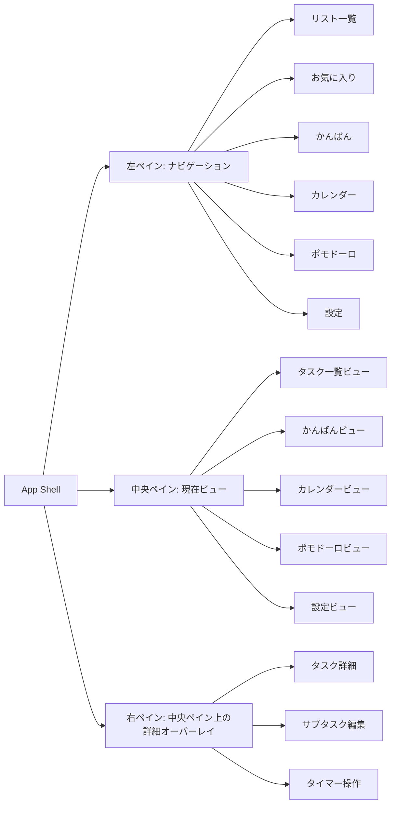
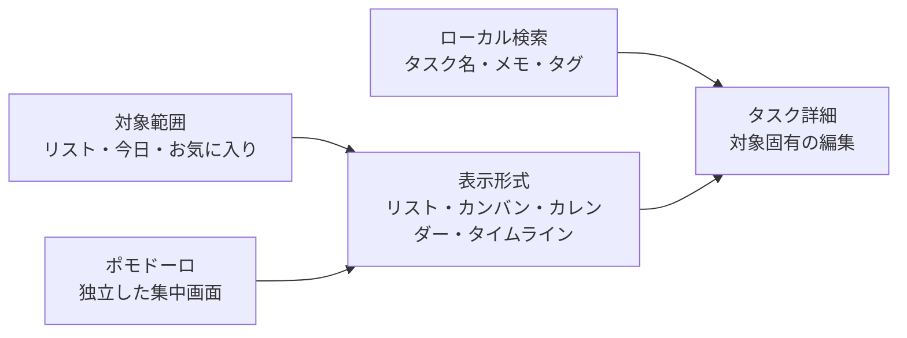
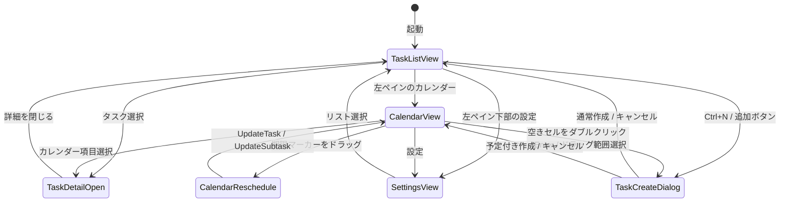

# UI/UX再設計仕様

## 目的

TaskTimerのUI/UXを、実務で毎日使うタスク管理アプリとして整理し直す。
Microsoft To Doの「左ナビ、中央リスト、右詳細」という認知しやすい構造を参考にしつつ、TaskTimerでは以下を差別化要素にする。

- タスクとサブタスクのどちらにも期限とタイマーを持てる。
- アプリ全体で同時に開始できるタイマーを1件に制限する。
- 通常タイマーに加えて、作業と休憩を分けるポモドーロモードを扱える。
- 週/日/月カレンダーで開始予定、期限、実行中タイマーを確認できる。
- 通知表示タイプをローカル設定として切り替えられる。
- アプリ実行時の外部通信を追加しない。

Microsoft To Doの画面構成をそのまま複製するのではなく、情報設計の型を参考にして、色、操作、タイマー体験、カレンダー体験はTaskTimer独自のものにする。

## 現状UI/UX整理

再設計前は、タスク作成、タスク詳細、週カレンダー、通知設定を1画面に並べたMVP検証向けUIだった。

| 領域 | 現状 | 課題 |
| --- | --- | --- |
| 左側 | タスク作成フォーム、タスク一覧、選択タスク詳細が同じペインにある | 作成フォームが常時大きく、一覧の見通しが弱い。ナビゲーションの概念がない。 |
| 中央 | 週カレンダーが常時表示される | タスク一覧を主作業にしたい場面でもカレンダーが画面を占有する。 |
| 右側 | 通知設定が常時表示される | タスク詳細と設定の役割が混ざらず、設定は必要時だけでよい。 |
| タスク完了 | チェックボックスで完了できる | 完了済みの視覚的移動、訂正線、半透明表現がない。 |
| サブタスク | 詳細内で作成、完了、タイマー開始ができる | 進捗が親タスク一覧に見えない。期限アイコンや進捗バーがない。 |
| タイマー | 開始/停止のみ | 一時停止、再開、終了、目標時間のUIがない。 |
| レスポンシブ | グリッドが折り返す | 幅ごとの主従関係が定義されていない。 |

## 改善したい情報

タスク一覧では、詳細を開かなくても以下を判断できることを目標にする。

- 完了状態。
- タスクタイトル。
- お気に入り状態。
- サブタスク進捗。例: `1/2`。
- 親タスクにサブタスクがある場合の進捗バー。
- 期限があること。
- 期限切れ、今日、今週などの状態。
- タイマー実行中であること。

タスク詳細では、実作業中に必要な操作を1か所へ寄せる。

- サブタスク追加、完了、期限変更。
- タスク期限追加。
- 繰り返し設定。
- 通知設定。
- 目標タイマー時間設定。
- タイマー開始、一時停止、再開、終了。
- 左ペインの専用ビューで、独立ポモドーロの開始、一時停止、再開、作業完了、休憩開始、休憩完了、休憩スキップ、終了を行う。
- 専用画面で作業、短休憩、長休憩、残り時間、セット数を表示する。
- ポモドーロの残り時間は、開始時に全面が満ちて時間経過とともに時計回りで減少する円形残量ディスクとして表示する。中央にデジタル残り時間とフェーズ名を併記し、主操作は状態にかかわらず3つの固定スロットを維持する。状態固有の操作は高さ固定の補助領域へ分ける。
- タスク削除。

## 画面構成

### 左ペイン

役割:

- リスト一覧を表示する。
- 今日のタスクへのビューを表示する。
- お気に入りされたタスクへのビューを表示する。
- タグ一覧とタグ別ビューを表示する。
- かんばん画面へ遷移する。
- カレンダー画面へ遷移する。
- 最下部に設定画面への導線を置く。
- `Ctrl+B` で開閉できる。
- 開閉ボタンはアプリヘッダーではなく、左ペイン右端に枠なしのアイコンとして配置する。

表示項目:

- アプリ名。
- リスト一覧。
- リスト色スウォッチ。
- 今日。
- お気に入り。
- タグ一覧。
- かんばん。
- カレンダー。
- 設定。最下部に固定。

振る舞い:

- 開いている状態ではラベルと件数を表示する。
- 閉じている状態ではアイコンのみ表示する。
- 閉じている状態でも現在ビューは視覚的に分かる。
- 設定画面には現状のローカル通知設定を移管する。
- タグはリストとは別セクションに表示するが、左ペインではタグ別ビューへの移動だけを扱う。
- タグの作成、名称変更、削除は親タスク詳細へ集約する。
- リスト色は識別用スウォッチとして表示し、変更操作は親タスク詳細へ集約する。

### 中央ペイン

役割:

- タスク一覧ビュー、カレンダービュー、設定ビューを切り替えて表示する。
- 通常作業の中心はタスク一覧ビューとする。

タスク一覧ビュー:

- 選択中リストのタスクを表示する。
- 未完了タスクを上部に表示する。
- 完了タスクは画面下部の完了セクションへ移動する。
- 完了セクションは折りたたみ可能にする。
- タスク作成はタスク件数表示の右にある追加ボタン、または `Ctrl+N` から共通ダイアログで開始する。
- タスク作成後は右ペインを自動で開かない。

タスク行:

- 左に円形チェックボタンを置く。
- 中央にタスクタイトルを置く。
- 右端にお気に入りボタンを置く。
- 行本文を選択したときだけ右ペインを開く。
- 選択中の同じ親タスク行をもう一度選択すると右ペインを閉じる。
- 円形チェックボタンとお気に入りボタンは状態だけ更新し、右ペインを開かない。
- 円形チェックボタンとお気に入りボタンの更新後は、一覧全体を読み込み表示へ戻さず、対象行だけpending状態にする。
- 完了済みの円形チェックボタンを押すと、未完了へ戻せる。
- 親タスクでサブタスクが存在する場合だけ、進捗バーと `1/2` のような数値を表示する。
- 期限設定がある場合は期限アイコンを表示する。
- 期限設定済みタスクは `期限` ラベル付きで日付/時刻を表示する。
- メモがあるタスク行には短いメモプレビューを表示する。
- タグがあるタスク行には小さなタグチップを表示する。
- 完了タスクは訂正線と半透明で表示する。
- タイマー実行中のタスクまたは子サブタスクがある場合は、行に実行中インジケーターを出す。

カレンダービュー:

- カレンダーを中央ペインへ表示する。
- 左ペインのカレンダーを選択したときに表示する。
- `週`、`日`、`月` を切り替えられる。
- 空の日付セルまたは時間帯セルをダブルクリックするとタスク作成を開始できる。フォーカスしたセルではEnterキーを代替操作にする。
- 日/週の空き時間軸は15分単位、月表示と上部予定行は1日単位でドラッグ範囲を選択し、その範囲を初期値にした共通タスク作成ダイアログを開く。ドラッグ解放だけでは保存しない。
- 日/週の同じ日付で時間帯が重なる単日予定は、半開区間として安定した横レーンへ分割する。重複しない予定は日列の全幅を使う。
- 共通ダイアログではタイトル、所属リスト、予定開始/終了、終日状態、メモを入力できる。
- 週/日表示の時間帯セルから作成する場合は、その日付と時間から1時間の予定期間を初期値にする。
- 終日行と月表示の日付セルから作成する場合は、その日付の終日予定を初期値にする。
- カレンダーからの作成後は右詳細ペインを自動で開かず、カレンダー表示を更新する。
- 期限マーカーはドラッグで別の日付または時間帯へ移動できる。
- 予定ブロック本体は期間長と終日状態を維持して移動できる。週/日の時刻あり予定は15分、月/終日予定は1日単位とする。
- 予定ブロック本体のD&D中は、日/週/月の全表示で期間長を維持した移動後の予定全体を予測表示する。
- 予定ブロックの開始端/終了端はリサイズ専用とし、本体移動と操作領域を分ける。
- 予定ブロックの移動または期間端調整を完了しても詳細を自動で開かず、詳細表示は通常クリックだけで行う。
- 予定移動と期限移動は別Application Use Caseを使い、予定移動で期限通知を変更しない。
- 週/日表示の時間帯へ移動した場合は期限日と期限時刻を更新し、終日行または月表示へ移動した場合は期限日だけを更新して期限時刻を解除する。
- 開始予定マーカーと実行中タイマーマーカーは読み取り専用とし、カレンダー上の移動では変更しない。
- カレンダー項目は所属リストの色トークンを反映する。
- 色は `green`、`blue`、`amber`、`rose`、`violet`、`gray` のプリセットから親タスク詳細で選択する。
- 色だけで状態や種別を示さず、開始予定/期限/実行中のマーカー種別テキストと親タスク名を維持する。
- 週/日表示はGoogleカレンダー型の上部ツールバー、日付ヘッダー、上部予定行、時間行、予定ブロック、現在時刻ラインを持つ。
- 上部予定行の左端にはローカルタイムゾーンを表示する。終日予定、日付のみの開始予定/期限、日をまたぐ予定を同じ高さに置き、複数日予定は表示範囲内を連続バーで示す。
- 日をまたぐ時刻あり予定は開始・終了時刻を維持したまま上部予定行へ置き、単日かつ時刻ありの予定だけを8:00から22:00の時間軸へ置く。
- 月表示は月曜始まりのグリッドで、1日3件まで表示する。月表示と日/週の上部予定行にある「他 N 件」は操作可能なボタンとし、当日の表示対象予定を中央ペイン内の一覧ポップアップで確認・選択できる。複数日予定は同一週内を連続バーとし、週をまたぐ場合だけ分割する。重なる予定は週単位の固定レーンへ配置する。
- サブタスク項目には親タスク名を表示する。
- カレンダー項目を選択すると右ペインで該当タスクまたはサブタスクを表示する。

設定ビュー:

- 現状のローカル通知設定を移管する。
- 通知表示タイプ、通知再試行、通知状態を扱う。表示タイプはカード型ラジオ選択にする。
- 通知失敗履歴は通常設定画面へ表示しない。
- データ操作はJSON/CSVエクスポートだけを表示し、SQLiteバックアップ/復元は通常設定画面へ表示しない。
- ポモドーロ既定値として、作業時間、短い休憩、長い休憩、長い休憩までの作業回数を編集できる。
- ポモドーロ自動開始設定は実行処理を持つが、設定ビューにはまだ表示しない。
- 将来はテーマ、ショートカット表示、データ保存場所表示を追加できる。

タグビュー:

- 左ペインのタグを選択したときに表示する。
- 選択タグが付いたタスクだけを表示する。
- タグビューでのタスク新規作成と自動タグ付与はMVP外とし、既存タスクへのタグ付与は右詳細ペインで行う。

かんばんビュー:

- 左ペインの `かんばん` を選択したときに表示する。
- 初期状態として `未着手`、`進行中` の2列を表示し、状態列を追加、名称変更、並べ替え、削除できる。
- タスクカードには一覧と同じ円形完了チェック、タイトル、期限、タグ、メモプレビュー、サブタスク進捗、タイマー実行中状態を表示する。
- タスクカードを選択すると右詳細ペインを開く。
- タスクカードはカード全面をドラッグ起点として状態列を移動する。6pxの開始閾値でクリックと分け、Pointer操作とKeyboard操作を同じUse Caseへ接続する。
- ドラッグ中のカードは列のスクロール領域から分離した前面オーバーレイへ表示し、移動先列のカードに隠れないようにする。
- ドロップ解放後は保存完了まで移動先へ楽観表示し、失敗時だけ移動元へ戻す。保存待ちで移動元カードを再表示しない。
- 状態列はドラッグ&ドロップで並べ替える。列削除時は所属タスクの移動先を選択してから削除する。
- 状態変更はApplication Use Caseを経由して保存する。
- 完了状態は業務状態列から分離する。完了済みタスクは元の状態列の下部にある折りたたみ可能な完了セクションへ表示する。
- アーカイブ済みタスクは通常かんばんから除外する。
- 大量タスク向けの仮想スクロールはMVP外とする。

### 右ペイン

役割:

- 基本は非表示。
- タスクを選択したときにタスク詳細を表示する。
- カレンダー項目を選択したときも、対象タスクまたはサブタスクの詳細を表示する。
- デスクトップでは中央ビューの幅を変えず、中央ペイン右側へオーバーレイ表示する。

タスク詳細:

- タイトル左に一覧と同じ円形完了ボタンを表示する。
- 完了済みの場合は同じボタンで未完了へ戻せる。
- お気に入り。
- タグを表示する。
- 親タスク詳細ではタグの作成、名称変更、削除、付け外しができる。
- サブタスク詳細では親タスクのタグを継承表示し、直接タグ編集はしない。
- 親タスク詳細では所属リストを直接選択し、所属リストの表示色を変更できる。
- 初期表示は現在情報の参照を主にし、編集フォームを常時表示しない。
- 開始日は詳細UIから外し、期限日/期限時刻を主要設定にする。
- 期限は `今日`、`明日`、`時間設定`、削除アイコンから変更できる。
- `時間設定` はポップアップで期限日と期限時刻を設定する。
- 期限操作は小さなチップとして表示する。期限設定済み時は選択済みチップだけを表示し、期限削除はチップ内の削除アイコンで扱う。
- タイマー目標時間はプリセット選択と手入力の両方を可能にする。
- 繰り返しは通常無効の最小表示にし、有効時だけ頻度と間隔を展開する。
- 繰り返し有効化時に期限が未設定の場合は、今日の期限を補完して基準日不足を避ける。
- 編集フォームの折りたたみ見出しは「タスクを編集」または「サブタスクを編集」とする。
- 通知。
- メモ。
- メモは詳細の参照表示でも確認できる。
- サブタスク、タイマー、通知は折りたたみセクションにする。
- 折りたたみセクションは原則デフォルトで閉じる。ただしサブタスクがある親タスクでは、作業関係を把握しやすいようサブタスクセクションを初期表示で開く。
- セクションの表示順は、サブタスク、タイマー、通知とする。
- サブタスクセクションでは親タスクとの関係が分かる説明、進捗件数、サブタスク一覧を表示する。
- 親タスク詳細では既存サブタスクの編集フォームを表示せず、サブタスク追加と選択だけを扱う。
- サブタスク追加フォームは「サブタスクの追加」押下後に表示し、通常時は一覧を優先する。
- 削除は詳細ペイン最下部に配置する。
- 削除はOS確認ダイアログに依存せず、詳細ペイン内で「削除」から「もう一度押して削除」へ切り替える2段階確認にする。

Issue #29 のMVPでは、繰り返し設定の永続化とタイマーの一時停止/再開は扱わない。開始予定日/期限に紐づく通知予定、タイマー開始/終了、タイマー目標時間、削除確認を右ペインへ集約する。

Issue #68 では詳細ペインを参照中心へ変更し、開始予定日の編集UIは外す。期限日/期限時刻はクイック操作と時間設定ポップアップで扱い、親タスク詳細では既存サブタスクを編集せず、サブタスク詳細へ遷移して編集する。

## 2026-07-20 ワークスペース再編

従来の `AppView` は「どのタスクを対象にするか」と「どう表示するか」を同じナビゲーションで切り替えていた。今後は、対象範囲と表示形式を分離する。この節は、左ペイン、中央ペイン、右詳細の旧記述と競合する場合に優先する。

### 画面責務

- 左ペインはリスト、今日、お気に入り、設定だけを表示する。タグ、カンバン、カレンダー、ポモドーロは置かない。
- タグの付与、解除、管理はタスク詳細へ残す。タグ別ビューは一旦UIから外すが、保存済みタグデータは削除しない。
- 中央ペイン上部に `リスト`、`カンバン`、`カレンダー`、`タイムライン` のセグメント切り替えを置く。選択中のリストまたはスマート範囲を維持したまま表示形式だけを切り替える。
- タイムライン未実装中に操作不能なボタンだけを先行表示しない。表示切り替え導入時は、利用可能な形式だけを操作可能にし、タイムライン実装と同時に4形式を揃える。
- アプリ上部右側に検索入力とポモドーロアイコンを置く。ポモドーロアイコンは独立ポモドーロ画面へ遷移する。
- 検索は外部通信を行わず、SQLiteの専用Queryでタスク名、サブタスク名、メモ、タグ名を検索する。削除済み項目を除外し、最大50件を返す。
- 検索結果はタスクとサブタスクを区別し、所属リスト、期限、状態、タグを補助情報として表示する。結果選択時は対象の詳細を開く。

### タスク作成

- 親タスクの新規作成は、一覧、カンバン、カレンダー、タイムラインのどこから開始しても共通ダイアログを使う。
- `Ctrl+N` は現在の対象リストを初期値にした共通ダイアログを開く。
- カレンダーのダブルクリックまたはドラッグ範囲作成では、選択した日付、時刻、期間を共通ダイアログの初期値にする。
- 通常作成は期限、カレンダー作成は予定期間を編集し、保存先のApplication Use Caseを分ける。予定から期限を自動生成しない。
- ダイアログは保存完了後に閉じ、タスク詳細を自動で開かない。保存失敗時は入力を維持し、エラーをダイアログ内へ表示する。
- タイトルへ初期フォーカスし、フォーカスはダイアログ内を循環する。未保存入力がある状態のEscapeまたは背景クリックでは破棄を確認する。
- タスク詳細内のサブタスク追加は作業関係を見ながら入力するため、既存のインラインフォームを維持する。

### タスク詳細と色

- タスク詳細の折りたたみセクションから `タイマー` と `通知` を外す。目標時間は「タスクを編集」に残し、通常タイマーの開始・一時停止・再開・終了はタスク行とサブタスク行で扱う。通知の全体設定は設定画面で扱う。
- タスク詳細では所属リストとタスク表示色を別フィールドにする。リスト色の変更は左ペインのリスト編集へ移す。
- リスト色とタスク色はいずれも許可済み色トークンだけを保存する。タスク色が未設定の場合は所属リスト色を表示色として使う。
- カレンダー項目は左端のアクセントに所属リスト色、本文に実効タスク色を使う。タスク色未設定時は両方とも所属リスト色になる。
- かんばん状態名の編集はEnterに加えてフォーカスが外れた時も保存する。空文字は保存せず元の名前へ戻す。

### 設計理由とトレードオフ

- 対象範囲と表示形式を分けることで、同じリストを一覧、カンバン、カレンダー、タイムラインで比較できる。
- 検索を読込済みReact stateだけで行う案は実装が小さいが、ページング外のタスクを見落とすため採用しない。
- タスク色をリスト色と分けるとSQLite、エクスポート、Read Modelの変更が必要になる。UIだけ先行して擬似的な色を保持せず、マイグレーションと同じ変更で導入する。
- タグ別ビューを外してもデータとUse Caseを残すため、検索や将来の絞り込みへ再利用できる。

### セキュリティと危険ケース

- 検索語は120文字以内に検証し、SQL文字列連結ではなくバインド値を使う。`LIKE` のワイルドカードは意図しない全件走査を避けるためエスケープする。
- 検索結果、タスク名、メモ、タグ名はReactのテキストとして描画し、HTMLとして解釈しない。
- 検索語やユーザー本文をログ、分析基盤、外部サービスへ送らない。
- 表示モード切り替えで未保存の作成ダイアログを黙って破棄しない。
- リスト削除や所属変更後に、古い対象範囲や詳細選択を残さない。
- 色トークンに任意CSS値を受け入れない。

サブタスク:

- タスク詳細内で追加できる。
- サブタスクごとに完了、期限日/期限時刻、タイマー目標時間、タイマー対象を扱える。
- 完了済みサブタスクは一覧と同じチェックUIで未完了へ戻せる。
- サブタスク行を選択すると、右ペイン内でサブタスク編集状態へ切り替える。
- 親タスク詳細へ戻る導線を持つ。
- タスク一覧でも親タスク行からサブタスクを展開し、サブタスク選択で右ペインへ詳細を表示する。

タイマー:

- 開始、一時停止、再開、終了を表示する。
- アプリ全体で他のタイマーが実行中の場合、開始ボタンは無効化し、実行中対象への導線を表示する。
- タイマー目標時間を設定できる。
- 目標時間は通知や見積もりに使うが、MVPではタイマー開始可否の制約にはしない。
- Issue #29 では開始と終了を実装し、一時停止と再開は #30 で追加する。

通知:

- 開始予定日がある場合は開始予定通知、期限がある場合は期限通知を作成する。
- 期限時刻がある場合、期限通知とカレンダー表示はその時刻を使う。
- 日付更新時に通知ルールを同一トランザクションで同期する。
- 右詳細ペインでは期限通知の予定を読み取り表示する。開始予定通知は既存データ互換として保持するが、詳細UIでは編集対象にしない。
- 通知全体のON/OFFは設定ビューで管理する。
- 日付が削除された通知ルールはソフト削除する。
- 通知本文の表示タイプは設定ビューで管理する。

## 画面遷移

初期表示:

- 初回起動時は `タスク` リストを表示する。
- 2回目以降は最後に開いたビューを復元する。ただし対象リストが削除済みの場合は `タスク` に戻す。

キーボード:

- `Ctrl+B`: 左ペイン開閉。
- `Ctrl+N`: 現在のタスクリストに新規タスクを追加。
- `Enter`: フォーカス中の空きカレンダーセルでタスク作成を開始する。
- `Esc`: 右ペインまたは作成ダイアログを閉じる。未保存入力がある場合は破棄を確認する。
- `Enter`: 作成ダイアログを確定する。ただしメモ入力中は改行を優先する。

## ビューの振る舞い

### 完了

- タスク完了時は、対象を完了セクションへ移動する。
- 未完了サブタスクがある親タスクを完了する場合、現行仕様どおり確認メッセージを表示する。
- 完了した親タスクは訂正線と半透明で表示する。
- タスク完了/未完了復元後の再取得はバックグラウンドで行い、中央ビューを一瞬空にしない。
- 完了済みタスクの円形チェックボタンを押すと、`status` を `todo` に戻し、`completed_at` をクリアする。
- サブタスク完了は親タスクの進捗バーへ即時反映する。

### お気に入り

- タスク一覧の右端にお気に入りボタンを表示する。
- お気に入りビューでは、お気に入り済みタスクを一覧表示する。
- お気に入り状態はタスク単位で保持する。
- サブタスク単位のお気に入りはMVP外とする。

### 今日

- 今日ビューでは、期限日が今日のタスクを表示する。
- 期限日が今日のサブタスクを持つ親タスクも表示する。
- 今日ビューは派生ビューであり、DB上のリストは作成しない。

### リスト

- タスクは1つのリストに所属する。
- 初期リストは `タスク` とする。
- カスタムリスト作成はUI改修MVPでは表示に必要な最小設計だけ行い、実装優先度は低くする。

### カレンダー

- カレンダーは日付範囲でDBから取得する。
- タスクとサブタスクの予定期間、開始予定、期限、実行中を表示する。
- 週/日/月の表示切替ができる。
- 空きセルのダブルクリックまたはEnterキーで共通タスク作成ダイアログを開く。
- 日/週の時間軸では同じ日列を15分単位、月表示と上部予定行では日付範囲を1日単位でドラッグ選択し、選択期間を共通タスク作成ダイアログへ反映する。
- 日/週の単日時刻あり予定は重複グループごとに横並び表示し、タスクとサブタスク、移動・変更予測へ同じレーン規則を適用する。
- 日付のみの開始予定/期限は時間指定と誤認しないよう、時間軸とは別の上部予定行へ表示する。日をまたぐ予定も同じ行へ置き、時刻ありの場合は開始時刻を併記する。
- 実行中タイマーは開始時刻を表示し、8:00から22:00の時間軸に配置する。時間外の場合は最寄りの端の行へ寄せ、実際の時刻テキストを併記する。
- 期限マーカーは既存仕様どおりドラッグ移動できる。
- 予定期間は、週/日の単日時刻予定を時間ブロック、日をまたぐ予定を上部の連続バー、月を日単位ブロックとして表示し、開始端/終了端をドラッグまたは矢印キーで調整する。
- 予定ブロック本体をドラッグまたは矢印キーで移動し、期間長を維持する。保存中は移動先へ仮表示し、失敗時だけDB上の位置へ戻す。
- 時刻あり期間は15分単位、終日期間は1日単位で調整し、期限マーカーの移動とは別操作として扱う。

### 設定

- 通知表示タイプを移管する。
- 通知再試行を移管する。
- JSON/CSVエクスポートを提供する。JSON/CSVは完全復元形式として扱わない。
- 通知失敗履歴とSQLiteバックアップ/復元は通常設定画面へ表示しない。
- アプリ実行時の外部通信設定は追加しない。通信を有効にする設定も追加しない。

### スクロール

- アプリ全体のbodyスクロールは発生させず、ウィンドウ内に固定する。
- 左ペイン、中央ペイン、右詳細ペイン、カレンダー、設定ビューはそれぞれ内部スクロールを持てる。
- お気に入り、今日、カレンダー、設定も同じ固定レイアウト規則に従う。

## デザインカラー

色はMicrosoft To Doの青系をそのまま使わず、TaskTimerの「実務、集中、時間」を表す落ち着いた配色にする。

| 用途 | Token | 値 | 理由 |
| --- | --- | --- | --- |
| 背景 | `--color-bg` | `#f6f8f9` | 長時間見ても疲れにくい明るい背景。 |
| 表面 | `--color-surface` | `#ffffff` | タスク行と詳細ペインの読みやすさを優先。 |
| 境界線 | `--color-line` | `#d8dee4` | 控えめな区切り。 |
| 本文 | `--color-ink` | `#172026` | 既存UIと互換性が高い濃色。 |
| 補助文字 | `--color-muted` | `#66737d` | 期限や件数に使う。 |
| 主アクセント | `--color-accent` | `#2f6f8f` | ナビ選択、主要ボタン。 |
| タイマー実行中 | `--color-timer` | `#23775a` | 実行中、開始、集中状態。 |
| 期限注意 | `--color-due` | `#9a6a14` | 期限アイコン、期限切れ予告。 |
| 破壊操作 | `--color-danger` | `#b64a3c` | 削除、エラー。 |
| お気に入り | `--color-favorite` | `#b88a00` | 星アイコン。 |

デザイン制約:

- 主要画面を単一色相だけで構成しない。
- 装飾的なグラデーション、オーブ、背景画像は使わない。
- アプリ内説明文を過剰に置かず、ラベル、アイコン、状態で理解できる構成にする。
- アイコンは既存採用ライブラリがないため、導入時は `lucide-react` を候補にする。ただし依存追加はIssue単位で判断する。

## ウィンドウ幅ごとのデザイン

| 幅 | 左ペイン | 中央ペイン | 右ペイン | 備考 |
| --- | --- | --- | --- | --- |
| `>= 1280px` | 280pxで常時表示 | 残り幅を使用 | 360pxで表示可能 | 3ペイン標準。 |
| `1024px - 1279px` | 240pxまたは72pxへ折りたたみ | 主表示 | 340pxのドロワー | 詳細は必要時だけ開く。 |
| `768px - 1023px` | 72pxのアイコンナビ | 主表示 | 画面右から重なるドロワー | カレンダーは横スクロールまたは2列。 |
| `< 768px` | オーバーレイドロワー | 単一カラム | 全画面詳細 | タスク一覧、詳細、設定を1画面ずつ表示。 |

最小対応幅:

- 360pxを下回る幅では、操作可能性は保証しない。
- 560px未満ではタスク行のサブ情報を2段に折り返す。
- 長いタスクタイトルは省略せず、詳細ペインでは折り返して全文を表示する。

## データモデル影響

UI改修だけではなく、以下のドメイン/永続化変更が必要になる。

| 必要要素 | 変更案 | 理由 |
| --- | --- | --- |
| リスト一覧 | `task_lists` テーブルと `tasks.list_id` | 左ペインのリスト選択に必要。 |
| タグ一覧 | `tags` と `task_tags` | 横断分類、タグ別ビュー、タスク詳細の付け外しに必要。 |
| お気に入り | `tasks.is_favorite` | お気に入りビューと星ボタンに必要。 |
| 完了セクション | 既存 `status`, `completed_at` を利用 | 新規データは不要。表示ロジックで対応。 |
| 進捗バー | サブタスク集計Read Model | 親タスク一覧で `done / total` が必要。 |
| 繰り返し | `recurrence_rules` または対象テーブルの recurrence列 | 期限更新時の次回生成ルールが必要。 |
| 通知全体設定 | `notification_preferences.notifications_enabled` | 設定画面で全体ON/OFFを扱う。 |
| 目標タイマー時間 | タスク/サブタスクに `timer_target_seconds` | 詳細ペインの目標時間表示に必要。 |
| 一時停止/再開 | `timer_pauses` または `timer_segments` | 経過時間から停止中時間を除外する必要がある。 |
| ビュー状態 | `ui_preferences` | 左ペイン開閉、最後に開いたビュー、最後のリストID、カレンダー表示モードを復元する。 |

## アーキテクチャ影響

Presentationは画面状態を増やすが、ドメインルールを持たない。

追加が必要なApplication境界:

- `ListTaskLists`
- `CreateTaskList`
- `UpdateTaskList`
- `DeleteTaskList`
- `ToggleTaskFavorite`
- `ReopenTask`
- `ListTasksByView`
- `UpdateTaskDueDate`
- `UpdateSubtaskDueDate`
- `UpdateTaskRecurrence`
- `UpdateNotificationsEnabled`
- `SetTimerTarget`
- `PauseActiveTimer`
- `ResumeActiveTimer`
- `EndActiveTimer`
- `GetUiPreferences`
- `UpdateUiPreferences`

Read Model:

- タスク一覧は、サブタスク進捗、期限有無、タグ、お気に入り、アクティブタイマー有無を一括で返す専用DTOを持つ。
- 右ペイン詳細は、選択対象のサブタスク、通知、タイマー情報を遅延取得できる。
- カレンダーは現行どおり日付範囲で取得する。

トランザクション境界:

- お気に入り切り替えはタスク1件更新。
- お気に入り切り替え後のRead Model再取得はバックグラウンド更新とし、グローバルなローディング状態を出さない。
- 完了済みタスクを未完了へ戻す操作は、タスク1件の `status` と `completed_at` を同一トランザクションで更新する。
- 期限/通知/繰り返し更新は、対象更新と通知ルール更新を同一トランザクションにする。
- タイマー一時停止/再開/終了は、単一アクティブタイマー制約を維持したまま同一トランザクションで処理する。
- UI設定は業務データと分けるが、SQLite内に保存してよい。

## 設計理由

- 3ペイン構成は、タスクの発見、選択、編集を分離でき、実務アプリとして繰り返し使いやすい。
- カレンダーを常時表示からビューへ移すことで、通常時はタスク一覧へ集中できる。
- 右ペインを必要時だけ表示することで、一覧の密度と詳細編集の両方を保てる。
- タイマー機能を右ペインへ寄せることで、TaskTimer独自の価値を詳細操作として明確にできる。
- お気に入りと完了セクションは、作業優先度と進捗整理に直結する。

## トレードオフ

- 3ペインはデスクトップでは強いが、狭い幅ではドロワー制御が複雑になる。
- 詳細ペインを基本非表示にすると初見では操作が見えにくい可能性がある。選択時のアニメーションと明確な選択状態で補う。
- 一時停止/再開を入れるとタイマー集計が複雑になる。単純な開始/終了だけよりDB設計とテストが増える。
- リストとお気に入りを追加するとクエリが増える。Read Modelで必要情報をまとめる。

## 代替案

### 代替案A: 現状の常時3カラムを維持する

利点:

- 実装変更が少ない。
- 週カレンダーと通知設定が常に見える。

欠点:

- タスク一覧への集中度が低い。
- 詳細ペイン、設定、カレンダーの主従関係が曖昧。
- Microsoft To Do系の使い慣れた操作モデルから離れる。

判断: 不採用。実務利用では中央タスク一覧を主役にする。

### 代替案B: 1画面1ビューで詳細をモーダルにする

利点:

- レスポンシブ設計が単純。
- 実装量が少ない。

欠点:

- タスク一覧を見ながらサブタスクやタイマーを操作しにくい。
- デスクトップアプリらしい効率が落ちる。

判断: 不採用。デスクトップでは右ペイン詳細を優先する。

## セキュリティ

- ユーザーのタスク名、メモ本文、通知本文をログに出さない。
- メモ本文をHTMLとして描画しない。
- リモートフォント、リモート画像、分析SDK、自動更新通信を追加しない。
- スクリーンショットやREADME用画像はサンプルデータで作成し、実データを使わない。
- キーボードショートカットはアプリ内状態だけを変更し、OSグローバルショートカットとして登録しない。

## スケール

- タスク一覧はページングまたはウィンドウイングを検討する。
- 一覧DTOに進捗集計を含め、UIで全サブタスクを毎回走査しない。
- 右ペイン詳細でタイマー履歴を表示する場合は、直近N件に制限する。
- カレンダーは表示範囲で絞り、全期間のタスクをロードしない。

## 危険ケース

- 左ペインを閉じた状態で、現在ビューが分からなくなる。
- 右ペインが開いている間に別タスクのタイマーが開始され、詳細表示と実態がずれる。
- 完了済みタスクを半透明にしすぎて、復元や確認が困難になる。
- サブタスクの期限変更で親タスク期限との関係が不明になる。
- 一時停止中タイマーをアプリ終了後に再開したとき、停止時間が経過時間に含まれる。
- 繰り返しタスクが完了時に無限生成される。
- 狭い幅で右ペインが中央ペインを覆い、削除ボタンを誤タップする。

## 受け入れ条件

- 左ペインからリスト、カレンダー、設定へ移動できる。
- `Ctrl+B` で左ペインを開閉できる。
- `Ctrl+N` で現在のタスクリストにタスク追加を開始できる。
- タスク行に円形チェック、タイトル、お気に入り、進捗、期限アイコンが表示される。
- 完了済みタスクが完了セクションへ移動し、訂正線と半透明で表示される。
- 完了済みタスクを未完了へ戻せる。
- チェック、お気に入り、作成完了では右ペインが自動で開かない。
- タスク選択時だけ右ペインが開く。
- 右ペインでサブタスク追加、期限、通知予定表示、タイマー目標時間、タイマー操作、削除ができる。
- 右ペインのタイマーセクションはタスク別の通常タイマーだけを操作する。
- ポモドーロは左ナビゲーション配下の専用画面で操作し、作業/短休憩/長休憩を通常タイマーと誤認されない色とラベルで表示する。
- 右ペインのサブタスク、タイマー、通知はデフォルトで折りたたまれ、サブタスク、タイマー、通知の順に表示される。
- カレンダー画面で週表示ができ、項目選択で右ペイン詳細を開ける。
- カレンダー画面に週/日/月の表示切替UIがある。
- 設定画面で通知全体ON/OFFと通知表示タイプを変更できる。
- 768px未満でも主要操作が破綻しない。
